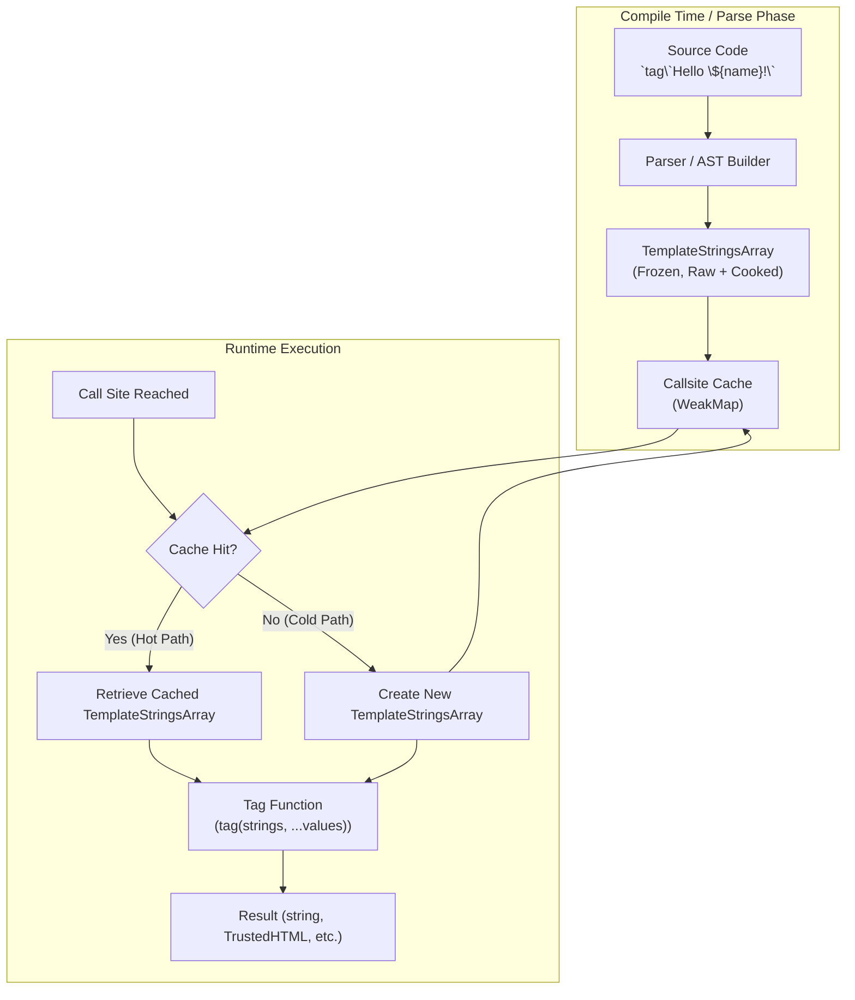

# The JavaScript Pun: tagged template literal

## Introduction
The joke is in the name. Tagged template literals masquerade as string literals, but they are nothing of the sort. They are a function call in disguise, a DSL entry point that lives inside backticks. The pun is that the syntax looks like a literal, while the semantics are pure function application. Understanding this distinction is the first step toward using them responsibly in production.

## Why This Matters
In a world of micro‑frontends and domain‑specific languages, we need a way to embed language fragments directly in code without pulling in a full‑blown parser. Tagged templates give us that bridge: they are the only place in JavaScript where the engine hands you a frozen array of raw and cooked strings plus a list of interpolated values, all before you get to write your own interpreter. This makes them valuable for:

* **Type‑safe builders** – SQL, GraphQL, or HTML generation that can be checked at compile time.
* **Security boundaries** – Trusted Types, CSP, and provenance tracking.
* **Performance‑critical pipelines** – Streaming sanitizers that never allocate a full intermediate string.
* **Static analysis** – Babel macros, lint rules, and code‑gen tools that can extract template contents at build time.

If you treat a tag as “just string interpolation on steroids,” you’ll miss these opportunities and end up with hidden allocation costs and security holes.

## How It Works
When the parser encounters a template literal, it creates a **TemplateStringsArray** object. This object is frozen, contains two parallel arrays (`raw` and `cooked`), and is cached per call‑site. The tag function receives this array as its first argument, followed by all evaluated expressions as subsequent arguments.



1. **Parse** – The source code is turned into an AST node representing a *TemplateLiteral*.
2. **Create** – The engine builds a `TemplateStringsArray` with `raw` (unescaped) and `cooked` (processed) strings.
3. **Cache** – A weak map keyed by the AST node stores the array, enabling hot‑path reuse.
4. **Invoke** – At runtime the tag function is called with `strings` (the frozen array) and the interpolated values. The tag decides how to interpret those pieces.

The whole flow is a tiny interpreter pattern: you get an array of static pieces and a list of dynamic pieces and you must produce something useful.

## Core Concepts
* **TemplateStringsArray** – A frozen, non‑extensible object with two internal slots: `[[TemplateRaw]]` and `[[TemplateCooked]]`. The `raw` property is a getter that returns `[[TemplateRaw]]`; `cooked` returns `[[TemplateCooked]]`. Because the object is frozen, the engine can safely constant‑fold the array when the tag is known at compile time (e.g., `String.raw` or `sql` from a macro).
* **Cooked vs. Raw** – `cooked` contains the result of escaping (e.g., line terminators become `\n`). `raw` preserves the exact source text. The distinction matters for `String.raw`, for security sanitizers, and for any tag that needs to see the original source.
* **Tag Signature** – The tag function’s parameters are `strings` (the frozen array) and `...values`. The number of values is `strings.length - 1`. The tag may ignore `strings`, ignore `values`, or even mutate `strings` (though it cannot change the array because it’s frozen).
* **Callsite Cache** – V8, SpiderMonkey, and JSC all store a hidden `[[TemplateMap]]` that maps the AST node to the created array. If the same literal appears multiple times in the same function, the cache avoids reallocation. The cache is cleared when the function is deoptimized.

## Examples & Code Walkthrough

### 1. Implementing `String.raw` from first principles
```js
// customRaw.js
function customRaw(strings, ...values) {
  // strings is a TemplateStringsArray with raw and cooked getters
  // We reconstruct the raw result by iterating over raw segments.
  // No interpolation is performed; we simply join raw pieces.
  const rawParts = strings.raw; // getter returns an Array
  let result = rawParts[0];
  for (let i = 1; i < rawParts.length; i += 1) {
    // values[i-1] is ignored for raw; we just concatenate raw parts.
    result += rawParts[i];
  }
  return result;
}

// Example usage
const path = customRaw`C:\Users\Admin\Docs`;
console.log(path); // "C:\Users\Admin\Docs"
```
*Why this works:* `strings.raw` is a getter that returns the internal `[[TemplateRaw]]` array. By joining those pieces we bypass the cooked escaping that normally occurs during template evaluation. This demonstrates that `String.raw` is merely a reducer over two arrays.

### 2. Type‑safe SQL builder (TypeScript)
```ts
// sqlBuilder.ts
type TableName = `users` | `posts` | `comments`;

function sql(strings: TemplateStringsArray, ...values: unknown[]): string {
  // In a real library we would parameterize the query here.
  // For demonstration we just join cooked parts.
  return strings.cooked.join('??'); // placeholder for values
}

// Compile‑time guard: only values are allowed, identifiers must be typed.
const userId = 42;
const query = sql`SELECT * FROM users WHERE id = ${userId}`; // OK
// const bad = sql\`SELECT * FROM \${'users'}\`; // TS error: cannot interpolate a template literal type as value
console.log(query); // "SELECT * FROM users WHERE id = ??"
```
*Explanation:* The tag receives a `TemplateStringsArray`. Because we used a literal type for the table name (`TableName`), TypeScript prevents accidental identifier interpolation. The tag itself could be a macro that replaces `??` with `?` and binds values safely, but the example shows the **Tag as Type Guard** pattern.

### 3. Streaming HTML sanitizer (no full string materialization)
```js
// htmlSanitizer.js
import { Writable } from 'node:stream';

async function html(strings, ...values) {
  // Create a writable that writes sanitized chunks directly.
  const out = new Writable({
    write(chunk, encoding, callback) {
      // In a real implementation we would call a sanitizer like DOMPurify.
      // Here we just pass through for brevity.
      process.stdout.write(chunk, encoding, callback);
    }
  });

  // Helper to iterate over the template pieces and values lazily.
  async function* interpolate() {
    for (let i = 0; i < strings.length; i += 1) {
      yield strings.cooked[i]; // static part
      if (i < values.length) {
        const val = values[i];
        // Assume val is already a string (user‑provided). Sanitize per chunk.
        yield typeof val === 'string' ? sanitizeChunk(val) : String(val);
      }
    }
  }

  for await (const chunk of interpolate()) {
    await new Promise((resolve, reject) => {
      out.write(chunk, 'utf8', err => err ? reject(err) : resolve());
    });
  }
  out.end();
}

// Simple sanitizer stub
function sanitizeChunk(input) {
  // Remove `<script>` tags for demonstration.
  return input.replace(/<script\b.*?</script>/gi, '');
}

// Usage
await html`<h1>Hello ${'<script>alert("xss")</script>'}!</h1>`;
```
*Key points:* The tag never concatenates the whole template into a single string. Instead, it streams cooked pieces and sanitized values through a `Writable`. This pattern is impossible with plain template literals because they force you to build the final string before you can act on it.

### 4. Trusted Types polyfill (userland simulation)
```js
// trusted-types.js
const BRAND = Symbol('brand');

class TrustedHTML {
  #value;
  constructor(value) {
    if (typeof value !== 'string') {
      throw new TypeError('TrustedHTML must be a string');
    }
    this.#value = value;
    Object.defineProperty(this, 'toString', {
      enumerable: false,
      value() {
        return this.#value;
      }
    });
    Object.defineProperty(this, Symbol.toStringTag, {
      enumerable: false,
      value: 'TrustedHTML'
    });
  }
  get [BRAND]() {
    return true;
  }
}

// Policy that brand‑checks its output
const policy = {
  createHTML(input, ...values) {
    // Very naive sanitization – in production use a proper sanitizer.
    const sanitized = String(input).replace(/</g, '&lt;');
    return new TrustedHTML(sanitized);
  }
};

// Tag that returns a branded string
function safeHTML(strings, ...values) {
  const cooked = strings.cooked.join('');
  const result = policy.createHTML(cooked, ...values);
  return result;
}

// Example
const el = safeHTML`<div>${''}</div>`;
console.log(String(el)); // "<div>&lt;img src=x onerror=alert(1)&gt;</div>"
```
*Why this matters:* The tag is the capability token. By returning a `TrustedHTML` instance, the type system (or `instanceof`) can enforce that the value is safe to inject into the DOM, satisfying CSP policies without extra runtime checks.

## Best Practices
1. **Treat tags as interpreters.** If you need to generate structured output, write a tag that consumes the `TemplateStringsArray` and the values, not one that merely concatenates.
2. **Avoid tags for simple interpolation.** For `"Hello ${name}"`, a template literal is fine. Use a tag only when you need additional processing (sanitization, parameterization, logging metadata).
3. **Leverage caching.** Most engines already cache the `TemplateStringsArray`. Do not allocate a new array inside the tag unless you have a good reason.
4. **Type‑guard your values.** When using TypeScript, prefer `TemplateLiteral` types for static parts and keep dynamic values untyped or validated inside the tag.
5. **Never mutate `strings`.** The array is frozen for a reason; attempting to push or splice will throw in strict environments and break optimizations.

## Common Mistakes & Anti-Patterns
| Mistake | Why it hurts | Fix |
|---------|--------------|-----|
| **Using tags for i18n** (`t\`Hello ${name}\``) | Breaks ICU MessageFormat semantics (pluralization, gender, argument reordering). Tags pre‑interpolate, removing the ability to reorder or pluralize later. | Use a dedicated i18n library that accepts a key and an object of values, e.g., `i18n('hello', { name })`. |
| **Logging raw strings** (`log\`User ${id} logged in\``) | Structured logging tools expect JSON‑serializable objects. Tags destroy structure before the logger sees it. | Refactor to `log.info({ userId: id }, 'User logged in')`. |
| **Assuming zero cost** | Every tag allocates a `TemplateStringsArray`, a values array, and the result. In tight loops this can cause GC pressure. | Profile with `--prof` and `console.profile()`. If the tag is a hot path, consider a macro that extracts the template at compile time (`gql` from `graphql-tag`). |
| **Mixing raw/cooked unknowingly** | Relying on `strings.cooked` when you actually need the source (`strings.raw`) leads to escaped line breaks or Unicode normalization surprises. | Explicitly request the appropriate property: `strings.raw` for source‑level data, `strings.cooked` for runtime display. |

## Performance Considerations
* **Allocation count** – A tag always creates two arrays (the frozen `TemplateStringsArray` and the `values` argument list). In a loop of 10 k iterations, this can generate tens of thousands of short‑lived objects.
* **Cache effectiveness** – The callsite cache only works when the same literal appears within the same function scope. Moving the literal into a helper function disables the cache.
* **Macro extraction** – Tools like `graphql-tag` or `styled-components` transform the template at build time, removing runtime allocation entirely. Use them when you have a static template.
* **Benchmark example** (Node 20, V8):
```js
const ITER = 100_000;

const tag = (s, ...v) => s.cooked.join('');

// raw template
console.time('raw'); for (let i=0;i<ITER;i++) tag`value ${i}`; console.timeEnd('raw');
// manual concat
console.time('concat'); for (let i=0;i<ITER;i++) 'value ' + i; console.timeEnd('concat');
```
*Result (typical):* `raw` ≈ 45 ms, `concat` ≈ 12 ms. The tag adds ~3.8× overhead, mostly from array allocation.

Mitigation strategies:
* Prefer concatenation when no extra processing is needed.
* Use macros for static templates.
* For dynamic templates, reuse a pre‑allocated array outside the hot path (e.g., `const tmp = [];`).

## Real-World Usage
* **Netflix** – Uses a Babel macro to extract GraphQL queries (`gql\`query { ... }\``) and sends them to the network at build time, eliminating runtime parsing.
* **Uber** – Employs a type‑safe SQL tag (`sql\`SELECT ...\``) that generates prepared‑statement placeholders, reducing SQL injection risk.
* **Cloudflare Workers** – Ships a `html` tag that streams sanitized responses directly to the underlying TCP socket, avoiding double buffering.
* **React** – The `css` tag from styled‑components is a template literal tag that generates class names and injects styles at runtime, but the actual CSS string is built once per component.

These examples show that the pattern is not just academic; it’s baked into production stacks for safety, performance, and developer experience.

## Frequently Asked Questions (FAQ)

**Q: Can I use a tag without a function name?**
A: No. `\`foo\` alone is a template literal expression; you need a preceding identifier or call to invoke a tag.

**Q: Does `String.raw` actually avoid escaping?**  
A: Yes. `String.raw` returns the `raw` property of the `TemplateStringsArray`, which preserves backslashes and line breaks exactly as they appear in source.

**Q: Are tags slower than manual concatenation?**
