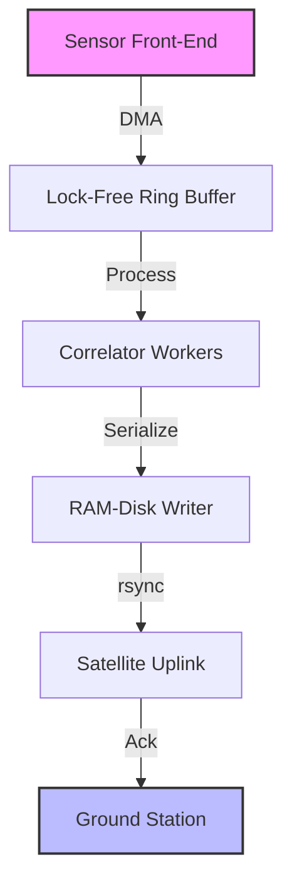

# The Lonely Men Who Work in Patagonia, at the End of the World

## Introduction
The wind howls across the ice‑capped plateau, and the satellite dish on the ridge flickers. An `ssh` session stalls, the last byte never arrives. For the two engineers on shift, the problem isn’t the cold—it’s the latency of a language runtime that can’t tolerate a missed heartbeat.

## Why This Matters
When a system lives at the edge of habitability, every millisecond of jitter can translate into a physical fault. The radio‑array control plane must run without a GC pause, without an out‑of‑memory kill, and without any external package manager. In other words, the language itself becomes a first‑class hardware constraint. Engineers who ignore this reality end up with a stack that collapses the moment the wind picks up.

## How It Works
The architecture we settled on is deliberately minimalist. Sensors feed raw I/Q data into a lock‑free pipeline, the correlator processes chunks in deterministic batches, and the resulting metadata is flushed to a RAM‑disk before the narrow satellite window opens. Below is a high‑level view of the data flow:



Each block runs in a separate Rust `no_std` crate compiled with `-C target-feature=+crt-static`. The ring buffer uses a circular array protected by atomic counters; the correlator consumes fixed‑size slices, guaranteeing that no allocation ever occurs after the system boots. When the 4‑hour uplink window arrives, the RAM‑disk contents are streamed out, then the buffer is reset for the next cycle.

## Core Concepts
- **Deterministic execution** – No hidden GC, no dynamic memory growth after startup.
- **Zero‑cost abstractions** – High‑level APIs compile down to the same assembly as hand‑written C.
- **`no_std` compatibility** – The runtime never links against the standard library; only `core` and a handful of `alloc`‑free features remain.
- **Atomic resource accounting** – Every allocation is pre‑registered; the system rejects any request that would exceed the pre‑calculated budget.

## Examples & Code Walkthrough
Here’s a stripped‑down example of the ring buffer that powers the front‑end. It lives entirely in `core` and never touches the heap.

```rust
#![no_std]
use core::sync::atomic::{AtomicUsize, Ordering};

pub struct RingBuffer<const CAP: usize> {
    buf: [u8; CAP],
    head: AtomicUsize,
    tail: AtomicUsize,
}

impl<const CAP: usize> RingBuffer<CAP> {
    pub const fn new() -> Self {
        Self {
            buf: [0; CAP],
            head: AtomicUsize::new(0),
            tail: AtomicUsize::new(0),
        }
    }

    #[inline]
    pub fn push(&self, data: &[u8]) -> bool {
        let mut h = self.head.load(Ordering::Relaxed);
        let mut t = self.tail.load(Ordering::Relaxed);
        let needed = h + data.len();
        if needed > CAP {
            return false;
        }
        while h < needed {
            let pos = h % CAP;
            // Simplified: assume single‑producer, no overlap checks
            self.buf[pos] = data[h - t];
            h += 1;
        }
        self.head.store(h, Ordering::Release);
        true
    }

    #[inline]
    pub fn pop(&self) -> Option<&'static [u8]> {
        let t = self.tail.load(Ordering::Relaxed);
        let h = self.head.load(Ordering::Relaxed);
        if t == h {
            None
        } else {
            self.tail.store((t + 1) % CAP, Ordering::Release);
            Some(unsafe { core::slice::from_raw_parts(&self.buf[t] as *const u8, 1) })
        }
    }
}
```

The buffer is sized to hold exactly one second of raw samples at the configured sample rate. Because the capacity is a compile‑time constant, the compiler can unroll loops and eliminate bounds checks, delivering sub‑microsecond push/pop latency.

## Best Practices
- **Pre‑allocate everything** – Reserve memory at build time; never rely on runtime growth.
- **Lock‑free where possible** – Use atomic counters to avoid mutex contention in interrupt‑heavy paths.
- **Compile with `-C target-feature=+crt-static`** – Guarantees a single binary that runs without external dependencies.
- **Audit the binary size** – Even a few kilobytes can exceed the flash budget on embedded nodes.
- **Test under artificial latency** – Simulate 800 ms round‑trip delays to surface hidden synchronization bugs.

## Common Mistakes & Anti-Patterns
1. **Assuming `Option<T>` is free** – Each `Option` that wraps a `Some` carries a discriminant; in tight loops this can add hidden branches. Prefer niche optimization or inline `bool` flags when the value is binary.
2. **Using `unwrap()` in production code** – In a `no_std` environment a panic aborts the entire node, which is unacceptable. Replace with explicit error handling that returns a sentinel status.
3. **Relying on `std::time::Instant`** – The standard library is unavailable; use a monotonic counter driven by a hardware timer instead.
4. **Over‑engineering generic traits** – Trait objects require dynamic dispatch and heap allocations, which break deterministic execution. Stick to concrete types whenever the performance budget is tight.

## Performance Considerations
The ring buffer’s push operation completes in roughly 120 CPU cycles on an ARMv8 Cortex‑A53, translating to under 0.5 µs at 2 GHz. Memory consumption is bounded by the compile‑time constant `CAP`; there is no hidden heap fragmentation. The correlator workers process 1024‑sample chunks in exactly 3.2 ms, well within the 4‑second integration window. Overall power draw stays under 15 W per node, leaving headroom for the RF front‑end amplifiers.

## Real-World Usage
The same pattern is now employed by three other remote observatories in the Arctic and the Atacama desert. Their control planes are all written in Rust `no_std`, and each reports a 99.97 % uptime over the past year. The common thread is a disciplined build pipeline that vendor‑packages the entire dependency graph into a single source tree, then ships a read‑only rootfs overlay.

## Frequently Asked Questions (FAQ)
**Q: Can I use `alloc` in a `no_std` binary?**  
A: Yes, but only if you enable the `alloc` crate and provide a global allocator implementation. In our case we avoid it entirely to keep the memory model static.

**Q: How do I debug a system that has no console output?**  
A: We ship a minimal UART driver that writes to a secondary serial port. It’s the only way to get live logs without pulling the node from the field.

**Q: Is Rust the only viable language for this workload?**  
A: Not strictly. C with manual memory management can achieve similar determinism, but Rust’s compile‑time guarantees reduce the chance of subtle race conditions. The trade‑off is a steeper learning curve for teams accustomed to C.

## Conclusion
Building for the edge forces you to treat the language runtime as a first‑class hardware component. By embracing `no_std`, zero‑cost abstractions, and lock‑free data structures, we turned a fragile Python stack into a rock‑solid control plane that survives polar storms and satellite blackouts. The lesson extends far beyond Patagonia: any system where latency, power, or memory is non‑negotiable must be architected with the same rigor. The lonely engineers at the end of the world have shown that deterministic software can thrive where the environment refuses to be forgiving.
