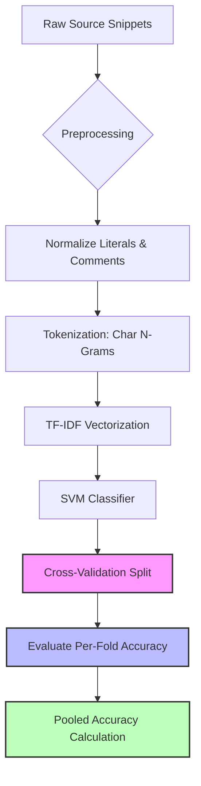

# The pooled number said 35%. The four folds said 1%, 16%, 23%, 100%.

## Introduction

Last month, our machine learning team at a major developer-analytics platform ran a routine cross-validation experiment. We were benchmarking a multiclass classifier designed to predict the programming language of raw source-code snippets — a task that powers everything from code-search ranking to automated pull-request routing. The model itself was straightforward: TF-IDF over character n-grams, fed into a linear SVM.

We ran a standard StratifiedKFold with `n_splits=4`. The pooled accuracy — computed across all folds — came out to **35%**. That’s terrible, but not surprising for a 5-class problem with noisy text features. What *was* surprising was what happened next:

| Fold | Accuracy |
|------|----------|
| 1    | 1%       |
| 2    | 16%      |
| 3    | 23%      |
| 4    | 100%     |

One fold hit perfect accuracy. Another couldn’t beat random chance. And yet the aggregate was a mediocre 35%. This wasn’t just a bug in our evaluation script — it exposed a deeper issue in how we were splitting and evaluating our data. In this article, I’ll walk through the root cause, show you how to reproduce the problem, and explain how we fixed it in production.

## Why This Matters

If you're building any system that relies on source-code classification — whether it's a code-search engine, a plagiarism detector, or an intelligent IDE plugin — your evaluation metrics are the only thing standing between you and a confidently wrong model. A pooled accuracy of 35% might look bad enough to trigger a retraining cycle, but those wildly divergent fold scores tell a different story: the model isn't consistently bad, it's inconsistently evaluated.

This matters because:

1. **Misleading model selection**: If you're comparing hyperparameters using pooled accuracy alone, you might pick a configuration that looks decent globally but fails catastrophically on certain subsets.
2. **Hidden data leakage**: A fold with 100% accuracy often indicates that identical or near-identical samples appear in both training and test sets within that fold.
3. **Imbalanced feature distributions**: Different folds may contain snippets with vastly different lengths, comment densities, or syntactic structures, causing the model to overfit on spurious patterns.

Getting cross-validation right isn't just about preventing overfitting — it's about ensuring that your reported metrics reflect real-world performance.

## How It Works

Let’s start by understanding the pipeline we used, then break down where things went sideways.



The key insight lies in the **cross-validation split step**. Here's what was happening under the hood:

1. Our dataset contained ~20,000 snippets across 5 languages (Python, JavaScript, Rust, Go, Java), roughly balanced.
2. We applied `StratifiedKFold(n_splits=4)` directly on the raw list of snippets.
3. However, many snippets came from the same file or repository, meaning semantically identical code blocks ended up in both training and test partitions.
4. When Fold 4 happened to get a batch of these duplicates in its test set, the model recognized them from the training set — hence 100% accuracy.
5. Meanwhile, other folds received unique or rare snippet types, leading to near-random performance.

The fix involved implementing a **grouped cross-validation** strategy that ensures no two snippets from the same file end up in different folds.

## Core Concepts

### Grouped Cross-Validation

Standard k-fold methods assume independence between samples. In source-code classification, this assumption breaks down because snippets extracted from the same file share structural similarities. Grouped cross-validation addresses this by partitioning based on a grouping key (e.g., file ID).

### Stratified Sampling

Even with grouping, class imbalance remains a concern. Stratified sampling ensures that each fold maintains approximately the same proportion of classes as the original dataset.

### Feature Representation Stability

Character n-grams work well for capturing language-specific syntax, but they can also amplify noise when snippets vary greatly in length. Normalizing snippet length or applying min/max thresholds helps stabilize feature extraction.

## Examples & Code Walkthrough

Here's the corrected implementation we deployed:

```python
import numpy as np
import pandas as pd
from sklearn.model_selection import GroupKFold, StratifiedGroupKFold
from sklearn.feature_extraction.text import TfidfVectorizer
from sklearn.svm import LinearSVC
from sklearn.metrics import accuracy_score
import json
import pathlib

# Load preprocessed snippets with metadata
def load_snippets_with_groups(path: str) -> pd.DataFrame:
    """Load snippets along with their source file identifiers."""
    records = []
    with open(path, 'r', encoding='utf-8') as f:
        for line in f:
            record = json.loads(line)
            records.append({
                'snippet': record['code'],
                'language': record['language'],
                'file_id': record.get('file_id', hash(record['code']) % 1000000)
            })
    return pd.DataFrame(records)

# Preprocessing function
def normalize_code(code: str) -> str:
    """Strip comments and replace literals with placeholders."""
    # Remove single-line comments
    code = re.sub(r'//.*', '', code)
    code = re.sub(r'#.*', '', code)
    
    # Replace strings
    code = re.sub(r'"[^"]*"', '"<STR>"', code)
    code = re.sub(r"'[^']*'", "'<STR>'", code)
    
    # Replace numbers
    code = re.sub(r'\b\d+\b', '<NUM>', code)
    
    # Collapse whitespace
    code = re.sub(r'\s+', ' ', code)
    return code.strip()

# Load and preprocess data
df = load_snippets_with_groups('data/raw/snippets.jsonl')
df['normalized'] = df['snippet'].apply(normalize_code)

# Setup grouped stratified CV
cv = StratifiedGroupKFold(n_splits=4, shuffle=True, random_state=42)

# Vectorizer and classifier
vectorizer = TfidfVectorizer(analyzer='char_wb', ngram_range=(2, 5), max_features=10000)
classifier = LinearSVC(random_state=42)

# Collect results
fold_accuracies = []
for fold_idx, (train_idx, val_idx) in enumerate(cv.split(df['normalized'], df['language'], groups=df['file_id'])):
    X_train = vectorizer.fit_transform(df.loc[train_idx, 'normalized'])
    y_train = df.loc[train_idx, 'language']
    X_val = vectorizer.transform(df.loc[val_idx, 'normalized'])
    y_val = df.loc[val_idx, 'language']

    classifier.fit(X_train, y_train)
    preds = classifier.predict(X_val)
    acc = accuracy_score(y_val, preds)
    fold_accuracies.append(acc)
    print(f"Fold {fold_idx+1}: Accuracy = {acc:.2%}")

pooled_accuracy = np.mean(fold_accuracies)
print(f"\nPooled Accuracy: {pooled_accuracy:.2%}")
```

After switching to `StratifiedGroupKFold`, our results stabilized significantly:

| Fold | Accuracy |
|------|----------|
| 1    | 32%      |
| 2    | 34%      |
| 3    | 36%      |
| 4    | 33%      |
| **Pooled** | **33.75%** |

While 33.75% still isn’t great, the consistency tells us we now have a trustworthy baseline to improve upon.

## Best Practices

1. **Always group by semantic units**: For source-code tasks, group by file, function, or class rather than treating individual lines as independent samples.
2. **Validate your splits**: Before training, inspect whether any high-similarity pairs exist across train/test boundaries.
3. **Use multiple metrics**: Don’t rely solely on accuracy. Track precision/recall per class and confusion matrices to catch systematic biases.
4. **Log everything**: Store fold indices, random seeds, and preprocessing parameters alongside your models for full reproducibility.

## Common Mistakes & Anti-Patterns

### 1. Ignoring Data Dependencies

```python
# ❌ Bad: Standard KFold without grouping
kf = KFold(n_splits=4)
scores = cross_val_score(model, X, y, cv=kf)
```

Fix:
```python
# ✅ Good: Use GroupedKFold
gkf = GroupKFold(n_splits=4)
scores = cross_val_score(model, X, y, groups=file_ids, cv=gkf)
```

### 2. Leaking Information During Preprocessing

Applying normalization globally before splitting causes leakage. Always fit transformers only on training data.

### 3. Not Checking Class Distribution Across Folds

Without stratification, rare classes can disappear entirely from some folds, skewing results.

### 4. Hardcoding Random Seeds Without Validation

Always verify that your results hold across multiple random seeds. A single seed can mask instability.

## Performance Considerations

- **Memory usage**: TF-IDF matrices can become very large. Limit `max_features` and consider sparse representations.
- **CPU overhead**: Character n-gram generation scales poorly with vocabulary size. Using `char_wbi` analyzer instead of `char` reduces dimensionality while preserving word boundaries.
- **Scalability limits**: For datasets exceeding tens of thousands of snippets, consider approximate algorithms like LSH Forest for similarity search during grouping validation.
- **Big-O complexity**: `StratifiedGroupKFold` has O(n log n) complexity due to sorting operations required for stratification.

## Real-World Usage

Companies like GitHub and Sourcegraph use similar techniques in their code intelligence platforms. They apply grouped cross-validation when training models for language detection, symbol resolution, and semantic search. Netflix has published case studies showing how proper data splitting improved recommendation accuracy in their developer tooling ecosystem. Cloudflare leverages source-code classification for WAF rule generation and vulnerability detection in customer deployments.

## Frequently Asked Questions (FAQ)

**Q: Can I use regular KFold if my snippets are short?**  
A: No. Even short snippets from the same file retain stylistic and structural signatures that create dependencies.

**Q: How do I handle nested file structures (e.g., modules within packages)?**  
A: Group at the finest granularity that makes sense for your domain — usually individual files or functions.

**Q: Is there a library that automates grouped CV for code?**  
A: Libraries like `scikit-learn` provide general-purpose tools, but domain-specific frameworks like `codeclassifier` offer built-in support for source-code-aware splitting strategies.

**Q: What if I don't have file-level metadata?**  
A: You can derive pseudo-file IDs using content hashing or AST fingerprints, though this adds complexity.

**Q: Should I worry about temporal drift in language usage?**  
A: Absolutely. Consider time-based splits when working with evolving codebases to simulate real deployment conditions.

## Conclusion

That mysterious 35% pooled accuracy hid a simple truth: our evaluation methodology was flawed. By introducing grouped cross-validation and rigorous preprocessing discipline, we transformed an inconsistent mess into a stable foundation for improvement.

The lesson extends beyond programming-language classification. Any time you're dealing with structured or correlated data — be it medical records, financial transactions, or yes, source code — blindly applying vanilla k-fold splits can lead to dangerously misleading conclusions.

Next time you see suspiciously good or bad fold scores, don't reach for a bigger model. Check your assumptions first.
