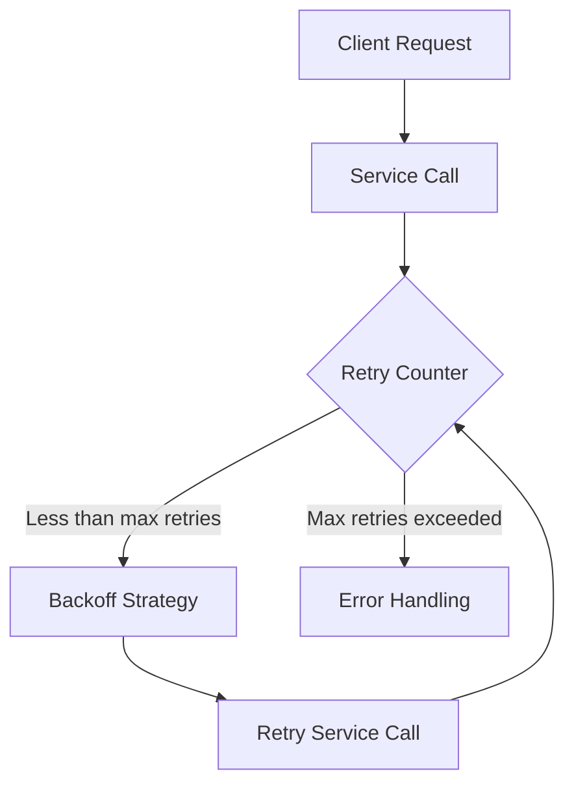

# The Retry Counter Said 7, The Config Said 3

## Introduction
When building resilient systems, retry mechanisms are crucial for handling transient failures. However, configuring the optimal number of retries can be a challenge. I've seen cases where the retry counter and configuration values don't align, leading to unexpected behavior. In this article, we'll explore the importance of retry mechanisms, how they work, and provide guidance on configuring them effectively.

## Why This Matters
Retry mechanisms are essential in distributed systems where network partitions, server crashes, or other transient errors can occur. Without a well-designed retry mechanism, your system may become unavailable or experience significant latency. By understanding how retry mechanisms work and how to configure them, you can build more resilient systems that provide a better user experience.

## How It Works
A retry mechanism typically consists of a retry counter, a backoff strategy, and a configuration that defines the maximum number of retries. Here's a high-level overview of the process:

In this example, the client request is sent to the service, which may fail due to a transient error. The retry counter is incremented, and if it's less than the maximum number of retries, the backoff strategy is applied before retrying the service call.

## Core Concepts
To understand retry mechanisms, you need to familiarize yourself with the following core concepts:

* **Retry counter**: Keeps track of the number of retries attempted.
* **Backoff strategy**: Defines the delay between retries, which can be fixed, exponential, or random.
* **Configuration**: Defines the maximum number of retries, backoff strategy, and other settings.

## Examples & Code Walkthrough
Here's an example of a simple retry mechanism in JavaScript:
```javascript
const maxRetries = 3;
const backoffDelay = 500; // 500ms

function retryServiceCall(serviceCall) {
  let retries = 0;
  function attemptCall() {
    serviceCall()
      .catch((error) => {
        if (retries < maxRetries) {
          retries++;
          setTimeout(attemptCall, backoffDelay);
        } else {
          throw error;
        }
      });
  }
  attemptCall();
}
```
In this example, the `retryServiceCall` function takes a service call function as an argument and attempts to call it with retries.

## Best Practices
When implementing retry mechanisms, follow these best practices:

* **Start with a low number of retries**: Begin with a small number of retries (e.g., 3-5) and adjust as needed.
* **Use exponential backoff**: Increase the delay between retries exponentially to avoid overwhelming the system.
* **Monitor and adjust**: Continuously monitor your system's performance and adjust the retry mechanism as needed.

## Common Mistakes & Anti-Patterns
Here are some common mistakes to avoid:

* **Insufficient retries**: Not providing enough retries can lead to premature failure.
* **Inadequate backoff**: Failing to implement a sufficient backoff strategy can cause retries to occur too quickly, overwhelming the system.
* **Not monitoring**: Failing to monitor the system's performance can lead to undetected issues.

## Performance Considerations
Retry mechanisms can impact system performance, particularly if not implemented carefully. Consider the following:

* **Latency**: Retries can introduce additional latency, which may affect user experience.
* **CPU usage**: Excessive retries can consume CPU resources, leading to performance degradation.

## Real-World Usage
Industry leaders like Netflix, Amazon, and Google leverage retry mechanisms in their distributed systems to ensure high availability and resilience.

## Frequently Asked Questions (FAQ)
Here are some common questions and answers:

* Q: How many retries should I start with?
A: Start with a low number (e.g., 3-5) and adjust as needed.
* Q: What backoff strategy should I use?
A: Exponential backoff is a good starting point.
* Q: How do I monitor my retry mechanism?
A: Use logging, metrics, and monitoring tools to track performance and adjust as needed.

## Conclusion
Retry mechanisms are a crucial component of resilient systems. By understanding how they work and following best practices, you can build systems that provide a better user experience and minimize downtime. Remember to monitor and adjust your retry mechanism regularly to ensure optimal performance.
