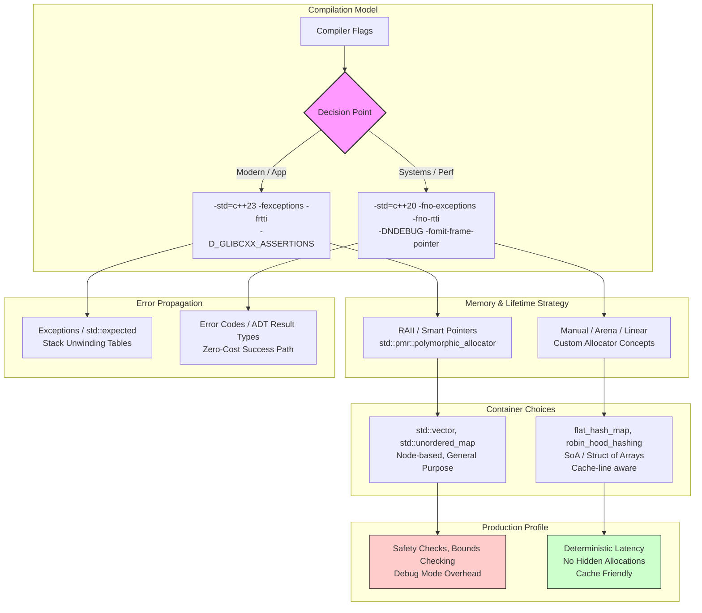

# The Two Factions of C++

## Introduction

Walk into any C++ conference, pull up a Godbolt window, or scroll through a heated GitHub issue thread, and you’ll see the same fault line. It’s not about tabs versus spaces. It’s not even about exceptions versus error codes, though that’s a symptom.

There are effectively two different languages wearing the same trench coat. One faction treats C++ as a high-level application language: RAII everywhere, `std::vector` by default, algorithms over raw loops, and the Standard Library as the bedrock of correctness. The other faction treats C++ as a portable assembly language: manual lifetime management, custom allocators, data-oriented design, `-fno-exceptions -fno-rtti`, and a deep suspicion of anything that might allocate behind your back.

They compile with the same toolchain. They link against the same standard library (mostly). But they do not write the same code, they do not debug the same way, and they rarely agree on what "good" looks like.

## Why This Matters

If you’re inheriting a codebase, hiring for a team, or choosing a dependency, this split dictates your next six months.

I’ve seen a high-frequency trading desk reject a perfectly good library because it threw `std::bad_alloc` on OOM instead of returning a nullable pointer. I’ve watched a game engine team rewrite `std::unordered_map` because the standard node-based implementation blew their instruction cache. Conversely, I’ve watched embedded teams re-implement `std::optional` poorly because they banned `<optional>` header due to "bloat" fears that didn't exist.

The friction isn't academic. It shows up in:
*   **Compile times:** One faction pulls in `<algorithm>`, `<ranges>`, `<format>`; the other forward-declares `malloc` and writes their own sort.
*   **ABI boundaries:** Mixing a `std::string` (SSO, reference counted, or not) across a DLL boundary compiled with different `_GLIBCXX_DEBUG` settings is a crash waiting to happen.
*   **Onboarding:** A developer fluent in `std::views` and structured bindings is useless in a codebase where `new` is a code-review blocker and `std::vector` is banned in hot paths.

You don't get to ignore this. You have to pick a lane for each module, or the codebase picks the worst of both worlds for you.

## How It Works

The divergence starts at the compiler command line and propagates through memory layout, error handling, and dependency graphs.



**Step-by-step breakdown:**

1.  **Compiler Flags:** The first commit in a repo usually locks in the exception/RTTI decision. Flipping `-fno-exceptions` later is a rewrite, not a refactor. It removes unwind tables, changes `new` to `nothrow_new`, and forces every library dependency to be recompiled.
2.  **Memory Model:** The Modern faction leans on `std::pmr` (Polymorphic Memory Resources) to inject custom allocators into standard containers. The Systems faction avoids virtual dispatch in the hot path entirely, preferring template-based allocator concepts (like `Allocator` in `std::vector` but stricter) or simple arena pointers (`char* bump_ptr`).
3.  **Error Propagation:** Exceptions force a specific control flow structure (try/catch blocks, destructors running during unwind). The Systems faction uses `std::expected` (C++23) or hand-rolled `Result<T, E>` monads. The success path is a simple branch; the error path is explicit data passing.
4.  **Containers:** `std::unordered_map` is a linked list of buckets. It pointer-chases. The Systems faction uses open-addressing hash tables (robin-hood, SwissTable variants) stored in contiguous arrays. Iteration is a linear scan; lookup is two cache misses max.

## Core Concepts

### 1. The "Zero-Cost Abstraction" Contract
Both factions claim this motto, but they define "cost" differently.
*   **Modern:** Cost = Developer cognitive load, memory safety bugs, lines of code. `std::unique_ptr` has *zero overhead* compared to a raw pointer with a manual `delete`, but prevents leaks.
*   **Systems:** Cost = Instruction count, cache misses, worst-case latency, binary size. A `unique_ptr` with a custom deleter that captures a lambda *might* allocate a closure object. That’s a cost. They want the assembly output to look like hand-written C.

### 2. Allocator Awareness
Modern C++ uses `std::allocator_traits` and `std::pmr::memory_resource`. It’s dynamic polymorphism for memory. You pass a `std::pmr::vector` a `monotonic_buffer_resource` backed by a stack array, and it works.
Systems C++ hates the virtual call in `memory_resource::do_allocate`. They use template parameters: `Vector<T, ArenaAllocator<4096>>`. The allocator is a stateless struct; `allocate` inlines to a pointer bump. No vtable, no indirection.

### 3. The Exception Boundary
In Modern C++, exceptions are the primary error transport. Destructors *must not throw*. The compiler generates unwind tables (`.eh_frame` / `.gcc_except_table`).
In Systems C++, exceptions are disabled. `throw` is a compile error. `new` returns `nullptr` on failure (or calls a handler that aborts). Error handling is value-based: `auto result = parse_packet(buf); if (!result) return handle_error(result.error());`. This removes the "invisible control flow" problem but pushes ceremony to every call site.

### 4. Standard Library as Liability vs. Asset
Modern: `std::format`, `std::ranges`, `std::mdspan` (C++23) are productivity multipliers. They are vetted, optimized, and standardized.
Systems: `std::format` pulls in locale machinery and dynamic formatting state. `std::regex` is famously slow. `std::iostream` is banned. They vendor `fmt` (the library `std::format` came from) but compile it with `FMT_HEADER_ONLY` and custom float formatters. They write their own `span`-like views because `std::span` didn't exist when they started, and migrating breaks ABI.

## Examples & Code Walkthrough

Here is the same problem—parsing a fixed-header network packet into a domain object—implemented in both dialects.

### Faction A: Modern C++ (Application Service Layer)
We prioritize correctness, readability, and using the standard library. We assume exceptions are enabled and heap allocation is cheap relative to developer time.

```cpp
// modern_parser.cpp
#include <expected>
#include <span>
#include <vector>
#include <string>
#include <cstdint>
#include <stdexcept>
#include <format>

struct PacketHeader {
    uint32_t magic;
    uint16_t version;
    uint16_t payload_len;
    uint32_t checksum;
};

struct ParsedMessage {
    uint64_t timestamp;
    std::string payload; // Heap allocated, SSO for small packets
    std::vector<uint8_t> metadata;
};

// Custom error type for domain logic
enum class ParseErrc { BadMagic, BadVersion, ChecksumMismatch, Truncated };

// Helper to read network-byte-order integers safely
template <typename T>
std::expected<T, ParseErrc> read_be(std::span<const std::uint8_t>& buf) {
    if (buf.size() < sizeof(T)) return std::unexpected(ParseErrc::Truncated);
    T val = 0;
    // Manual byte shift avoids strict aliasing / alignment UB
    for (size_t i = 0; i < sizeof(T); ++i) {
        val = (val << 8) | buf[i];
    }
    buf = buf.subspan(sizeof(T));
    return val;
}

std::expected<ParsedMessage, ParseErrc> parse_packet_modern(std::span<const std::uint8_t> data) {
    // 1. Header validation
    auto magic = read_be<uint32_t>(data);
    if (!magic || *magic != 0xDEADBEEF) return std::unexpected(ParseErrc::BadMagic);

    auto version = read_be<uint16_t>(data);
    if (!version || *version != 1) return std::unexpected(ParseErrc::BadVersion);

    auto payload_len = read_be<uint16_t>(data);
    if (!payload_len) return std::unexpected(ParseErrc::Truncated);

    auto checksum = read_be<uint32_t>(data);
    if (!checksum) return std::unexpected(ParseErrc::Truncated);

    // 2. Bounds check payload
    if (data.size() < *payload_len) return std::unexpected(ParseErrc::Truncated);

    // 3. Verify checksum (simplified)
    // In real code: use hardware CRC32 intrinsic
    uint32_t calc = 0; 
    // ... calculation omitted ...
    if (calc != *checksum) return std::unexpected(ParseErrc::ChecksumMismatch);

    // 4. Construct result. std::string handles allocation/SSO.
    // std::vector handles metadata growth.
    ParsedMessage msg;
    msg.timestamp = 0; // Would come from header in real impl
    msg.payload.assign(reinterpret_cast<const char*>(data.data()), *payload_len);
    msg.metadata.assign(data.data() + *payload_len, data.data() + data.size());

    return msg;
}
```

**Why this works for Faction A:**
*   `std::expected` forces the caller to handle the error, but the happy path reads top-to-bottom.
*   `std::span` gives a non-owning view over the network buffer (zero copy).
*   `std::string`/`std::vector` manage memory automatically. If `payload` is small (< 15-22 chars typically), SSO kicks in—zero heap hits.
*   `read_be` is a generic algorithm. The compiler inlines it completely.

---

### Faction B: Systems C++ (Ingest Pipeline / Hot Path)
We prioritize deterministic latency, zero allocations in the steady state, and cache locality. We assume `-fno-exceptions`, custom allocators, and a fixed memory budget.

```cpp
// systems_parser.hpp
#pragma once
#include <cstdint>
#include <cstddef>
#include <cstring> // memcpy
#include <concepts>

// No STL headers in the hot path interface.
// We use a simple Result monad, no std::expected dependency.
template <typename T, typename E>
struct Result {
    union { T value; E error; };
    bool ok;
    
    constexpr Result(T v) : value(v), ok(true) {}
    constexpr Result(E e) : error(e), ok(false) {}
    constexpr ~Result() {} // Trivial destructor for union
    
    constexpr explicit operator bool() const { return ok; }
    constexpr T& operator*() & { return value; }
    constexpr const T& operator*() const& { return value; }
    constexpr E& error() & { return error; }
};

// Fixed-size arena allocator (bump pointer)
// Thread-local or passed explicitly. No virtual dispatch.
class Arena {
    char* buffer_;
    size_t capacity_;
    size_t offset_ = 0;
public:
    constexpr Arena(char* buf, size_t cap) : buffer_(buf), capacity_(cap) {}
    
    void* allocate(size_t size, size_t align = alignof(std::max_align_t)) {
        uintptr_t current = reinterpret_cast<uintptr_t>(buffer_ + offset_);
        uintptr_t aligned = (current + align - 1) & ~(align - 1);
        size_t new_offset = (aligned - reinterpret_cast<uintptr_t>(buffer_)) + size;
        if (new_offset > capacity_) return nullptr; // OOM = nullptr, no throw
        offset_ = new_offset;
        return reinterpret_cast<void*>(aligned);
    }
    
    void reset() { offset_ = 0; }
    size_t used() const { return offset_; }
};

// Domain object: Plain Old Data. No constructors, no vtables.
// Payload is a view into the original buffer OR a copy in the arena.
struct ParsedMessageSys {
    uint64_t timestamp;
    const char* payload_ptr; // Non-owning view
    uint16_t payload_len;
    const uint8_t* meta_ptr;
    uint16_t meta_len;
};

enum class ParseErrcSys : uint8_t { Ok, BadMagic, BadVersion, ChecksumMismatch, Truncated, OOM };

// Force inlining for the hot path
[[gnu::always_inline]] 
inline uint16_t read_u16_be(const uint8_t*& ptr, const uint8_t* end) {
    uint16_t val = (static_cast<uint16_t>(ptr[0]) << 8) | ptr[1];
    ptr += 2;
    return val;
}

[[gnu::always_inline]]
inline uint32
