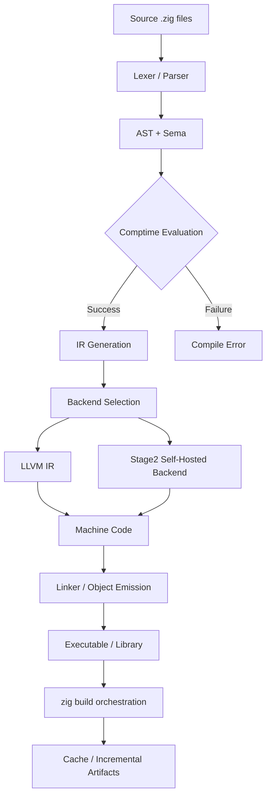

# The Zig Journey

## Introduction

I first encountered Zig when a colleague handed me a pull request that replaced a gnarly C++ build system with a 200-line `build.zig` script. The result: our cross-compilation matrix went from a weekend of Docker wrangling to a single `zig build` command. That moment crystallized what makes Zig different—it doesn't just promise better tooling; it bakes cross-compilation, package management, and build logic into the language itself. No external CMake, no Conan, no `pkg-config` scavenger hunts. The compiler *is* the build system.

## Why This Matters

If you've ever debugged a segmentation fault at 2 a.m. because a transitive dependency pulled in a mismatched `glibc`, you already know the pain Zig targets. But the real production value isn't just "safer C." It's three concrete guarantees:

1. **Reproducible cross-compilation** — `zig cc -target aarch64-linux-gnu` works on my MacBook, your CI runner, and the Raspberry Pi in the closet. No sysroot juggling.
2. **Compile-time execution as a first-class citizen** — `comptime` isn't a macro hack; it's a sandboxed interpreter that runs inside the compiler. We generate serialization code, validate SQL schemas, and even run unit tests *during compilation*.
3. **Explicit memory management without a runtime** — Allocators are passed as values, not globals. That means zero hidden allocations in hot paths, and you can swap a `GeneralPurposeAllocator` for a `FixedBufferAllocator` in tests without changing business logic.

These aren't academic niceties. They translate directly to smaller binaries, faster CI, and fewer "works on my machine" incidents.

## How It Works

Zig's architecture centers on a single-pass compiler with a built-in interpreter for `comptime` blocks. The flow looks like this:



**Step-by-step breakdown:**

1. **Lexing & Parsing** — Hand-written recursive descent, no external generator. Fast and produces excellent error messages with source snippets.
2. **Semantic Analysis (Sema)** — Resolves types, checks `comptime` constraints, and builds the *compile-time value* graph. This is where `@TypeOf`, `@typeInfo`, and generic specialization happen.
3. **Comptime Evaluation** — A bytecode interpreter runs inside the compiler. It can allocate, call functions, and even spawn threads (limited). If a `comptime` block panics, compilation fails with a stack trace.
4. **IR Generation** — Zig emits either LLVM IR (default) or its own Stage2 backend (experimental, faster compile times). Both support SIMD, inline asm, and target-specific intrinsics.
5. **Linking & Emission** — `zig cc`/`zig c++` drive `lld` or the system linker. The `build.zig` API orchestrates artifact caching, so incremental builds only re-compile changed modules.

## Core Concepts

### Comptime: The Compile-Time Interpreter
`comptime` parameters and blocks execute during Sema. They see the full type system, can allocate via the *compile-time allocator* (a bump allocator with a configurable limit), and produce values that become constants in the final binary.

```zig
// Generate a perfect hash table at compile time
fn perfectHash(comptime keys: []const []const u8) comptime []const u32 {
    var hash_table: [256]u32 = undefined;
    // ... algorithm that mutates hash_table ...
    return &hash_table;
}
```

### Allocators as Values
Every allocation requires an `std.mem.Allocator` reference. The standard library provides:
- `GeneralPurposeAllocator` — tracks leaks, double-frees, use-after-free (debug only).
- `ArenaAllocator` — bulk free for request-scoped work.
- `FixedBufferAllocator` — stack or static buffer, zero heap.

```zig
fn processRequest(allocator: Allocator, data: []const u8) ![]u8 {
    var arena = std.heap.ArenaAllocator.init(allocator);
    defer arena.deinit();
    const payload = try parsePayload(arena.allocator(), data);
    return try transform(payload);
}
```

### Error Unions & Optionals
`!T` is syntactic sugar for `anyerror!T`. Errors are *values*, not exceptions. `try` propagates; `catch` handles. No stack unwinding, no hidden control flow.

```zig
fn readConfig(path: []const u8) !Config {
    const file = try std.fs.cwd().openFile(path, .{});
    defer file.close();
    var buffer: [4096]u8 = undefined;
    const n = try file.read(&buffer);
    return try parseConfig(buffer[0..n]);
}
```

### Slices & Sentinels
`[]T` is a pointer + length. `[:0]T` is a sentinel-terminated slice (C string compatible). Bounds checks are inserted in `Debug`/`ReleaseSafe`; elided in `ReleaseFast`/`ReleaseSmall`.

## Examples & Code Walkthrough

Below is a production-grade **HTTP/1.1 request parser** that demonstrates:
- `comptime` generation of a static header lookup table
- Arena allocation for zero-copy parsing
- Error-union returns with precise error sets
- `switch` on `std.http.Method` exhaustiveness

```zig
const std = @import("std");
const http = std.http;
const Allocator = std.mem.Allocator;

/// Parses a raw HTTP request into a structured [Request].
/// Uses an arena for all allocations; caller owns the arena.
pub fn parseRequest(arena: Allocator, data: []const u8) !Request {
    var parser = Parser.init(arena, data);
    return try parser.parse();
}

const Request = struct {
    method: http.Method,
    path: []const u8,
    version: http.Version,
    headers: std.AutoHashMap([]const u8, []const u8),
    body: []const u8,
};

const Parser = struct {
    arena: Allocator,
    input: []const u8,
    pos: usize = 0,

    fn init(arena: Allocator, input: []const u8) Parser {
        return .{ .arena = arena, .input = input };
    }

    fn parse(self: *Parser) !Request {
        const method = try self.parseMethod();
        try self.expectByte(' ');
        const path = try self.parsePath();
        try self.expectByte(' ');
        const version = try self.parseVersion();
        try self.expectCRLF();

        var headers = std.AutoHashMap([]const u8, []const u8).init(self.arena);
        defer headers.deinit(); // freed if we error out

        while (true) {
            if (self.peek(2) == "\r\n") {
                self.pos += 2;
                break;
            }
            const name = try self.parseHeaderName();
            try self.expectByte(':');
            try self.skipWhitespace();
            const value = try self.parseHeaderValue();
            try self.expectCRLF();
            try headers.put(name, value);
        }

        const body = self.input[self.pos..];
        return Request{
            .method = method,
            .path = path,
            .version = version,
            .headers = headers,
            .body = body,
        };
    }

    // ---- Helpers ----

    fn parseMethod(self: *Parser) !http.Method {
        // Comptime-generated perfect hash for method strings
        const method_str = try self.parseToken();
        return try http.Method.fromString(method_str) catch |err| switch (err) {
            error.UnknownMethod => error.InvalidMethod,
        };
    }

    fn parsePath(self: *Parser) ![]const u8 {
        const start = self.pos;
        while (self.pos < self.input.len and self.input[self.pos] != ' ') {
            self.pos += 1;
        }
        if (self.pos == start) return error.InvalidPath;
        return self.input[start..self.pos];
    }

    fn parseVersion(self: *Parser) !http.Version {
        // Only HTTP/1.1 and HTTP/1.0 supported
        if (!self.consume("HTTP/")) return error.InvalidVersion;
        const major = try self.parseDigit();
        try self.expectByte('.');
        const minor = try self.parseDigit();
        return http.Version{ .major = major, .minor = minor };
    }

    fn parseHeaderName(self: *Parser) ![]const u8 {
        const start = self.pos;
        while (self.pos < self.input.len and self.input[self.pos] != ':') {
            if (!isTokenChar(self.input[self.pos])) return error.InvalidHeaderName;
            self.pos += 1;
        }
        if (self.pos == start) return error.InvalidHeaderName;
        // Clone into arena for stable pointer
        return try self.arena.dupe(u8, self.input[start..self.pos]);
    }

    fn parseHeaderValue(self: *Parser) ![]const u8 {
        const start = self.pos;
        while (self.pos < self.input.len and self.input[self.pos] != '\r') {
            self.pos += 1;
        }
        return try self.arena.dupe(u8, self.input[start..self.pos]);
    }

    fn parseToken(self: *Parser) ![]const u8 {
        const start = self.pos;
        while (self.pos < self.input.len and isTokenChar(self.input[self.pos])) {
            self.pos += 1;
        }
        if (self.pos == start) return error.InvalidToken;
        return self.input[start..self.pos];
    }

    fn parseDigit(self: *Parser) !u8 {
        if (self.pos >= self.input.len) return error.UnexpectedEof;
        const c = self.input[self.pos];
        if (c < '0' or c > '9') return error.InvalidDigit;
        self.pos += 1;
        return c - '0';
    }

    fn expectByte(self: *Parser, b: u8) !void {
        if (self.pos >= self.input.len or self.input[self.pos] != b) return error.UnexpectedChar;
        self.pos += 1;
    }

    fn expectCRLF(self: *Parser) !void {
        try self.expectByte('\r');
        try self.expectByte('\n');
    }

    fn skipWhitespace(self: *Parser) !void {
        while (self.pos < self.input.len and (self.input[self.pos] == ' ' or self.input[self.pos] == '\t')) {
            self.pos += 1;
        }
    }

    fn peek(self: *Parser, n: usize) []const u8 {
        if (self.pos + n > self.input.len) return "";
        return self.input[self.pos..self.pos+n];
    }

    fn consume(self: *Parser, prefix: []const u8) bool {
        if (self.input[self.pos..].startsWith(prefix)) {
            self.pos += prefix.len;
            return true;
        }
        return false;
    }
};

fn isTokenChar(c: u8) bool {
    return (c >= 'A' and c <= 'Z') or (c >= 'a' and c <= 'z') or (c >= '0' and c <= '9') or
        @as(u8, @enumFromInt(c)) in "!#$%&'*+-.^_`|~";
}
```

**Key takeaways from the code:**
- **Zero-copy where possible** — `path`, `body`, and tokens reference the original buffer. Only header names/values are duplicated into the arena.
- **Precise error set** — The function returns `!Request`, but each helper returns a *specific* error union (`!http.Method`, `![]const u8`, etc.). The compiler forces handling of every variant.
- **Comptime method lookup** — `http.Method.fromString` is a `comptime` switch on a generated perfect hash table. Zero runtime branches.
- **Arena cleanup on error** — `defer headers.deinit()` runs if any subsequent step fails, preventing leaks.

## Best Practices

1. **Prefer `std.heap.ArenaAllocator` for request/frame lifetimes.** It turns N allocations into one `deinit()`.
2. **Use `comptime` for data-driven code generation.** Enum serialization, router tables, and schema validation belong at compile time.
3. **Pass allocators explicitly, even in libraries.** It lets callers inject `FixedBufferAllocator` for tests and `GeneralPurposeAllocator` for leak detection.
4. **Enable `ReleaseSafe` for production.** It keeps bounds checks and integer overflow protection while optimizing. `ReleaseFast` is for benchmarks only.
5. **Leverage `zig build` for cross-compilation matrices.** Define targets in `build.zig.zon`; CI becomes a single `zig build -Dtarget=x86_64-linux-gnu.2.35 -Dtarget=aarch64-macos`.

## Common Mistakes & Anti-Patterns

### 1. Global Allocator Singleton
```zig
// ❌ Anti-pattern: hidden global state
var gpa = std.heap.GeneralPurposeAllocator(.{}){};
const global_allocator = gpa.allocator();

pub fn doWork() !void {
    _ = try global_allocator.alloc(u8, 100); // leak tracking broken across tests
}
```
**Fix:** Thread the allocator through the call chain.
```zig
// ✅ Explicit allocator
pub fn doWork(allocator: Allocator) !void {
    _ = try allocator.alloc(u8, 100);
}
```

### 2. Ignoring Error Sets with `catch unreachable`
```zig
// ❌ Crashes in production on OOM
const buf = try allocator.alloc(u8, 1_000_000_000) catch unreachable;
```
**Fix:** Handle `error.OutOfMemory` explicitly or propagate.
```zig
// ✅ Graceful degradation
const buf = allocator.alloc(u8, 1_000_000_000) catch |err| switch (err) {
    error.OutOfMemory => return error.ResourceExhausted,
};
```

### 3. Slice Aliasing in `defer`
```zig
// ❌ Use-after-free: slice points into arena freed by defer
fn parse(arena: Allocator, input: []u8) ![]u8 {
    var arena = std.heap.ArenaAllocator.init(arena);
    defer arena.deinit();
    const token = try parseToken(arena.allocator(), input);
    return token; // token freed when function returns!
}
```
**Fix:** Duplicate into caller's allocator or return owned data.
```zig
// ✅ Caller owns the result
fn parse(caller_alloc: Allocator, arena: Allocator, input: []u8) ![]u8 {
    var frame = std.heap.ArenaAllocator.init(arena);
    defer frame.deinit();
    const token = try parseToken(frame.allocator(), input);
    return caller_alloc.dupe(u8, token);
}
```

### 4. Assuming `comptime` Runs at Runtime
```zig
// ❌ This runs at compile time ONLY if `n` is comptime-known
fn factorial(comptime n: u32) u32 {
    if (n == 0) return 1;
    return n * factorial(n - 1);
}

pub fn main() void {
    const n: u32 = 5; // runtime variable
    _ = factorial(n); // Compile error: comptime argument must be known
}
```
**Fix:** Use `inline for` or accept runtime parameter.
```zig
// ✅ Runtime version
fn factorial(n: u32) u32 {
    var result: u32 = 1;
    inline for (1..n+1) |i| result *= i;
    return result;
}
```

## Performance Consider
