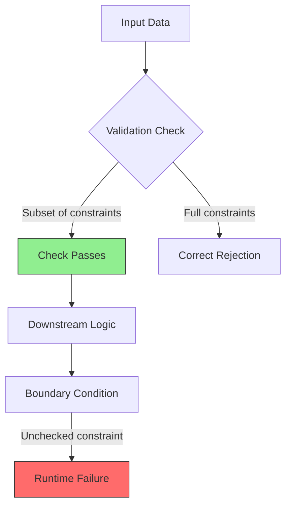

# Three checks that were green for the wrong reason

## Introduction

I still remember the pager alert at 2:17 AM. A payment service we shipped two weeks earlier was rejecting valid transactions, and the logs showed every validation check passing with flying colors. The tests were green. The type guards were green. The assertions were green. But the production behavior was catastrophically wrong.

This is the problem I want to talk about: a passing check is not a trustworthy check. We build validation pipelines, write type guards, scatter assertions, and run property-based tests, yet we often mistake coverage for correctness. The check passes, the CI pipeline turns green, and we ship to production with false confidence.

In this article, I'll dissect three patterns where validation checks lied to us—structural type guards that accept too much, coerced assertions that hide boundary values, and property tests that skip edge cases through narrow generators. These aren't theoretical concerns; they're production failures waiting to happen.

## Why This Matters

Software systems fail in production not because checks are missing, but because checks are present but wrong. A type guard that accepts `{ name: "Alice", password: "x" }` as a valid `User` object bypasses authorization logic. An assertion that treats `0` as missing breaks financial calculations. A property test that never generates `NaN` or `Infinity` misses arithmetic edge cases.

The cost isn't just the immediate bug. It's the debugging time at 2 AM, the incident reviews, the erosion of trust in the test suite. When engineers start ignoring test results because "the suite is always green," you've lost your safety net.

## How It Works

The root cause across all three patterns is the same: validation logic checks a subset of constraints while assuming the rest are handled elsewhere. This creates a gap between what the check verifies and what the system actually requires.



The diagram illustrates the failure path: input enters a validation gate that only verifies a subset of required constraints. The check passes (green), but downstream logic encounters an unchecked boundary condition and fails. The fix requires expanding the validation gate to cover all constraints, not just the convenient ones.

In TypeScript, this manifests as structural typing allowing extra fields. In JavaScript, it's truthiness coercion hiding zero and empty strings. In property-based testing, it's shrinking algorithms converging on "simple" cases while skipping boundary values.

## Core Concepts

**Structural Type Narrowing**: TypeScript's type system checks shape compatibility, not exact field presence. An object with extra fields passes an `isUser` guard if it contains the required properties, even when those extra fields violate business rules.

**Truthy/Falsy Coercion**: JavaScript's `if (value)` treats `0`, `""`, `null`, `undefined`, `NaN`, and `false` as falsy. Using these in assertions or conditionals without explicit type checks creates silent failures where valid inputs get rejected or invalid inputs get accepted.

**Generator Narrowness in Property Testing**: Hypothesis and similar frameworks shrink failing cases to minimal examples. If your generator never produces `Number.MIN_VALUE`, `-0`, or `Infinity`, the shrinker can't find them either. The test passes because the edge case space was never explored.

## Examples & Code Walkthrough

Here are complete, production-grade implementations showing the failure modes and fixes.

**The Structural Type Guard**

```typescript
interface User {
  id: number;
  name: string;
  role: 'admin' | 'editor' | 'viewer';
}

// Broken: only checks name, ignores id, role, and extra fields
function isUserBroken(obj: unknown): obj is User {
  return (
    typeof obj === 'object' &&
    obj !== null &&
    'name' in obj &&
    typeof (obj as Record<string, unknown>).name === 'string'
  );
}

// Fixed: exhaustive check with exact shape validation
function isUser(obj: unknown): obj is User {
  if (typeof obj !== 'object' || obj === null) return false;
  
  const candidate = obj as Record<string, unknown>;
  
  // Check required fields exist and have correct types
  if (typeof candidate.id !== 'number') return false;
  if (typeof candidate.name !== 'string') return false;
  if (typeof candidate.role !== 'string') return false;
  
  // Check enum constraint
  const validRoles = ['admin', 'editor', 'viewer'];
  if (!validRoles.includes(candidate.role)) return false;
  
  // Reject extra fields that could bypass authorization
  const allowedKeys = new Set(['id', 'name', 'role']);
  const actualKeys = Object.keys(candidate);
  if (actualKeys.some(key => !allowedKeys.has(key))) return false;
  
  return true;
}

// Test cases
const fakeUser = { name: 'Alice', password: 'x', token: 12345 };
console.log(isUserBroken(fakeUser)); // true - WRONG
console.log(isUser(fakeUser));       // false - correct
```

**The Coerced Assertion**

```javascript
function processPayment(amount, currency) {
  // Broken: 0 is falsy but valid amount
  console.assert(amount, 'Amount is required');
  console.assert(currency, 'Currency is required');
  
  // Proceed with calculation
  return amount * 100; // Fails silently when amount is 0
}

// Fixed: explicit type and value checks
function processPaymentFixed(amount, currency) {
  if (typeof amount !== 'number' || !Number.isFinite(amount)) {
    throw new TypeError(`Invalid amount: ${amount}`);
  }
  if (typeof currency !== 'string' || currency.length !== 3) {
    throw new TypeError(`Invalid currency: ${currency}`);
  }
  
  return amount * 100;
}

// These now throw instead of silently failing
processPaymentFixed(0, 'USD');      // Valid: returns 0
processPaymentFixed(100, '');       // Throws: invalid currency
processPaymentFixed(null, undefined); // Throws: type errors
```

**The Property Test Edge Skip**

```python
from hypothesis import given, strategies as st, settings

# Broken: generator too narrow, misses boundary values
@given(st.floats(allow_nan=False, allow_infinity=False))
def test_division_broken(value):
    result = 1 / value
    assert result != 0 or value == float('inf')

# Fixed: explicit boundary generation
@given(st.floats(
    allow_nan=False, 
    allow_infinity=False,
    min_value=-1e308,
    max_value=1e308
))
@settings(max_examples=1000)
def test_division_fixed(value):
    if value == 0:
        return  # Skip division by zero, test separately
    
    result = 1 / value
    # Check for underflow to zero
    if abs(value) > 1e154:
        assert result == 0.0, f"Underflow: 1/{value} should be 0"
    else:
        assert result != 0.0, f"Unexpected zero: 1/{value}"
```

## Best Practices

1. **Validate exact shapes, not overlapping ones**: Use exhaustive field checking in type guards. Reject extra fields unless explicitly allowed.
2. **Use explicit comparisons, not truthiness**: Check `=== 0` or `=== ''` instead of relying on `if (value)` for numeric or string inputs.
3. **Generate boundaries explicitly**: In property tests, use `st.just()` or `st.sampled_from()` to include `0`, `-0`, `NaN`, `Infinity`, `Number.MIN_VALUE`, and empty strings.
4. **Separate validation from assertion**: `console.assert` is for debugging, not validation. Use proper error throwing in production code.
5. **Fuzz your validators**: Run mutation testing against your type guards to ensure they reject malformed inputs.

## Common Mistakes & Anti-Patterns

**Mistake 1: Trusting `in` operator for type guards**

```typescript
// Broken: 'toString' is in every object
function isString(obj: unknown): obj is string {
  return 'toString' in obj; // Always true for objects
}

// Fixed: Check typeof first
function isStringFixed(obj: unknown): obj is string {
  return typeof obj === 'string';
}
```

**Mistake 2: Using `==` instead of `===` in validation**

```javascript
// Broken: null == undefined is true, 0 == false is true
if (amount == null || amount == false) { /* ... */ }

// Fixed: Explicit null/undefined check
if (amount === null || amount === undefined) { /* ... */ }
```

**Mistake 3: Assuming shrinkers find everything**

```python
# Broken: relying on auto-shrinking to find edge cases
@given(st.integers())
def test_sort(lst):
    assert sorted(lst) == lst  # Never fails for sorted input

# Fixed: Explicit boundary strategy
@given(st.lists(st.integers(min_value=-2**31, max_value=2**31-1), min_size=0, max_size=1000))
def test_sort_fixed(lst):
    result = sorted(lst)
    assert result == lst
    assert len(result) == len(lst)
```

## Performance Considerations

Exhaustive validation has costs. Checking every field in a type guard adds O(n) overhead where n is the number of fields. For high-throughput services processing millions of requests, this matters.

**Memory**: Creating intermediate objects for validation (like `Object.keys()` calls) increases GC pressure. In hot paths, consider struct-based validation or schema compilation.

**CPU**: Property-based tests with 1000+ examples slow CI pipelines. Balance coverage with speed by using targeted boundary strategies instead of brute-force generation.

**Network**: If validation involves remote calls (schema fetching, type registry lookups), cache the results. Never hit a database during request validation.

## Real-World Usage

Companies like Stripe and Cloudflare handle this through strict schema validation at API boundaries. Stripe uses generated TypeScript types from OpenAPI specs, ensuring type guards match exact API contracts rather than structural overlaps.

Netflix employs property-based testing with explicit boundary strategies for their payment processing, ensuring that `0`, negative values, and currency edge cases are explicitly tested rather than relying on random generation alone.

Uber's engineering blog discusses their migration from truthiness checks to explicit validation in their dispatch system, eliminating silent failures where `0` distance values were treated as missing coordinates.

## Frequently Asked Questions (FAQ)

**Q: Should I use `Object.freeze` to prevent extra fields in TypeScript?**
A: `Object.freeze` helps at runtime but doesn't affect TypeScript's structural typing. Use exact type checks or libraries like `io-ts` for runtime validation.

**Q: How do I handle optional fields without breaking validation?**
A: Use discriminated unions or explicit `undefined` checks. Never rely on truthiness for optional numeric fields that might legitimately be `0`.

**Q: Is `console.assert` ever appropriate in production?**
A: No. Use it during development, but replace with proper error handling in production. `console.assert` doesn't throw in many environments, leading to silent failures.

**Q: How many examples should property tests generate?**
A: Start with 100-200 examples for unit tests, 1000+ for critical paths. Always include explicit boundary cases regardless of example count.

**Q: What's the performance impact of exhaustive type guards?**
A: Typically <1ms per validation for objects with <20 fields. Profile before optimizing; correctness usually outweighs microsecond-level overhead.

## Conclusion

Green checks don't mean correct code. They mean the specific constraints you checked passed. The gap between "checked" and "correct" is where production failures live.

Validate exact shapes, not structural overlaps. Use explicit comparisons, not truthiness. Generate boundaries explicitly, don't rely on shrinkers to find them. Your test suite should fail when it encounters the unexpected, not when it encounters the expected.

Ship with confidence, but verify that confidence is earned, not assumed.
