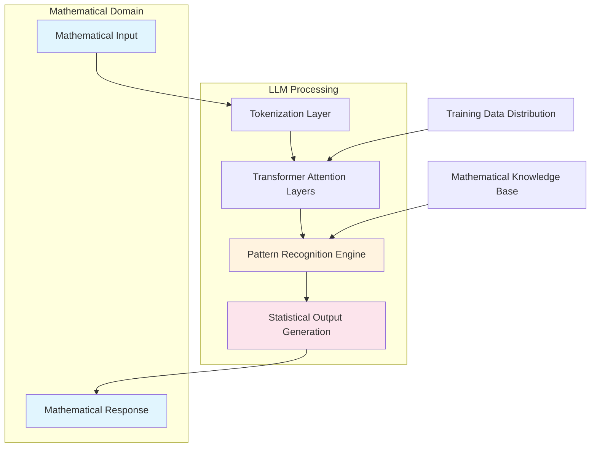

# Tim Gowers: What sort of maths are LLMs good at?

## Introduction

Tim Gowers is a Fields Medalist mathematician who has spent considerable time thinking about how artificial intelligence intersects with mathematical reasoning. His recent explorations into large language models (LLMs) have produced some of the most insightful observations about what kinds of mathematics these systems can actually handle well versus where they fall short.

For software engineers working with formal methods, theorem provers, or mathematical computation systems, Gowers' perspective offers a crucial reality check. He doesn't just ask whether LLMs can do math—he asks what *kind* of math they're suited for, and more importantly, what this tells us about the nature of mathematical reasoning itself.

## Why This Matters

Most programming languages have some form of built-in mathematical capability, whether through libraries like NumPy, symbolic computation packages, or even embedded DSLs for specific domains. But when we start asking LLMs to generate or verify mathematical proofs, or to assist with symbolic manipulation, we hit fundamental limitations that aren't just technical—they're epistemological.

This matters because many language designers are now embedding AI assistance directly into their toolchains. If you're building a dependently typed language, a proof assistant, or a system that requires mathematical correctness guarantees, you need to understand what parts of that problem space LLMs can actually help with versus where you need traditional algorithmic approaches.

Gowers' observations also highlight a deeper issue: the difference between pattern matching over mathematical syntax and genuine mathematical understanding. This distinction affects everything from code generation quality to automated verification systems.

## How It Works

The core insight from Gowers' analysis is that LLMs operate primarily through statistical pattern recognition rather than logical deduction. Here's a simplified architectural view of how this plays out in mathematical contexts:



The key insight is that the "Pattern Recognition Engine" (D) doesn't actually perform mathematical operations—it matches input patterns against training data distributions. When it generates a proof, it's stitching together statistically probable sequences of symbols, not constructing a logically valid argument.

## Core Concepts

**Pattern Matching vs. Logical Deduction**: LLMs excel at recognizing when a mathematical expression or proof structure looks similar to something in their training data. They generate responses based on what comes next in the probability distribution, not what follows logically from axioms.

**Computational vs. Conceptual Mathematics**: There's a meaningful difference between computational mathematics (arithmetic, algebra, calculus operations) and conceptual mathematics (proof theory, abstract algebra, topology). LLMs tend to perform better on the former because it's more pattern-like.

**Training Data Bias**: The mathematical knowledge embedded in LLMs reflects what's commonly written about mathematics, not necessarily what's mathematically correct. This creates systematic biases toward certain styles of proof and away from more novel or counterintuitive results.

**Verification Gap**: While LLMs can often generate plausible-looking mathematical arguments, verifying their correctness typically requires separate formal verification tools or human oversight.

## Examples & Code Walkthrough

Let's look at a concrete example. Suppose we want to verify whether an LLM-generated proof of the irrationality of √2 is correct:

```python
from typing import Tuple, Optional
import re

class MathProofVerifier:
    def __init__(self):
        self.known_patterns = {
            'irrationality_proof': r'assume.*√2.*rational.*contradiction',
            'induction_step': r'base_case.*inductive_hypothesis.*inductive_step',
            'contradiction_structure': r'assume.*then.*contradiction'
        }
    
    def extract_key_components(self, proof: str) -> dict:
        """Extract logical components from a proof"""
        components = {}
        
        # Look for assumption patterns
        assumption_match = re.search(
            r'assume\s+(.*?)\s+then', 
            proof, 
            re.IGNORECASE | re.DOTALL
        )
        if assumption_match:
            components['assumption'] = assumption_match.group(1)
            
        # Look for contradiction markers
        contradiction_matches = re.findall(
            r'(cannot|impossible|contradicts).*?(?=\.|$)',
            proof,
            re.IGNORECASE
        )
        components['contradictions'] = contradiction_matches
        
        return components
    
    def validate_structure(self, proof: str) -> Tuple[bool, Optional[str]]:
        """Basic structural validation"""
        components = self.extract_key_components(proof)
        
        if 'assumption' not in components:
            return False, "Missing initial assumption"
            
        if not components.get('contradictions'):
            return False, "No clear contradiction identified"
            
        return True, "Structure appears valid"

# Example usage
verifier = MathProofVerifier()

llm_proof = """
Assume √2 is rational, so √2 = p/q where p and q are integers with no common factors.
Then 2 = p²/q², so 2q² = p².
This means p² is even, so p is even.
Let p = 2k for some integer k.
Then 2q² = (2k)² = 4k², so q² = 2k².
This means q² is even, so q is even.
But then both p and q are even, contradicting our assumption.
Therefore √2 is irrational.
"""

is_valid, message = verifier.validate_structure(llm_proof)
print(f"Validation: {message}")
```

This code demonstrates a basic approach to validating LLM-generated mathematical proofs. Note that this is purely structural validation—it checks for the presence of expected patterns, not logical correctness.

## Best Practices

**Hybrid Approach**: Don't rely solely on LLMs for mathematical reasoning in critical systems. Use them for initial exploration or suggestion generation, but always verify results with formal methods or traditional algorithms.

**Prompt Engineering**: When asking LLMs to perform mathematical tasks, be extremely specific about the domain and desired output format. Include constraints and expected verification steps.

**Layered Verification**: Implement multiple layers of validation—syntactic checking, pattern matching, and formal verification where possible.

**Domain-Specific Fine-Tuning**: For production systems requiring mathematical capabilities, consider fine-tuning on domain-specific mathematical corpora rather than relying on general-purpose LLMs.

## Common Mistakes & Anti-Patterns

**Mistake 1: Treating LLM Output as Proof**
Engineers sometimes accept LLM-generated mathematical arguments as valid without independent verification. This leads to subtle bugs in systems that depend on mathematical correctness.

**Mistake 2: Overfitting to Training Patterns**
LLMs can generate convincing but mathematically incorrect arguments if they match the statistical patterns of training data. Always verify against known mathematical principles.

**Mistake 3: Ignoring Domain Limitations**
Attempting to use LLMs for highly abstract mathematical reasoning (category theory, advanced topology) often produces less useful results than expected. Recognize the boundaries of pattern-based reasoning.

**Mistake 4: Insufficient Prompt Constraints**
Generic prompts like "prove this theorem" often yield verbose, circuitous arguments. Specific, constrained prompts work better for targeted mathematical tasks.

## Performance Considerations

**Latency vs. Accuracy Trade-offs**: LLM-based mathematical reasoning introduces significant latency compared to traditional algorithmic approaches. For real-time systems, pre-computed solutions or cached results are often preferable.

**Memory Overhead**: Storing and processing mathematical expressions in LLM contexts requires substantial memory, especially when maintaining conversation history or context windows.

**Computational Complexity**: The O(n²) attention mechanism in transformers makes processing long mathematical expressions expensive. Breaking complex proofs into smaller chunks can improve performance.

**Scalability Concerns**: As mathematical complexity grows, LLM performance degrades more quickly than traditional symbolic computation systems, which often scale linearly or polynomially with problem size.

## Real-World Usage

Several companies are already experimenting with LLM-enhanced mathematical tools:

- **GitHub Copilot** uses LLMs for generating mathematical code snippets and documentation
- **Wolfram Alpha** incorporates LLM-based explanation generation alongside traditional symbolic computation
- **Proof assistants** like Lean are exploring LLM integration for tactic suggestion and proof automation
- **Educational platforms** use LLMs to generate step-by-step mathematical explanations

However, production systems typically maintain strict separation between LLM-generated suggestions and formally verified mathematical operations.

## Frequently Asked Questions (FAQ)

**Q: Can LLMs replace traditional symbolic computation systems?**
A: Not for critical applications. LLMs excel at explaining concepts and suggesting approaches, but symbolic systems like Mathematica or SageMath remain superior for actual computation and verification.

**Q: How do we handle LLM hallucinations in mathematical contexts?**
A: Implement rigorous validation pipelines. Never trust LLM output without independent verification, especially for proofs or correctness-critical calculations.

**Q: Are there specific mathematical domains where LLMs perform better?**
A: Elementary number theory, basic calculus manipulations, and combinatorial arguments tend to work well because they have abundant training data and clear pattern structures.

**Q: What's the computational cost comparison?**
A: LLM-based mathematical reasoning is orders of magnitude slower than traditional algorithms, making it unsuitable for performance-critical applications.

## Conclusion

Tim Gowers' analysis reveals that LLMs are tools for pattern recognition in mathematical spaces, not substitutes for logical reasoning. For language designers and engineers, this means leveraging LLMs where pattern matching adds value—explanation generation, suggestion systems, educational tools—while relying on traditional algorithms for correctness-critical operations.

The real power lies in hybrid systems that combine LLM capabilities with formal verification, creating tools that are both helpful and reliable. As we build the next generation of programming languages and mathematical tools, understanding these boundaries will be crucial for avoiding both over-reliance and missed opportunities.
