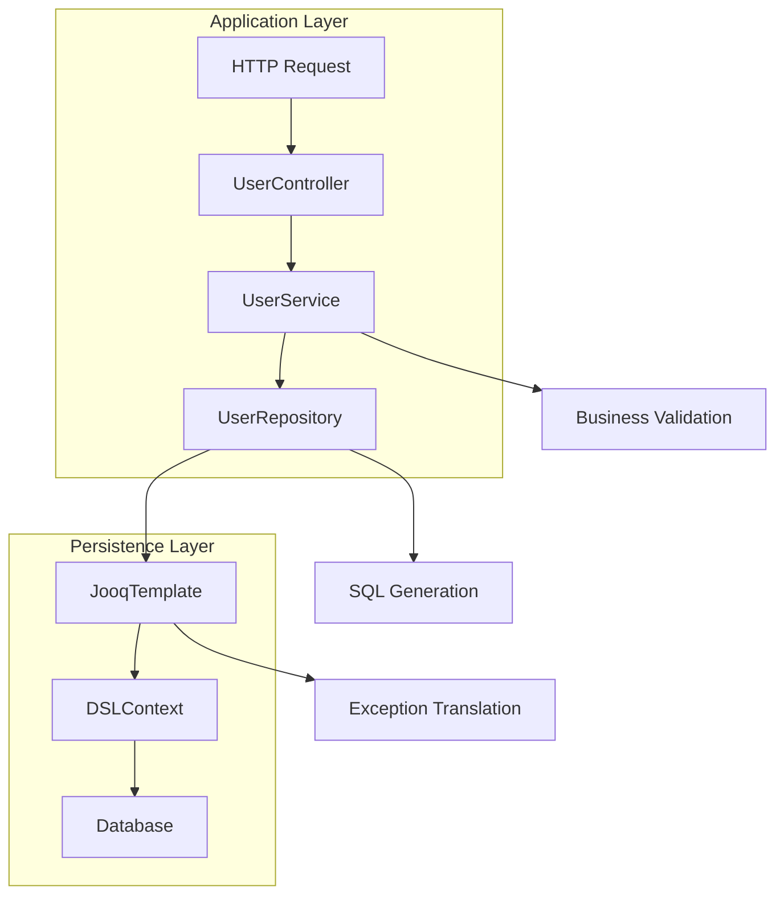

# Using JooqTemplate implement UserService Demo

## Introduction

Let's cut right to it: working with databases in Java applications often feels like herding cats. You've got raw JDBC calls that are verbose and error-prone, then there's Hibernate with its magic that sometimes backfires spectacularly. Enter JOOQ and its lesser-known sibling JooqTemplate – tools that aim to give us the type safety of JOOQ's fluent API without all the ceremony.

This article walks through building a practical UserService demo using JooqTemplate, focusing on real implementation details rather than theoretical perfection. We'll cover everything from project setup to production deployment considerations, with code you can actually run.

## Why This Matters

Database interaction remains one of the most critical and error-prone aspects of backend development. Traditional approaches either sacrifice type safety for convenience or add layers of complexity that obscure what's actually happening. JooqTemplate sits at that sweet spot – providing compile-time safety while keeping the code readable and maintainable.

For teams dealing with complex queries, legacy schemas, or performance-critical operations, this approach pays dividends. It's particularly valuable when you need precise control over SQL generation without abandoning modern development practices.

## How It Works

At its core, JooqTemplate wraps JOOQ's DSLContext with additional convenience methods. Think of it as a specialized template pattern implementation that handles common database operations while preserving the expressive power of JOOQ's type-safe SQL building blocks.



The flow is straightforward:
1. Controller receives the request and delegates to service layer
2. Service performs business validation and orchestrates operations
3. Repository uses JooqTemplate to execute database operations
4. JooqTemplate translates between domain objects and database records
5. DSLContext handles the actual SQL generation and execution

## Core Concepts

### JooqTemplate Design Philosophy

JooqTemplate follows the Template Method pattern but with a functional twist. Instead of abstract methods, it accepts lambda functions that define query logic. This eliminates boilerplate while maintaining flexibility.

Key principles:
- **Type Safety First**: All queries are validated at compile time
- **Minimal Abstraction**: No hidden magic – what you see is what you get
- **Transaction Awareness**: Integrates cleanly with Spring's transaction management
- **Exception Translation**: Converts database exceptions to meaningful application exceptions

### Relationship with Spring Ecosystem

Unlike Spring Data JPA's repository proxies, JooqTemplate works directly with JOOQ's fluent API. This means:
- Full access to JOOQ's advanced features (stored procedures, complex joins)
- No proxy overhead or reflection-based method interception
- Explicit transaction boundaries that are easier to reason about

## Examples & Code Walkthrough

Let's build this thing step by step.

### Project Setup

Maven configuration (because let's be honest, most enterprise projects still use it):

```xml
<dependencies>
    <dependency>
        <groupId>org.springframework.boot</groupId>
        <artifactId>spring-boot-starter-web</artifactId>
    </dependency>
    <dependency>
        <groupId>org.springframework.boot</groupId>
        <artifactId>spring-boot-starter-data-jooq</artifactId>
    </dependency>
    <dependency>
        <groupId>org.jooq</groupId>
        <artifactId>jooq</artifactId>
        <version>3.18.7</version>
    </dependency>
    <dependency>
        <groupId>org.postgresql</groupId>
        <artifactId>postgresql</artifactId>
        <scope>runtime</scope>
    </dependency>
</dependencies>
```

Code generation configuration in `application.yml`:

```yaml
spring:
  jooq:
    sql-load-executor: spring-jobs
    translations:
      method: json
```

### Domain Model

We'll model a user system that handles real-world complexity:

```java
public class User {
    private final UUID id;
    private final String email;
    private final String firstName;
    private final String lastName;
    private final LocalDateTime createdAt;
    private final UserStatus status;
    private final Set<String> roles;
    
    // Business logic encapsulated in the entity itself
    public String getFullName() {
        return String.format("%s %s", firstName, lastName).trim();
    }
    
    public boolean isActive() {
        return status == UserStatus.ACTIVE;
    }
    
    public boolean hasRole(String role) {
        return roles.contains(role);
    }
    
    // Factory method for creation
    public static User createNew(String email, String firstName, String lastName) {
        return new User(
            UUID.randomUUID(),
            email,
            firstName,
            lastName,
            LocalDateTime.now(),
            UserStatus.PENDING,
            Collections.emptySet()
        );
    }
}

enum UserStatus {
    ACTIVE, INACTIVE, SUSPENDED, PENDING
}
```

### Repository Layer

Here's where JooqTemplate shines – complex queries become readable:

```java
@Repository
public class UserRepository {
    
    private final JooqTemplate jooqTemplate;
    private final UserRecordMapper mapper;
    
    public UserRepository(JooqTemplate jooqTemplate) {
        this.jooqTemplate = jooqTemplate;
        this.mapper = new UserRecordMapper();
    }
    
    // Simple find by ID
    public Optional<User> findById(UUID id) {
        return jooqTemplate.select(USERS)
            .where(USERS.ID.eq(id))
            .fetchOne(mapper::toDomain);
    }
    
    // Complex search with multiple criteria
    public List<User> search(SearchCriteria criteria) {
        SelectQuery<USERSRecord> query = dsl.selectFrom(USERS);
        
        if (criteria.getDepartment() != null) {
            query.where(USERS.DEPARTMENT.eq(criteria.getDepartment()));
        }
        
        if (criteria.getStatus() != null) {
            query.and(USERS.STATUS.eq(criteria.getStatus()));
        }
        
        if (criteria.getCreatedAfter() != null) {
            query.and(USERS.CREATED_AT.greaterThan(criteria.getCreatedAfter()));
        }
        
        return query.orderBy(USERS.LAST_NAME)
                   .limit(criteria.getLimit())
                   .offset(criteria.getOffset())
                   .fetch(mapper::toDomain);
    }
    
    // Upsert operation with conflict resolution
    @Transactional
    public User save(User user) {
        UserRecord record = mapper.toRecord(user);
        
        return jooqTemplate.insertInto(USERS)
            .set(USERS.ID, record.getId())
            .set(USERS.EMAIL, record.getEmail())
            .set(USERS.FIRST_NAME, record.getFirstName())
            .set(USERS.LAST_NAME, record.getLastName())
            .set(USERS.DEPARTMENT, record.getDepartment())
            .set(USERS.STATUS, record.getStatus())
            .set(USERS.CREATED_AT, record.getCreatedAt())
            .onConflict(USERS.ID)
            .doUpdate()
            .set(USERS.EMAIL, record.getEmail())
            .set(USERS.FIRST_NAME, record.getFirstName())
            .set(USERS.LAST_NAME, record.getLastName())
            .set(USERS.DEPARTMENT, record.getDepartment())
            .set(USERS.STATUS, record.getStatus())
            .returning()
            .fetchOne(mapper::toDomain);
    }
    
    // Bulk operations
    public void deactivateUsers(List<UUID> userIds) {
        jooqTemplate.update(USERS)
            .set(USERS.STATUS, UserStatus.INACTIVE)
            .where(USERS.ID.in(userIds))
            .execute();
    }
}
```

### Service Layer

Business logic lives here, orchestrated with care:

```java
@Service
@RequiredArgsConstructor
public class UserService {
    
    private final UserRepository userRepository;
    private final PasswordEncoder passwordEncoder;
    private final EmailService emailService;
    private final UserValidator userValidator;
    
    @Transactional
    public UserRegistrationResult registerUser(UserRegistrationRequest request) {
        // Validate input
        userValidator.validate(request);
        
        // Check for existing user
        if (userRepository.existsByEmail(request.getEmail())) {
            throw new DuplicateUserException("Email already registered: " + request.getEmail());
        }
        
        // Create user entity
        User user = User.createNew(
            request.getEmail(),
            request.getFirstName(),
            request.getLastName()
        );
        
        // Add default role
        User userWithRoles = user.toBuilder()
            .roles(Set.of("USER"))
            .status(UserStatus.ACTIVE)
            .build();
        
        // Save to database
        User savedUser = userRepository.save(userWithRoles);
        
        // Send welcome email
        emailService.sendWelcomeEmail(savedUser.getEmail(), savedUser.getFullName());
        
        return UserRegistrationResult.success(savedUser.getId());
    }
    
    public Page<User> getUsersByDepartment(String department, Pageable pageable) {
        SearchCriteria criteria = SearchCriteria.builder()
            .department(department)
            .status(UserStatus.ACTIVE)
            .limit((int) pageable.getPageSize())
            .offset((int) pageable.getOffset())
            .build();
        
        List<User> users = userRepository.search(criteria);
        long totalCount = userRepository.countByDepartment(department);
        
        return new PageImpl<>(users, pageable, totalCount);
    }
    
    @Transactional
    public User updateLastLogin(UUID userId) {
        return userRepository.findById(userId)
            .map(user -> {
                User updated = user.toBuilder()
                    .lastLogin(LocalDateTime.now())
                    .build();
                return userRepository.save(updated);
            })
            .orElseThrow(() -> new UserNotFoundException(userId));
    }
}
```

### Controller Layer

RESTful endpoints that speak the language of HTTP:

```java
@RestController
@RequestMapping("/api/v1/users")
@RequiredArgsConstructor
public class UserController {
    
    private final UserService userService;
    private final UserMapper userMapper;
    
    @PostMapping
    public ResponseEntity<UserRegistrationResponse> register(
            @Valid @RequestBody UserRegistrationRequest request) {
        
        UserRegistrationResult result = userService.registerUser(request);
        
        return ResponseEntity.created(
                URI.create("/api/v1/users/" + result.getUserId()))
            .body(UserRegistrationResponse.from(result));
    }
    
    @GetMapping("/department/{department}")
    public ResponseEntity<Page<UserResponse>> getByDepartment(
            @PathVariable String department,
            @RequestParam(defaultValue = "0") int page,
            @RequestParam(defaultValue = "20") int size) {
        
        Pageable pageable = PageRequest.of(page, size);
        Page<User> users = userService.getUsersByDepartment(department, pageable);
        
        return ResponseEntity.ok(
            users.map(userMapper::toResponse));
    }
    
    @PutMapping("/{id}/last-login")
    public ResponseEntity<UserResponse> updateLastLogin(@PathVariable UUID id) {
        User updatedUser = userService.updateLastLogin(id);
        return ResponseEntity.ok(UserResponse.from(updatedUser));
    }
}
```

## Best Practices

### Connection Pool Configuration

Don't overlook database connections – they're your bottleneck:

```yaml
spring:
  datasource:
    hikari:
      maximum-pool-size: 20
      minimum-idle: 5
      connection-timeout: 30000
      idle-timeout: 600000
      max-lifetime: 1800000
      leak-detection-threshold: 60000
```

### Query Optimization Patterns

Always fetch only what you need:

```java
// Bad - selects all columns
public List<User> findAll() {
    return jooqTemplate.select(USERS).fetch(mapper::toDomain);
}

// Good - selects only required columns
public List<UserSummary> findUserSummaries() {
    return jooqTemplate.select(USERS.ID, USERS.EMAIL, USERS.FIRST_NAME, USERS.LAST_NAME)
        .from(USERS)
        .where(USERS.STATUS.eq(UserStatus.ACTIVE))
        .fetch(record -> new UserSummary(
            record.get(USERS.ID),
            record.get(USERS.EMAIL),
            record.get(USERS.FIRST_NAME),
            record.get(USERS.LAST_NAME)
        ));
}
```

### Exception Handling Strategy

Create meaningful exception hierarchies:

```java
public abstract class UserDomainException extends RuntimeException {
    protected UserDomainException(String message) {
        super(message);
    }
}

public class DuplicateUserException extends UserDomainException {
    public DuplicateUserException(String message) {
        super(message);
    }
}

public class UserNotFoundException extends UserDomainException {
    public UserNotFoundException(UUID userId) {
        super("User not found: " + userId);
    }
}
```

## Common Mistakes & Anti-Patterns

### 1. Loading Entire Tables Into Memory

```java
// Anti-pattern - loads all users into memory
public List<User> getAllUsers() {
    return jooqTemplate.select(USERS).fetch(mapper::toDomain);
}

// Better - implement pagination
public Page<User> getUsers(int page, int size) {
    // Implementation with limit/offset
}
```

### 2. Mixing Transaction Boundaries

```java
// Problematic - multiple transactions
public void complexOperation() {
    userService.createUser(user1);  // Transaction 1
    userService.createUser(user2);  // Transaction 2
    auditService.logCreation(user1); // Transaction 3
}

// Better - single transaction boundary
@Transactional
public void complexOperation() {
    userService.createUser(user1);
    userService.createUser(user2);
    auditService.logCreation(user1);
}
```

### 3. Ignoring Database Constraints

Always handle constraint violations gracefully:

```java
try {
    return userRepository.save(user);
} catch (DataIntegrityViolationException e) {
    if (e.getCause() instanceof PSQLException psqlEx && 
        psqlEx.getSQLState().equals("23505")) { // Unique violation
        throw new DuplicateUserException("User already exists");
    }
    throw e;
}
```

## Performance Considerations

### Index Usage

JOOQ helps you leverage indexes effectively:

```java
// This query can use an index on EMAIL
public Optional<User> findByEmail(String email) {
    return jooqTemplate.select(USERS)
        .where(USERS.EMAIL.eq(email))
        .fetchOne(mapper::toDomain);
}

// Create the index in your migration scripts
// CREATE INDEX idx_users_email ON users(email);
```

### Batch Operations

For bulk updates/inserts:

```java
public void bulkUpdateStatus(List<UUID> userIds, UserStatus newStatus) {
    jooqTemplate.update(USERS)
        .set(USERS.STATUS, newStatus)
        .where(USERS.ID.in(userIds))
        .execute();
}

public List<User> bulkInsert(List<User> users) {
    return users.stream()
        .map(mapper::toRecord)
        .collect(Collectors.toList())
        .pipe(jooqTemplate.batchInsert(USERS));
}
```

## Real-World Usage

Companies handling millions of user records rely on similar patterns. The financial services sector particularly benefits from JOOQ's type safety – it prevents costly SQL injection vulnerabilities and ensures queries match schema definitions exactly.

Netflix's backend infrastructure reportedly uses JOOQ extensively for their content delivery systems, where query correctness trumps development speed. The type-safe nature catches errors that would otherwise surface only in production.

## Frequently Asked Questions (FAQ)

**Q: How does JooqTemplate compare to Spring Data JPA?**
A: JooqTemplate gives you more control and better performance for complex queries, but requires more explicit coding. JPA excels at simple CRUD operations with minimal code.

**Q: Can I use JooqTemplate with multiple databases?**
A: Absolutely. Configure separate DSLContext beans for each datasource, and inject the appropriate one into your repositories.

**Q: What about read replicas?**
A: JooqTemplate works seamlessly with read replicas. Just configure routing DataSource or use JOOQ's settings to control query routing.

**Q: How do I handle database migrations?**
A: Use Flyway or Liquibase alongside JOOQ code generation. Regenerate code after schema changes to maintain type safety.

## Conclusion

JooqTemplate offers a compelling middle ground between raw JDBC and full ORM solutions. It provides type safety, performance, and flexibility without sacrificing developer productivity. The UserService demo shows how practical, production-ready applications can be built with this approach.

The key is understanding when to apply these patterns – complex reporting systems benefit enormously, while simple admin panels might be overkill. As with any tool, mastery comes from knowing both its strengths and limitations.

Start small
