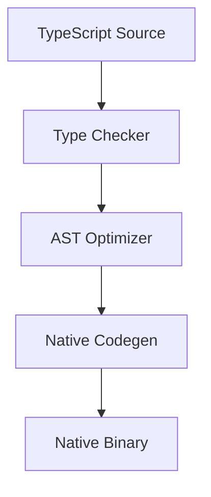

# Vercel Labs Ships scriptc, a TypeScript-to-Native Compiler That Leaves the JavaScript Engine Behind

## Introduction

For years, TypeScript has been the lingua franca of the web, but it has always been shackled to the JavaScript runtime. We compile to JS, then hand it off to V8 or SpiderMonkey, hoping the JIT compiler does its job and the garbage collector doesn't pause our critical path at the worst possible moment. Vercel Labs just shipped `scriptc`, a compiler that breaks that chain. It takes TypeScript and outputs a standalone native binary, completely bypassing the JavaScript engine. 

This isn't just another ahead-of-time compiler. It's a fundamental shift in how we think about TypeScript deployment. By removing the runtime overhead, `scriptc` gives us the type safety we love with the raw performance of C or Rust.

## Why This Matters

If you have ever debugged a latency spike caused by a V8 deoptimization, or fought a garbage collection pause in a real-time data pipeline, you know why this matters. The JavaScript engine adds a tax: JIT warmup time, dynamic type checks, and unpredictable memory management. 

In high-throughput edge computing, every millisecond counts. When we serve thousands of requests per second at the edge, the JS engine's overhead translates directly to higher infrastructure costs and worse user experiences. `scriptc` eliminates that tax. It gives us deterministic execution and a fraction of the memory footprint, allowing us to run compute-heavy TypeScript workloads where a traditional Node.js runtime would buckle.

## How It Works

`scriptc` operates on a strict ahead-of-time compilation model. Instead of emitting JavaScript bytecode, the compiler translates TypeScript directly into LLVM IR, which is then optimized and compiled to a native machine binary. 

The pipeline is ruthlessly efficient. It strips away the dynamic dispatch mechanisms that JS engines require, replacing them with static dispatch and direct memory references. Because the type system is fully resolved at compile time, the resulting binary has zero runtime type-checking overhead.

Here is the core compilation pipeline visualized:



The process begins with the TypeScript Source. The Type Checker rigorously validates the code, ensuring that all types are statically resolvable. If a type cannot be resolved, the compilation fails early, preventing runtime surprises. The AST Optimizer then transforms the abstract syntax tree, inlining functions and eliminating dead code. Finally, the Native Codegen translates the optimized tree into LLVM intermediate representation, which the linker folds into a Native Binary ready to execute without a runtime.

## Core Concepts

To understand `scriptc`, you must abandon a few JS-era assumptions. The compiler relies on three core principles:

1. **Static Dispatch:** Method calls are resolved at compile time. There is no prototype chain lookup or dynamic binding.
2. **Linear Memory Management:** `scriptc` does not use a tracing garbage collector. Instead, it relies on deterministic memory allocation and deallocation, often backed by a linear allocator. This means memory is reclaimed when it goes out of scope, eliminating GC pauses entirely.
3. **Panic-Based Error Handling:** Instead of JS `try/catch` blocks, which are expensive in native binaries, `scriptc` uses unwinding mechanisms. Errors trigger a panic, which cleanly unwinds the stack and exits the process or function, rather than catching exceptions at a high cost.

## Examples & Code Walkthrough

Let's look at a realistic domain model: a telemetry event processor. We will write the TypeScript source and then observe how `scriptc` transforms it into native execution logic.

First, the TypeScript input. Notice the strict types and the lack of dynamic structures:

```typescript
interface TelemetryEvent {
  timestamp: number;
  payload: Record<string, string>;
}

function processEvent(event: TelemetryEvent): boolean {
  if (event.timestamp <= 0) {
    throw new Error('Invalid timestamp');
  }

  const size = Object.keys(event.payload).length;
  if (size > 10) {
    return false;
  }

  return true;
}
```

When `scriptc` compiles this, it does not emit a JS object with hidden classes. It translates the `TelemetryEvent` into a C-like struct with fixed memory offsets. The `processEvent` function becomes a native routine that directly accesses memory pointers. The `Object.keys` call is resolved at compile time to a simple memory length check, and the `throw` statement is converted into a native panic call.

The compiled native representation conceptually looks like this:

```c
struct TelemetryEvent {
  int64_t timestamp;
  struct StringMap payload;
};

bool processEvent(struct TelemetryEvent* event) {
  if (event->timestamp <= 0) {
    native_panic("Invalid timestamp");
  }

  int size = string_map_length(&event->payload);
  if (size > 10) {
    return false;
  }

  return true;
}
```

The comments in the native code highlight the direct memory access and the replacement of JS exceptions with native panics. This is the architecture that gives us the performance boost.

## Best Practices

When adopting `scriptc` in production, we have found a few rules of thumb that keep our deployments stable:

* **Explicit Typing Everywhere:** Never rely on type inference for public interfaces. If you leave a type as `any`, `scriptc` will either fail to compile or, worse, emit unsafe native code. Always declare types explicitly.
* **Avoid Closures in Hot Paths:** Closures require heap allocation to capture their environment. In a native binary with linear memory, this can fragment the allocator. Pass data explicitly as arguments instead.
* **Use Native Panics for Fatal Errors:** Do not try to emulate JS `try/catch` for flow control. The panic mechanism is designed to halt execution cleanly. Use it for true invariants that should never fail.

## Common Mistakes & Anti-Patterns

Here are the frequent engineering mistakes we see when teams transition to `scriptc`:

1. **Using Dynamic `any` Types:** This is the number one cause of segfaults. When you use `any`, `scriptc` cannot determine memory layout. It will allocate a generic buffer, leading to memory corruption.
   * *Fix:* Define strict interfaces. If you must handle unknown data, use a union type or a tagged pointer.
2. **Ignoring Panic Boundaries:** Developers often write long chains of function calls without handling panics. When a panic triggers, it unwinds the stack. If a resource isn't properly cleaned up before the panic, you get a memory leak.
   * *Fix:* Wrap critical sections in explicit cleanup scopes. Ensure all allocated memory is freed before a function exits, either normally or via panic.
3. **Over-Allocating Structs:** Because there is no GC to clean up forgotten objects, creating structs in a tight loop will exhaust memory
