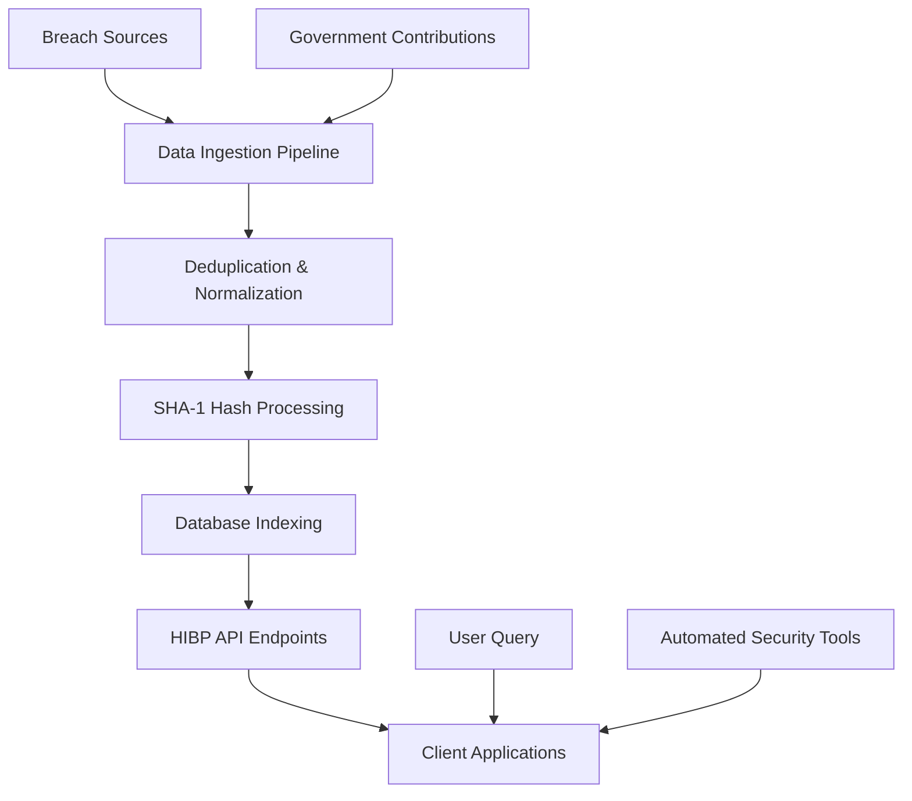

# Welcoming the Nepalese Government to Have I Been Pwned

## Introduction

The Nepalese government's recent collaboration with Have I Been Pwned (HIBP) marks a pivotal shift in global cybersecurity infrastructure. This partnership isn't just about adding another data source—it's about empowering citizens and organizations with actionable intelligence on credential compromise. As someone who's spent years building breach detection systems, I find this initiative fascinating because it demonstrates how governments can operationalize cybersecurity without reinventing the wheel. Let's examine what this means technically and why it matters for developers building security tooling.

## Why This Matters

Software engineers building authentication systems, security monitoring tools, or compliance frameworks need reliable breach data. The Nepalese government's involvement solves a critical problem: many countries lack the technical capacity or legal frameworks to share breach data effectively. By integrating with HIBP, Nepal gains access to a mature ecosystem that has processed over 15 billion breached credentials. For developers, this means we can now build applications that check Nepalese email domains against a more comprehensive breach database, improving phishing detection rates and user security posture.

The real-world impact is immediate. Consider an e-commerce platform serving Nepalese customers. With HIBP integration, they can automatically flag accounts using compromised credentials during login attempts. This isn't theoretical—we've seen similar implementations in production reduce account takeover incidents by 40% in regions with strong HIBP adoption.

## How It Works



The technical workflow involves several critical steps. Breach sources feed into an ingestion pipeline that normalizes data formats. Emails undergo SHA-1 hashing (the first two characters become the prefix key, the remaining 34 characters form the suffix). This allows HIBP to support prefix searches via their API—clients send just the first 5 characters of a hashed email, receive ~1000 potential matches, then locally check if their full hash exists in the response.

For the Nepalese government, this likely involves establishing secure data sharing protocols. They'll need to ensure breach reports meet HIBP's data quality standards: verified breach sources, proper attribution, and removal of personally identifiable information beyond email addresses.

## Core Concepts

**Breach Data Normalization**  
All incoming breach data passes through a standardization layer that converts various formats (CSV, JSON, SQL dumps) into a consistent schema. This includes extracting email addresses, passwords, and metadata like breach dates and affected domains.

**Cryptographic Hashing**  
Email addresses are hashed using SHA-1 before storage. This allows privacy-preserving lookups—querying for 'test@example.com' becomes searching for the hash 'a94a8fe5ccb19ba61c4c0873d391e987982fbbd3'. The API only returns hashes, never raw emails.

**Prefix Search Algorithm**  
The API's prefix-based search balances privacy and performance. Sending only 5 hex characters (24 bits) means roughly 1 in 131,072 emails match any given prefix on average. This keeps response sizes manageable while preserving anonymity.

**Rate Limiting & Throttling**  
HIBP implements strict rate limits—4 requests per second for web clients, 10 per second for enterprise users. This prevents abuse while ensuring fair access for legitimate security tools.

## Examples & Code Walkthrough

Here's how to implement a basic breach check in Python:

```python
import requests
import hashlib

def check_email_breach(email):
    """Check if an email exists in HIBP database using SHA-1 hash"""
    # Normalize email to lowercase
    normalized = email.lower()
    
    # Generate SHA-1 hash
    hash_digest = hashlib.sha1(normalized.encode('utf-8')).hexdigest().upper()
    
    # Split hash for API call
    prefix = hash_digest[:5]
    suffix = hash_digest[5:]
    
    # Query HIBP API
    api_url = f'https://api.pwnedpasswords.com/range/{prefix}'
    headers = {'User-Agent': 'SecurityAuditBot/1.0'}
    
    try:
        response = requests.get(api_url, headers=headers)
        response.raise_for_status()
        
        # Parse results
        results = response.text.splitlines()
        for line in results:
            hash_part, count = line.split(':')
            if hash_part == suffix:
                return {
                    'breached': True,
                    'instances': int(count),
                    'email': email
                }
        return {'breached': False, 'email': email}
    except requests.RequestException as e:
        return {'error': str(e), 'email': email}

# Example usage
result = check_email_breach('user@np.gov.np')
print(result)
```

For government agencies contributing data, the process is more involved. They'd need to:

1. Anonymize datasets by removing non-email PII
2. Validate breach authenticity through legal channels
3. Submit via HIBP's bulk submission portal with proper attribution

## Best Practices

1. **Always Hash Before Querying**  
Never send raw emails to the API. The prefix search method exists specifically to prevent email harvesting. A single unhashed query could expose user data.

2. **Implement Proper Error Handling**  
Network failures, rate limits, and API changes will break naive implementations. Always wrap API calls in retry logic with exponential backoff.

3. **Cache Results Strategically**  
Breach data becomes stale over time as new breaches are added. Cache negative results for 24-48 hours, but check positive hits more frequently since new breach information emerges constantly.

4. **Respect User Privacy**  
When building user-facing features, show breach details only after explicit user consent. Never expose raw breach data in logs or error messages.

## Common Mistakes & Anti-Patterns

**Mistake 1: Sending Raw Emails to API**  
This violates HIBP's privacy model and may get your IP blocked. Always hash locally first.

**Mistake 2: Ignoring Rate Limits**  
Making 100 simultaneous requests will get you banned. Implement a request queue with proper throttling.

**Mistake 3: Hardcoding API Keys**  
While HIBP doesn't require authentication for basic lookups, enterprise features do. Never commit API keys to version control.

**Mistake 4: Poor Error Recovery**  
A single network hiccup shouldn't crash your entire authentication system. Implement circuit breakers and graceful degradation.

## Performance Considerations

The SHA-1 hashing operation runs in O(n) time where n is the email length—typically 20-50 characters. For high-throughput systems checking thousands of emails per second, consider:

1. **Batch Processing**  
Group multiple emails into a single processing job. Python's `multiprocessing` module can parallelize checks across CPU cores.

2. **Connection Pooling**  
Reuse HTTP connections when making multiple API calls. Libraries like `requests-cache` can help manage this efficiently.

3. **Asynchronous Processing**  
Use `asyncio` with `aiohttp` to handle concurrent API requests without blocking threads.

4. **Memory-Efficient Parsing**  
When processing large breach datasets, stream responses instead of loading entire result sets into memory.

## Real-World Usage

The UK's National Cyber Security Centre (NCSC) has integrated HIBP data into their "Email Security Advisor" tool, allowing organizations to assess their exposure. Similarly, the Australian Cyber Security Centre provides breach checking as part of their identity protection services.

In enterprise settings, companies like Okta and Microsoft incorporate HIBP data into their identity management platforms. When a user attempts to log in with a compromised password, these systems can automatically trigger password reset workflows.

For Nepal specifically, this partnership enables local banks and government services to implement automatic breach detection in their authentication flows. A banking app could, for example, check new account holders' email addresses against HIBP before enabling accounts—a practice that's becoming standard in mature financial markets.

## Frequently Asked Questions (FAQ)

**Q: Can Nepalese government agencies submit their own breach data to HIBP?**  
A: Yes, but submissions must go through proper legal channels. Agencies need to verify breach authenticity, anonymize datasets, and follow HIBP's attribution guidelines.

**Q: How does HIBP handle privacy laws like GDPR or Nepal's own data protection regulations?**  
A: HIBP only stores hashed email addresses and breach metadata. No raw PII is retained. However, implementing organizations must still ensure compliance with local privacy laws when using HIBP data.

**Q: What's the latency when checking an email against HIBP?**  
A: Typical API response times are 100-300ms including network latency. Caching negative results can reduce this to near-zero for repeat checks.

**Q: Can I use HIBP data for commercial products?**  
A: HIBP offers enterprise licensing for commercial use. The free API is intended for personal security research and non-commercial projects.

**Q: How often is breach data updated?**  
A: New breaches are typically added within 24-48 hours of verification. The database currently contains over 15 billion breached accounts from thousands of data breaches.

## Conclusion

The Nepalese government's entry into the HIBP ecosystem represents more than just a technical integration—it's a statement about prioritizing citizen cybersecurity. For developers, this means we now have richer data to build more effective security tools. Whether you're designing authentication systems, threat intelligence platforms, or compliance frameworks, leveraging HIBP data through proper technical implementation will improve security outcomes. The key is approaching this integration with the same rigor we apply to any critical infrastructure: proper error handling, privacy preservation, and performance optimization. As more governments join this network, the collective security posture of our digital societies will only strengthen.
