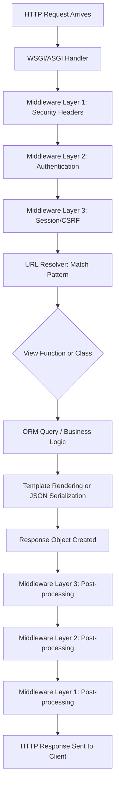

# What I love about Django

## Introduction

Last March, a colleague told me I was over-engineering a internal reporting dashboard. "Just use Flask," he said. "It's two endpoints and a table." I agreed to try it. By day three, I had a working prototype. By day five, I was building user authentication, role-based access, a CSV export pipeline, and a audit log — all of which Flask handed me back as TODOs. By day eight, I had migrated the entire thing to Django and shipped it before lunch on Friday.

That moment crystallized something I've come to believe deeply: Django isn't just a web framework. It's a set of opinions about how engineers should spend their time — opinions that consistently push you toward shipping real software instead of assembling duct-taped components.

I've built production systems with Django across three companies, two continents, and one particularly memorable incident where a misconfigured `ALLOWED_HOSTS` setting took down a staging environment for six hours (long story). Through all of it, Django has been the framework I reach for when I want to think about my domain problem, not about wiring together infrastructure.

This is what I love about it.

## Why This Matters

Engineers in 2024 face a strange paradox. We have more framework choices than ever, and yet the cognitive overhead of choosing, configuring, and maintaining those choices has become its own full-time job. You can build a REST API in Flask, FastAPI, or Starlette. Each has trade-offs. Each requires you to make decisions about serialization, authentication, database access, error handling, and deployment that Django has already made for you.

The question isn't which framework is "best." The question is: what do you actually want to spend your Tuesday afternoon on?

Django's answer — "whatever your business logic is, not whatever your database driver needs" — matters because it directly impacts velocity, maintainability, and the psychological cost of context-switching. When your team's senior engineer spends three hours choosing between SQLAlchemy sessions and Django ORM querysets, that's three hours not spent on the thing that actually differentiates your product.

I've seen teams burn weeks on framework plumbing that Django provided out of the box. The admin interface alone has saved my teams dozens of engineering hours in internal tools. The auth system has eliminated entire categories of security bugs before they ever reached code review. The migration framework has prevented at least one production database incident that I'm fairly certain would have been catastrophic.

These aren't theoretical benefits. They're the accumulated weight of 20 years of real-world failures and fixes baked into a single package.

## How It Works

Understanding Django means understanding its request pipeline — the invisible machinery that turns an HTTP byte stream into a Python object, runs your code, and turns the result back into bytes. Most engineers use this pipeline daily without ever looking under the hood. That's fine until something breaks at 3 AM and you need to know exactly where the failure lives.

Here's the mental model: a request enters Django through the WSGI or ASGI handler, passes through a chain of middleware components (each of which can inspect, modify, or short-circuit the request), gets matched to a URL pattern by the resolver, hits the appropriate view function or class, interacts with the ORM and template engine (if applicable), and returns a response that flows back through the middleware stack in reverse order.



The middleware chain is the most underappreciated piece here. Each layer wraps the next, forming a nested set of concerns — logging, authentication, rate limiting, CORS headers — that can be added, removed, or reordered without touching your views. When a request comes in, it hits middleware 1 first. When a response goes out, it passes through middleware 1 last. This inversion is subtle but powerful.

## Core Concepts

### The ORM as a Data Pipeline

Django's Object-Relational Mapper is the part most engineers think they understand and the part most engineers underestimate. The ORM isn't a thin wrapper around SQL. It's a lazy, composable query builder that defers execution until the moment you actually need data.

Every filter call, every `.order_by()`, every `.annotate()` returns a new `QuerySet` object — not a list, not a result, but a *description* of a query. The SQL doesn't hit the database until you iterate, slice, or explicitly call `.get()`. This means you can build complex queries incrementally, passing `QuerySet` objects around your codebase like lazy promises that resolve only when needed.

The real magic happens with `select_related()` and `prefetch_related()`. `select_related()` follows foreign keys and JOINs them into a single query — perfect for one-to-one and many-to-one relationships. `prefetch_related()` runs a separate query and does the joining in Python — better for many-to-many and reverse foreign key lookups. Misusing these is the single fastest way to turn a 12ms query into a 12-second query.

### The Admin as a Workflow Engine

Django Admin is not a demo toy. It's a full-featured content management interface that you can customize with custom ModelAdmin classes, inlines, list filters, custom actions, and even embedded JavaScript. I once built a multi-step publishing workflow for a non-technical editorial team using nothing but Django Admin customizations — custom actions that moved content between draft/review/published states, inlines that let editors manage related objects on the same page, and a thin admin override template that injected a approval-comment field.

That workflow ran in production for two years. The editorial team never needed to talk to an engineer about it.

### Middleware as Cross-Cutting Architecture

Middleware in Django follows the Chain of Responsibility pattern. Each middleware class has a `process_request` (or `__call__` in newer Django), a `process_response`, and optionally `process_exception`. The framework invokes them in order on the way in and reverse order on the way out. This gives you a clean hook for cross-cutting concerns — request timing, tenant identification, rate limiting, response compression — without polluting your view code.

## Examples & Code Walkthrough

### A Composable Notification Query

Here's a real-world pattern we used at a previous company for a notification system serving 40,000+ daily active users. The challenge was: show each user their unread notifications, grouped by type, with the actor's profile info preloaded, sorted by recency, and paginated — all without triggering N+1 queries.

```python
# notifications/models.py
from django.conf import settings
from django.db import models
from django.utils import timezone

class Notification(models.Model):
    recipient = models.ForeignKey(
        settings.AUTH_USER_MODEL,
        on_delete=models.CASCADE,
        related_name='notifications',
    )
    actor = models.ForeignKey(
        settings.AUTH_USER_MODEL,
        on_delete=models.SET_NULL,
        null=True,
        related_name='actor_notifications',
    )
    verb = models.CharField(max_length=255)
    target_content_type = models.ForeignKey(
        'contenttypes.ContentType',
        on_delete=models.SET_NULL,
        null=True,
    )
    target_object_id = models.PositiveIntegerField(null=True)
    read_at = models.DateTimeField(null=True, blank=True)
    created_at = models.DateTimeField(auto_now_add=True)

    class Meta:
        indexes = [
            models.Index(fields=['recipient', 'read_at']),
            models.Index(fields=['-created_at']),
        ]
        ordering = ['-created_at']

    def mark_read(self):
        self.read_at = timezone.now()
        self.save(update_fields=['read_at'])


# notifications/querysets.py
from django.db.models import Prefetch, Q, Count, OuterRef, Subquery

class NotificationQuerySet(models.QuerySet):
    def for_user(self, user):
        return self.filter(recipient=user)

    def unread(self):
        return self.filter(read_at__isnull=True)

    def with_actor_details(self):
        return self.select_related('actor').only(
            'actor__username',
            'actor__avatar_url',
            'verb',
            'created_at',
        )

    def with_target_summary(self):
        return self.annotate(
            target_title=Subquery(
                self.model.target_content_type.get_object_for_this_type(
                    pk=OuterRef('target_object_id')
                ).values('title')[:1]
            )
        )

    def group_by_verb(self):
        return self.values('verb').annotate(
            count=Count('id'),
            latest=Max('created_at'),
        ).order_by('-latest')
```

The `.only()` call is critical here — it restricts the SELECT columns, which reduces memory usage and query time when you don't need the full model. The `Subquery` approach for `target_summary` avoids a separate query per notification, which is the classic N+1 trap that catches everyone at least once.

### Custom Middleware for Request Timing

```python
# middleware/request_timing.py
import time
import logging
from django.utils.deprecation import MiddlewareMixin

logger = logging.getLogger('request_timing')

class RequestTimingMiddleware(MiddlewareMixin):
    def process_request(self, request):
        request._start_time = time.monotonic()

    def process_response(self, request, response):
        elapsed_ms = (time.monotonic() - request._start_time) * 1000
        if elapsed_ms > 500:
            logger.warning(
                'Slow request: %s %s — %.1fms',
                request.method,
                request.path,
                elapsed_ms,
            )
        response['X-Response-Time'] = f'{elapsed_ms:.2f}ms'
        return response
```

This middleware adds an `X-Response-Time` header to every response and logs a warning for anything over 500ms. It's the kind of thing that takes five minutes to write but pays for itself the first time you're debugging a latency spike in production.

### Admin Customization for Editorial Workflow

```python
# editorial/admin.py
from django.contrib import admin
from .models import Article, ArticleRevision, Comment

class ArticleRevisionInline(admin.TabularInline):
    model = ArticleRevision
    extra = 1
    fields = ['version', 'editor', 'changes_summary', 'created_at']
    readonly_fields = ['created_at']
    can_delete = False


class CommentInline(admin.StackedInline):
    model = Comment
    extra = 0
    fields = ['author', 'body', 'created_at', 'is_approved']
    readonly_fields = ['created_at']


@admin.register(Article)
class ArticleAdmin(admin.ModelAdmin):
    list_display = ['title', 'author', 'status', 'published_at', 'updated_at']
    list_filter = ['status', 'author', 'created_at']
    search_fields = ['title', 'body']
    prepopulated_fields = {'slug': ('title',)}
    inlines = [ArticleRevisionInline, CommentInline]
    fieldsets = (
        (None, {
            'fields': ('title', 'slug', 'author', 'status', 'body')
        }),
        ('Publishing', {
            'fields': ('published_at', 'featured_image'),
            'classes': ('collapse',),
        }),
    )

    actions = ['mark_as_published', 'mark_as_draft']

    def
