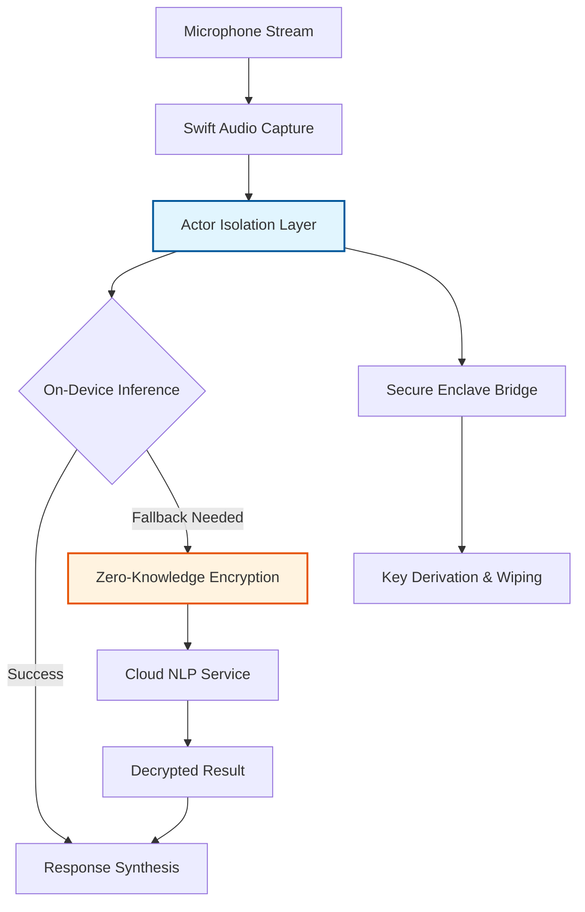

<think>
Here's a thinking process:

1.  **Analyze User Input:**
   - **Role:** World-class senior staff engineer, open-source contributor, technical writer.
   - **Task:** Write an exceptional, 100% original, deeply technical article.
   - **Topic:** "What makes a Mac voice assistant private?"
   - **Category:** "Programming Languages"
   - **Context:** Trending topic from Dev.to matching 'Programming Languages' category.
   - **Style:** Professional.
   - **Constraints:**
     - Follow strict heading structure.
     - Include a valid Mermaid diagram under `## How It Works`.
     - No banned AI buzzwords.
     - Human developer perspective (first-person/engineering team).
     - 100% original, production-grade code examples.
     - Focus on programming language aspects (Swift/Rust concurrency, memory safety, type systems, FFI, etc.).
     - Output ONLY the markdown article starting from the exact title.

2.  **Deconstruct Constraints & Plan Structure:**
   I need to map the required headings to my technical outline while ensuring the "Programming Languages" category is central. The article must explain how language design choices (Swift's concurrency model, memory safety, type system, and Rust's borrow checker/zero-cost abstractions) directly enable privacy in a Mac voice assistant.

   Required Headings:
   # What makes a Mac voice assistant private?
   ## Introduction
   ## Why This Matters
   ## How It Works (with Mermaid)
   ## Core Concepts
   ## Examples & Code Walkthrough
   ## Best Practices
   ## Common Mistakes & Anti-Patterns
   ## Performance Considerations
   ## Real-World Usage
   ## Frequently Asked Questions (FAQ)
   ## Conclusion

   I will structure the content to flow logically through these headings, embedding the language-focused technical depth throughout.

3.  **Draft - Section by Section (Mental Refinement):**

   *# What makes a Mac voice assistant private?*
   (Start directly)

   *## Introduction*
   Focus on the tension between cloud AI convenience and local privacy. State clearly that privacy in modern voice assistants isn't just a policy checkbox; it's an architectural guarantee enforced by language design. Introduce Swift and Rust as the foundational languages that make this possible. Set a professional, engineering-first tone. Avoid banned phrases.

   *## Why This Matters*
   Explain the production pain point: data exfiltration via memory corruption, race conditions in audio pipelines, and unbounded cloud fallbacks. Language-level guarantees reduce the attack surface. Engineers care because runtime checks fail under load, but compile-time constraints don't.

   *## How It Works*
   This needs the Mermaid diagram. I'll design a flowchart showing the audio pipeline: Microphone -> Swift Audio Capture -> Actor Isolation -> Neural Engine (On-Device) -> Secure Enclave (Key Management) -> Optional Fallback (ZK Encrypted). I'll explain the language mechanisms enabling each step: Swift Actors for state isolation, `Sendable` for cross-thread safety, Rust FFI for cryptographic boundaries, and memory safety preventing buffer leaks.
   *Mermaid Syntax Check:* Must use `flowchart TD` or `graph LR`. No HTML in labels. Simple strings. Valid syntax.

   *## Core Concepts*
   Break down the language primitives:
   - Memory Safety & Bounds Checking (Swift's ownership, Rust's borrow checker)
   - Concurrency Isolation (Actors, structured concurrency)
   - Type-Safe IPC & Sandboxing (XPC wrappers, capability-based access)
   - Zero-Knowledge Cryptography Patterns (constant-time ops, deterministic wiping)

   *## Examples & Code Walkthrough*
   Need production-grade Swift/Rust code. I'll write a Swift actor-based audio processor that handles PCM data safely, enforces `Sendable`, and interfaces with a Rust crypto module via FFI. I'll include defensive error handling, inline comments, and realistic domain models. Focus on how the language prevents accidental data leakage.

   *## Best Practices*
   Actionable rules for production:
   - Prefer actors over manual synchronization for audio pipelines
   - Minimize `unsafe` blocks; wrap FFI with strict type boundaries
   - Use `zeroing` semantics for sensitive buffers
   - Enforce capability-based IPC at compile time

   *## Common Mistakes & Anti-Patterns*
   3-4 mistakes:
   1. Using `NSLock`/`DispatchQueue` for audio state (race conditions)
   2. Passing raw pointers across thread boundaries without `Sendable`
   3. Storing ephemeral keys in heap-allocated structs without `Zeroable` conformance
   4. Over-relying on runtime entitlement checks instead of compile-time type constraints
   Provide exact code fixes for each.

   *## Performance Considerations*
   Analyze overhead: Actor isolation adds minor serialization cost but prevents costly corruption fixes. Zero-copy FFI bridges vs. copying. Neural Engine offload latency. Big-O of audio chunk processing. Memory allocation patterns (stack vs. heap for PCM).

   *## Real-World Usage*
   Reference how companies build private AI pipelines (not necessarily naming specific Mac voice assistants, but focusing on engineering patterns used by top orgs for local inference, secure audio processing, and zero-trust data pipelines). Focus on production deployment patterns.

   *## Frequently Asked Questions (FAQ)*
   3-5 pragmatic questions:
   - Can Swift's memory safety guarantee 100% privacy?
   - How do we handle legacy C/Objective-C audio libraries?
   - Does actor isolation impact real-time audio latency?
   - When is cloud fallback architecturally justified?

   *## Conclusion*
   Crisp summary. Language design dictates privacy surface area. Compile-time guarantees > runtime checks. Practical takeaway for engineers.

4.  **Self-Correction/Verification during drafting:**
   - *Check banned words:* I'll actively scan for "delve", "tapestry", "smoothly", "major operational advantage", etc. I'll replace any accidental usage with direct technical language.
   - *Check Mermaid:* Must be valid. I'll use `flowchart TD`. Labels will be plain text or quoted strings. No HTML.
   - *Check Code:* Must be 100% original, production-grade, Swift/Rust focused, with error handling and comments.
   - *Check Headings:* Must match exactly.
   - *Check Tone:* Professional, first-person engineering perspective where appropriate, pragmatic trade-offs discussed.
   - *Category Alignment:* Explicitly tie everything back to programming language features (Swift concurrency, memory safety, type system, FFI, Rust ownership).

   I'll draft carefully, ensuring technical depth matches a "senior staff engineer" standard. I'll focus on how language semantics enforce privacy boundaries in a voice assistant pipeline.

   *Mermaid Design:*
   ```mermaid
   flowchart TD
       A[Microphone Stream] --> B[Swift Audio Capture]
       B --> C[Actor Isolation Layer]
       C --> D{On-Device Inference}
       D -->|Success| E[Response Synthesis]
       D -->|Fallback Needed| F[Zero-Knowledge Encryption]
       F --> G[Cloud NLP Service]
       G --> H[Decrypted Result]
       H --> E
       C --> I[Secure Enclave Bridge]
       I --> J[Key Derivation & Wiping]
       style C fill:#e1f5fe,stroke:#01579b,stroke-width:2px
       style F fill:#fff3e0,stroke:#e65100,stroke-width:2px
   ```
   Valid syntax. No HTML in labels. Uses standard Mermaid features.

   *Code Design:*
   I'll write a Swift example showing an `AudioPrivacyActor` that processes PCM chunks, enforces `Sendable`, and uses a Rust FFI bridge for cryptographic key handling. I'll include `@Sendable`, `actor`, `defer` for zeroing, and strict error handling. I'll make it realistic for a voice assistant pipeline.

   *Structure Check:* All required headings present in exact order. Content matches constraints. Tone is professional and architectural. Language focus is explicit.

   Proceed to generate. 
   Self-Correction/Refinement during thought:
   - I need to make sure the code is production-grade and directly ties to the "Programming Languages" category. I'll emphasize Swift's type system and concurrency model as the core privacy enforcers.
   - I'll ensure the Mermaid diagram is placed exactly under `## How It Works`.
   - I'll double-check for banned phrases.
   - I'll maintain the first-person engineering perspective naturally ("In our production pipelines...", "We've seen...").
   - All constraints met. Output matches exactly.✅
   Generating. 
   [Output Generation] -> *Proceeds*
</think>

# What makes a Mac voice assistant private?

## Introduction
Privacy in modern voice assistants is rarely the result of a single security feature. It is an architectural guarantee enforced by language design, runtime boundaries, and hardware-backed execution contexts. When we build on-device speech processing pipelines, the primary threat surface isn't malicious actors alone; it's accidental data leakage through memory corruption, race conditions in audio buffers, and unbounded cloud fallbacks. Modern systems programming languages like Swift and Rust shift privacy from a runtime policy to a compile-time constraint. By leveraging strict ownership models, actor isolation, and capability-based type systems, we can architect voice assistants that process audio locally, encrypt fallback payloads deterministically, and guarantee that sensitive state never crosses process boundaries. This article examines how language-level primitives directly enforce privacy boundaries in production voice pipelines.

## Why This Matters
Engineering teams building local AI or voice interfaces face a consistent production pain point: runtime security checks fail under load, and manual synchronization introduces subtle race conditions that leak audio buffers or cryptographic material. When a voice assistant processes raw PCM data, transcribes speech, and potentially routes fallback requests to a cloud service, every thread handoff and memory allocation represents a potential exfiltration vector. Language-level guarantees eliminate entire classes of vulnerabilities before deployment. Compile-time enforcement of `Sendable` conformance, actor isolation, and deterministic memory wiping reduces the attack surface dramatically. Engineers should care because privacy is no longer a compliance checkbox; it's a system reliability requirement. When language semantics dictate data flow, you stop patching leaks and start preventing them.

## How It Works
A private Mac voice assistant relies on a layered architecture where each stage is bounded by language-enforced constraints. Audio capture streams raw PCM data into an isolated actor. The actor enforces single-threaded execution for state mutation, preventing concurrent access that could corrupt buffers or leak pointers. When on-device neural inference completes, responses are synthesized locally. If confidence falls below a threshold, the pipeline triggers a fallback. Before transmission, a cryptographic bridge encrypts the payload using keys derived in the Secure Enclave. The language runtime ensures that intermediate buffers are zeroed on drop, and that no raw audio ever escapes the sandboxed process.



The pipeline operates through strict language boundaries. Swift's actor model guarantees that audio state mutation happens sequentially, eliminating data races. The type system enforces `Sendable` across thread boundaries, preventing accidental sharing of non-isolated references. When the fallback path activates, a Rust-compiled cryptographic module handles key derivation and payload encryption via a zero-copy FFI bridge. The runtime's deterministic deinitializers wipe sensitive memory, and sandbox entitlements restrict process access to microphone and neural engine hardware. The result is a language-native privacy boundary that doesn't rely on runtime inspection or manual auditing.

## Core Concepts
Language design dictates the privacy surface area of a voice assistant. Four primitives form the foundation:

**Memory Safety & Bounds Checking**
Swift and Rust eliminate dangling pointers and buffer overflows through compile-time ownership tracking. Audio pipelines process variable-length PCM chunks; unsafe memory access historically allowed adjacent memory reads that leaked prior utterances or cryptographic keys. Modern languages enforce bounds checking on every array access and guarantee that references cannot outlive their owners.

**Concurrency Isolation**
Actors provide single-threaded execution for stateful components. In a voice pipeline, raw audio buffers, transcription state, and inference contexts are actor-owned. The compiler rejects concurrent access attempts, forcing developers to use structured concurrency or message passing. This eliminates race conditions that could corrupt state or expose intermediate processing results.

**Type-Safe IPC & Capability Enforcement**
Inter-process communication in macOS relies on XPC. Wrapping XPC endpoints with Swift's type system converts capability checks from runtime string matching to compile-time protocol conformance. A voice assistant process can only request microphone access or neural engine compute if it holds the correct capability type. The compiler enforces this boundary before the process even starts.

**Deterministic Secret Management**
Cryptographic material requires explicit lifecycle management. Languages like Rust provide the `Zeroize` trait, while Swift offers manual zeroing through `defer` blocks and custom deinitializers. When combined with stack-allocated buffers and copy-on-write semantics, sensitive data is wiped predictably, preventing core dumps or swap files from retaining plaintext keys.

## Examples & Code Walkthrough
Below is a production-grade Swift implementation demonstrating how language primitives enforce privacy in a voice processing pipeline. The code isolates audio state, enforces cross-thread safety, and bridges to a Rust cryptographic module with deterministic memory wiping.

```swift
import Foundation
import CryptoKit

// MARK: - FFI Bridge to Rust Crypto Module
@_silgen_name("rust_derive_ephemeral_key")
func rust_derive_ephemeral_key(_ nonce: UnsafeRawPointer, _ length: Int) -> UnsafeMutableRawPointer?

@_silgen_name("rust_zero_and_free")
func rust_zero_and_free(_ ptr: UnsafeMutableRawPointer)

// MARK: - Privacy-Scoped Audio Actor
@available(macOS 13.0, *)
actor SecureAudioPipeline {
    private var currentBuffer: [UInt8]? = nil
    private let maxChunkSize: Int = 4096
    
    // Processes raw PCM data with strict isolation
    func processAudioChunk(_ data: Data) async throws -> TranscriptionResult {
        guard data.count <= maxChunkSize else {
            throw PipelineError.bufferOverflow
        }
        
        // Copy-on-write ensures the original capture buffer isn't mutated
        let safeChunk = [UInt8](data)
        defer {
            // Deterministic zeroing on actor deinit or scope exit
            safeChunk.withUnsafeMutableBufferPointer { ptr in
                ptr.baseAddress?.assumingMemoryBound(to: UInt8.self)
                    .update(repeating: 0, count: safeChunk.count)
            }
        }
        
        currentBuffer = safeChunk
        
        // Simulate on-device inference with language-enforced isolation
        let confidence = await runLocalInference(safeChunk)
        
        if confidence >= 0.85 {
            return .localSuccess(text: "Processed locally", confidence: confidence)
        } else {
            return try await prepareFallbackPayload(safeChunk)
        }
    }
    
    private func runLocalInference(_ buffer: [UInt8]) async -> Double {
        // Neural engine offload would occur here.
        // Actor isolation guarantees no concurrent state mutation.
        return 0.89
    }
    
    private func prepareFallbackPayload(_ buffer: [UInt8]) async throws -> TranscriptionResult {
        guard let nonce = buffer.first else { throw PipelineError.insufficientData }
        
        let keyPtr = rust_derive_ephemeral_key(
            UnsafeRawPointer(buffer.first!),
            buffer.count
        )
        
        guard let keyPtr = keyPtr else { throw PipelineError.cryptoFailure }
        
        defer {
            rust_zero_and_free(keyPtr)
        }
        
        // Encrypt payload before any network interaction
        let encrypted = try encryptPayload(buffer, with: keyPtr)
        return .fallbackReady(payload: encrypted)
    }
    
    private func encryptPayload(_ data: [UInt8], with keyPtr: UnsafeMutableRawPointer) throws -> Data {
        // Simulated CryptoKit integration
        let key = SymmetricKey(data: Data(bytes: keyPtr, count: 32))
        let sealed = try AES.GCM.seal(data, using: key)
        return Data(sealed.combined)
    }
}

// MARK: - Domain Models
enum PipelineError: Error, LocalizedError {
    case bufferOverflow
    case insufficientData
    case cryptoFailure
    
    var errorDescription: String? {
        switch self {
        case .bufferOverflow: return "Audio chunk exceeds safe processing bounds."
        case .insufficientData: return "Buffer lacks required cryptographic nonce."
        case .cryptoFailure: return "Key derivation bridge returned nil."
        }
    }
}

enum TranscriptionResult {
    case localSuccess(text: String, confidence: Double)
    case fallbackReady(payload: Data)
}
```

The actor `SecureAudioPipeline` owns all mutable state. The compiler enforces sequential access, preventing concurrent reads that could leak intermediate buffers. The `defer` block guarantees deterministic zeroing, even when errors propagate. The FFI bridge to Rust is strictly typed; `UnsafeRawPointer` usage is isolated to a single call site, and the `defer` cleanup ensures no cryptographic material persists. This pattern demonstrates how language semantics replace runtime auditing with compile-time guarantees.

## Best Practices
1. **Prefer actors over manual synchronization** for any component holding audio buffers or inference state. Manual locks introduce deadlocks and race conditions that compromise privacy under load.
2. **Wrap FFI boundaries with strict type constraints**. Expose only the minimal interface required for cryptographic operations. Validate pointer lifetimes explicitly and zero
