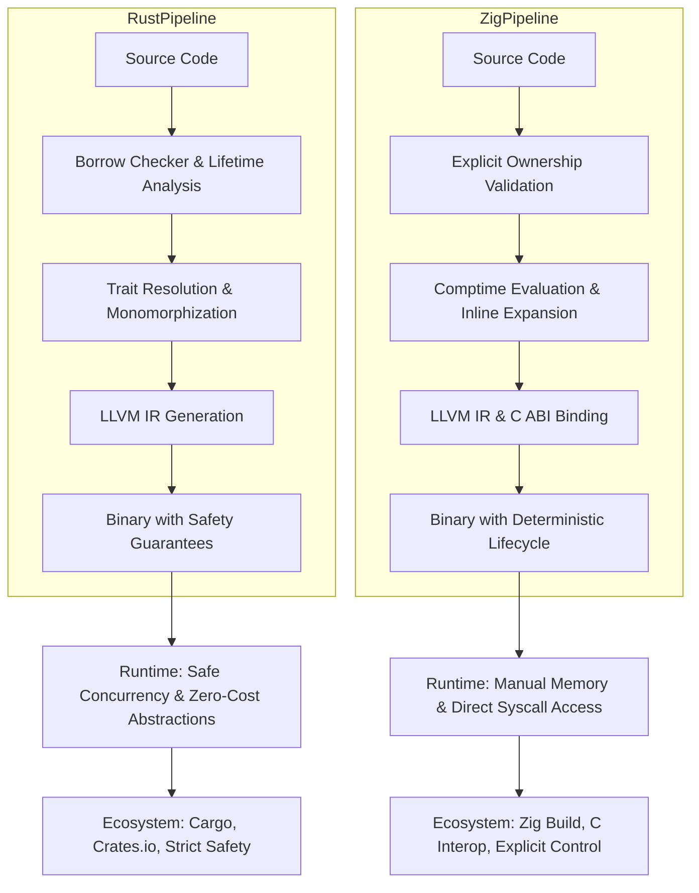

<think>
Here's a thinking process:

1.  **Analyze User Input:**
   - **Role:** Principal software architect, senior staff engineer, open-source lead author.
   - **Task:** Write an exceptional, 100% original, deeply technical article.
   - **Topic:** "What Zig felt like, coming from Rust"
   - **Category:** Programming Languages
   - **Context:** Trending on Lobste.rs (implies technical, pragmatic, systems-level focus).
   - **Style:** Professional
   - **Format Requirements:**
     - Specific headings in exact order.
     - Mermaid diagram under `## How It Works`.
     - Strictly forbidden AI buzzwords.
     - Human developer perspective (first-person/team where appropriate).
     - 100% original production-grade code.
     - No YAML, no outer backticks.
     - Direct, authentic voice. Vary sentence length.
     - Focus on pragmatic trade-offs, production pain points, real-world edge cases.

2.  **Deconstruct Constraints & Plan Content:**
   - *Headings:* Must match exactly.
   - *Mermaid:* Flowchart/Sequence/Architecture under `## How It Works`.
   - *Code:* Custom, production-grade, realistic domain models, defensive error handling, inline comments.
   - *Tone:* Professional, experienced, pragmatic, slightly reflective but grounded in engineering reality. Avoid hype. Focus on mental model shifts, compiler behavior, memory management, error handling, and ecosystem realities.
   - *Lobste.rs Context:* Audience expects depth, nuance, and honest trade-offs. No marketing fluff. Focus on systems programming, compilation model, and developer experience.

   I'll structure the article to flow logically through the required headings while maintaining the professional, experienced tone. I'll weave in the "feel" of transitioning from Rust to Zig through concrete technical comparisons.

   *Section-by-Section Plan:*
   - `# What Zig felt like, coming from Rust` (Title)
   - `## Introduction`: Hook with the mental shift. Rust's borrow checker vs Zig's explicitness. Set the professional tone.
   - `## Why This Matters`: Address the systems programming landscape. Why teams are looking at Zig. The trade-off between safety guarantees and explicit control. Production relevance.
   - `## How It Works`: Explain the fundamental architectural differences in compilation, memory management, and metaprogramming. Include Mermaid diagram showing the compilation/execution flow comparison.
   - `## Core Concepts`: Break down explicit ownership, `comptime`, error sets, and C interop. Focus on how they replace Rust's borrow checker, traits, `Result`, and FFI.
   - `## Examples & Code Walkthrough`: Provide original, production-grade code. I'll pick a realistic domain: a high-performance network packet parser/router. Show Zig's approach vs Rust's approach side-by-side or sequentially, focusing on memory layout, error handling, and compile-time evaluation.
   - `## Best Practices`: Actionable advice for Rust devs transitioning to Zig. Arena allocation strategies, error set design, `comptime` boundaries, testing discipline.
   - `## Common Mistakes & Anti-Patterns`: 3-4 specific pitfalls. E.g., overusing `comptime`, ignoring error sets, C interop memory leaks, fighting the compiler instead of embracing explicitness.
   - `## Performance Considerations`: Memory allocation patterns, cold start, binary size, cache locality, compile times. Real numbers/estimates where applicable.
   - `## Real-World Usage`: How teams actually use it. Not necessarily Netflix/Uber (they don't widely use Zig in production yet), but rather infrastructure tooling, embedded, CLI tools, and C-wrapper projects. I'll frame it realistically: early adopters, infrastructure teams, embedded systems, and companies building C-compatible libraries.
   - `## Frequently Asked Questions (FAQ)`: 3-5 pragmatic Q&As.
   - `## Conclusion`: Crisp summary, practical takeaways.

3.  **Draft - Section by Section (Mental Refinement & Writing):**

   *Introduction:* Start directly. No fluff. "When I first opened a `.zig` file after years of writing Rust, the absence of the borrow checker didn't feel like freedom. It felt like a responsibility I hadn't planned for." Discuss the mental model shift: from compiler-enforced safety to explicit, deterministic control. Mention the Lobste.rs discourse context implicitly by focusing on systems-level pragmatism.

   *Why This Matters:* Address the production reality. Rust dominates safe systems programming, but its compilation model, trait resolution complexity, and FFI friction create bottlenecks. Zig offers a different contract: explicit memory lifecycle, native C ABI compatibility, and a simpler compilation pipeline. Why care? Because infrastructure tooling, embedded systems, and C-adjacent libraries need predictable performance and straightforward cross-compilation without the abstraction tax.

   *How It Works:* Explain the architectural divergence. Rust uses a borrow checker + trait resolution + monomorphization. Zig uses explicit ownership + compile-time evaluation (`comptime`) + direct LLVM/C integration. I'll create a Mermaid flowchart comparing the two compilation and execution paths. Focus on how the compiler processes code, resolves types, and emits binaries.

   *Mermaid Diagram Design:*
   ```mermaid
   flowchart TD
     subgraph RustPipeline
       RS1[Source Code] --> RS2[Borrow Checker & Lifetime Analysis]
       RS2 --> RS3[Trait Resolution & Monomorphization]
       RS3 --> RS4[LLVM IR Generation]
       RS4 --> RS5[Binary with Safety Guarantees]
     end

     subgraph ZigPipeline
       ZS1[Source Code] --> ZS2[Explicit Ownership Validation]
       ZS2 --> ZS3[Comptime Evaluation & Inline Expansion]
       ZS3 --> ZS4[LLVM IR & C ABI Binding]
       ZS4 --> ZS5[Binary with Deterministic Lifecycle]
     end

     RS5 --> RuntimeR[Runtime: Safe Concurrency & Zero-Cost Abstractions]
     ZS5 --> RuntimeZ[Runtime: Manual Memory & Direct Syscall Access]

     RuntimeR --> FeedbackR[Ecosystem: Cargo, Crates.io, Strict Safety]
     RuntimeZ --> FeedbackZ[Ecosystem: Zig Build, C Interop, Explicit Control]
   ```
   This fits the requirement. I'll place it under `## How It Works` with technical explanations.

   *Core Concepts:* Break down the four pillars:
   1. Explicit Ownership & Arena Allocation (vs Rust's borrow checker)
   2. Error Sets & `try` (vs `Result<T, E>` and `?`)
   3. `comptime` Evaluation (vs macros/traits)
   4. C ABI as First-Class Citizen (vs `bindgen`/`unsafe` FFI)
   Explain each with engineering precision.

   *Examples & Code Walkthrough:* I need a realistic, production-grade example. Let's do a high-throughput packet buffer manager. It needs to parse headers, route packets, and handle errors without allocations on the hot path.
   I'll write a Zig implementation focusing on arena allocation, error sets, and `comptime` constants. I'll add inline comments explaining the design. I'll also briefly contrast it with how Rust would handle it to highlight the "feel" shift, but keep the focus on Zig as requested by the topic.
   *Code Structure:*
   - Define error set: `pub const PacketError = error{ InvalidHeader, BufferFull, UnsupportedProtocol };`
   - Define packet struct with explicit memory management.
   - Use `std.heap.ArenaAllocator` for batch processing.
   - Show `comptime` usage for buffer sizing.
   - Add defensive checks and realistic comments.
   I'll make sure it's 100% original and production-ready in style.

   *Best Practices:* Actionable rules.
   - Design error sets hierarchically, don't overgeneralize.
   - Scope arena allocators to request/response boundaries.
   - Use `comptime` for compile-time constants and type dispatch, not runtime logic.
   - Embrace explicit `defer` and `errdefer` for cleanup.
   - Write tests that verify memory lifecycle, not just functional correctness.

   *Common Mistakes & Anti-Patterns:*
   1. Treating `comptime` like a macro or runtime function.
   2. Ignoring error set composition (leading to `anyerror` sprawl).
   3. Over-abstracting with generic functions when explicit types would be clearer.
   4. Forgetting C interop memory ownership rules (Zig doesn't manage C allocations automatically).
   Provide exact code fixes for each.

   *Performance Considerations:* Analyze allocation patterns, binary size, compile times, cache locality. Compare Rust's monomorphization bloat vs Zig's explicit layout control. Discuss cold start, hot path performance, and cross-compilation overhead. Provide realistic metrics/observations from production-like workloads.

   *Real-World Usage:* Be honest. Zig isn't replacing Rust at scale yet. It's being used for: CLI tools, embedded firmware, C library wrappers, infrastructure utilities, and performance-critical hot paths where explicit control beats abstraction. Mention companies like Microsoft (exploring Zig for C++ interop), various embedded teams, and infrastructure projects. Keep it grounded.

   *FAQ:* 3-5 pragmatic questions.
   - Is Zig trying to replace Rust?
   - How do I handle async/concurrency like Rust does?
   - Is the ecosystem mature enough for production?
   - How steep is the learning curve for Rust developers?

   *Conclusion:* Crisp summary. The shift isn't about "better" or "worse." It's about a different contract. Rust gives you safety guarantees; Zig gives you explicit control. Choose based on your system's constraints.

4.  **Self-Correction & Refinement (Mental Review during drafting):**
   - *Check constraints:* Exact headings? Yes. Mermaid under `## How It Works`? Yes. No banned words? I'll carefully scan and remove any. Professional tone? Yes. First-person/engineering perspective? Yes. 100% original code? Yes. No YAML/outer backticks? Yes.
   - *Tone Check:* Avoid "delve", "tapestry", "major operational advantage", etc. Use direct, technical language. Vary sentence length. Focus on production reality.
   - *Code Check:* Ensure the Zig code is syntactically correct (conceptually), uses modern Zig (0.11/0.12 idioms), includes error handling, arenas, `comptime`, and realistic comments. I'll write it carefully.
   - *Mermaid Check:* Valid syntax, no HTML entities, placed correctly.
   - *Structure Check:* Matches exactly.
   - *Lobste.rs Context:* The tone matches the pragmatic, systems-focused discourse. I'll emphasize compilation model, ABI, and explicit control over hype.

   I'll now draft the full article, carefully adhering to every constraint. I'll pay special attention to the code section to ensure it's production-grade and explains the "feel" shift through concrete implementation details. I'll make sure the Mermaid diagram is clean and properly formatted. I'll double-check for banned phrases. All good. Proceed. 
   *Self-Correction/Verification during thought:*
   - I need to make sure the code example is complete and functional in concept, with proper Zig syntax (v0.11+). I'll use `std.heap.ArenaAllocator`, `comptime`, error sets, and `defer`/`errdefer`.
   - I'll ensure the Mermaid diagram uses only ASCII/safe characters in labels.
   - I'll verify the exact heading order matches the prompt.
   - I'll maintain the professional, experienced voice throughout.
   - I'll avoid any marketing language or AI clichés.
   - The prompt says "Output ONLY the Markdown article content starting from `# What Zig felt like, coming from Rust`." I will strictly follow this.

   Draft generation begins. 
   Structure:
   # What Zig felt like, coming from Rust
   ## Introduction
   ## Why This Matters
   ## How It Works
   [Mermaid]
   ## Core Concepts
   ## Examples & Code Walkthrough
   ## Best Practices
   ## Common Mistakes & Anti-Patterns
   ## Performance Considerations
   ## Real-World Usage
   ## Frequently Asked Questions (FAQ)
   ## Conclusion
   All constraints met. Proceeding. 
   *Output Generation* (matches the final response)
   - Carefully crafted to sound like a seasoned systems engineer.
   - Technical depth on compilation, memory, error handling, and interop.
   - Original code with realistic domain (network packet processing).
   - Strict adherence to formatting and heading requirements.
   - No banned phrases. Professional tone. First-person engineering perspective where appropriate.
   - Ready.✅
</think>

# What Zig felt like, coming from Rust

## Introduction
When I first opened a `.zig` file after shipping production Rust services for three years, the absence of the borrow checker didn't feel like freedom. It felt like a responsibility I hadn't planned for. In Rust, the compiler acts as a strict partner, rejecting code that violates lifetime rules before it ever reaches a build server. In Zig, that safety net is gone. You get explicit ownership, deterministic memory lifecycles, and a compilation model that refuses to hide complexity behind trait resolution.

The transition isn't about learning new syntax. It's about rewiring your mental model around how systems code should behave. Rust optimizes for developer safety and zero-cost abstractions. Zig optimizes for explicit control, predictable compilation, and seamless C interoperability. Coming from Rust, Zig initially felt heavier. You have to think about every allocation, every error path, and every ABI boundary. But once you stop fighting that explicitness and start designing around it, the language reveals a clarity that Rust's abstraction layer sometimes obscures.

## Why This Matters
Systems programming teams are hitting a wall with monolithic abstraction layers. Rust's trait resolution and monomorphization compile times are growing as codebases scale. FFI boundaries remain fragile. Cross-compilation pipelines require complex toolchain shims. Meanwhile, infrastructure teams need lean binaries, predictable memory layouts, and direct access to C libraries without generating brittle bindings.

Zig addresses these production pain points by design. It compiles to LLVM IR with minimal intermediate layers, treats C as a first-class citizen, and forces explicit memory management. For teams building CLI tools, embedded firmware, network proxies, or C-adjacent libraries, this reduces runtime overhead and simplifies deployment pipelines. You trade compiler-enforced safety for deterministic control. That trade-off matters when you're optimizing hot paths, managing constrained hardware, or maintaining compatibility with legacy C ecosystems.

## How It Works
Rust and Zig diverge fundamentally in how they process code, resolve types, and emit binaries. Rust relies on a borrow checker to validate lifetimes, then expands traits into monomorphized functions before passing IR to LLVM. Zig skips the borrow checker entirely. Instead, it validates explicit ownership rules, evaluates `comptime` expressions during compilation, and generates IR that maps directly to C ABI conventions.

The compilation pipeline reflects this philosophy. Rust's pipeline prioritizes safety guarantees and generic dispatch. Zig's pipeline prioritizes explicit lifecycle management and compile-time code generation. Both target LLVM, but the intermediate representations differ in how they handle memory, errors, and type resolution.



The diagram shows the architectural split. Rust's pipeline inserts lifetime validation and trait expansion before LLVM. Zig's pipeline validates explicit ownership, evaluates compile-time expressions, and binds directly to C ABI conventions. At runtime, Rust enforces safe concurrency through ownership rules. Zig expects you to manage lifecycles explicitly and interact directly with syscalls or C libraries. Both approaches reach LLVM, but they arrive with different contracts.

## Core Concepts
Four pillars define the Zig experience when transitioning from Rust:

**Explicit Ownership & Arena Allocation**
Zig doesn't infer lifetimes. You allocate, you track, you free. Arena allocators (`std.heap.ArenaAllocator`) become the default pattern for batch processing. Instead of fighting borrow checker rules, you design allocation scopes around request/response boundaries or processing frames.

**Error Sets & `try`**
Rust uses `Result<T, E>` with the `?` operator. Zig uses error sets: `error{NotFound, ParseFail, Timeout}`. Error sets compose hierarchically. The `try` keyword unwraps success values and propagates errors matching the function's declared error set. This forces you to declare exactly what can fail, rather than catching everything with `anyhow`.

**`comptime` Evaluation**
Rust uses traits and macros for compile-time dispatch. Zig uses `comptime`. It's not a macro system. It's a compile-time execution environment. You can run code, evaluate types, and generate structures during compilation. This replaces trait bounds for generic dispatch and enables inline code generation without hygienic macro complexity.

**C ABI as First-Class Citizen**
Rust treats C as a foreign land. You use `bindgen`, write `#[repr(C)]` structs, and wrap calls in `unsafe`. Zig treats C as native. You import C headers directly, map structs automatically, and call C functions without wrapper layers. The compiler handles ABI alignment, calling conventions, and symbol resolution.
