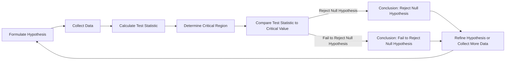

# Why Hypothesis Testing is the Backbone of Data Science

## Introduction
Data science has become an essential component of modern businesses, enabling organizations to extract insights from vast amounts of data and make informed decisions. At the heart of data science lies hypothesis testing, a statistical technique that allows us to test assumptions and draw conclusions about a population based on a sample of data. In this article, we'll explore the world of hypothesis testing, exploring its fundamentals, applications, and best practices.

## Why This Matters
As a software engineer, you may wonder why hypothesis testing is relevant to your work. The answer lies in the fact that data-driven decision-making is becoming increasingly important in the industry. By understanding hypothesis testing, you can develop more effective data-driven solutions, identify areas for improvement, and optimize your systems. Moreover, hypothesis testing is a crucial tool for A/B testing, regression analysis, and other statistical techniques that are essential in data science.

## How It Works
Hypothesis testing involves formulating a hypothesis, collecting data, calculating a test statistic, determining a critical region, and comparing the test statistic to the critical value. The following Mermaid diagram illustrates the workflow of hypothesis testing:

This diagram shows the iterative process of refining the hypothesis or collecting more data based on the outcome of the test.

## Core Concepts
To understand hypothesis testing, you need to grasp a few fundamental concepts. A hypothesis is a statement about a population parameter, and it can be either null (H0) or alternative (H1). The null hypothesis is a statement of no effect or no difference, while the alternative hypothesis is a statement of an effect or difference. For example, in a study to determine whether a new medication is effective, the null hypothesis might be "the medication has no effect on the patient's condition," while the alternative hypothesis might be "the medication has a positive effect on the patient's condition."

## Examples & Code Walkthrough
Let's consider an example of a simple hypothesis test using Python. Suppose we want to determine whether the average height of a population is greater than 175 cm. We can use the following function to perform the test:
```python
def simple_hypothesis_test(sample_mean, population_mean, sample_std, sample_size, significance_level):
    # Calculate the z-score
    z_score = (sample_mean - population_mean) / (sample_std / (sample_size ** 0.5))
    
    # Determine the critical region
    critical_region = 1 - significance_level
    
    # Compare the z-score to the critical value
    if abs(z_score) > critical_region:
        return "Reject the null hypothesis"
    else:
        return "Fail to reject the null hypothesis"
```
This function takes the sample mean, population mean, sample standard deviation, sample size, and significance level as input and returns the result of the hypothesis test.

## Best Practices
When performing hypothesis testing, it's essential to follow best practices to avoid common pitfalls. Here are a few tips:

* Formulate a clear and testable hypothesis
* Choose the correct type of hypothesis test (parametric or non-parametric)
* Select a suitable significance level
* Avoid p-hacking and false positives
* Use robust statistical methods to handle missing data and outliers

## Common Mistakes & Anti-Patterns
One common mistake in hypothesis testing is p-hacking, which involves manipulating the data or the test to achieve a significant result. Another mistake is failing to consider the power of the test, which can lead to false negatives. Additionally, ignoring the assumptions of the test, such as normality or independence, can lead to incorrect conclusions.

## Performance Considerations
Hypothesis testing can be computationally intensive, especially when dealing with large datasets. To improve performance, you can use optimized statistical libraries, such as NumPy or SciPy, and take advantage of parallel processing techniques.

## Real-World Usage
Hypothesis testing is widely used in various industries, including healthcare, finance, and marketing. For example, in healthcare, hypothesis testing is used to determine the effectiveness of new treatments or medications. In finance, hypothesis testing is used to evaluate the performance of investment portfolios or to detect anomalies in financial data.

## Frequently Asked Questions (FAQ)
Here are a few frequently asked questions about hypothesis testing:

* Q: What is the difference between a null hypothesis and an alternative hypothesis?
A: The null hypothesis is a statement of no effect or no difference, while the alternative hypothesis is a statement of an effect or difference.
* Q: How do I choose the correct type of hypothesis test?
A: The choice of hypothesis test depends on the type of data and the research question. Parametric tests are used for continuous data, while non-parametric tests are used for categorical or ordinal data.
* Q: What is the significance level, and how do I choose it?
A: The significance level is the probability of rejecting the null hypothesis when it is true. A common choice for the significance level is 0.05, but it can be adjusted depending on the research question and the desired level of precision.

## Conclusion
In conclusion, hypothesis testing is a powerful tool in data science that allows us to test assumptions and draw conclusions about a population based on a sample of data. By understanding the fundamentals of hypothesis testing, following best practices, and avoiding common pitfalls, you can develop more effective data-driven solutions and make informed decisions in your organization. As data science continues to evolve, hypothesis testing will remain a crucial component of the field, enabling us to extract insights from complex data and drive business success.
