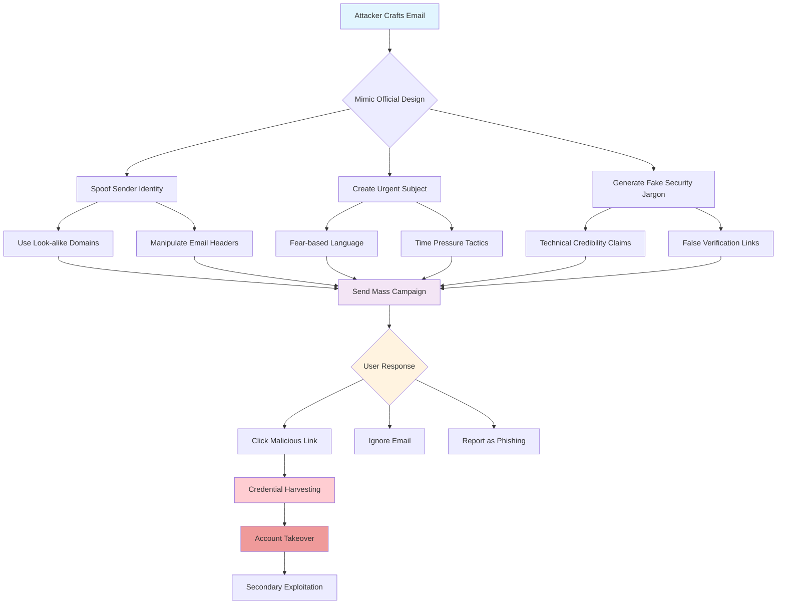

# Why Those 'Your Password Wasn't Changed' Google Emails Are a Scam

## Introduction

If you've received an email claiming "Your password wasn't changed" from what looks like Google, your inbox probably felt a familiar spike of anxiety. The subject line hits all the right emotional notes: it mentions your account, implies unauthorized activity, and suggests something went wrong. But here's the harsh reality—most of these emails aren't just misleading, they're deliberate phishing attempts designed to steal your credentials.

As engineers, we spend our days building systems that users trust implicitly. When that trust is weaponized against them through sophisticated social engineering, it creates a feedback loop that makes our jobs exponentially harder. These aren't random spam campaigns; they're precision strikes targeting the very security features we've spent years implementing.

## Why This Matters

For software architects and developers, understanding phishing isn't just about protecting users—it's about designing resilient systems. Every security feature we build (password reset flows, account recovery, multi-factor authentication) becomes a potential attack vector when users are manipulated into bypassing them entirely.

The real danger lies in how effectively these scams exploit our own security infrastructure. Attackers don't need to break into Google's systems—they just need to convince users they already have. This undermines years of security investment and creates cascading failures across the entire ecosystem.

When we see widespread phishing success, it forces us to reevaluate fundamental assumptions about user behavior, authentication workflows, and trust boundaries. The cost isn't just individual accounts compromised—it's the erosion of confidence in digital identity systems we've spent decades building.

## How It Works

The sophistication of modern phishing attacks mirrors the complexity of legitimate security notifications. Here's the attack flow:



The attack starts with reconnaissance—studying official Google communications to understand visual language, timing patterns, and technical terminology. Sophisticated operators even A/B test different subject lines and designs to maximize click-through rates.

Once crafted, the email uses domain spoofing techniques that can fool even careful users. Instead of `google.com`, they might use `goog1e.com` or `google-security-alert.com`. The visual similarity triggers automatic recognition without conscious verification.

The urgency manipulation is particularly effective because it compresses the user's normal decision-making process. Instead of taking time to verify authenticity, fear bypasses critical thinking and drives immediate action.

## Core Concepts

### Email Authentication Protocols

Modern email security relies on three pillars working together:

**SPF (Sender Policy Framework)** validates that the sending server is authorized to send mail for the domain. When attackers forge emails from `google.com`, they typically fail SPF checks because their servers aren't listed in Google's SPF records.

**DKIM (DomainKeys Identified Mail)** adds a cryptographic signature to verify message integrity. Legitimate Google emails include valid DKIM signatures that can be cryptographically verified against Google's public keys.

**DMARC (Domain-based Message Authentication, Reporting & Conformance)** provides policy guidance for handling failed authentication attempts. Google publishes strict DMARC policies that reject unauthenticated mail.

### Domain Reputation Systems

Enterprise email providers maintain real-time reputation databases tracking sender behavior. These systems assign risk scores based on historical data, content analysis, and infrastructure characteristics. Newly registered domains or those with poor reputations trigger additional scrutiny or automatic quarantining.

### User Behavior Analytics

Sophisticated phishing detection requires understanding normal user patterns. Systems track metrics like:
- Time between receiving email and clicking links
- Geographic location consistency
- Device fingerprint changes
- Typing pattern anomalies during login

## Examples & Code Walkthrough

Here's a practical implementation for detecting phishing attempts in your own applications:

```python
import re
import dns.resolver
from email.utils import parseaddr
from typing import Dict, List, Tuple

class PhishingDetector:
    def __init__(self):
        self.google_domains = {
            'google.com', 'gmail.com', 'googlemail.com',
            'accounts.google.com', 'mail.google.com'
        }
        self.suspicious_patterns = [
            r'password.*wasn\'?t changed',
            r'account.*compromised',
            r'verify.*account',
            r'immediate.*action',
            r'urgent.*security'
        ]
        
    def analyze_email(self, sender: str, subject: str, body: str) -> Dict:
        """Comprehensive phishing analysis returning detailed findings"""
        results = {
            'is_phishing': False,
            'risk_score': 0,
            'indicators': [],
            'recommendation': ''
        }
        
        # Validate sender domain authenticity
        sender_domain = self._extract_domain(sender)
        domain_validation = self._validate_domain_authenticity(sender_domain)
        
        if not domain_validation['valid']:
            results['risk_score'] += 40
            results['indicators'].append(
                f"Suspicious sender domain: {sender_domain}"
            )
            
        # Check subject line for manipulation tactics
        subject_analysis = self._analyze_subject_line(subject)
        results['risk_score'] += subject_analysis['score']
        results['indicators'].extend(subject_analysis['flags'])
        
        # Analyze body content for phishing patterns
        body_analysis = self._analyze_body_content(body)
        results['risk_score'] += body_analysis['score']
        results['indicators'].extend(body_analysis['flags'])
        
        # Determine final classification
        if results['risk_score'] >= 50:
            results['is_phishing'] = True
            results['recommendation'] = (
                "Do not click any links. Report to IT/security team. "
                "If urgent, navigate directly to the official website."
            )
        elif results['risk_score'] >= 25:
            results['recommendation'] = (
                "Exercise caution. Verify sender identity through "
                "alternative channels before taking action."
            )
        else:
            results['recommendation'] = "Email appears legitimate."
            
        return results
    
    def _extract_domain(self, sender: str) -> str:
        """Extract domain from email address"""
        email_address = parseaddr(sender)[1]
        if '@' in email_address:
            return email_address.split('@')[1]
        return sender
    
    def _validate_domain_authenticity(self, domain: str) -> Dict:
        """Check if domain has proper authentication records"""
        try:
            # Check SPF record
            spf_records = dns.resolver.resolve(domain, 'TXT')
            has_spf = any('v=spf1' in str(rdata) for rdata in spf_records)
        except:
            has_spf = False
            
        try:
            # Check DKIM selector (common ones for major providers)
            selectors = ['google', 'default', 'selector1']
            has_dkim = False
            for selector in selectors:
                try:
                    dkim_record = dns.resolver.resolve(
                        f'{selector}._domainkey.{domain}', 'TXT'
                    )
                    has_dkim = True
                    break
                except:
                    continue
        except:
            has_dkim = False
            
        return {
            'valid': has_spf or has_dkim or domain in self.google_domains,
            'has_spf': has_spf,
            'has_dkim': has_dkim,
            'is_official': domain in self.google_domains
        }
    
    def _analyze_subject_line(self, subject: str) -> Dict:
        """Detect urgency and fear-based language in subject"""
        flags = []
        score = 0
        subject_lower = subject.lower()
        
        for pattern in self.suspicious_patterns:
            if re.search(pattern, subject_lower):
                flags.append(f"suspicious_pattern:{pattern}")
                score += 15
                
        # Check for excessive urgency indicators
        urgent_words = ['urgent', 'immediate', 'critical', 'security alert']
        urgent_count = sum(1 for word in urgent_words if word in subject_lower)
        if urgent_count >= 2:
            flags.append("multiple_urgency_indicators")
            score += 20
            
        return {'score': score, 'flags': flags}
    
    def _analyze_body_content(self, body: str) -> Dict:
        """Analyze email body for phishing indicators"""
        flags = []
        score = 0
        body_lower = body.lower()
        
        # Check for fake verification links
        if re.search(r'https?://[^\s]*security[^\s]*', body_lower):
            flags.append("suspicious_security_link")
            score += 25
            
        # Look for credential harvesting language
        credential_phrases = [
            'enter your password', 'click here to verify',
            'confirm your identity', 'provide your credentials'
        ]
        for phrase in credential_phrases:
            if phrase in body_lower:
                flags.append(f"credential_harvesting:{phrase}")
                score += 30
                
        # Check for poor grammar/spelling (often indicates scam)
        if self._has_spelling_errors(body):
            flags.append("spelling_errors_detected")
            score += 10
            
        return {'score': score, 'flags': flags}
    
    def _has_spelling_errors(self, text: str) -> bool:
        """Basic spelling error detection"""
        # This is a simplified check - production systems would use
        # proper spell checking libraries
        common_misspellings = [
            'recieve', 'seperate', 'definately', 'occured'
        ]
        text_lower = text.lower()
        return any(word in text_lower for word in common_misspellings)

# Usage example
detector = PhishingDetector()

# Simulate analyzing a suspicious email
sample_email = {
    'sender': 'security-notifications@google-security-alert.com',
    'subject': 'URGENT: Your password wasn\'t changed - Immediate action required!',
    'body': 'We detected unauthorized access attempts. Click here to verify your account immediately: http://fake-google-security.com/login'
}

analysis = detector.analyze_email(
    sample_email['sender'],
    sample_email['subject'],
    sample_email['body']
)

print(f"Risk Score: {analysis['risk_score']}/100")
print(f"Is Phishing: {analysis['is_phishing']}")
print("Indicators Found:")
for indicator in analysis['indicators']:
    print(f"  - {indicator}")
print(f"Recommendation: {analysis['recommendation']}")
```

This detector implements multiple layers of analysis:

1. **Domain Validation**: Checks SPF/DKIM records and compares against known legitimate domains
2. **Content Analysis**: Scans for manipulation patterns and credential harvesting language  
3. **Behavioral Indicators**: Looks for urgency tactics and social engineering cues

## Best Practices

### For Email Service Providers

Implement robust authentication headers and enforce strict DMARC policies. Monitor authentication failure rates and investigate sudden spikes that might indicate spoofing attempts.

### For End Users

Never click links in suspicious emails—navigate directly to official websites. Enable multi-factor authentication wherever possible. When in doubt, contact the organization through verified channels.

### For Application Developers

Build systems that minimize reliance on email-based security notifications. Implement out-of-band verification for critical actions. Design workflows that don't assume users will correctly identify phishing attempts.

## Common Mistakes & Anti-Patterns

### Mistake 1: Over-reliance on Visual Similarity

Many security teams focus too much on making emails visually identical to legitimate ones. This approach fails when attackers simply slightly modify logos or colors. Instead, implement behavioral analysis that goes beyond surface appearance.

### Mistake 2: Ignoring Domain Registration Patterns

Newly registered domains are often used for phishing campaigns. Implement automated systems that flag recent domain registrations, especially those impersonating major brands.

### Mistake 3: Treating All Warnings Equally

Not all security warnings carry the same risk level. Implement tiered response systems that escalate appropriately based on threat severity. A password reset notification should never trigger the same response as a suspected account takeover.

### Anti-Pattern: Quick Fix Solutions

Avoid implementing simple keyword filters that attackers can easily circumvent by changing one word. Phishing detection requires layered approaches combining multiple signals.

## Performance Considerations

Phishing detection systems must balance accuracy with performance. Real-time email scanning introduces latency that can impact user experience. Consider these optimization strategies:

- Cache domain reputation lookups to avoid repeated DNS queries
- Use bloom filters for fast negative matching of known good domains
- Implement asynchronous analysis for non-critical emails
- Pre-compute risk scores for high-volume senders

Memory usage becomes significant when maintaining large reputation databases. Production systems typically use compressed data structures and lazy loading to manage resource consumption.

Network overhead from external API calls (domain reputation services, threat intelligence feeds) can create bottlenecks. Batch processing and intelligent caching help mitigate these issues while maintaining detection accuracy.

## Real-World Usage

Major technology companies employ sophisticated phishing detection at scale. Google processes billions of emails daily using machine learning models trained on historical phishing data. Their systems incorporate:

- Real-time reputation scoring of sending IPs and domains
- Content analysis using natural language processing
- User behavior modeling to identify anomalous patterns
- Automated takedown of malicious domains

Financial institutions implement additional layers including transaction monitoring and behavioral biometrics. Credit card companies track spending patterns to detect fraudulent activity even after credentials are compromised.

Security vendors like Proofpoint and Mimecast provide enterprise-grade solutions that combine threat intelligence feeds with advanced analytics. Their platforms process terabytes of data to identify emerging phishing campaigns before they reach end users.

## Frequently Asked Questions (FAQ)

**Q: How can I tell if an email is really from Google?**

A: Check the sender address carefully—it should be `@google.com` or `@gmail.com`. Hover over any links to see the actual destination URL before clicking. When in doubt, navigate directly to google.com instead of using email links.

**Q: Should I report these phishing emails?**

A: Yes, reporting helps improve detection systems. Most email providers have reporting mechanisms. For Google-specific scams, you can forward the full email headers to phishing@google.com.

**Q: Can I block these emails automatically?**

A: Basic filtering can reduce exposure, but sophisticated phishing often bypasses filters. Focus on user education and verification processes rather than relying solely on technical controls.

**Q: What if I clicked a link in a phishing email?**

A: Immediately change your password using a different device or browser. Enable two-factor authentication if not already active. Monitor your accounts for unusual activity and consider credit monitoring services.

**Q: Why don't these emails get caught by spam filters?**

A: Modern phishing uses techniques specifically designed to evade filters—personalized content, legitimate-looking domains, and social engineering that mimics real security alerts. Defense requires multiple layers beyond simple spam detection.

## Conclusion

The "Your password wasn't changed" scam represents a sophisticated evolution in phishing tactics that leverages our own security infrastructure against us. These attacks succeed not because they're technically complex, but because they exploit human psychology and trust in established brands.

For engineers building secure systems, this underscores a critical principle: security is never just about technology. It's about designing experiences that help users make safe decisions even under stress or time pressure. Every security notification we send should be crafted with the understanding that attackers will study and mimic it.

The most effective defense combines technical controls with user education. Implement systems that don't rely solely on users identifying phishing attempts, and always provide clear, direct paths for legitimate security actions that bypass potentially compromised communication channels.

As we continue building the next generation of digital identity systems, we must remember that the strongest security is invisible to attackers—because it doesn't exist in places they can easily exploit.
