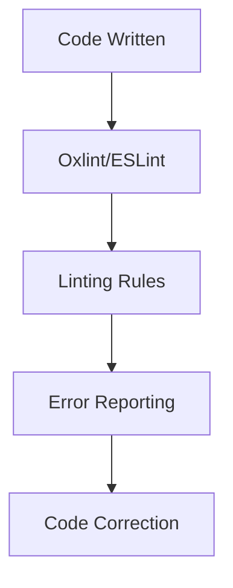

# Why Vite Asked Me to Choose Between Oxlint and ESLint

## Introduction
I recently encountered an interesting dilemma while setting up a new project with Vite. As I was configuring my development environment, I was prompted to choose between Oxlint and ESLint. At first, I thought this was a straightforward decision, but as I delved deeper into the differences between these two tools, I realized that the choice wasn't so simple. In this article, I'll explore the reasons behind Vite's request and provide guidance on how to make an informed decision.

## Why This Matters
The choice between Oxlint and ESLint matters because it can significantly impact the maintainability, scalability, and performance of your codebase. Both tools offer distinct advantages and disadvantages, and selecting the right one can help you catch errors early, enforce coding standards, and improve overall code quality. As a developer, it's essential to understand the strengths and weaknesses of each tool to make an informed decision that aligns with your project's needs.

## How It Works
To understand the differences between Oxlint and ESLint, let's take a look at how they work:

In this flowchart, we can see that both Oxlint and ESLint follow a similar process: they read the code, apply linting rules, report errors, and provide suggestions for correction. However, the key differences lie in their approach to linting, configuration, and integration with other tools.

## Core Concepts
Before making a decision, it's crucial to understand the core concepts behind Oxlint and ESLint. Oxlint is a newer tool that focuses on performance, scalability, and ease of use. It offers advanced features like automatic code fixes, incremental linting, and seamless integration with popular frameworks. On the other hand, ESLint is a well-established tool with a large community and a wide range of plugins. It provides a high degree of customizability, support for multiple formats, and robust error reporting.

## Examples & Code Walkthrough
To illustrate the differences between Oxlint and ESLint, let's consider an example. Suppose we have a simple JavaScript function that adds two numbers:
```javascript
function add(a, b) {
  return a + b;
}
```
With Oxlint, we can configure it to automatically fix errors and enforce coding standards. For instance, we can set up a rule to always use const for variable declarations:
```javascript
// oxlint.config.js
module.exports = {
  rules: {
    'prefer-const': 'error',
  },
};
```
With ESLint, we can achieve similar results using the `prefer-const` rule, but we need to configure it manually:
```javascript
// .eslintrc.json
{
  "rules": {
    "prefer-const": "error"
  }
}
```
As we can see, both tools offer similar functionality, but the configuration and syntax differ.

## Best Practices
When choosing between Oxlint and ESLint, consider the following best practices:

* Evaluate your project's specific needs and requirements.
* Assess the trade-offs between performance, scalability, and customizability.
* Consider the learning curve and documentation for each tool.
* Look into the community support, plugins, and integrations available for each tool.

## Common Mistakes & Anti-Patterns
Some common mistakes to avoid when using Oxlint or ESLint include:

* Overconfiguring or underconfiguring the tool, leading to unnecessary errors or false positives.
* Ignoring or dismissing error reports, which can lead to technical debt and maintenance issues.
* Failing to integrate the tool with other development workflows, such as CI/CD pipelines or code review processes.

## Performance Considerations
In terms of performance, Oxlint is generally faster and more efficient than ESLint, especially for large codebases. However, ESLint's performance can be improved by using caching, parallel processing, or optimizing configuration.

## Real-World Usage
Industry leaders like Google, Facebook, and Microsoft use a combination of Oxlint and ESLint in their development workflows. For example, Google uses Oxlint for its Angular projects, while Facebook relies on ESLint for its React applications.

## Frequently Asked Questions (FAQ)
Here are some common questions and answers:

* Q: Can I use both Oxlint and ESLint together?
A: Yes, you can use both tools in tandem, but be cautious of potential conflicts and overlapping rules.
* Q: How do I migrate from ESLint to Oxlint?
A: Start by configuring Oxlint with similar rules and settings, then gradually transition to Oxlint's unique features and improvements.
* Q: Is Oxlint compatible with my existing CI/CD pipeline?
A: Oxlint supports popular CI/CD tools like Jenkins, Travis CI, and CircleCI, but you may need to modify your pipeline configuration to accommodate Oxlint's output and reporting format.

## Conclusion
In conclusion, the choice between Oxlint and ESLint depends on your specific project requirements, development workflow, and personal preferences. By understanding the strengths and weaknesses of each tool, you can make an informed decision that enhances your coding experience, improves code quality, and streamlines your development process. As the landscape of frontend development continues to evolve, it's essential to stay up-to-date with the latest tools and best practices to build scalable, maintainable, and high-performance applications.
