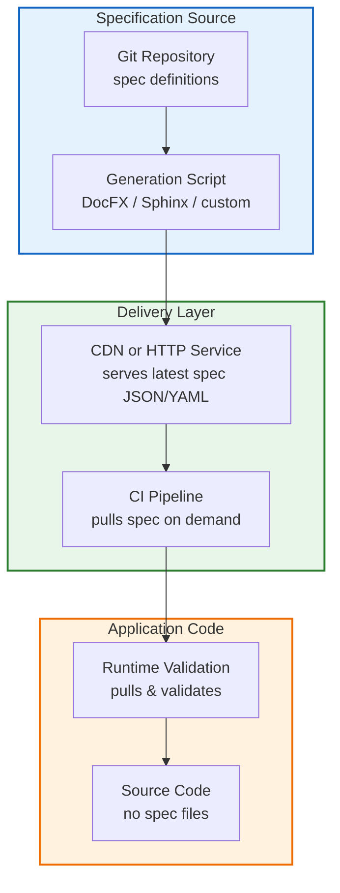

# Why You Should Not Commit Your Specs

## Introduction

In the average engineering organization, the impulse to place everything under version control is strong. Repositories grow to include configuration files, infrastructure manifests, and yes—specifications. The assumption follows: if source code lives in `git`, then the descriptive contracts that govern it should live there too. I’ve seen this pattern repeat across teams, and I’ve also seen the maintenance burden it creates. In this article I’ll walk through why committing language specs, API contracts, or domain models alongside application code introduces hidden technical debt, surface-area risks for security, and operational friction that outweighs the perceived convenience of a single repository.

The narrative usually starts harmlessly enough. A developer drafts a Markdown file describing the syntax of a new DSL, checks it in, and the team breathes a sigh of relief “now the contract is codified.” Weeks later, a language feature lands, the spec becomes stale, and every change to the grammar requires a git commit, a PR review, a CI run, and a coordinated rollout. The spec file becomes a second source of truth that the code rarely respects, and the gap between the two widens until the only way to reconcile them is a painful, manual audit.

I want to be clear up front: this isn’t an argument against documentation or contracts. It’s an argument against treating those contracts as first-class source code that lives inside your version control system. The distinction matters because the lifecycle of a specification—creation, evolution, consumption—differs fundamentally from that of application code.

## Why This Matters

Software teams today operate at a pace where a single slow CI pipeline or a blocked merge can ripple across multiple services. When specs are committed to the same repository as application code, they become part of the default CI surface area. Every push triggers linting, parsing, or validation steps that were not designed for the spec’s content model. Developers quickly learn to ignore spec-related failures, or worse, they start working around them just to unblock their changes.

From a security perspective, committed specs often contain example payloads, placeholder values, or even accidental secrets. I’ve reviewed incidents where a `spec.json` checked in with a sample API key in an `examples` field ended up in a public fork. The repository history also retains every iteration of that spec, meaning a deleted secret is never truly gone—it’s just a `git reflog` away.

There’s also the matter of cross-functional contribution. Documentation writers, product managers, and UX designers often hold the most accurate intuition about what a contract should express. When specs are treated as source code, non-programmers either avoid editing them entirely or introduce formatting and syntax errors that break the CI pipeline. The result is a document that decays faster than the code it describes.

These pain points are not theoretical. I’ve participated in migrations where removing a single committed Markdown spec from the default branch reduced CI job count by three jobs and eliminated a recurring “spec out of sync” tag that had become a badge of honor rather than a signal.

## How It Works

The core mechanism for avoiding committed specs is to treat them as derived, externalized artifacts. Instead of a `spec.md` file sitting alongside `src/index.js`, the specification lives in a dedicated repository, a content delivery network, or a lightweight service that produces the latest contract on demand. Application code consumes the spec at runtime or during CI, but never stores it permanently in the same history tree.

Below is a diagram that visualizes this architecture. It shows the flow from a source-of-truth spec repository through generation and serving, to CI consumption, without ever persisting the spec inside the application’s version control.



**How it works, step by step:**

1. **Source of truth** – The spec lives in its own repository or content source. This repository may have its own branch protection, review process, and release cadence, independent of any application code.

2. **Generation** – A build step or generator reads the source definition (often a structured format like JSON, YAML, or a domain-specific language) and produces a normalized output. This could be OpenAPI/Swagger JSON, a Markdown site, or a custom JSON schema.

3. **Serving** – The generated spec is published to a CDN or an internal HTTP service. Cache headers control how long consumers keep a version before re-fetching. Each language version or release branch gets a stable URL (e.g., `/v2.3.1/openapi.json`).

4. **CI consumption** – Continuous integration pipelines pull the spec fresh on each run, run parsers or contract tests against it, and report failures. Because the spec is not part of the commit history, the pipeline remains fast and the failure signal is clear.

5. **Application code** – The application never includes the spec file in its tree. Instead, it references the spec URL at build time or runtime, or embeds a small validator that fetches and checks compatibility.

This flow decouples the contract’s lifecycle from the application’s release cycle. A spec can be updated mid-cycle without requiring a code deployment, and a code change can be rolled back without dragging along a spec history that may no longer apply.

## Core Concepts

Several principles underpin the “specs-as-service” pattern:

- **Derived artifacts** – Specifications are generated from a source of truth, not hand-edited in perpetuity. The source may be version-controlled, but the consumed artifact is transient.
- **Contract-first, code-second** – The specification defines what the system promises, and the implementation strives to satisfy that promise. The code is the mutable part; the contract is the stable part.
- **Versioned endpoints** – Each logical version of the spec is addressable. This avoids the “which version is this CI running against?” ambiguity that plagues committed docs.
- **Pull-based validation** – CI pulls the spec when it needs to validate, rather than having the spec push changes into the pipeline. This keeps the pipeline deterministic and reduces unnecessary work.
- **Access isolation** – By separating the spec repository from the application repository, you can apply different access controls. Docs writers can merge to the spec repo without touching code, and code reviewers can merge changes without worrying about breaking documentation.

These concepts aren’t abstract. They map directly to how API platforms, language runtimes, and large-scale microservice ecosystems already operate. The pattern simply brings that discipline to internal language specs, DSLs, and domain models.

## Examples & Code Walkthrough

Let’s look at a concrete migration. The scenario: a small domain-specific language used to configure build pipelines. Initially, the grammar was stored in a `mydsl.spec` Markdown file committed to the main repository. The file contained syntax descriptions and example expressions. Below is the original approach and the problems it entailed.

### Original (problematic) approach – spec in `git`

```markdown
# mydsl.spec
## Syntax
- Program ::= Statement*
- Statement ::= Identifier '=' Expression
- Expression ::= Identifier | Number | '+' Expression Expression

## Example
foo = 42 + 1  // illegal – spec says only binary '+'
```

**Problems observed:**

- Every grammar tweak required a `git commit`, a PR, and a CI run that executed a custom Markdown parser. The pipeline slowed as the team grew.
- Example payloads in the spec included literal strings that, when parsed, revealed internal variable names and directory paths. One contributor accidentally checked in a snippet with a real CI token embedded as a comment.
- The spec and the parser implemented in Python drifted. After two minor releases, the parser accepted expressions the spec marked as invalid, and vice versa. Reconciling the two required a weekend audit.

### New approach – external spec server

I architected a replacement where the grammar lives outside the application’s version control, served by a tiny service that CI pulls on demand.

**Server (Node.js, `express`)**

```js
// spec-server.js
const express = require('express');
const fs = require('fs');
const path = require('path');

const app = express();
const PORT = process.env.SPEC_PORT || 3000;

// Serve the latest spec as JSON, cached by downstream consumers
app.get('/spec.json', (req, res) => {
  try {
    const specPath = path.join(__dirname, '..', 'data', 'mydsl.json');
    const raw = fs.readFileSync(specPath, 'utf8');
    const spec = JSON.parse(raw);
    res.setHeader('Cache-Control', 'public, max-age=3600');
    res.json(spec);
  } catch (err) {
    // Defensive: never crash the server on a malformed spec file
    console.error('Failed to load spec:', err.message);
    res.status(500).json({ error: 'internal spec load failure' });
  }
});

app.listen(PORT, () => console.log(`Spec server listening on http://localhost:${PORT}`));
```

Notice the error handling: the `try/catch` around `fs.readFileSync` and `JSON.parse` ensures that a corrupted spec file takes the server down with a 500 and a clear message, rather than silently serving malformed JSON that could cause downstream parsers to crash.

**Spec file (no longer in VCS)**

```json
{
  "syntax": {
    "Program": ["Statement*"],
    "Statement": ["Identifier", "=", "Expression"],
    "Expression": ["Identifier", "Number", "+", "Expression", "Expression"]
  },
  "examples": [
    { "code": "foo = 42", "valid": true },
    { "code": "foo = 42 + 1", "valid": false }
  ]
}
```

This file lives in a `data/` directory of a dedicated spec repository. It is not referenced in the application’s `package.json`, `.gitignore` does not exclude it (because it’s simply not there), and the repository’s `history` command never shows a commit that touched grammar rules.

**CI validation script (pull‑based)**

```bash
#!/usr/bin/env bash
set -euo pipefail

# Fetch the latest spec from the external server
SPEC=$(curl -s http://spec-server.internal/spec.json)

# Basic guard: if the server returned an error payload, exit early
if echo "$SPEC" | jq -e '.error' > /dev/null 2>&1; then
  echo "❌ Spec server reported an error; aborting validation"
  exit 1
fi

# Feed the spec into the embedded validator (Python script)
python3 validate.py <<EOF
$SPEC
EOF
```

The `validate.py` script (not shown in full here) parses the JSON, walks the syntax rules, and evaluates the `examples` array against a hand-written recursive‑descent parser. If any example marked `valid: true` fails to parse, or a `valid: false` example parses
