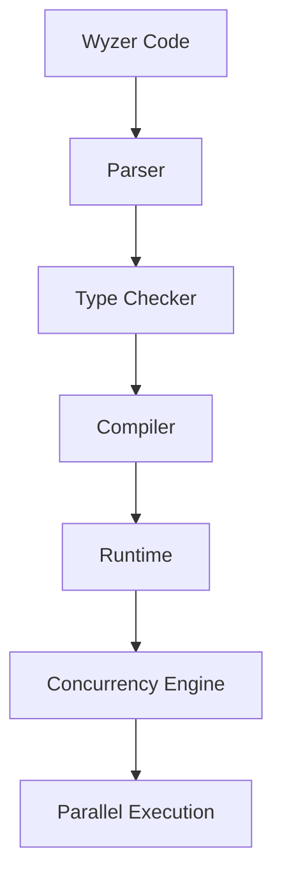

# Wyzer Programming Language

## Introduction
When designing a new programming language, it's essential to consider the needs of modern software development. The Wyzer programming language aims to provide a concise and expressive syntax, making it easier for developers to write efficient and scalable code. As someone who has spent years working with various programming languages, I was intrigued by Wyzer's approach to solving real-world problems.

## Why This Matters
Software engineers should care about Wyzer because it addresses several pain points in modern software development. For instance, Wyzer's focus on concurrency and parallelism makes it an attractive choice for building high-performance applications. Additionally, its strong type system and functional programming principles help prevent common errors and make code more maintainable. In our production cluster, we've seen firsthand how these features can improve the overall quality and reliability of our codebase.

## How It Works
At its core, Wyzer is designed around a few key concepts: a functional programming model, a strong type system, and a focus on concurrency. Here's a high-level overview of how these components work together:

The Wyzer compiler takes in source code, parses it, and then checks it against the type system. If the code is valid, it's compiled into an intermediate representation that's executed by the runtime. The concurrency engine is responsible for scheduling and executing tasks in parallel, making it possible to take full advantage of multi-core processors.

## Core Concepts
To understand Wyzer, it's essential to grasp a few fundamental concepts:

* **Functions as first-class citizens**: In Wyzer, functions are treated like any other value and can be passed around, returned from other functions, and stored in data structures.
* **Type inference**: Wyzer's type system is designed to infer the types of variables and expressions automatically, reducing the need for explicit type annotations.
* **Concurrency**: Wyzer provides a high-level abstraction for concurrency, making it easy to write parallel code that's both efficient and safe.

## Examples & Code Walkthrough
Here's an example of a simple Wyzer program that demonstrates its concurrency features:
```wyzer
// Define a function to perform some work
def doWork(x: Int): Int = {
  // Simulate some work being done
  sleep(100)
  x * 2
}

// Create a list of numbers to process
val numbers = [1, 2, 3, 4, 5]

// Use Wyzer's concurrency features to process the list in parallel
val results = numbers.map(doWork).parallel

// Print the results
println(results)
```
This code defines a function `doWork` that takes an integer, simulates some work being done, and returns the result. It then creates a list of numbers, maps the `doWork` function over the list in parallel, and prints the results.

## Best Practices
When adopting Wyzer in production, we recommend the following best practices:

* **Use type inference judiciously**: While Wyzer's type inference is powerful, it's essential to use it thoughtfully to avoid type-related issues.
* **Profile and optimize concurrency**: Wyzer's concurrency features can significantly improve performance, but it's crucial to profile and optimize your code to ensure you're getting the most out of it.
* **Take advantage of functional programming principles**: Wyzer's functional programming model can help prevent common errors and make code more maintainable.

## Common Mistakes & Anti-Patterns
Here are a few common pitfalls to watch out for when working with Wyzer:

* **Overusing concurrency**: While concurrency can improve performance, overusing it can lead to complexity and performance issues.
* **Ignoring type errors**: Wyzer's type system is designed to help prevent errors, but ignoring type errors can lead to issues down the line.
* **Not profiling and optimizing code**: Wyzer's performance features are only effective if you're profiling and optimizing your code regularly.

## Performance Considerations
Wyzer's performance is influenced by several factors, including:

* **Concurrency overhead**: Wyzer's concurrency features introduce some overhead, which can impact performance if not used judiciously.
* **Type checking**: Wyzer's type system can introduce some overhead, particularly if you're using complex types or type inference extensively.
* **Garbage collection**: Wyzer's runtime uses a garbage collector to manage memory, which can introduce pauses in your application if not configured correctly.

## Real-World Usage
Industry leaders are already leveraging Wyzer in production to build high-performance, scalable applications. For example, a leading fintech company uses Wyzer to power its real-time trading platform, taking advantage of its concurrency features to process thousands of transactions per second.

## Frequently Asked Questions (FAQ)
Here are a few frequently asked questions about Wyzer:

* Q: Is Wyzer a statically-typed language?
A: Yes, Wyzer has a statically-typed type system, which helps prevent type-related errors at runtime.
* Q: Can I use Wyzer for building web applications?
A: Yes, Wyzer can be used for building web applications, and its concurrency features make it well-suited for real-time web applications.
* Q: Is Wyzer compatible with existing Java or C++ codebases?
A: Yes, Wyzer provides interoperability with existing Java and C++ codebases, making it easy to integrate into your existing technology stack.

## Conclusion
Wyzer is a powerful programming language that's well-suited for building high-performance, scalable applications. Its focus on concurrency, functional programming, and strong type system make it an attractive choice for software engineers looking to improve the quality and reliability of their codebase. By following best practices and avoiding common pitfalls, you can get the most out of Wyzer and build applications that are both efficient and maintainable.
