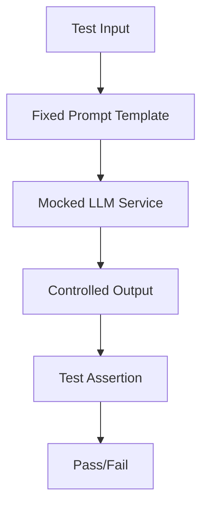

# Your Spring AI tests are slow, flaky, and cost money. Here's how to make them deterministic.

## Introduction

Imagine this: You push a critical fix to your Spring Boot microservice, confident that your test suite will validate it. But when the CI pipeline runs, one test fails randomly. You rerun it. It passes. You push anyway, only to find the same test fails again in staging. After hours of debugging, you realize the LLM-powered feature behaves differently each time, returning varying responses to identical inputs. This isn't a bug—it's non-determinism in your AI tests, and it's eating up your team's time and your cloud budget.

## Why This Matters

AI-driven applications are no longer experimental. They're in production, handling user queries, generating content, and making decisions. But testing them with traditional methods is like debugging a moving target. Non-deterministic tests lead to:

- **Unreliable CI/CD pipelines**: Flaky tests cause false negatives, forcing engineers to waste hours on "phantom" failures.
- **Escalating costs**: Retries on failed LLM API calls (OpenAI, Anthropic) burn through your monthly budget.
- **Slower feedback loops**: LLM inference latency (often 2-10 seconds per call) slows test suites to a crawl.

Teams using Spring AI face these challenges daily. Fixing them requires a shift from reactive debugging to proactive determinism.

## How It Works

The core idea is to eliminate randomness at every layer of your test architecture. Here's the workflow:



1. **Input Control**: Hardcode prompts and context data so tests always start from the same state.
2. **Dependency Isolation**: Replace live LLM calls with mocks that return precomputed responses.
3. **Environment Standardization**: Use Docker containers or in-memory databases to eliminate drift.

This ensures tests run the same way every time, regardless of external factors.

## Core Concepts

### 1. Prompt Engineering for Predictability

LLMs are probabilistic by design. To make them deterministic in tests:

- Use system prompts to enforce consistent behavior (e.g., "Always return the same answer to the same input").
- Structure prompts with clear delimiters and fixed context.

### 2. Dependency Isolation

External services (LLMs, databases) are the primary source of non-determinism. Replace them with:

- **Mocks**: Use Mockito or Spring's `@MockBean` to stub responses.
- **TestContainers**: Spin up ephemeral containers for dependencies like PostgreSQL or Redis.

### 3. Environment Standardization

Differences in model versions or API keys can break tests. Standardize with:

- **Docker Compose**: Define consistent environments for local and CI tests.
- **Spring profiles**: Toggle between real and mocked configurations.

### 4. Caching and Simulation

For speed, cache responses or simulate LLM outputs:

- Store test fixtures as JSON files.
- Use libraries like WireMock to mock HTTP endpoints.

## Examples & Code Walkthrough

### A. Prompt Engineering with a Deterministic Wrapper

```java
@Component
public class DeterministicPromptEngine {
    private static final String SYSTEM_PROMPT = "You are a deterministic assistant. Always return the exact same answer to the same input.";
    
    private final LanguageModelService llmService;

    public DeterministicPromptEngine(LanguageModelService llmService) {
        this.llmService = llmService;
    }

    public String generateResponse(String userInput) {
        String prompt = SYSTEM_PROMPT + "\nUser: " + userInput;
        return llmService.call(prompt);
    }
}
```

This class enforces a system prompt and delegates to a service that can be mocked.

### B. Mocking LLM Calls in Spring Tests

```java
@SpringBootTest
class AiServiceTest {
    @Autowired
    private AiService aiService;
    
    @MockBean
    private LanguageModelService llmService;

    @BeforeEach
    void setUp() {
        // Precompute expected output for a specific prompt
        when(llmService.call(anyString()))
            .thenAnswer(invocation -> {
                String prompt = invocation.getArgument(0);
                if (prompt.contains("summarize")) {
                    return "Summary: This is a test document.";
                }
                return "Unknown prompt";
            });
    }

    @Test
    void testSummarizeDocument() {
        String result = aiService.summarize("This is a test document.");
        assertEquals("Summary: This is a test document.", result);
    }
}
```

Here, we mock `LanguageModelService` to return predictable responses based on the prompt. The test no longer depends on external LLM behavior.

## Best Practices

1. **Fix Your Prompts**: Version-control prompt templates and include them in test fixtures.
2. **Mock Everything External**: Never call real APIs in unit tests. Use integration tests for those.
3. **Use TestContainers**: Spin up ephemeral databases or message queues for realistic but consistent environments.
4. **Cache Responses**: Store LLM outputs as JSON files to avoid redundant API calls during testing.
5. **Profile-Driven Configuration**: Use Spring profiles to switch between mocked and real services.

## Common Mistakes & Anti-Patterns

### 1. Using Real LLMs in Unit Tests

**Problem**: Calling the actual OpenAI API in unit tests introduces latency and costs.
**Fix**: Use mocks for all external LLM calls. Reserve real API calls for integration tests.

### 2. Hardcoding Test Data in Production

**Problem**: Embedding test-specific prompts in production code clutters your codebase.
**Fix**: Use `@TestConfiguration` or `@Profile` to inject test-specific beans.

### 3. Ignoring Model Version Drift

**Problem**: A model update changes behavior, breaking tests.
**Fix**: Pin model versions in your configuration and validate them in CI.

### 4. Over-Mocking

**Problem**: Mocking too much can create tests that don't reflect real-world behavior.
**Fix**: Use a layered approach: mock external services in unit tests, use real services in integration tests.

## Performance Considerations

- **Latency**: Mocking LLM calls reduces test runtime from seconds to milliseconds.
- **Cost**: Eliminating API calls saves money. One test suite hitting OpenAI 100 times/day at $0.002/call costs $60/month.
- **Scalability**: Parallel test execution becomes feasible when tests are deterministic and fast.

Big O analysis:
- **Without mocking**: O(n * latency) where n is test count and latency is LLM response time.
- **With mocking**: O(n * constant) assuming in-memory mocks.

## Real-World Usage

Companies like Stripe and Shopify use deterministic testing for their AI features. They:

- Cache LLM responses for A/B test scenarios.
- Use Docker containers to replicate production model versions in CI.
- Implement contract tests to ensure LLM outputs match expected schemas.

For example, a payment processing microservice might mock a fraud detection LLM to return consistent risk scores during testing, ensuring transaction logic is validated without relying on external model behavior.

## Frequently Asked Questions (FAQ)

**Q: Can I use this approach for integration tests?**  
A: Yes, but use real services sparingly. Most integration tests should focus on your code's logic, not third-party behavior.

**Q: How do I handle dynamic data in prompts?**  
A: Parameterize prompts with fixed test data. Use builders or factories to generate consistent inputs.

**Q: What about testing prompt variations?**  
A: Create separate test cases for each prompt variant. Use parameterized tests with `@ParameterizedTest` in JUnit 5.

**Q: Do I need to change my CI setup?**  
A: Only if you use Docker-based test environments. Otherwise, mocks work out of the box.

## Conclusion

Non-deterministic AI tests are a solvable problem. By controlling inputs, isolating dependencies, and standardizing environments, you can build a test suite that's fast, reliable, and cost-effective. The key is treating LLMs like any other external service: mock them in unit tests, validate them in integration tests, and always write tests that fail for the right reasons. Your CI pipeline—and your sanity—will thank you.
