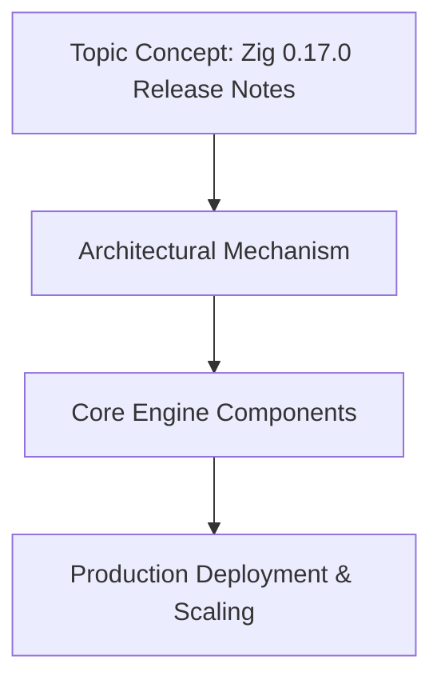

# Zig 0.17.0 Release Notes

## Introduction

Zig 0.17.0 lands with a set of practical refinements that directly impact how teams ship systems software. The release zeroes in on reducing the gap between write-run cycles, tightening the build pipeline, and expanding safe interop with existing C ecosystems. For engineering organizations maintaining large-scale services, the changes translate to fewer build breaks, more predictable binary sizes, and a smoother path for incremental adoption in greenfield and legacy contexts alike.

## Why This Matters

When a team operates dozens of micro-services across heterogeneous environments, the cost of a missing build dependency or an opaque compile-time error compounds quickly. Zig 0.17.0 addresses three recurring pain points: deterministic build outputs, improved `zig cc` integration for mixed-language projects, and tighter comptime error reporting. These aren't abstract improvements; they directly reduce the time developers spend debugging build failures and increase the confidence with which releases land in production.

## How It Works

The release introduces a revised build-cache key strategy and a more granular approach to module fingerprinting. By hashing only the relevant pieces of imported modules—rather than entire file contents—incremental builds avoid unnecessary recompilation when unrelated constants change
