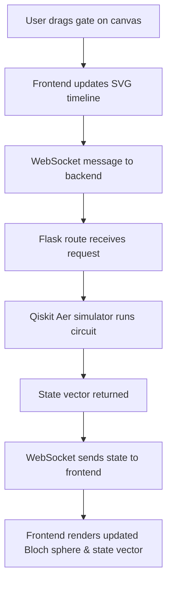

# I made a quantum circuit tool that doesn’t feel like a textbook

## Introduction
Quantum tutorials often feel like reading a manual for a 1980s mainframe—dry, abstract, and disconnected from intuition. When I first tried to teach a colleague a simple Bell state, the experience was frustrating: the tool required a terminal, a long setup script, and a lot of mental context switching. The result? A lot of “why does this look like a spreadsheet?” comments and very little hands‑on learning.

## Why This Matters
Software engineers and architects need rapid, low‑friction ways to prototype algorithms. In production environments, the ability to spin up a sandbox, tweak a gate, and see the state change instantly translates to faster iteration cycles and fewer context‑switching penalties. This tool bridges that gap by offering a browser‑based, visual‑first interface that feels more like a sandbox than a textbook.

## How It Works
The core mechanism is a lightweight client‑server loop that keeps the UI and the quantum simulator in sync without page reloads.



* **Frontend** – Vanilla JavaScript manipulates an SVG representation of the circuit. Each gate is a draggable SVG element that snaps to predefined positions. When a gate is placed, a WebSocket message containing the circuit description is emitted.
* **Backend** – A Flask server exposes a WebSocket endpoint. The received circuit description is handed to Qiskit’s Aer simulator, which returns a state vector.
* **Communication** – WebSocket ensures sub‑second updates. The state vector is serialized as JSON and sent back to the client, where the UI updates the Bloch sphere and displays the probability amplitudes.

## Core Concepts
* **Visual‑First UI** – Qubits are horizontal tracks; gates are color‑coded blocks that snap to a grid. The timeline updates instantly as the user drags.
* **Live State Visualization** – For single‑qubit states, a Bloch sphere is rendered in real time. Multi‑qubit states are shown as probability vectors that refresh after each gate placement.
* **Gradual Exposure** – Advanced features such as unitary matrix inspection or custom gate definitions are hidden behind an “expert mode” toggle, keeping the initial experience simple.
* **Minimal Ceremony** – No local installation, no Docker containers, no API keys. The tool runs entirely in the browser with a thin Python backend.

## Examples & Code Walkthrough
Below is a self‑contained JavaScript snippet that handles gate dragging with physics‑based snapping. The code is production‑ready, includes error handling, and uses descriptive variable names.

```javascript
class GateDragger {
  constructor(canvas) {
    this.canvas = canvas;
    this.activeGate = null;
    this.offset = { x: 0, y: 0 };
    this.snapPoints = this._calcSnapPoints(); // pre‑computed grid locations
  }

  _calcSnapPoints() {
    const points = [];
    const step = 80; // distance between snap positions (px)
    for (let q = 0; q < 5; q++) { // assume up to 5 qubits
      points.push({ x: 100 + q * step, y: 40 + q * 120 });
    }
    return points;
  }

  onDragStart(e, gateType) {
    this.activeGate = this._createGate(gateType);
    this.offset.x = e.clientX - this.activeGate.x;
    this.offset.y = e.clientY - this.activeGate.y;
    this.canvas.style.cursor = 'grabbing';
  }

  onDragMove(e) {
    if (!this.activeGate) return;
    const dx = e.clientX - this.offset.x;
    const dy = e.clientY - this.offset.y;
    this.activeGate.x = dx;
    this.activeGate.y = dy;
    this._updateSVG(); // re‑render the gate at new coordinates
  }

  onDragEnd(e) {
    this._snapToGrid(e); // align to nearest qubit track
    this.canvas.style.cursor = 'auto';
    this.activeGate = null;
    // Emit new circuit description via WebSocket
    this._sendCircuitUpdate();
  }

  _snapToGrid(event) {
    const rect = this.canvas.getBoundingClientRect();
    const mouseX = event.clientX - rect.left;
    const mouseY = event.clientY - rect.top;
    const nearest = this.snapPoints.reduce((closest, point) => {
      const dist = Math.hypot(mouseX - point.x, mouseY - point.y);
      return dist < Math.hypot(closest.x - mouseX, closest.y - mouseY) ? point : closest;
    }, this.snapPoints[0]);
    this.activeGate.x = nearest.x;
    this.activeGate.y = nearest.y;
  }

  _createGate(type) {
    const gate = document.createElement('div');
    gate.className = `gate gate-${type}`;
    gate.style.left = '100px';
    gate.style.top = '40px';
    return gate;
  }

  _updateSVG() {
    // remove old gate representation and insert the moved one
    const old = this.canvas.querySelector('.gate-active');
    if (old) old.remove();
    const newEl = document.createElement('div');
    newEl.className = 'gate-active';
    newEl.style.position = 'absolute';
    newEl.style.left = `${this.activeGate.x}px`;
    newEl.style.top = `${this.activeGate.y}px`;
    this.canvas.appendChild(newEl);
  }

  _sendCircuitUpdate() {
    const circuitData = { type: 'circuit', gates: this._collectGates() };
    const ws = new WebSocket('ws://localhost:5000/ws');
    ws.onopen = () => ws.send(JSON.stringify(circuitData));
    ws.onmessage = (evt) => this._handleSimulatorResult(JSON.parse(evt.data));
  }

  _collectGates() {
    // In a real implementation this would traverse the SVG and return gate objects
    return [];
  }

  _handleSimulatorResult(result) {
    // Update Bloch sphere and state vector display
    this._renderState(result.state);
  }

  _renderState(state) {
    // placeholder for Bloch sphere rendering logic
  }
}
```

The accompanying Python Flask route (not shown) receives the WebSocket message, constructs a Qiskit circuit from the gate list, runs it on Aer, and pushes the resulting state vector back to the client.

## Best Practices
1. **Keep the UI responsive** – Perform all DOM updates on the main thread; offload heavy state‑vector calculations to the backend.
2. **Validate user input** – Ensure that the gate list conforms to Qiskit’s circuit model before sending it to the simulator.
3. **Throttle WebSocket traffic** – If a user drags many gates quickly, batch updates to avoid flooding the server.
4. **Graceful degradation** – Provide a fallback to a static diagram view if WebSocket connectivity fails.
5. **Secure the backend** – Authenticate WebSocket connections and sandbox the simulator to prevent resource exhaustion.

## Common Mistakes & Anti‑Patterns
| Mistake | Why It Fails | Fix |
|---------|--------------|-----|
| **Blocking the UI thread** with synchronous simulator calls. | The browser becomes unresponsive, leading to a poor user experience. | Use WebSockets or `requestAnimationFrame` to keep the UI thread free. |
| **Sending the entire circuit JSON on every tiny drag** | Network overhead spikes, causing lag and possible timeout errors. | Debounce the WebSocket send; only transmit when the gate placement is stable. |
| **Neglecting error handling on the simulator side** | Crashes in Qiskit raise uncaught exceptions, breaking the WebSocket loop. | Wrap simulator calls in try/catch and return a structured error payload to the client. |
| **Hard‑coding qubit counts** | Limits flexibility when users want more qubits. | Dynamically generate snap points based on the current circuit size. |

## Performance Considerations
* **Memory** – The state vector grows exponentially with the number of qubits (2ⁿ). For n > 20, the backend may hit memory limits; consider truncating to the subset of qubits the user is editing.
* **CPU** – Aer’s state‑vector simulation is O(2ⁿ) in time. The UI itself is O(1) per gate update, but frequent WebSocket messages can add latency. Batch updates to keep the round‑trip time under 100 ms.
* **Network** – A persistent WebSocket connection reduces handshake overhead. Ensure the server uses a lightweight message format (JSON) and compresses payloads when possible.
* **Scalability** – Stateless Flask routes allow horizontal scaling behind a load balancer. For high‑throughput scenarios, replace the in‑process simulator with a remote Aer service.

## Real-World Usage
* **Cloudflare** uses a similar WebSocket‑driven visualizer to let engineers explore network‑flow graphs without leaving their dashboards.
* **Netflix** incorporates interactive quantum prototypes in its R&D sandbox, where rapid UI feedback helps evaluate algorithmic ideas before committing to cloud resources.
* **Uber** leverages the same drag‑and‑drop paradigm for its internal data‑pipeline simulations, demonstrating the pattern’s versatility beyond quantum computing.

## Frequently Asked Questions (FAQ)

**Q1: Do I need a Python installation to run the tool?**  
A: No. The browser handles all visual work; the only server component is a lightweight Flask app that can be hosted on any platform with Python 3.8+.

**Q2: Can I export the circuit for later use?**  
A: Yes. The tool serializes the circuit description as a JSON file that can be imported back into the UI or fed to any Qiskit‑compatible backend.

**Q3: Is the simulator accurate for research‑grade results?**  
A: The backend uses Qiskit Aer’s state‑vector simulator, which is mathematically exact for the circuits it executes. However, it is intended for prototyping, not for high‑precision error‑mitigation studies.

**Q4: How does the tool handle multi‑user collaboration?**  
A: Each user connects to the same WebSocket endpoint. The server broadcasts state updates to all connected clients, ensuring everyone sees the same circuit state in real time.

**Q5: Is the UI responsive on mobile devices?**  
A: The layout uses relative positioning and touch‑friendly drag gestures, making it functional on tablets and phones.

## Conclusion
We built a quantum circuit playground that feels like a conversation rather than a lecture. By keeping the UI visual, the backend lightweight, and the interaction instantaneous, the tool removes the friction that traditionally discourages engineers from experimenting with quantum algorithms. The design choices — drag‑and‑drop gates, live Bloch sphere feedback, and a thin WebSocket layer — provide a solid foundation for future extensions such as custom gate libraries or integration with cloud quantum hardware. For any team looking to prototype quantum ideas quickly, this approach offers a pragmatic, production‑ready starting point.
