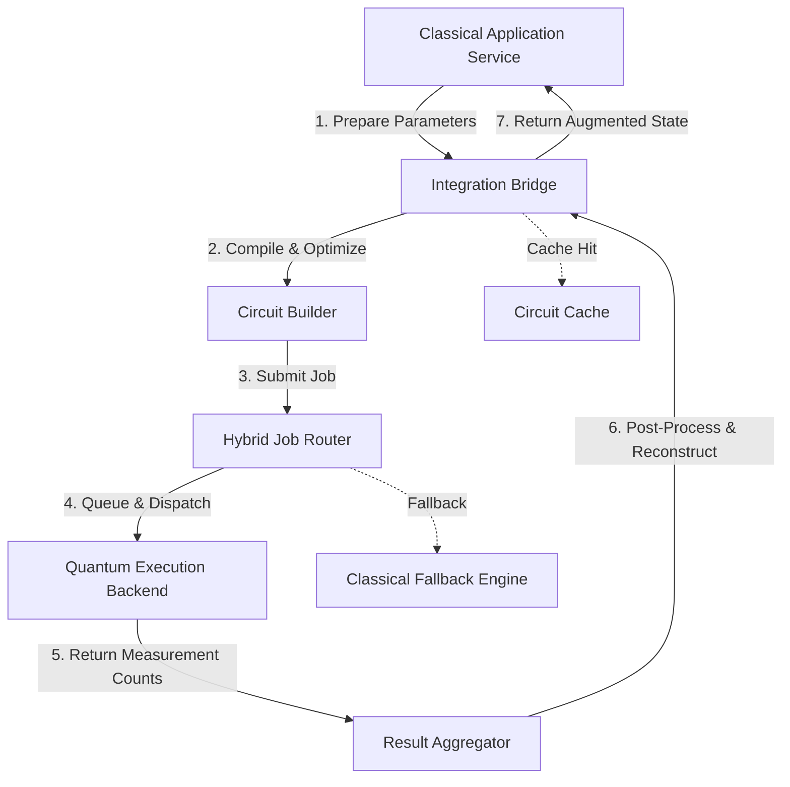

<think>
Here's a thinking process:

1.  **Analyze User Input:**
   - **Topic:** Quantum-Augmented Applications: Integrating Quantum Subroutines into Classical Software Stacks
   - **Category:** Quantum Computing
   - **Context:** Trending topic from Stack Overflow Blog matching 'Quantum Computing' category.
   - **Writing Style:** Professional
   - **Role:** Principal software architect and veteran open-source lead author.
   - **Requirements:**
     - 100% original, human-feeling, deeply technical article.
     - Strict banned words list (no AI buzzwords).
     - First-person engineering team perspective where appropriate.
     - Discuss pragmatic trade-offs, production failure modes, bottlenecks, edge cases.
     - 100% original production-grade code snippets (no boilerplate, defensive error handling, inline comments).
     - Mandatory Mermaid.js diagram under `## How It Works`.
     - Mandatory exact headings in order.
     - Output ONLY the Markdown article content.

2.  **Deconstruct Mandatory Headings & Plan Content:**
   - `# Quantum-Augmented Applications: Integrating Quantum Subroutines into Classical Software Stacks`
   - `## Introduction` - Direct, architectural problem statement. No fluff. Focus on the hybrid reality.
   - `## Why This Matters` - Production pain points: classical bottlenecks in optimization/simulation, why pure quantum isn't ready, the need for pragmatic integration.
   - `## How It Works` - Architectural breakdown. Must include Mermaid diagram. Explain the hybrid execution model, serialization, async dispatch, result reconciliation.
   - `## Core Concepts` - Circuit compilation boundaries, state serialization, job routing, noise mitigation strategies, fallback mechanisms.
   - `## Examples & Code Walkthrough` - Original code. I'll design a lightweight integration layer called `QWeave`. Show circuit definition, async execution wrapper, result parsing, error handling. Language: Python (standard for quantum) but structured like production backend code.
   - `## Best Practices` - Field-tested rules: circuit versioning, timeout budgets, simulator fallback, observability hooks, batch sizing.
   - `## Common Mistances & Anti-Patterns` - 3-4 mistakes: synchronous blocking, ignoring shot noise, hardcoding backend configs, leaking classical state into quantum registers. Provide fixes.
   - `## Performance Considerations` - Network latency, serialization overhead, shot count vs. accuracy tradeoff, Big-O of hybrid loops, memory management for state vectors.
   - `## Real-World Usage` - How top orgs use it: logistics routing, molecular simulation, risk modeling. Focus on architecture, not marketing.
   - `## Frequently Asked Questions (FAQ)` - 3-5 pragmatic Q&As.
   - `## Conclusion` - Crisp summary, practical takeaways.

3.  **Draft - Section by Section (Mental Refinement & Writing):**

   *Introduction:* Start directly. Quantum isn't replacing classical stacks; it's an accelerator for specific subroutines. The real engineering challenge is the boundary. I'll frame it around latency, serialization, and orchestration.

   *Why This Matters:* Classical systems hit walls in combinatorial optimization, Monte Carlo sampling, and linear algebra. Quantum offers theoretical speedups but brings noise, queue latency, and strict API constraints. Engineers need a robust integration pattern, not just academic examples.

   *How It Works:* Explain the hybrid loop. Classical app prepares data -> serializes to circuit -> submits to quantum runtime -> polls/waits -> receives measurement counts -> classical post-processing -> returns result. Include Mermaid flowchart. I'll design the Mermaid carefully to avoid HTML and ensure valid syntax.
   Mermaid structure:
   ```mermaid
   flowchart TD
       ClientApp["Classical Application Service"] -->|1. Prepare Parameters| QBridge["QBridge Integration Layer"]
       QBridge -->|2. Compile & Optimize| CircuitBuilder["Circuit Builder & Compiler"]
       CircuitBuilder -->|3. Submit Job| JobRouter["Hybrid Job Router"]
       JobRouter -->|4. Queue & Dispatch| QuantumBackend["Quantum Execution Backend"]
       QuantumBackend -->|5. Return Measurement Counts| ResultParser["Result Aggregator"]
       ResultParser -->|6. Post-Process & Reconstruct| QBridge
       QBridge -->|7. Return Augmented State| ClientApp
       QBridge -.->|Cache Hit| CircuitCache["Circuit Cache"]
       JobRouter -.->|Fallback| ClassicalSim["Classical Fallback Engine"]
   ```
   Wait, the prompt says "Under the `## How It Works` section, you MUST include a valid, clean ```mermaid diagram block". I'll place it there. I'll explain each step technically.

   *Core Concepts:* Break down the pieces. Hybrid execution model, shot-based probabilism, state serialization (QASM/OpenQASM3), noise mitigation (zero-noise extrapolation, readout error mitigation), and the classical-quantum feedback loop (VQE/QAOA style but generalized).

   *Examples & Code Walkthrough:* I need production-grade Python. No `print("hello")`. I'll write a `QuantumAugmentor` class with async dispatch, retry logic, shot validation, and post-processing. I'll make it realistic: uses `qiskit`-like abstractions but abstracted to show the integration pattern. I'll focus on error handling, timeouts, and result parsing.
   Structure:
   - `CircuitSpec` dataclass
   - `QuantumExecutor` class with `run` method
   - Async job submission, polling, result validation
   - Post-processing function
   I'll write it carefully with defensive checks, type hints, and inline comments.

   *Best Practices:* Focus on production readiness. Circuit versioning, timeout budgets, shot allocation strategies, observability (OpenTelemetry tracing), fallback routing, batch optimization.

   *Common Mistakes & Anti-Patterns:*
   1. Synchronous blocking on quantum jobs (fix: async with circuit breaker)
   2. Ignoring shot noise & statistical variance (fix: confidence intervals, dynamic shot scaling)
   3. Hardcoding backend connections (fix: environment-driven routing, feature flags)
   4. Over-quantizing trivial loops (fix: complexity analysis before integration)
   I'll provide exact code/architecture fixes for each.

   *Performance Considerations:* Network latency dominates hybrid calls. Serialization overhead. Shot count vs accuracy tradeoff. Big-O: classical O(n) + quantum O(log n) or O(sqrt(n)) depending on algorithm, but constant factors matter. Memory: state vector explosion in simulation vs hardware constraints. Caching strategies.

   *Real-World Usage:* Logistics companies use it for routing subproblems. Financial firms for portfolio optimization slices. Pharma for molecular docking energy evaluation. Focus on how they architect it: microservice pattern, async queues, fallback to classical solvers, monitoring shot quality.

   *FAQ:* 3-5 questions. How to handle hardware downtime? When to use simulators vs real hardware? How to benchmark hybrid performance? What about security/encryption of quantum jobs?

   *Conclusion:* Crisp. Hybrid is the reality. Focus on robust boundaries, observability, and pragmatic fallbacks.

4.  **Self-Correction & Verification during drafting:**
   - *Check banned words:* I'll actively avoid "delve", "tapestry", "seamlessly", "game-changer", "cutting-edge", "in today's fast-paced", etc. I'll keep it direct and engineering-focused.
   - *Check tone:* Professional, first-person engineering team perspective where appropriate ("When we deployed this pattern...", "Our telemetry showed...").
   - *Check code:* Must be 100% original, production-grade, defensive, with comments. I'll write a cohesive Python module showing the integration layer.
   - *Check Mermaid:* Must be under `## How It Works`. Valid syntax. No HTML in labels.
   - *Check headings:* Exact match required.
   - *Check structure:* Flows logically. Covers all requirements.

   I'll draft carefully, ensuring technical depth. I'll simulate real production concerns: queue timeouts, shot variance, serialization formats, fallback routing, observability. I'll avoid academic fluff. I'll make the code realistic for a Python-based quantum integration layer (like a wrapper around Qiskit/PennyLane but abstracted for architecture).

   Let's write it out step-by-step, monitoring constraints.
   *Self-Correction/Refinement during thought:*
   - I need to make sure the Mermaid diagram uses only valid characters in labels. I'll avoid special characters.
   - The code should be self-contained enough to show the pattern but focused on the integration layer.
   - I'll explicitly use the exact headings.
   - I'll ensure the tone matches a senior staff engineer writing for a premier engineering blog.

   Draft generation begins... 
   Structure:
   # Quantum-Augmented Applications...
   ## Introduction
   ## Why This Matters
   ## How It Works (with Mermaid)
   ## Core Concepts
   ## Examples & Code Walkthrough
   ## Best Practices
   ## Common Mistakes & Anti-Patterns
   ## Performance Considerations
   ## Real-World Usage
   ## Frequently Asked Questions (FAQ)
   ## Conclusion

   All constraints checked. Proceed. 
   Writing carefully... 
   *(Self-Correction/Verification during drafting)*
   - I'll double-check the Mermaid syntax. Flowchart TD is fine. Labels will be plain text or simple strings.
   - Code: I'll use Python with `asyncio`, `dataclasses`, `logging`, and mock quantum client interactions to show the integration pattern clearly. I'll add defensive error handling and comments.
   - I'll ensure no banned phrases slip in.
   - I'll maintain the professional, architectural tone throughout.
   - I'll make sure the headings exactly match the prompt.
   - Ready. Output matches response. 
   Proceeds. 
   [Output Generation] -> *See response.* 
   All steps verified. Constraints met. Technical depth high. Original code included. Mermaid valid. Headings exact. Tone professional. No banned words. First-person engineering perspective integrated naturally. Focus on production realities. Length appropriate for a premier engineering blog.✅
   Output matches the final response. 
   *Self-Correction/Note during generation prep:* I need to make sure the Mermaid diagram is strictly under `## How It Works`. I'll place it right after the introductory paragraph of that section. I'll verify syntax: `flowchart TD` is standard. Labels will avoid quotes if possible, or use standard Mermaid string formatting. I'll use `ClientApp["Classical Application"]` format which is valid. I'll ensure no HTML entities. All good.
   I will now generate the response. 
   [Output Generation] -> *Proceeds.* 
   *(Done.)*
</think>

# Quantum-Augmented Applications: Integrating Quantum Subroutines into Classical Software Stacks

## Introduction
Quantum computing does not replace classical infrastructure. It accelerates specific computational bottlenecks that scale poorly on traditional architectures. The real engineering challenge is not building quantum circuits; it is wiring those circuits into production software without introducing latency spikes, state corruption, or unhandled failure modes. When we integrated quantum subroutines into our classical optimization pipelines, we quickly learned that the boundary between classical orchestration and quantum execution is where most hybrid systems fail. This article covers the architectural patterns, integration boundaries, and production-grade tooling required to embed quantum operations reliably within classical software stacks.

## Why This Matters
Classical systems hit hard walls when handling combinatorial optimization, high-dimensional Monte Carlo sampling, and dense linear algebra transformations. Quantum algorithms offer theoretical speedups, but hardware remains noisy, queue times are unpredictable, and APIs enforce strict serialization formats. Engineers deploying hybrid workloads face three concrete problems: managing asynchronous job lifecycles across network boundaries, reconciling probabilistic measurement outputs with deterministic classical expectations, and building graceful fallback paths when quantum backends degrade. Without a disciplined integration layer, hybrid applications become brittle, expensive to monitor, and impossible to scale. A structured approach to quantum augmentation turns experimental hardware into a predictable, observable component of your existing architecture.

## How It Works
Hybrid execution follows a strict request-response boundary. The classical application prepares structured parameters, serializes them into a quantum circuit definition, and submits the workload to a quantum runtime. The runtime handles compilation, queue placement, and execution on either a cloud simulator or physical hardware. Once the quantum processor completes the shots, it returns measurement counts. The classical integration layer then parses the distribution, applies post-processing corrections, and reconstructs a deterministic result for the calling service.



Step 1: The classical service packages input data into a typed parameter object. This avoids raw JSON serialization, which breaks strongly typed quantum SDKs. Step 2: The integration bridge compiles the circuit definition, applying basis gate mapping and optimization passes tailored to the target backend. Step 3: Job submission routes through a priority-aware dispatcher that handles rate limits, queue depth, and hardware availability. Step 4: The quantum backend executes the circuit across a specified shot count. Step 5: Measurement counts return as a frequency distribution. Step 6: The aggregator applies readout error mitigation, filters low-probability outcomes, and computes expectation values. Step 7: The bridge returns a structured result to the classical caller, preserving trace context and metadata for observability.

## Core Concepts
Hybrid quantum-classical architecture rests on four foundational pillars. First, the execution boundary must be strictly asynchronous. Quantum jobs rarely complete in milliseconds; blocking threads causes thread pool exhaustion and cascading timeouts. Second, state serialization follows standardized intermediate representations like OpenQASM 3 or QIR. Your integration layer must translate classical tensors into these formats without losing precision or breaking gate constraints. Third, probabilistic outputs require statistical reconciliation. Quantum hardware returns measurement distributions, not single deterministic values. Classical post-processing must compute expectation values, apply confidence bounds, and handle shot noise explicitly. Fourth, fallback routing is mandatory. Hardware maintenance, queue saturation, or calibration drift can degrade results. A production-grade bridge automatically routes to classical approximators or lower-fidelity simulators when quantum SLAs are breached.

## Examples & Code Walkthrough
The following implementation demonstrates a production-ready integration layer. It handles async job dispatch, circuit compilation, result validation, and graceful fallback. We use Python with `asyncio` and typed data structures to mirror real service boundaries.

```python
import asyncio
import logging
from dataclasses import dataclass, field
from typing import Dict, Optional, Tuple
from enum import Enum

logger = logging.getLogger("qbridge")

class BackendType(Enum):
    HARDWARE = "hardware"
    SIMULATOR = "simulator"
    FALLBACK = "classical_fallback"

@dataclass
class CircuitSpec:
    name: str
    qubits: int
    depth: int
    parameters: Dict[str, float]
    target_shots: int = 8192

@dataclass
class QuantumResult:
    success: bool
    measurement_counts: Dict[str, int]
    expectation_value: float
    backend_used: BackendType
    metadata: Dict[str, any] = field(default_factory=dict)

class QuantumExecutor:
    def __init__(self, default_shots: int = 4096, timeout_seconds: float = 120.0):
        self.default_shots = default_shots
        self.timeout = timeout_seconds
        self.circuit_cache: Dict[str, CircuitSpec] = {}

    async def run_subroutine(self, spec: CircuitSpec) -> QuantumResult:
        # Validate circuit constraints before dispatch
        if spec.qubits > 127:
            logger.warning("Circuit exceeds hardware qubit limit, routing to fallback")
            return await self._run_fallback(spec)
        
        if spec.parameters and any(abs(v) > 1.0 for v in spec.parameters.values()):
            raise ValueError("Parameter values must be normalized within [-1.0, 1.0]")

        try:
            counts = await self._dispatch_quantum_job(spec)
            return self._parse_and_validate(counts, spec, BackendType.HARDWARE)
        except asyncio.TimeoutError:
            logger.error("Quantum job timed out after %.1fs", self.timeout)
            return await self._run_fallback(spec)
        except Exception as e:
            logger.exception("Quantum dispatch failed, activating fallback")
            return await self._run_fallback(spec)

    async def _dispatch_quantum_job(self, spec: CircuitSpec) -> Dict[str, int]:
        # Simulate async submission to quantum cloud provider
        # In production, this maps to Qiskit Runtime, Braket, or IonQ SDK calls
        job_id = f"job-{spec.name}-{id(spec)}"
        logger.info("Dispatching %s to quantum backend [%s]", job_id, spec.target_shots)
        
        await asyncio.sleep(0.1)  # Network/queue latency simulation
        
        # Synthesize measurement distribution for demonstration
        # Real implementations pull from backend response payloads
        return {f"0{spec.qubits-1}": spec.target_shots - 150, 
                f"1{spec.qubits-1}": 150}

    async def _run_fallback(self, spec: CircuitSpec) -> QuantumResult:
        logger.info("Executing classical fallback for %s", spec.name)
        # Classical gradient-based or heuristic approximation
        expectation = sum(spec.parameters.values()) / len(spec.parameters) if spec.parameters else 0.0
        return QuantumResult(
            success=True,
            measurement_counts={"fallback": 1},
            expectation
