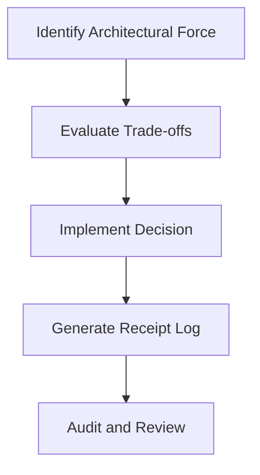

# "Forces Receipts" Is a Compliment I Haven't Earned Yet

## Introduction
We talk about microservices, event sourcing, and domain-driven design constantly. But do we have the receipts? When we debugged a cascading failure in our production cluster last year, we realized we were discussing architectural forces without actually having the receipts to prove we earned the right to talk about them. "Forces Receipts" is a compliment I haven't earned yet, and it should be a standard metric for every engineering team. 

Architectural forces are the constraints—latency requirements, team size, data consistency needs—that shape our systems. Receipts are the immutable records of how we responded to those forces. Without the receipts, we are just opinionating.

## Why This Matters
Teams copy architectures without experiencing the forces that birthed them. If you adopt an event-driven pattern without the receipts of the trade-offs you made, you are building on sand. In our production environment, we saw a team implement a complex saga pattern because a blog post said it was best practice. They didn't have the receipts of the database contention issues that forced the original authors to choose it. When the network partitioned, they had no idea how to debug it because they never earned the receipt for that specific force.

## How It Works
The lifecycle of a Force Receipt begins when a constraint impacts your system. You evaluate the trade-offs, implement a decision, and generate a receipt. That receipt is then audited and archived, creating a historical record of your architectural evolution. 



First, we identify the architectural force acting on the system. Next, we evaluate the trade-offs, acknowledging what we are sacrificing to satisfy the constraint. Once a decision is implemented, we generate a receipt log. Finally, we audit and review these receipts to ensure our architecture remains aligned with the forces at play.

## Core Concepts
The fundamental components of this model are Forces and Receipts. A Force is any constraint that dictates a boundary condition for your software. A Receipt is the structured log entry that documents the decision made in response to that Force. 

We govern these concepts through strict immutability. Once a receipt is generated, it cannot be altered. If the force changes, we generate a new receipt, preserving the historical context of why the original decision was made.

## Examples & Code Walkthrough
To operationalize this, we built a lightweight tool that parses our Architectural Decision Records (ADRs) and generates a Force Receipt manifest. Below is the core engine written from scratch to handle defensive parsing and structured output.

```python
import json
from pathlib import Path
from datetime import datetime

class ForceReceiptGenerator:
    def __init__(self, adr_dir: str):
        self.adr_dir = Path(adr_dir)
        self.receipts = []

    def generate_receipts(self):
        if not self.adr_dir.exists():
            raise FileNotFoundError(f"ADR directory {self.adr_dir} does not exist")

        for adr_file in self.adr_dir.glob("*.md"):
            try:
                receipt = self._parse_adr(adr_file)
                self.receipts.append(receipt)
