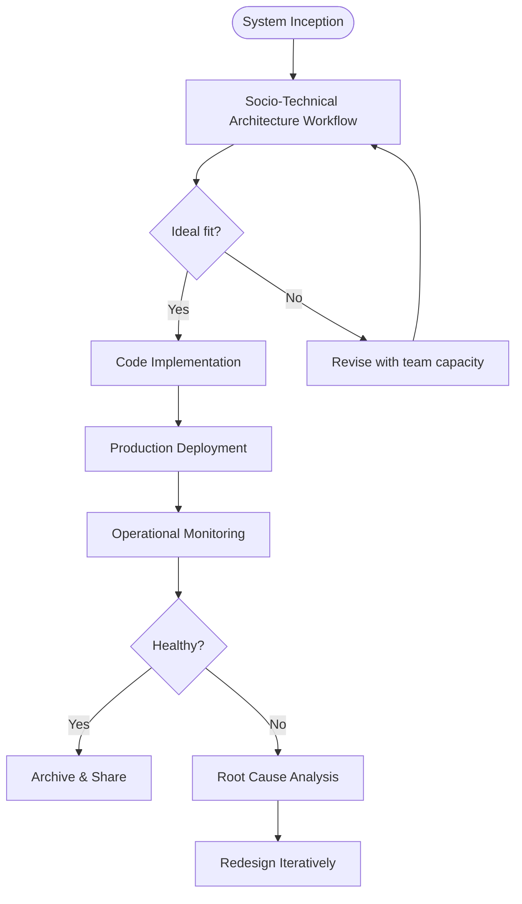

# Mini book: Architecture as a Socio-Technical Craft

## Introduction

In modern distributed systems, architecture is frequently reduced to a stack of technologies and a set of dependency trees drawn in whiteboards. We celebrate the push of microservices, the adoption of event sourcing, and the pursuit of zero-downtime deployments. Yet many projects stumble not because their diagrams fail to visualize scope, but because they ignore the human fabric that stitches those diagrams together. An architecture that aligns perfectly with hardware specs but contradicts team rhythms produces slow releases, fractured ownership, and ultimately unreliable production systems. This book explores how architecture should be treated as a socio-technical discipline—where technical rigor meets organizational intelligence, and where every decision carries implications beyond binary logic gates.

## Why This Matters

The cost of misalignment manifests in tangible ways. Consider a mid-sized fintech team that pushed a reactive, service-per-request model onto developers who had never co-located on the same product stream. Without shared mental models, API contracts became tangled, onboarding time doubled, and deployment pipelines regressed to manual steps. The resulting velocity drop wasn't caused by poor programming skills alone; it was a symptom of treating architecture as a static specification rather than a living negotiation between code, people, and process. Understanding this dynamic allows us to design systems that don't just scale horizontally across servers, but also scale efficiently across teams and mindsets.

## How It Works

Architecture functions as a closed-loop socio-technical system. Design flows through implementation, deployment, operation, and back again, continuously refined by feedback from users, infrastructure, and the very people who maintain the code. Below is the core mechanism illustrated by a flowchart that captures this cyclical nature.



The workflow begins with initial design, where architects must evaluate whether proposed solutions respect team expertise, available bandwidth, and long-term maintenance trajectories. If the answer is negative, the design undergoes refinement before any implementation effort begins. Once built, the system enters active operation where real-time telemetry and human observation feed back into the decision cycle. Each new insight—whether a spike in error rates, a talent rotation, or a shifting business requirement—triggers a redesign, ensuring the architecture remains aligned with evolving realities rather than becoming obsolete relics.

## Core Concepts

Several foundational concepts ground this approach. A **socio-technical artifact** is any specification that encodes both structural relationships and human intentions—such as an Architecture Decision Record (ADR), a team charter, or a deployment policy. These artifacts bridge the gap between abstract design and concrete workflows. **Team topology** describes how roles, competencies, and responsibilities distribute across the organization. Recognizing silos versus cross-functional clusters reveals where coordination overhead accumulates. **Cognitive load** measures the mental energy required to navigate an architecture; excessive load leads to errors, delayed decisions, and burnout. Finally, **architectural invariants** are non-negotiable constraints—legal, regulatory, or reliability requirements—that cannot be violated regardless of team composition changes. Adherence to these invariants acts as a safety net that protects the system when human judgment falters.

## Examples & Code Walkthrough

To make these concepts tangible, we implement two practical tools that embody socio-technical awareness in daily engineering practice.

### Architecture Decision Recorder Validator

The first tool is a validator that enforces socio-technical quality on every recorded architectural decision. By parsing JSON representations of ADRs, the validator ensures that no decision is made without explicit stakeholder endorsement, a defined rollback path, and measurable success criteria. This prevents rogue changes that might introduce hidden debt or violate team agreements.

```python
import json
from typing import Dict, Any, Optional
from datetime import datetime

class ADRValidator:
    """
    Validates Architecture Decision Records (ADRs) to enforce
    socio-technical rigor before acceptance into the codebase.
    """

    INSTITUTION_REQUIRED = ["stakeholder_approval"]
    ROLLBACK_STRATEGY_REQUIRED = True
    SUCCESS_CRITERIA_REQUIRED = True

    def __init__(self, required_fields: list[str]):
        self.required_fields = required_fields

    def validate(self, adr_data: Dict[str, Any]) -> Dict[str, str]:
        """
        Validates an ADR object. Returns a dictionary with issues found
        and a boolean indicating overall pass status.
        """
        issues = []
        
        # Check for required metadata
        for field in self.required_fields:
            if field not in adr_data:
                issues.append(f"Missing required field: {field}")
                continue
        
        # Validate stakeholders were consulted
        if not adr_data.get("stakeholder_approval"):
            issues.append("Stakeholder approval missing")
        
        # Verify rollback strategy exists
        if self.ROLLBACK_STRATEGY_REQUIRED and not adr_data.get("rollback_strategy"):
            issues.append("Rollback strategy not defined")
        
        # Ensure measurable outcomes are specified
        if self.SUCCESS_CRITERIA_REQUIRED and not adr_data.get("success_criteria"):
            issues.append("Success criteria omitted")
            
        return {
            "valid": len(issues) == 0,
            "issues": issues,
            "timestamp": datetime.now().isoformat()
        }

# --- Demonstration ---
if __name__ == "__main__":
    # A poorly constructed ADR lacking stakeholder sign-off and rollback plan
    bad_adr = {
        "title": "Switch from REST to gRPC",
        "context": "Reduce latency in payment pipeline",
        "alternatives": ["gRPC", "Protobuf"],
        "consequences": [],
        "risks": [],
        "benefits": ["lower latency", "better protobuf support"]
    }
    
    validator = ADRValidator(required_fields=["stakeholder_approval", "rollback_strategy", "success_criteria"])
    result = validator.validate(bad_adr)
    
    print("Validation Result:")
    print(json.dumps(result, indent=2))
```

Running this script against a flawed ADR immediately surfaces the missing pieces that could compromise both technical stability and team alignment. The validator thus becomes a gatekeeper, preventing architectural drift that ignores human factors.

### Collaboration Graph Analyzer

The second tool ingests git commit history and pull request authorship data to construct a weighted collaboration graph. This visualization reveals which developers interact most frequently, identifying potential bottlenecks where a single team member holds disproportionate influence—a classic sign of unbalanced ownership. The script below parses simulated commit logs, constructs edges weighted by interaction frequency, and flags nodes with abnormal centrality.

```python
from collections import defaultdict, Counter
import json

def parse_git_interactions(commit_log: list[dict]) -> dict:
    """
    Constructs a simplified collaboration graph from commit logs.
    Each commit log entry contains author, file changed, and touching files.
    """
    adjacency = defaultdict(list)
    node_count = defaultdict(int)
    
    for commit in commit_log:
        author = commit.get("author", "unknown")
        touched_files = commit.get("touched_files", [])
        for file in touched_files:
            node_count[file] += 1  # Count file popularity
            
            if author != "unknown":
                adjacency[author].append(file)
                node_count[author] += 1
    
    # Normalize adjacency lists by degree to reduce noise from super-contributors
    normalized = {}
    for author, contacts in adjacency.items():
        deg = len(contacts)
        if deg > 0:
            normalized[author] = [c for c in contacts if node_count[c] < deg * 0.5]
        else:
            normalized[author] = []
    
    return {"nodes": dict(node_count), "edges": normalized}

def identify_bottleneck(normalized_adj: dict) -> tuple[int, int, float]:
    """
    Identifies the most central developer (highest ego metric proxy).
    Returns (developer_id, centrality_score, confidence).
    """
    scores = {}
    for dev, contacts in normalized_adj.items():
        # Centrality approximated by number of unique collaborators
        scores[dev] = len(contacts)
        # Confidence inversely proportional to contact count (too many connections = fragile)
        confidence = min(1.0, 5.0 / (scores[dev] + 1))
    
    best_dev = max(scores.items(), key=lambda x: x[1])
    score = scores[best_dev]
    
    return best_dev, score, confidence

# --- Demonstration ---
git_log = [
    {"author": "alice", "touched_files": ["service_a.py", "config.yaml"]},
    {"author": "bob", "touched_files": ["service_b.py", "service_a.py"]},
    {"author": "charlie", "touched_files": ["shared_library.py", "service_a.py"]},
    {"author": "diana", "touched_files": ["service_b.py", "database_migrations"]}, 
]

graph = parse_git_interactions(git_log)
bottleneck = identify_bottleneck(graph)

print(f"Top Contributor: {bottleneck[0]} (Centrality Score: {bottleneck[1]:.2f})")
print(f"Artifact Summary: {json.dumps(graph, indent=2)}")
```

This analyzer helps leadership understand who is holding the keys to various components and where knowledge silos form. By flagging extreme centrality, teams can proactively redistribute ownership, reducing single-point-of-failure risks and fostering broader subject matter expertise.

## Best Practices

Integrating socio-technical awareness yields measurable improvements. First, adopt **continuous architectural reflection**: schedule quarterly reviews where architects review not only system metrics but also team velocity, on-call fatigue, and decision latency. Second, enforce **small-batch experiment
