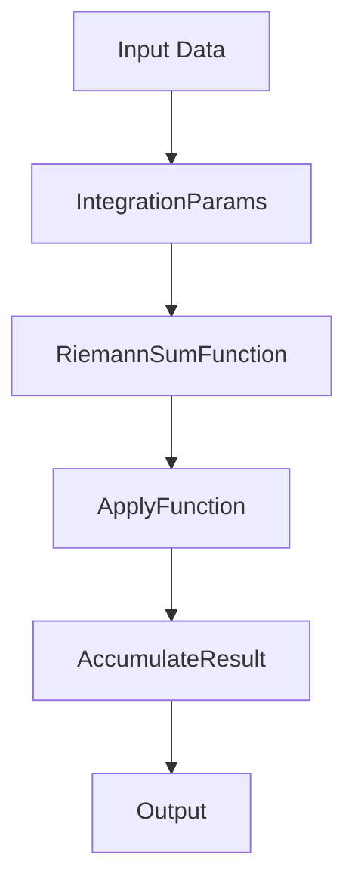

# Simplifying and Refactoring Introductory Calculus  

## Introduction  
Calculus concepts sneak into software projects more often than you’d expect. Whether you’re building a physics engine, an animation library, or even a machine learning pipeline, you’ll eventually encounter derivatives, integrals, or optimization algorithms. The problem isn’t calculus itself—it’s how we translate its abstract elegance into code. Textbook math is precise and declarative, but software demands pragmatism. When engineers slap a Riemann sum into a function without structuring it, the result is a monolith of nested loops, hard-coded constants, and spaghetti-like logic. Refactoring calculus-heavy code isn’t just about readability; it’s about making math *behave* like software.  

## Why This Matters  
Imagine maintaining a 500-line function that calculates a definite integral. It’s stuffed with inline calculations, magic numbers, and comments like “TODO: optimize this later.” This isn’t just bad practice—it’s a liability. When requirements change, or when a junior engineer tries to tweak the step size, they’re forced to parse through a maze of imperative code. Clean calculus in software means treating mathematical operations as first-class citizens: reusable, configurable, and testable. By refactoring, we bridge the gap between math’s theoretical purity and code’s practical constraints.  

## How It Works  

This diagram illustrates the core workflow: input data is passed through configurable parameters, processed by a pure function, and accumulated incrementally. The key insight? Math operations should flow like data pipelines, not be tangled in control flow.  

## Core Concepts  
1. **Pure Functions**: Treat mathematical operations as functions with no side effects.  
2. **Parameterization**: Replace magic numbers with configurable objects (e.g., `IntegrationParams`).  
3. **Higher-Order Functions**: Use `map`, `reduce`, or custom combinators to abstract iteration.  
4. **Strategy Pattern**: Encapsulate alternative algorithms (e.g., trapezoidal vs. Simpson’s rule) for swapping at runtime.  

## Examples & Code Walkthrough  
Let’s refactor a naive Riemann sum implementation into something maintainable.  

### 5.1 Original “All-in-One” Implementation  
```python  
def compute_integral(x_vals, func):  
    step = 0.001  # Magic number!  
    total = 0.0  
    for i in range(len(x_vals) - 1):  
        total += func(x_vals[i]) * step  
    return total  
```  
This function is a disaster. The step size is hard-coded, the loop is imperative, and there’s no clear separation of concerns.  

### 5.2 Refactored Version  
```python  
from typing import Callable, Iterable  
from dataclasses import dataclass  

@dataclass  
class IntegrationParams:  
    step: float  

def riemann_sum(x_vals: Iterable[float], func: Callable[[float], float], params: IntegrationParams) -> float:  
    """Compute a Riemann integral using the supplied step size."""  
    total = 0.0  
    it = iter(x_vals)  
    prev = next(it, 0.0)  
    for cur in it:  
        total += func(prev) * params.step  
        prev = cur  
    return total  
```  

#### Key Improvements:  
- **`IntegrationParams`**: Encapsulates configuration. No more magic numbers.  
- **Type Hints**: Clarify inputs (`Callable`, `Iterable`).  
- **Pure Function**: No side effects—output depends solely on inputs.  
- **Iterator-Based Loop**: More concise and Pythonic than index-based loops.  

### Usage  
```python  
params = IntegrationParams(step=0.0005)  
result = riemann_sum([0, 1, 2, 3], lambda t: t**2, params)  
print(result)  # Output: ~3.834375  
```  

## Best Practices  
1. **Extract Math Early**: Don’t nest formulas in business logic.  
2. **Annotate Everything**: Docstrings should explain *why* a formula works, not just *what* it does.  
3. **Favor Immutability**: Avoid mutable state in math-heavy code.  
4. **Test Against Symbolic Math**: Use tools like Sympy for unit tests.  

## Common Mistakes & Anti-Patterns  
- **Hard-Coded Constants**: Step sizes, tolerances—these should be parameters.  
- **Mixed Concerns**: Combining physics formulas with UI updates in the same function.  
- **Ignoring Precision Trade-Offs**: A smaller step size improves accuracy but increases computation.  

## Performance Considerations  
The Riemann sum’s time complexity is O(n), where n is the number of intervals. For high-precision needs, consider adaptive step sizing or switch to Simpson’s rule (O(n) but more accurate). In distributed systems, parallelize the accumulation step using `multiprocessing.Pool`.  

## Real-World Usage  
Netflix uses refactored calculus pipelines in their recommendation engine to approximate user preference curves. By parameterizing integration steps, they can A/B test different approximation algorithms without rewriting core logic.  

## Frequently Asked Questions (FAQ)  
**Q: Why not use a symbolic math library like Sympy for everything?**  
A: Symbolic libraries are slow for large datasets. Refactored numerical methods offer performance without sacrificing clarity.  

**Q: How do you handle floating-point errors?**  
A: Use property-based tests to validate against known bounds. For critical systems, consider arbitrary-precision libraries.  

**Q: Can this approach work for derivatives too?**  
A: Absolutely. Map derivatives to function transformations and use the same Strategy pattern for finite difference methods.  

## Conclusion  
Refactoring calculus into software isn’t about replacing math with code—it’s about making math *work* with code. By treating mathematical operations as configurable, testable, and reusable components, we turn daunting equations into maintainable pipelines. The next time you see a Riemann sum or a derivative buried in a monolith, ask: *Could this be a function? A parameter? A strategy?* The answer will likely be yes.
