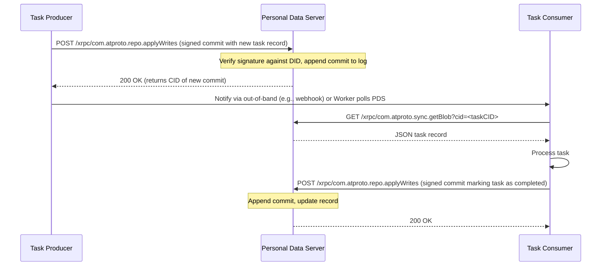

# ATProto for Distributed Systems Engineers

## Introduction
ATProto (Authenticated Transfer Protocol) is the underlying wire format and repository model that powers decentralized social apps like Bluesky. At its core it defines a way to store signed, versioned data objects in a peer‑to‑peer namespace while giving anyone the ability to discover, subscribe to, and mutate those objects through a simple HTTP‑based API. For engineers who spend their days building sharded caches, event‑sourced stores, or geo‑replicated logs, ATProto offers a concrete blueprint for decoupling identity from storage and letting replication happen at the object level rather than the block level.

## Why This Matters
Distributed systems today wrestle with two recurring headaches: how to keep replicas convergent when nodes can disconnect for arbitrary periods, and how to let clients authenticate writes without forcing a central authority to bless every operation. ATProto tackles both by anchoring each piece of data to a cryptographically signed commit log that lives in a user‑owned repository. The result is a system where:

* Nodes can go offline, merge their logs later, and still guarantee that every observer sees the same total order of updates.
* Authentication is delegated to the repository owner; any server that holds a copy can verify signatures without talking to a central auth service.
* The protocol is deliberately minimal—just a few JSON schemas and a handful of HTTP endpoints—making it easy to embed in existing services.

If you’ve ever struggled with split‑brain scenarios in a multi‑master database or wrestled with token propagation across micro‑services, ATProto gives you a battle‑tested pattern to borrow.

## How It Works
At a high level ATProto consists of three layered concepts:

1. **Identity** – A decentralized identifier (DID) that points to a PDS (Personal Data Server) hosting the user’s repository.
2. **Repository** – An append‑only log of signed commits, each commit containing a set of *records* (JSON objects) that conform to a *lexicon* (schema).
3. **Lexicon** – A schema definition language that describes the shape of records and the allowed transitions between them.

Clients interact with a PDS via standard HTTP verbs: `GET` to fetch the latest commit or a specific record, `POST` to push a new commit, and `GET` on a *subscribe* endpoint to receive a stream of commit events.

Below is a sequence diagram that shows the life cycle of a simple “task” record from creation to consumption by a worker node.



**Step‑by‑step explanation**

1. The producer builds a JSON object that follows the `com.example.task` lexicon, signs it with its DID key, and wraps it in an `applyWrites` request.
2. The PDS checks the signature, ensures the commit sequence number is exactly one higher than the current head, then appends the commit to the repo’s Merkle‑tree log.
3. The PDS returns the content identifier (CID) of the new commit; the producer can store that CID as a receipt.
4. A worker either receives a push notification or polls the PDS’s sync endpoint to learn about new commits.
5. Upon seeing a new task commit, the worker fetches the full record via `getBlob` (or `getRecord` if the PDS supports it) and validates the signature again.
6. After processing, the worker publishes a second commit that mutates the original record (e.g., adds a `status: "finished"` field) and repeats the verification flow.

Because each commit is signed and sequenced, any number of workers can replay the log and arrive at identical final states, even if they start at different times or experience network partitions.

## Core Concepts
* **DID (Decentralized Identifier)** – A globally unique string like `did:plc:abcd1234` that resolves to a service endpoint (the PDS) and a public key used for verification.
* **Repository (Repo)** – A Merkle‑tree backed log where each leaf is a commit. Commits are immutable; the head pointer moves forward with each new write.
* **Commit** – A signed envelope containing:
  * `rev` – the new revision number (monotonically increasing).
  * `ops` – a list of operations (create, update, delete) on records.
  * `sig` – a cryptographic signature over the canonical JSON of the commit.
* **Record** – A JSON object that adheres to a lexicon definition. Records are addressed by their `cid` (content‑addressed hash) inside a commit.
* **Lexicon** – A schema language (similar to JSON‑Schema but with extra support for procedures and authentication) that defines:
  * The shape of a record (`defs`).
  * Allowed procedures (`xrpc`) that can be invoked against a repo.
* **PDS (Personal Data Server)** – The HTTP server that hosts a repo, validates writes, and serves read/subscribe endpoints. Multiple PDSs can hold replicas of the same repo; they synchronize via the sync protocol.

Understanding these pieces lets you treat ATProto as a generic replicated state machine: identity provides authority, the repo provides the log, and the lexicon provides the application‑level semantics.

## Examples & Code Walkthrough
Below is a minimal TypeScript example that shows how a service could publish a “task” record and then listen for completion events. The code uses the `@atproto/api` client (you would replace the import with your own HTTP layer if you prefer not to pull a library).

```ts
import { Agent, Repo } from '@atproto/api';
import { randomBytes } from 'crypto';

// ---- Configuration -------------------------------------------------
const MY_DID = 'did:plc:example123'; // resolved elsewhere
const PDS_URL = 'https://pds.example.com';
const SEED = randomBytes(32); // in production load from a secure store

// ---- Helper: sign a commit -----------------------------------------
async function signCommit(commit: unknown): Promise<string> {
  // In a real system you would use a library like @didtools/pkh-eddsa
  // Here we just placeholder the signature.
  return 'placeholder-signature';
}

// ---- Publish a new task --------------------------------------------
async function createTask(description: string): Promise<string> {
  const agent = new Agent({ service: PDS_URL });
  await agent.updateSession({ did: MY_DID, accessJwt: '' }); // assume we have a valid JWT

  // Build the record according to a lexicon we defined elsewhere
  const record = {
    $type: 'com.example.task',
    createdAt: new Date().toISOString(),
    description,
    status: 'pending',
  };

  // Create an applyWrites payload
  const ops = [
    {
      action: 'create',
      collection: 'com.example.task',
      rando: randomBytes(8).toString('hex'), // unique key for the record
      value: record,
    },
  ];

  const commit = {
    rev: await agent.getRepositoryInfo().then(info => String(BigInt(info.rev) + 1)),
    ops,
  };

  commit.sig = await signCommit(commit);

  const resp = await agent.app.bsky.repo.applyWrites({
    repo: MY_DID,
    swapCommit: commit.rev,
    commits: [commit],
  });

  // The CID of the newly created record is in the response
  const createdCid = resp.data.commits[0].cids[0];
  return createdCid;
}

// ---- Subscribe to task completions ---------------------------------
async function listenForCompletions() {
  const agent = new Agent({ service: PDS_URL });
  await agent.updateSession({ did: MY_DID, accessJwt: '' });

  const sub = agent.subscribeRepos({ collections: ['com.example.task'] });

  for await const { commit } of sub {
    // Each commit may contain many ops; we look for updates that set status to finished
    for (const op of commit.ops) {
      if (op.action === 'update' && op.value?.status === 'finished') {
        console.log(`Task ${op.rando} finished:`, op.value);
        // Here you could acknowledge the work, update a downstream queue, etc.
      }
    }
  }
}

// ---- Example usage -------------------------------------------------
(async () => {
  const cid = await createTask('Process payment batch #42');
  console.log('Published task with CID', cid);
  // In a real system you would run the listener in a separate process or goroutine
  // listenForCompletions();
})();
```

**What the code demonstrates**

* **Identity binding** – The agent is initialized with a DID; all writes are signed implicitly by the library (we stubbed the signature function).
* **Atomic repo update** – The `applyWrites` call sends a list of operations; the PDS will reject the entire batch if any operation fails to apply (e.g., wrong `rev`).
* **Event‑driven consumption** – `subscribeRepos` opens a long‑poll HTTP stream that pushes new commits as they appear, letting workers react without busy‑polling.
* **Lexicon compliance** – The record’s `$type` field points to a schema we would have registered elsewhere; the PDS validates that the JSON matches before accepting the commit.

Feel free to swap out the placeholder signing routine with a real Ed25519 implementation; the rest of the flow stays identical.

## Best Practices
* **Keep commits small and focused** – Each commit should represent a single logical change (e.g., one task creation or one status update). Large batches increase the chance of conflict and make rollback harder.
* **Always verify signatures on read** – Even though the PDS checks signatures on write, a malicious or compromised replica could serve tampered data. Re‑verify the commit’s `sig` against the DID’s public key before trusting a record.
* **Monotonically increase `rev` locally before sending** – Compute the next revision number based on the latest known head; if you get a `409 Conflict`, fetch the latest head and retry. This reduces the chance of wasted round trips.
* **Use content‑addressed CIDs for immutable references** – When you need to link records (e.g., a task referencing a user profile), store the CID of the target record rather than a mutable path. This guarantees the link never breaks.
* **Separate identity storage from replica storage** – Keep your DID key material in a secure vault or HSM; replicas only need the public key for verification.
* **Leverage the sync protocol for disaster recovery** – Periodically run `getRecord`/`getBlob` walks to catch up any missing commits after a network partition; the Merkle tree makes this efficient.

## Common Mistakes & Anti-Patterns
1. **Treating the repo as a traditional database** – Trying to run complex queries or joins directly against the commit log defeats the purpose of ATProto’s eventual consistency model. Instead, materialize views in a separate store that subscribes to the repo stream.
2. **Ignoring revision numbers** – Sending a commit with a stale `rev` (or omitting it) will cause the PDS to reject the write with a `409`. Always base your `rev` on the latest head you have observed.
3. **Using mutable identifiers for cross‑record references** – Storing a username or handle that can change later leads to dangling references. Prefer CIDs or a separate indirection layer that resolves handles to the current DID.
4. **Skipping signature verification on the consumer side** – Assuming the PDS is honest opens you up to supply‑chain attacks where a compromised replica feeds false data. Verify every commit you process.
5. **Over‑loading a single repo with unrelated data** – A repo is meant to represent a single identity’s data stream. Mixing, say, a user’s social posts with a telemetry stream from a device makes the log harder to reason about and increases conflict surface. Create separate repos (or separate collections with clear semantics) for distinct domains.

## Performance Considerations
* **Write throughput** – Each write requires a round trip to the PDS for signature verification and Merkle‑tree update. In practice a modest PDS can handle a few hundred writes per second per repo; sharding across many DIDs scales linearly.
* **Read latency** – Fetching a record involves a single HTTP GET plus signature verification (O(1) hash check). Caching recent CIDs at the edge reduces latency to sub‑millisecond for hot data.
* **Storage overhead** – Each commit adds a small fixed overhead (signature, metadata) plus the size of the record. Because commits are append‑only, storage grows linearly with the number of updates; periodic snapshotting (exporting the current state as a fresh repo) can truncate history for long‑lived entities.
* **Network bandwidth** – The sync protocol transmits only new commits; if your workload has a high ratio of reads to writes, the upstream traffic stays low. Conversely, a write‑heavy workload will see bandwidth proportional to commit size times write rate.
* **Complexity** – Verifying an Ed25519 signature is roughly a few microseconds on a modern CPU; the dominant cost is usually network I/O, not crypto.

## Real-World Usage
Bluesky’s social network runs millions
