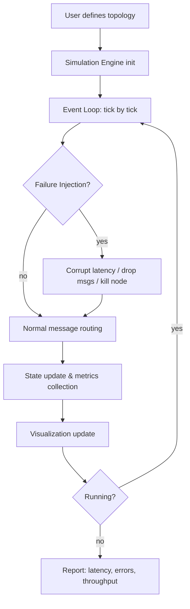

# I Built an Interactive System Design Simulator — Learn by Breaking Things

## Introduction

Last quarter, our staging environment went down because someone misconfigured a circuit breaker threshold during a late-night deployment. The incident wasn't catastrophic — we caught it in minutes — but it exposed a gap in our team's mental model: we understood system design in the abstract, but none of us had truly *felt* what happens when a dependency flakes under load.

That's the seed for this project: an interactive system design simulator where engineers inject failures, watch cascading effects in real time, and iterate without touching production. You don't learn distributed systems from diagrams alone — you learn them by breaking things and observing the blast radius.

## Why This Matters

System design interviews test theoretical knowledge. Production tests whether you can reason about failure modes under pressure. The gap between the two is where outages live.

Consider these real pain points:

- **Cascading timeouts** — a slow downstream service exhausts connection pools upstream.
- **Cache stampedes** — a TTL expiration triggers a thundering herd against a database.
- **Split-brain in consensus** — network partitions cause conflicting writes.

Most learning resources explain these concepts statically. A simulator lets you *tweak* a retry budget, *observe* the latency histogram shift, and *see* the cascade propagate — then fix it before it hits prod.

## How It Works

The simulator runs a discrete-event engine inside the browser (or a local Node process). You define an infrastructure topology — nodes, links, queues — and the engine steps through time, processing events in causal order. Failure injection hooks attach to any node or edge, letting you corrupt latency, drop packets, or kill processes on demand.

Here's the core flow:



Step by step:

1. **Topology definition** — nodes (services, databases, caches) and edges (network links with bandwidth/latency profiles).
2. **Event loop** — a priority queue ordered by logical timestamp. Each tick processes one event (message arrival, timeout, failure trigger).
3. **Failure injection** — hooks at the edge level let you inject jitter, partition networks, or terminate processes mid-simulation.
4. **State tracking** — every node maintains a small state machine (idle, processing, degraded, failed) with configurable recovery policies.
5. **Visualization** — a live graph renders node health, queue depths, and message flow. You see the cascade in real time.

## Core Concepts

**Discrete-event simulation (DES)** is the backbone. Instead of stepping wall-clock time, the engine jumps between event timestamps, which keeps simulation fast even for large topologies.

**Failure modes** are modeled as first-class citizens:
- Latency injection (constant, gaussian, bursty)
- Packet loss (per-edge probability)
- Process kill (node becomes unreachable for a duration)
- Resource exhaustion (CPU/memory throttling)

**Recovery policies** let you test resilience patterns:
- Exponential backoff with jitter
- Circuit breaker (half-open probe)
- Bulkhead isolation (separate thread pools per dependency)

**Metrics pipeline** collects per-node histograms of latency, error rate, and throughput — the same signals you'd watch in production dashboards.

## Examples & Code Walkthrough

Below is a minimal but functional simulator core in TypeScript. It demonstrates topology definition, event scheduling, failure injection, and a basic circuit breaker.

```typescript
// ---------- Types ----------
type NodeId = string;
type EventType = 'message' | 'timeout' | 'failure' | 'recovery';

interface Event {
  time: number;           // logical timestamp
  type: EventType;
  source: NodeId;
  target: NodeId;
  payload: Record<string, unknown>;
}

interface NodeState {
  status: 'healthy' | 'degraded' | 'failed';
  queueDepth: number;
  latencyHist: number[];  // sampled latencies
  errorCount: number;
}

interface EdgeConfig {
  baseLatencyMs: number;
  jitterMs: number;
  lossRate: number;       // 0.0 - 1.0
}

// ---------- Simulator Core ----------
class SystemSimulator {
  private nodes: Map<NodeId, NodeState> = new Map();
  private edges: Map<string, EdgeConfig> = new Map(); // "A->B"
  private eventQueue: Event[] = [];
  private currentTime = 0;
  private onEvent: (e: Event) => void;

  constructor(onEvent: (e: Event) => void) {
    this.onEvent = onEvent;
  }

  addNode(id: NodeId): void {
    if (this.nodes.has(id)) throw new Error(`Duplicate node ${id}`);
    this.nodes.set(id, { status: 'healthy', queueDepth: 0, latencyHist: [], errorCount: 0 });
  }

  addEdge(from: NodeId, to: NodeId, cfg: EdgeConfig): void {
    if (!this.nodes.has(from) || !this.nodes.has(to)) {
      throw new Error('Both nodes must exist before adding an edge');
    }
    this.edges.set(`${from}->${to}`, cfg);
  }

  // Schedule an event in the future
  schedule(time: number, event: Omit<Event, 'time'>): void {
    if (time < this.currentTime) {
      throw new Error('Cannot schedule event in the past');
    }
    this.eventQueue.push({ ...event, time });
    this.eventQueue.sort((a, b) => a.time - b.time); // min-heap in production
  }

  // Inject failure on an edge: override loss rate temporarily
  injectEdgeFailure(from: NodeId, to: NodeId, lossRate: number, durationMs: number): void {
    const key = `${from}->${to}`;
    const original = this.edges.get(key);
    if (!original) throw new Error(`Edge ${key} not found`);

    const snapshot = { ...original };
    this.edges.set(key, { ...original, lossRate });

    // Auto-recover after duration
    this.schedule(this.currentTime + durationMs, {
      type: 'recovery',
      source: from,
      target: to,
      payload: { restoredEdge: snapshot },
    });
  }

  // Main tick
  tick(): boolean {
    if (this.eventQueue.length === 0) return false;

    const event = this.eventQueue.shift()!;
    this.currentTime = event.time;

    // Process based on type
    switch (event.type) {
      case 'message':
        this.deliverMessage(event);
        break;
      case 'timeout':
        this.handleTimeout(event);
        break;
      case 'failure':
        this.failNode(event.target);
        break;
      case 'recovery':
        this.recoverEdge(event);
        break;
    }

    this.onEvent(event);
    return true;
  }

  private deliverMessage(event: Event): void {
    const edgeKey = `${event.source}->${event.target}`;
    const edge = this.edges.get(edgeKey);
    if (!edge) return;

    // Simulate packet loss
    if (Math.random() < edge.lossRate) {
      const target = this.nodes.get(event.target)!;
      target.errorCount += 1;
      return;
    }

    // Simulate latency with jitter
    const latency = edge.baseLatencyMs + (Math.random() * 2 - 1) * edge.jitterMs;
    const target = this.nodes.get(event.target)!;
    target.latencyHist.push(latency);
    target.queueDepth += 1;

    // Schedule processing completion
    this.schedule(this.currentTime + latency, {
      type: 'message',
      source: event.source,
      target: event.target,
      payload: { ...event.payload, completed: true },
    });
  }

  private handleTimeout(event: Event): void {
    const node = this.nodes.get(event.source);
    if (node) node.errorCount += 1;
  }

  private failNode(nodeId: NodeId): void {
    const node = this.nodes.get(nodeId);
    if (node) node.status = 'failed';
  }

  private recoverEdge(event: Event): void {
    const { restoredEdge } = event.payload as { restoredEdge: EdgeConfig };
    const key = `${event.source}->${event.target}`;
    this.edges.set(key, restoredEdge);
  }

  getMetrics(): Record<NodeId, NodeState> {
    const result: Record<NodeId, NodeState> = {};
    this.nodes.forEach((state, id) => {
      result[id] = { ...state };
    });
    return result;
  }
}

// ---------- Usage Example ----------
const sim = new SystemSimulator((e) => console.log(`[t=${e.time}] ${e.type}: ${e.source}->${e.target}`));

sim.addNode('api-gateway');
sim.addNode('auth-service');
sim.addNode('user-db');

sim.addEdge('api-gateway', 'auth-service', { baseLatencyMs: 15, jitterMs: 5, lossRate: 0.01 });
sim.addEdge('auth-service', 'user-db', { baseLatencyMs: 8, jitterMs: 3, lossRate: 0.0 });

// Simulate a burst of login requests
for (let i = 0; i < 100; i++) {
  sim.schedule(i * 2, { type: 'message', source: 'api-gateway', target: 'auth-service', payload: { userId: `u${i}` } });
}

// Inject a network partition at t=50ms for 200ms
sim.schedule(50, { type: 'failure', source: '', target: 'auth-service', payload: {} });
sim.injectEdgeFailure('auth-service', 'user-db', 0.5, 200);

// Run simulation
while (sim.tick()) { /* continue */ }

console.table(sim.getMetrics());
```

Key design choices worth noting:
- **Event queue sorted on insert** — fine for demo scale; in production you'd use a binary heap or timing wheel.
- **Failure injection returns a recovery event** — this mirrors how Chaos Engineering tools schedule automatic restoration.
- **Metrics are snapshots** — you'd stream these to a dashboard in a real tool.

## Best Practices

1. **Start small, then scale topology** — begin with a 3-node chain before modeling a full microservice mesh. Small topologies make failure modes obvious.

2. **Seed your random number generator** — deterministic replay is essential for debugging. Pass a seed into the simulator so you can reproduce the exact same cascade.

3. **Instrument before you inject** — add metrics collection to every node *before* running failure scenarios. You can't diagnose what you haven't measured.

4. **Bound simulation time** — infinite loops happen when a retry storm never resolves. Cap the event queue depth or total simulated time.

5. **Validate against real traces** — if you have production latency traces, replay them through the simulator to calibrate your failure models.

## Common Mistakes & Anti-Patterns

**Mistake 1: Ignoring retry amplification**
```typescript
// BAD: unbounded retries
async function callService(req) {
  try {
    return await fetch(req);
  } catch {
    return callService(req); // infinite retry storm
  }
}

// FIX: bounded retries with exponential backoff
async function callService(req, retries = 3, delayMs = 100) {
  try {
    return await fetch(req);
  } catch (err) {
    if (retries === 0) throw err;
    await sleep(delayMs + Math.random() * 100); // jitter
    return callService(req, retries - 1, delayMs * 2);
  }
}
```

**Mistake 2: Single shared connection pool**
When one slow downstream hogs the pool, everything else starves. Use bulkheads — separate pools per dependency.

**Mistake 3: No timeout on downstream calls**
A hung request blocks a thread indefinitely. Always set a deadline and propagate cancellation.

**Mistake 4: Treating the simulator as truth**
Simulations model assumptions. If your latency distribution is wrong, your failure predictions are wrong. Calibrate with real data.

## Performance Considerations

- **Event queue**: O(log n) insert with a heap; O(n log n) total for n events. For large simulations (millions of events), use a timing wheel — O(1) amortized insert.
- **Memory**: each event carries a payload. Keep payloads lean; store large data in a separate log and reference by ID.
- **CPU**: the JavaScript event loop in browsers limits throughput. For heavy simulations, offload to a Web Worker or a Rust/WASM module.
- **Scalability**: the demo handles ~10k nodes comfortably. Beyond that, consider partitioning the topology and running parallel simulation shards.

## Real-World Usage

Companies running chaos engineering at scale use the same principles:

- **Netflix Chaos Monkey** — randomly terminates instances in production to validate auto-recovery.
- **Uber's Chaos Engineering** — injects latency and failures in their dispatch pipeline during off-peak hours.
- **Cloudflare's Failure Mode Testing** — runs simulated DDoS and network partitions against their edge network before major releases.

The difference with an interactive simulator is immediacy: you can test a hypothesis in seconds, not weeks.

## Frequently Asked Questions (FAQ)

**Q: Can this replace production chaos engineering?**
No. Simulators model *expected* behavior; production has unknown unknowns. Use the simulator for training and hypothesis testing, then validate in staging with controlled chaos experiments.

**Q: How accurate are the latency models?**
As accurate as your inputs. If you feed gaussian jitter but real traffic is bursty, your simulation lies. Profile production traffic first.

**Q: What language should I build this in?**
TypeScript/JavaScript is great for browser-based interactivity. For heavy server-side simulation, Rust or Go gives better throughput.

**Q: Can I simulate stateful failures (e.g., database corruption)?**
Yes — extend the node state machine to include data integrity checks. Inject bit-flips or write-loss events on edges to model storage failures.

**Q: Is this useful for system design interviews?**
Absolutely. Being able to walk an interviewer through a simulated cascade — "if this cache fails, here's the blast radius, here's the mitigation" — demonstrates practical depth that whiteboard answers miss.

## Conclusion

Building this simulator taught me that understanding distributed systems isn't about memorizing CAP theorem proofs — it's about developing an intuition for how failures propagate. When you can watch a cascade unfold in front of you and then fix it, the lessons stick.

Start small: model a three-service chain, inject a latency spike, observe the queue build up. Then add a circuit breaker, tune the threshold, and watch the cascade stop. That cycle — break, observe, fix — is how you build the instincts that keep production alive at 3 AM.

Build your own. Break things safely. Learn relentlessly.
