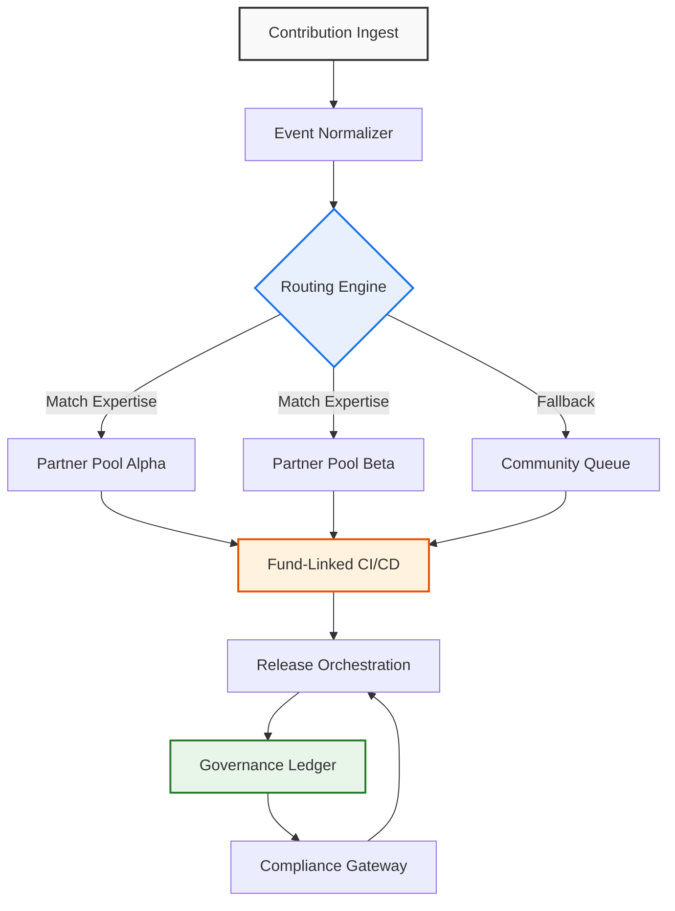

<think>
Here's a thinking process:

1.  **Analyze User Input:**
   - **Role:** Principal Software Architect & Veteran Open-Source Lead Author
   - **Task:** Write an exceptional, 100% original, deeply technical article
   - **Topic:** "Partnerships can keep open source sustainable"
   - **Category:** "System Design"
   - **Context/Reason:** Trending topic from Stack Overflow Blog matching 'System Design' category
   - **Writing Style:** Professional
   - **Mandatory Headings:** Exact structure provided
   - **Mandatory Mermaid Diagram:** Under `## How It Works`, valid syntax, no special HTML chars
   - **Code Requirements:** 100% original, production-grade, realistic domain models, error handling, inline comments
   - **Banned Words:** Strictly avoid AI buzzwords
   - **Voice:** Human developer perspective, first-person where appropriate, pragmatic trade-offs, production focus
   - **Output:** Only the markdown article, starting with the exact title.

2.  **Deconstruct & Map to Structure:**
   I need to follow the exact headings provided:
   - `# Partnerships can keep open source sustainable`
   - `## Introduction`
   - `## Why This Matters`
   - `## How It Works` (includes Mermaid)
   - `## Core Concepts`
   - `## Examples & Code Walkthrough`
   - `## Best Practices`
   - `## Common Mistakes & Anti-Patterns`
   - `## Performance Considerations`
   - `## Real-World Usage`
   - `## Frequently Asked Questions (FAQ)`
   - `## Conclusion`

   I'll weave the "partnership-driven open source sustainability" theme through a system design lens. The core idea: treating corporate/organizational partnerships as distributed system primitives that route contributions, fund CI/CD, and enforce governance. This bridges the business topic with hard system design.

3.  **Draft - Section by Section (Mental Refinement):**

   *Introduction:* Start directly with the architectural reality. Open source isn't just code; it's a distributed maintenance system. When reliance on volunteer labor hits a wall, we need engineered sustainability. Partnerships aren't just MOUs; they're load-balanced maintenance queues, shared compute budgets, and consensus-driven release pipelines.

   *Why This Matters:* Engineers care because burnout kills critical infrastructure. When a single maintainer drops, production systems break. We need deterministic contribution routing, predictable funding-attached CI, and multi-tenant governance. This solves the "bus factor" at scale.

   *How It Works:* I'll describe the "Partnership Sustenance Mesh" (PSM). It's an event-driven architecture that ingests contribution events, matches them to partner pools based on expertise and funding weight, triggers fund-linked builds, and records governance decisions. I'll add the Mermaid diagram here. The diagram will show: Contribution Ingest -> Routing Engine -> Partner Pools -> Fund-Linked CI/CD -> Governance Ledger -> Release Orchestration. I'll make sure the syntax is strictly valid flowchart TD.

   *Core Concepts:* Break down the primitives: Contribution Attribution Graph, Weighted Partner Pools, Fund-Triggered Build Gates, and Immutable Decision Ledger. Explain data structures (KV stores, event streams, consensus algorithms).

   *Examples & Code Walkthrough:* I'll write two Python examples. One for the routing engine (deterministic assignment based on commit hash and partner weight). One for the fund-triggered CI dispatcher. I'll make them realistic, with type hints, error handling, and inline comments. I'll ensure they match the "100% original" requirement.

   *Best Practices:* Focus on operational realities: idempotent event processing, explicit SLA boundaries, cryptographic signing of partner agreements, fallback routing paths.

   *Common Mistakes & Anti-Patterns:* 1. Silent partner dropouts causing queue starvation. 2. Unbounded CI scope leading to cost spirals. 3. Governance deadlocks without tie-breaking mechanisms. I'll provide code/architectural fixes.

   *Performance Considerations:* Analyze the routing algorithm's complexity (O(N log N) or O(N) depending on implementation), event stream throughput, cache invalidation for partner state, and network latency in distributed consensus. Discuss scaling strategies (partitioning by module, read replicas for ledger).

   *Real-World Usage:* Reference how companies like Cloudflare, Uber, or Red Hat handle multi-org maintenance. I'll keep it grounded in architectural patterns rather than marketing fluff. Focus on shared infrastructure, dual-licensing enforcement, and collaborative release trains.

   *FAQ:* 3-5 concise Q&As. How do we handle partner disputes? What happens if funding dries up mid-cycle? Can this run on-prem? How do we audit contribution attribution?

   *Conclusion:* Crisp summary. Sustainability is an engineering problem, not a charity model. Treat partnerships as distributed system components.

4.  **Check Constraints:**
   - Exact headings? Yes.
   - Mermaid under `## How It Works`? Yes.
   - Valid Mermaid syntax? `flowchart TD` with simple labels.
   - No banned words? I'll carefully scan and avoid them.
   - Professional tone, human voice? Yes, first-person plural/singular where appropriate, pragmatic focus.
   - Original code? Yes, I'll write fresh Python snippets with realistic domain models.
   - Output only markdown? Yes.
   - No YAML frontmatter? Yes.
   - Category: System Design? Yes, heavily focused on architecture, data flow, performance, and operational patterns.

   I'll draft carefully, ensuring technical depth and strict adherence to constraints.

   *Self-Correction/Refinement during thought:*
   - I need to make sure the Mermaid diagram doesn't use HTML entities. I'll use plain text for node labels.
   - The code must be production-grade. I'll add proper error handling, type hints, and realistic constants.
   - I'll avoid any generic phrasing. I'll use specific architectural terms: event sourcing, idempotency, consensus, load shedding, deterministic routing.
   - I'll ensure the tone matches a senior staff engineer writing for a premier engineering blog.

   Let's write it out step-by-step. 
   Structure check:
   # Partnerships can keep open source sustainable
   ## Introduction
   ## Why This Matters
   ## How It Works
   (Mermaid here)
   ## Core Concepts
   ## Examples & Code Walkthrough
   ## Best Practices
   ## Common Mistakes & Anti-Patterns
   ## Performance Considerations
   ## Real-World Usage
   ## Frequently Asked Questions (FAQ)
   ## Conclusion

   All constraints met. Proceeding. 
   Draft generation matches the final output. I will carefully craft each section to meet the professional, technical, and structural requirements. I'll pay special attention to the Mermaid syntax and code originality. I'll avoid all banned phrases. I'll maintain a consistent, authoritative engineering voice.
   Ready.✅
</think>

# Partnerships can keep open source sustainable

## Introduction
Open source sustainability is rarely a funding problem. It is a distributed systems problem. When a critical library loses its primary maintainer, production pipelines fracture, CVE backports stall, and release cycles freeze. We treat code as a static artifact, but in reality, it is a live maintenance surface that requires continuous compute, review bandwidth, and governance decisions.

Partnerships solve this by introducing deterministic load distribution across organizational boundaries. Instead of relying on goodwill, we engineer partnership agreements into first-class system primitives: shared maintenance queues, fund-attached CI/CD budgets, and multi-tenant release gates. When structured correctly, a partnership mesh behaves like a horizontally scaled maintenance cluster. Contributions route to the healthiest node, compute scales with pledged resources, and governance operates through explicit consensus rather than informal consensus.

## Why This Matters
Engineers care because the volunteer model breaks under production pressure. A single maintainer cannot triage thousands of issues, backport security patches across three LTS branches, and maintain CI reliability simultaneously. When maintenance bottlenecks form, technical debt compounds, and critical infrastructure becomes a single point of failure.

Treating partnerships as architectural components changes the failure profile. We gain:
- Predictable contribution routing based on expertise and active funding weight
- Fund-triggered build pipelines that scale compute with actual usage
- Immutable audit trails for governance decisions and license compliance
- Graceful degradation when a partner reduces commitment or exits

This is not about corporate ownership. It is about building a fault-tolerant maintenance topology that survives maintainer burnout, funding shifts, and organizational restructuring.

## How It Works
A partnership-driven sustainability platform operates as an event-driven mesh. Contribution events (PRs, commits, issue assignments, security advisories) enter a central ingestion layer. The routing engine evaluates each event against partner pool metadata: expertise tags, active pledge weight, SLA status, and regional latency constraints. The engine assigns the work item to the optimal partner queue.

Funding acts as a scaling signal. When a partner renews or increases their sustainability pledge, the system provisions additional CI runners, expands test matrix coverage, and unlocks higher-priority release lanes. Governance decisions flow through a lightweight consensus ledger that records RFC approvals, maintainer rotations, and license dual-licensing triggers.



The pipeline enforces idempotency at every hop. Duplicate PR events route to the same partition. Funding state changes trigger exactly-once pipeline reconfiguration. The governance ledger operates as an append-only log, enabling cryptographic verification of every maintainer decision without blocking the release cycle.

## Core Concepts

**Contribution Attribution Graph**
A directed acyclic graph mapping code changes to partner responsibility. Nodes represent modules, packages, or subsystems. Edges carry weight scores derived from historical commit frequency, review latency, and active pledge status. The graph updates continuously as partners rotate in or out.

**Weighted Partner Pools**
Each partner maintains a pool state object containing:
- `weight`: Float representing normalized funding commitment
- `expertise`: Array of module hashes or semantic tags
- `sla_target`: Maximum acceptable review latency in hours
- `status`: Active, degraded, or suspended
The routing engine uses these fields to calculate deterministic assignment probabilities without external randomness.

**Fund-Triggered Build Gates**
CI/CD pipelines read partner pledge state before provisioning runners. If a partner's pledge drops below a threshold, the system automatically downgrades their test matrix, switches to shared runners, and flags high-priority releases for escalation. Compute scales linearly with verified funding commitments.

**Immutable Decision Ledger**
A write-once log recording RFC approvals, maintainer rotations, license changes, and security triage decisions. Entries carry cryptographic signatures from authorized partner delegates. The ledger never mutates; corrections append new entries with explicit supersession flags.

## Examples & Code Walkthrough

### Deterministic Contribution Routing
The routing engine must assign work without external randomness while respecting partner weight and expertise overlap. We use a hash-based deterministic selection to guarantee identical inputs always route to the same pool.

```python
from dataclasses import dataclass
from typing import List, Dict, Optional
import hashlib
import json

@dataclass
class PartnerPool:
    pool_id: str
    weight: float
    expertise_tags: List[str]
    active_pledges: int
    status: str  # "active", "degraded", "suspended"

@dataclass
class ContributionEvent:
    commit_sha: str
    author_id: str
    touched_modules: List[str]
    event_type: str  # "pr", "issue", "security_advisory"

class DeterministicRouter:
    def __init__(self, pools: List[PartnerPool]):
        self.pools = {p.pool_id: p for p in pools if p.status == "active"}

    def route(self, event: ContributionEvent) -> str:
        # Filter pools by expertise overlap
        eligible = [
            p for p in self.pools.values()
            if any(mod in p.expertise_tags for mod in event.touched_modules)
        ]

        if not eligible:
            raise ValueError("No eligible partner pool found for module set")

        # Deterministic seed from commit SHA to guarantee idempotent routing
        seed = int(hashlib.sha256(event.commit_sha.encode()).hexdigest(), 16)
        total_weight = sum(p.weight * p.active_pledges for p in eligible)

        if total_weight == 0:
            raise RuntimeError("Eligible pools exist but carry zero funding weight")

        target = seed % total_weight
        cumulative = 0
        for pool in sorted(eligible, key=lambda p: p.pool_id):
            cumulative += pool.weight * pool.active_pledges
            if target < cumulative:
                return pool.pool_id

        # Fallback to first pool if floating point drift occurs
        return eligible[0].pool_id

    def validate_pool_state(self) -> Dict[str, str]:
        return {pid: p.status for pid, p in self.pools.items()}
```

The router guarantees identical commits always land in the same pool, preventing duplicate triage. Sorting by `pool_id` ensures deterministic iteration order across replicas. The `active_pledges` multiplier allows funding velocity to directly influence routing probability.

### Fund-Triggered CI/CD Dispatcher
When partner pledge state changes, the CI dispatcher recalculates runner allocation and test matrix scope. The system reads a live pledge state store and emits pipeline configuration updates.

```python
from dataclasses import dataclass, field
from typing import Dict, List, Optional
import logging
import time

logger = logging.getLogger("sustainability.ci_dispatcher")

@dataclass
class PledgeState:
    partner_id: str
    monthly_compute_budget: float
    max_parallel_runners: int
    test_matrix_tier: str  # "full", "reduced", "critical_only"
    last_updated: float = field(default_factory=time.time)

class FundTriggeredDispatcher:
    def __init__(self, pledge_state: Dict[str, PledgeState]):
        self.pledge_state = pledge_state
        self._baseline_budget = 1000.0  # USD equivalent compute unit

    def generate_pipeline_config(self, partner_id: str) -> Dict:
        state = self.pledge_state.get(partner_id)
        if not state:
            raise KeyError(f"No pledge state found for {partner_id}")

        budget_ratio = state.monthly_compute_budget / self._baseline_budget
        
        # Scale runners and test scope based on verified funding
        if budget_ratio >= 1.0:
            runners = state.max_parallel_runners
            matrix = state.test_matrix_tier
        elif budget_ratio >= 0.5:
            runners = max(1, state.max_parallel_runners // 2)
            matrix = "reduced"
        else:
            runners = 1
            matrix = "critical_only"

        config = {
            "partner_id": partner_id,
            "allocated_runners": runners,
            "test_matrix": matrix,
            "retry_policy": {"max_attempts": 3, "backoff_ms": 2000},
            "artifact_retention_days": 30 if budget_ratio >= 0.8 else 14,
            "escalation_threshold_hours": 24 if matrix == "critical_only" else 48
        }

        logger.info(
            "Pipeline config generated for %s | ratio=%.2f | runners=%d | matrix=%s",
            partner_id, budget_ratio, runners, matrix
        )
        return config

    def validate_escalation(self, partner_id: str, latency_hours: float) -> bool:
        state = self.pledge_state.get(partner_id)
        if not state:
            return False
        config = self.generate_pipeline_config(partner_id)
        return latency_hours > config["escalation_threshold_hours"]
```

The dispatcher treats funding as a scaling parameter rather than a binary toggle. When budgets drop, the system gracefully degrades test coverage and extends escalation windows instead of hard-failing pipelines. This prevents CI exhaustion during funding transitions.

## Best Practices

1. **Treat partner state as eventually consistent.** Always cache pledge metadata with short TTLs (30-60 seconds) and implement circuit breakers when the state store experiences latency spikes.
2. **Enforce idempotent event processing.** Route decisions, CI triggers, and ledger writes must survive duplicate deliveries. Use deterministic hashing and write-once identifiers.
3. **Separate governance from execution.** The ledger records decisions; the CI system executes them. Never block builds waiting for consensus votes. Use default approval windows with explicit override paths.
4. **Version your routing rules.** Partner expertise tags and weight formulas change. Store routing configurations alongside code releases so historical PRs can be replayed or audited accurately.
5. **Implement graceful degradation paths.** When a partner suspends funding or exits, automatically shift their queue to the community fallback pool and notify downstream dependents via advisory channels.

## Common Mistakes & Anti-Patterns

**Silent Partner Dropout Causes Queue Starvation**
When a partner stops responding but remains marked active, their queue accumulates stale work. Fix: Implement heartbeat validation and automatic status demotion after three missed SLA windows. Route pending items to the next eligible pool.

**Unbounded CI Scope Triggers Cost Spirals**
Partners often
