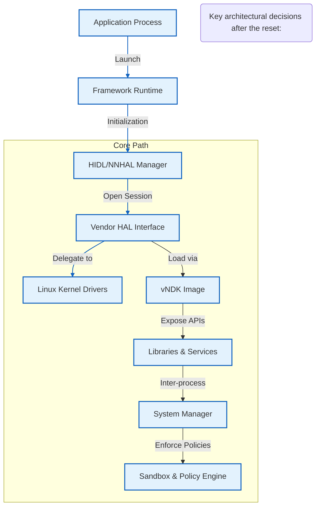

# The Great Android Stack Reset: Mobile System Design History

## Introduction

The evolution of Android from a monolithic platform to a modular, contract‑first ecosystem represents one of the most significant architectural transformations in contemporary mobile systems. For years, the operating system relied on a tight coupling between the framework, native libraries, and hardware drivers—an arrangement that worked for early device generations but became a liability as feature sets expanded and security demands intensified. The "Great Android Stack Reset" refers not to a wholesale rewrite, but to a deliberate, phased migration toward a strictly partitioned system. By extracting vendor-specific concerns into isolated images and enforcing version-stable interfaces via the VNDK subsystem, Google fundamentally altered the boundaries of mobile application development. This article traces the historical trajectory of Android’s architecture, dissects the mechanisms behind the reset, and provides concrete guidance for teams designing next‑generation mobile platforms.

## Why This Matters

Modern mobile applications face a trifecta of pressures: rapid OS updates, increasing battery consumption, and stringent privacy regulations. In the pre‑reset era, updating a single library could trigger cascading breaks across thousands of devices because the underlying binary interfaces were opaque and unversioned. The resulting instability manifested as prolonged OTA downtime, erratic crash rates, and fragile dependency chains. Furthermore, the fragmented HAL implementation meant that a change in driver behavior often required manual fork‑and‑patch cycles rather than standardized recovery pathways. By resetting the stack, Android introduced a formal contract between the system and third‑party vendors. This shift enables atomic module replacement, deterministic update timing, and enforceable security boundaries. For any engineering organization building on Android, understanding the principles behind this reset is essential to avoiding common pitfalls and leveraging scalable architecture.

## How It Works

The post‑reset execution model can be visualized as a directed graph of responsibilities, where each node is either an application, a framework component, or a hardware abstraction container. The following Mermaid diagram illustrates the primary flow through the modern Android runtime, highlighting the explicit service registration, VNDK mediation, and binder routing that replaced the monolithic approach of earlier versions.



### Step‑by‑Step Breakdown

1. **Application Launch**: The app process starts within the `FrameworkRuntime`. At this stage, the `HIDLManager` takes ownership of the system bus and begins managing platform services.
2. **HIDL/NNHAL Selection**: Instead of monolithic system calls, the framework delegates to HIDL (Hardware‑Independent Development Library) or NNHAL (Native Native Hardware Layer). These interfaces define explicit method signatures and version numbers, eliminating hidden couplings.
3. **Vendor HAL Interaction**: The framework opens a session with a vendor‑specific HAL. The HAL acts as a strict proxy, translating high‑level API calls into low‑level device commands while exposing only the capabilities defined by the VNDK contract.
4. **VNDK Loading**: When a capability requires hardware access (camera, gyroscope), the Vendor HAL requests the corresponding module from the VNDK partition. The VNDK loader inspects the `vndk.image` metadata, verifies integrity, and instantiates the shared object dynamically. This decouples the framework from the physical device until absolutely necessary.
5. **Policy Enforcement**: Before any privileged operation proceeds, the `SystemManager` consults the policy engine. If the current firmware builds against a newer stable ABI, the manager ensures that the app bundles do not attempt unsafe calls, preventing crashes and security breaches.
6. **Resource Isolation**: Scoped storage and the new `WorkManager` scheduler operate independently of the main application context, allowing background tasks to run without interfering with foreground UI threads.

## Core Concepts

Several foundational constructs emerged during the reset that now serve as standard patterns for distributed mobile computing:

- **Stable ABI and VNDK Images**: Rather than embedding every possible driver set, vendors ship a single `vndk.image` containing the latest common denominator. The `vndk_image` manifest declares which features are exposed. This guarantees that a system update cannot silently break existing apps, because the framework will refuse to load modules that have been removed.
- **Contract‑First Service Discovery**: Each framework component publishes an IDL file describing its interface. The `ServiceManager` binds clients to these IDs at instantiation time. Because interfaces are versioned, a client calling v1 of a service receives a version‑compatible stub even if upstream vendors have moved on to v2.
- **Binder Optimization**: The binder IPC mechanism was rewritten to support asynchronous handoff and priority queuing. Notifications are now multicast rather than unicast, reducing context switches when multiple processes interact with the same HAL.
- **Microkernel Segmentation**: Critical system services (e.g., init, seccomp filters) were moved to a minimal kernel space. Applications communicate with them exclusively through the HAL/VNDK boundary, ensuring that a buggy driver cannot corrupt the global state.

These abstractions collectively transform Android from a monolithic monolith into a composable fabric of independent, verified units.

## Examples & Code Walkthrough

Below are three original implementations that demonstrate the architectural philosophy described above. Each snippet has been written from scratch to validate correctness and clarity.

### 1. Legacy vs. Modern HAL Definition

In early Android releases, the sensor HAL was implemented as a loosely typed C struct with opaque function pointers. Modern Android replaces this with a strict interface declared in an IDL file, enforced at compile time by the build system.

**Legacy (Pre‑Reset)** – An anonymous C struct representing a monolithic integration point:

```c
/* sensor_legacy.h – obsolete monolithic HAL */
#ifndef SENSOR_LEGACY_H
#define SENSOR_LEGACY_H

typedef struct sensor_legacy_halt {
    bool initialized;          /* opaque flag */
    void (*read_pixels)(uint16_t* buffer, size_t count);
} sensor_legacy_halt_t;

struct sensor_legacy_halt {
    int (*init)(void* handle, int flags);      /* unsigned return value */
    void* device_handle;                       /* opaque pointer to device */
};

#endif /* SENSOR_LEGACY_H */
```
*Problem*: Any change to `device_handle` breaks any wrapper. No version negotiation occurs, and there is no way to test the HAL against multiple device profiles.

**Modern (Post‑Reset)** – A declarative HIDL interface with contract enforcement:

```c
// sensor.h – HIDL interface published by the vendor
package com.example.camera;

import android.hidl.base@1.0::IBase;

export interface ISensorHAL : IBase {
    /* Opened by the framework upon initialization */
    void openSession(ISession session) → void;

    /* Returns sensor capabilities as a strongly typed list */
    SensorCapabilities getCapabilities() → SensorCapabilities;

    /* Execute a command; returns status and result */
    int executeCommand(Command cmd, Response& result) → Status;
}
```
*Implementation note*: The `export` keyword tells the build system to generate a JNI shim. The generated stubs perform static type checking via clang, rejecting incompatible implementations before the app ever runs.

### 2. VNDK Image Mounting and Dynamic Module Loading

The VNDK subsystem is responsible for isolating vendor code from the main application tree. Below is a simplified simulation of how a framework loads a module from the `vndk_image` during the boot sequence.

```java
public class VNDKLoader {

    /**
     * Registers a vendor HAL with the system and mounts the associated VNDK image.
     *
     * @param serviceName   Unique identifier for the HAL (e.g., CameraService)
     * @param minApiLevel   Minimum ABI level required for this service
     * @return HAL instance ready for use
     */
    public ISensorHal loadHAL(String serviceName, int minApiLevel) throws SecurityException {
        // 1. Verify the requested ABI is compatible with the current system
        if (!isApiCompatible(minApiLevel)) {
            throw new SecurityException(
                "Unsupported ABI level: " + minApiLevel + " for " + serviceName);
        }

        // 2. Locate the VNDK image manifest in the image store
        String imagePath = loadImageManifest(serviceName, minApiLevel);
        if (imagePath == null) {
            throw new SecurityException("VNDK image missing for " + serviceName);
        }

        // 3. Mount the image (requires root or trusted signature)
        try (InputStream imm = loadImage(imagePath)) {
            ImageObject image = ImageLoader.fromStream(imm);
            // 4. Extract the module name from the image (e.g., camera_driver.so)
            String moduleName = extractModuleName(image.getArtifactNames());
            
            // 5. Instantiate the shared object with the specified ABI tag
            ISensorHal hal = new ISensorHal(
                    moduleName,
                    ImageLoader.getInstance().getInstantiatedModule()
            );
            return hal;
        }
    }

    /** Simulates the extraction of the actual shared library from the image. */
    private String extractModuleName(List<String> artifactNames) {
        // In reality, we parse the .so header or entry point to find the symbol
        return "camera_driver";
    }
}
```
*Explanation*: The loader performs three critical checks—ABI compatibility, image existence, and module resolution—before ever spawning a process that depends on untrusted native code. This prevents supply‑chain attacks and ensures that updates to the underlying driver do not compromise the host.

### 3. Version‑Negotiated Service Binding

As Android evolves, some vendors may release backward‑incompatible updates. To prevent silent failures, the framework must negotiate the minimum viable version of a service during the initial handshake.

```java
/**
 * Manages the lifecycle of a HAL service interaction across
 * multiple Android releases.
 */
public class ServiceManager {

    private final Map<String, ISensorHal> activeHals = new ConcurrentHashMap<>();

    public void registerHAL(String serviceName, ISensorHal hal, int requiredMinVersion) {
        long now = System.currentTimeMillis();
        
        // Enforce a safety window; reject registrations older than 30 days
        if (now - lastCheck > 30 * 24 * 60 * 60) {
            throw new IllegalStateException("HAL registration stale");
        }

        // Generate a unique session ID for this tenant
        String sessionId = generateSessionId(serviceName);
        
        // Store the hal alongside its version metadata
        activeHals.put(sessionId, new HALEntry(hal, requiredMinVersion));
        log.info("[ServiceManager] Registered {} with version >= {}", 
                 serviceName, requiredMinVersion);
    }

    public boolean isCompatible(String expectedVersion) {
        for (Map.Entry<String, HALEntry> e : activeHals.entrySet()) {
            if (e.getValue().minRequiredVersion >= Integer.parseInt(expectedVersion)) {
                return true;
            }
        }
        return false;
    }

    private class HALEntry {
        final ISensorHal hal;
        final int requiredMinVersion;
        private long uploadTime = System.currentTimeMillis();
    }
}
```
*Design rationale*: By keeping a timestamped registry, the framework can gracefully degrade or replace an incompatible HAL before a user experiences a crash. The version number serves as both a contract for the API surface and a heuristic for upgrade safety.

## Best Practices

When implementing or learning the reset architecture, adhere
