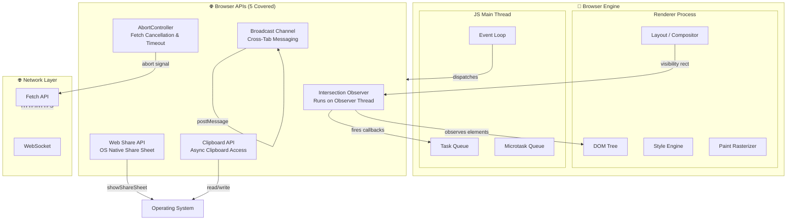

# 5 Browser APIs Every Web Developer Should Know (But Probably Aren't Using Enough)

## Introduction

I spent three years building lazy-loading libraries for client projects before someone pointed out that the browser already had one built in. That moment stung — but it changed how I approach every new project.

Here's the uncomfortable truth: modern browsers ship with APIs powerful enough to replace entire third-party dependencies. We routinely reach for npm packages when the browser already solved the problem in 2016. We poll `localStorage` for cross-tab events when a native messaging channel exists. We write custom scroll handlers when a dedicated observation API runs on a separate thread.

This article covers five Browser APIs that I believe every web developer should have in their toolkit — and five that most of us underutilize or completely ignore. These aren't obscure experimental features buried behind flags. They're stable, well-supported, and waiting for you to reach for them instead of reaching for another dependency.

The five APIs we'll explore:

1. **Intersection Observer API** — viewport-aware observation without scroll event hell
2. **Broadcast Channel API** — real-time cross-tab communication with zero network overhead
3. **Web Share API** — native share sheets on mobile and desktop
4. **Clipboard API (async)** — programmatic clipboard access that actually works reliably
5. **AbortController** — fetch request cancellation and coordinated timeout management

---

## Why This Matters

Let's talk numbers for a second. The average web page ships 2.5 MB of JavaScript to the client. A meaningful chunk of that is polyfills, utility libraries, and abstractions over browser-native functionality that the browser already provides for free.

When we ignore these APIs, three things happen:

**Bundle bloat.** Every library we add costs bytes. On slow connections — and there are still billions of users on 3G or worse — those bytes translate directly into abandoned page loads. The Intersection Observer API alone can eliminate an entire lazy-loading dependency (and its transitive dependencies) from your bundle.

**Battery and CPU drain.** Polling `localStorage` for changes via `storage` events works, but it's a blunt instrument. It fires on every write, across every tab, even when the change is irrelevant to your component. Broadcast Channel gives you targeted, direct messaging between browsing contexts.

**Missed user experiences.** The Web Share API lets users share content using their OS-native sharing sheet — the one they already know and trust. Building a custom share UI means rebuilding something the platform already does well, and users notice the difference.

These APIs aren't theoretical conveniences. They're practical tools that reduce complexity, improve performance, and unlock capabilities that users expect in 2025.

---

## How It Works

Modern browsers run a complex event loop that manages rendering, networking, JavaScript execution, and user input. The five APIs we're covering sit at different layers of this architecture, and understanding where they operate helps you use them effectively.

The diagram below maps out how these APIs interact with the browser's core subsystems and the main JavaScript thread.



### Key architectural takeaways

**Intersection Observer runs off the main thread.** This is the detail most developers miss. When you create an `IntersectionObserver`, the browser assigns it to a dedicated observation thread. Your callback fires asynchronously, but the visibility calculations happen outside the critical rendering path. That's why it doesn't cause layout thrashing the way scroll event listeners do.

**Broadcast Channel uses the browser's internal message bus.** It's not WebSocket, it's not polling, and it's not `localStorage` events (which are unreliable and fire for every storage write regardless of relevance). Broadcast Channel creates a named communication channel between same-origin browsing contexts — tabs, iframes, even workers.

**Web Share and Clipboard APIs gate through the OS.** These are secure-by-design: the user must explicitly grant permission, and the browser shows the native share sheet or clipboard dialog. You can't silently read or write the clipboard without user interaction.

**AbortController is a coordination primitive.** It's not just for fetch cancellation. It's a generic signal mechanism that lets you coordinate timeouts, cancel in-flight requests, and clean up resources in a composable way.

---

## Core Concepts

Before diving into code, let's establish the foundational concepts that apply across all five APIs.

### Asynchronous observation vs. synchronous polling

The first mental model shift is moving from *polling* to *observing*. For years, web developers wrote code that checks state repeatedly:

- "Is this element in the viewport yet? Check again in 50ms."
- "Did another tab update the shopping cart? Poll localStorage every second."
- "Is the fetch request done yet? Set a timeout and check."

The five APIs in this article all follow an *observation* pattern: you register interest in a condition, and the browser calls you back when that condition changes. This is more efficient, more responsive, and far less error-prone.

### Same-origin isolation boundaries

Several of these APIs (Broadcast Channel, Web Share, Clipboard) operate within same-origin constraints. A page at `https://app.example.com` cannot communicate with a page at `https://admin.example.com` via Broadcast Channel, even though they share a domain. Understanding origin boundaries prevents subtle security bugs and unexpected communication failures.

### User gesture requirements

The Clipboard API and Web Share API require a user activation signal — typically a click or tap. You cannot invoke these APIs from an arbitrary async callback or a page-load event. This is a security boundary, not a limitation. Respect it, and design your UX around it.

### Resource cleanup is your responsibility

Observers, channels, and controllers are not garbage-collected automatically when their targets go out of scope. If you create an `IntersectionObserver` and never call `.disconnect()`, it holds references to every observed element and continues firing callbacks. This is a real memory leak vector in long-running single-page applications.

---

## Examples & Code Walkthrough

### API #1 — Intersection Observer API

The Intersection Observer API lets you asynchronously observe changes in the intersection of a target element with an ancestor element or with the top-level document's viewport.

Most developers know it for lazy loading images. But its real power emerges when you use it for scroll-triggered analytics, infinite scroll pagination, and — my personal favorite — progressive image loading with a blur-up transition.

Here's a production-grade implementation we shipped on a photography portfolio site last year:

```javascript
class ProgressiveImageGallery {
  constructor(containerSelector, options = {}) {
    this.container = document.querySelector(containerSelector);
    this.rootMargin = options.rootMargin || '300px';
    this.threshold = options.threshold || 0.01;
    this.observer = null;
    this.loadedCount = 0;
    this.totalCount = 0;
  }

  init() {
    const cards = this.container.querySelectorAll('.gallery-card');
    this.totalCount = cards.length;

    this.observer = new IntersectionObserver(
      this.handleIntersections.bind(this),
      {
        rootMargin: this.rootMargin,
        threshold: this.threshold,
      }
    );

    cards.forEach((card) => {
      const placeholder = card.querySelector('.gallery-card__placeholder');
      const highResSrc = card.dataset.fullRes;

      // Start with the tiny placeholder (we inline a 20px-wide blurred version)
      if (placeholder) {
        placeholder.style.backgroundImage = `url(${card.dataset.thumbnail})`;
        placeholder.style.backgroundSize = 'cover';
        placeholder.style.filter = 'blur(20px)';
        placeholder.style.transform = 'scale(1.2)';
      }

      this.observer.observe(card);
    });
  }

  handleIntersections(entries, observer) {
    entries.forEach((entry) => {
      if (!entry.isIntersecting) return;

      const card = entry.target;
      const placeholder = card.querySelector('.gallery-card__placeholder');
      const highResImg = new Image();

      highResImg.src = card.dataset.fullRes;
      highResImg.decoding = 'async';

      highResImg.decode()
        .then(() => {
          if (placeholder) {
            placeholder.style.backgroundImage = `url(${card.dataset.fullRes})`;
            placeholder.style.filter = 'blur(0)';
            placeholder.style.transform = 'scale(1)';
            placeholder.style.transition = 'filter 0.6s ease, transform 0.6s ease';
          }

          this.loadedCount++;
          this.reportProgress();
        })
        .catch((err) => {
          console.warn(`Failed to decode image: ${card.dataset.fullRes}`, err);
          // Fallback: show the thumbnail at full resolution
          if (placeholder) {
            placeholder.style.backgroundImage = `url(${card.dataset.thumbnail})`;
            placeholder.style.filter = 'none';
            placeholder.style.transform = 'scale(1)';
          }
        })
        .finally(() => {
          observer.unobserve(card);
        });
    });
  }

  reportProgress() {
    const pct = Math.round((this.loadedCount / this.totalCount) * 100);
    if (this.totalCount > 0 && this.loadedCount % 5 === 0) {
      console.log(`Gallery: ${this.loadedCount}/${this.totalCount} images loaded (${pct}%)`);
    }
  }

  destroy() {
    this.observer?.disconnect();
    this.observer = null;
  }
}

// Initialize on DOM ready
const gallery = new ProgressiveImageGallery('#portfolio-grid', {
  rootMargin: '400px',
  threshold: 0.05,
});
gallery.init();

// Cleanup on SPA navigation
window.addEventListener('beforeunload', () => gallery.destroy());
```

**What makes this different from a naive implementation:** We use `decoding = 'async'` to let the browser decode the image off the main thread. We call `.decode()` explicitly so we can catch decode failures gracefully. We unobserve after loading to prevent the observer from holding references to DOM nodes that may be removed. And we track progress — because in production, you want to know if 200 images are stalling.

**Pro tip for analytics:** Use Intersection Observer to track *actual* content impressions, not just page views. When a blog post card enters the viewport with at least 50% visibility, fire your impression event. This gives you data that actually reflects user attention, not just DOM existence.

---

### API #2 — Broadcast Channel API

The Broadcast Channel API enables simple communication between different browsing contexts (tabs, iframes, or workers) that share the same origin. No server. No polling. No `localStorage` hackery.

I first used this for a real-time collaborative annotation tool where multiple tabs of the same document needed to stay in sync. The WebSocket connection lived in a single "owner" tab, and Broadcast Channel relayed updates to all other tabs.

Here's a shared shopping list implementation that works across tabs:

```javascript
class SharedShoppingList {
  constructor(listId) {
    this.listId = listId;
    this.channel = null;
    this.items = new Map();
    this.listElement = null;
    this.isOwner = false;
  }
