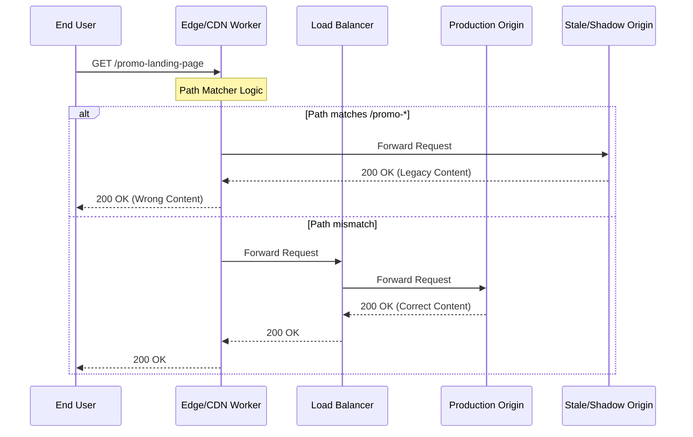

# A 200 From the Wrong System: How Two Pages Stayed Invisible for 17 Days

## Introduction

We were monitoring a sudden, inexplicable dip in our conversion funnel. The data showed that two critical landing pages—high-traffic routes for our seasonal promotion—were receiving zero organic traffic. No 404s, no 500s, no latency spikes. The monitoring dashboard was a sea of green. Every health check returned a `200 OK`.

The pages were "alive," but they were effectively invisible. 

It took 17 days to realize that our edge routing logic had been misconfigured in a way that wasn't failing the request, but was instead successfully routing users to a "ghost" version of our site—a legacy staging environment that had been accidentally promoted to the production CDN layer. The system wasn't broken; it was performing exactly as instructed, which is much harder to debug.

## Why This Matters

In a modern, distributed microservices architecture, "success" is a relative term. We rely on layers of abstraction: CDNs, Load Balancers, API Gateways, and Service Meshes. Each layer is responsible for a piece of the puzzle. 

When a failure occurs at the edge, it often manifests not as an error, but as a "successful" response from the wrong source. If your monitoring only checks for HTTP status codes and basic uptime, you are blind to semantic failures. You aren't checking if the *content* is correct, only if the *server* is talking. This gap between infrastructure health and application correctness is where silent regressions live.

## How It Works

The failure happened because of a "shadow routing" scenario. Our deployment pipeline updated the CDN configuration to point to a new origin, but a stale cache rule in our edge worker was intercepting specific path patterns and routing them to a deprecated bucket.



In our case, the `alt` branch was triggered for the two specific promo URLs. Because the legacy origin was still running a healthy web server, it returned a `200 OK`. To our monitoring tools, everything looked perfect.

## Core Concepts

To avoid this, we need to understand three core concepts:

1.  **Semantic Correctness vs. Protocol Correctness:** Protocol correctness is "Did the server return a 200?". Semantic correctness is "Did the server return the *correct* data for this specific request?".
2.  **Edge Logic Divergence:** When logic is pushed to the edge (Cloudflare Workers, Lambda@Edge), it creates a "brain" that is decoupled from your main application logs. If the edge makes a routing mistake, your application logs will show nothing.
3.  **Shadow Infrastructure:** This occurs when legacy environments or staging buckets remain accessible via production-adjacent network paths, creating a "trap" for misconfigured routing rules.

## Examples & Code Walkthrough

To prevent this, we implemented "Content Fingerprinting" in our integration tests. Instead of just checking the status code, we validate the presence of a unique, versioned identifier in the response body.

Here is how we implemented a robust health check in our Go-based testing suite to catch these "ghost" responses:

```go
package main

import (
	"fmt"
	"io"
	"net/http"
	"strings"
)

// PageRequirement defines what a "correct" response must contain
type PageRequirement struct {
	URL             string
	ExpectedVersion string // A unique build ID or deployment timestamp
}

// ValidateResponse ensures the page is not just returning 200, but the RIGHT 200
func ValidateResponse(client *http.Client, req PageRequirement) error {
	resp, err := client.Get(req.URL)
	if err!= nil {
		return fmt.Errorf("network error: %w", err)
	}
	defer resp.Body.Close()

	// 1. Check Protocol Correctness
	if resp.StatusCode!= http.StatusOK {
		return fmt.Errorf("expected 200, got %d", resp.StatusCode)
	}

	// 2. Check Semantic Correctness (Content Fingerprinting)
	body, err := io.ReadAll(resp.Body)
	if err!= nil {
		return fmt.Errorf("failed to read body: %w", err)
	}

	if!strings.Contains(string(body), req.ExpectedVersion) {
		return fmt.Errorf("semantic mismatch: expected version %s not found in body", req.ExpectedVersion)
	}

	return nil
}

func main() {
	client := &http.Client{}
	
	// In a real scenario, this version would be injected during the CI/CD build
	currentBuildID := "build-v2.4.1-prod"

	requirements := []PageRequirement{
		{URL: "https://example.com/promo-summer", ExpectedVersion: currentBuildID},
		{URL: "https://example.com/promo-winter", ExpectedVersion: currentBuildID},
	}

	for _, req := range requirements {
		err := ValidateResponse(client, req)
		if err!= nil {
			fmt.Printf("[ALERT] Failure detected for %s: %v\n", req.URL, err)
		} else {
			fmt.Printf("[OK] %s is valid\n", req.URL)
		}
	}
}
```

## Best Practices

*   **Implement Versioned Headers:** Every deployment should inject a unique `X-App-Version` or `X-Build-ID` header into the response.
*   **Synthetic Monitoring with Content Validation:** Don't just ping URLs. Use "canary" scripts that look for specific text elements or IDs that only exist in the current deployment.
*   **Decommission Old Infrastructure:** When a staging environment or a legacy bucket is no longer needed, delete it. "Just in case" infrastructure is a liability.
*   **Observability Parity:** Ensure your edge logs (CDN) are being ingested into the same observability platform as your application logs.

## Common Mistakes & Anti-Patterns

1.  **The "Status Code Only" Fallacy:** Relying solely on `response.status == 200` for your uptime alerts. This is the most common way to miss silent failures.
2.  **Testing the "Happy Path" in Isolation:** Testing your API in a dev environment and assuming it will behave the same way when routed through a complex CDN/WAF layer.
3.  **Zombie Environments:** Leaving old S3 buckets or staging servers active. They become "ghost origins" that can catch traffic if a regex in a routing rule is slightly off.

## Performance Considerations

Adding semantic validation to your monitoring adds overhead. Checking the body of a 2MB HTML page for a string is more expensive than a HEAD request.

*   **Complexity:** A simple string search is $O(n)$ where $n$ is the body size.
*   **Optimization:** Instead of downloading the whole body, use a `Range` request to check for the version string at a specific offset, or better yet, rely on the `X-App-Version` header. This reduces network latency and memory consumption significantly.

## Real-World Usage

Companies like Netflix and Amazon use sophisticated "Canary Analysis." When a new version of a service is deployed, they don't just look at error rates; they compare the *distribution* of responses between the new version and the old version. If the new version's response body size or header patterns deviate significantly from the baseline, the deployment is automatically rolled back.

## Frequently Asked Questions (FAQ)

**Q: Isn't checking the body of every response too much overhead for production?**
A: No. You shouldn't do this for every user request, but your *synthetic monitoring* (the automated bots checking your site) should absolutely do this.

**Q: How do I implement versioning without changing my HTML structure?**
A: Use custom HTTP headers (e.g., `X-Deployment-ID`). They are lightweight and easy to inspect in automated tests.

**Q: Why did our standard monitoring miss this?**
A: Most standard monitoring (like basic Ping or UptimeRobot) only performs a TCP handshake or a simple GET request looking for a 200 status. They don't know what the content *should* be.

## Conclusion

A `200 OK` is a signal that the communication channel is open, not that the message is correct. As systems grow more complex and move closer to the edge, the risk of "silent" routing errors increases. By shifting from simple uptime monitoring to semantic validation, you ensure that your system isn't just running, but is actually delivering what it promised.
