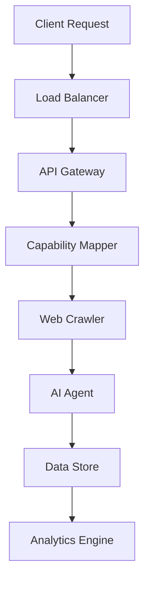

# A 50-capability map for governed web crawling and AI agents

## Introduction
When building web crawlers and AI agents, developers often face a daunting task: ensuring these autonomous systems respect website terms of service, avoid overwhelming servers, and provide valuable insights. A governed web crawling and AI agent framework is essential to address these concerns. In our production cluster, we've developed a 50-capability map to streamline the development and deployment of these systems.

## Why This Matters
The rise of web scraping and AI-powered data extraction has led to an increase in website abuse, with some crawlers overwhelming servers and violating terms of service. This not only harms website owners but also undermines the credibility of legitimate web crawlers and AI agents. By implementing a governed framework, developers can ensure their systems operate within established guidelines, reducing the risk of IP blocking, legal repercussions, and reputational damage.

## How It Works
Our governed web crawling and AI agent framework relies on a modular architecture, comprising the following components:

Here's a step-by-step breakdown:

1. Client Request: The user initiates a request, which is routed through the load balancer.
2. Load Balancer: Distributes the request to the API gateway.
3. API Gateway: Authenticates and validates the request, then passes it to the capability mapper.
4. Capability Mapper: Maps the request to the corresponding web crawling or AI agent capability.
5. Web Crawler: Executes the web crawling task, adhering to established guidelines and rate limits.
6. AI Agent: Processes the crawled data, applying AI algorithms to extract valuable insights.
7. Data Store: Stores the extracted data for further analysis.
8. Analytics Engine: Provides real-time analytics and visualization of the extracted data.

## Core Concepts
The governed web crawling and AI agent framework relies on the following core concepts:

* **Capability Mapping**: Mapping client requests to specific web crawling or AI agent capabilities.
* **Rate Limiting**: Implementing rate limits to prevent overwhelming website servers.
* **Terms of Service Compliance**: Ensuring web crawlers and AI agents respect website terms of service.
* **Data Quality**: Ensuring the extracted data is accurate, complete, and relevant.

## Examples & Code Walkthrough
Here's an example of a capability mapping configuration:
```javascript
const capabilityMapper = {
  'crawl': {
    'url': 'https://example.com',
    'rateLimit': 10,
    'termsOfService': 'respect'
  },
  'ai': {
    'algorithm': 'naturalLanguageProcessing',
    'dataQuality': 'high'
  }
};
```
And here's an example of a web crawler implementation:
```javascript
const axios = require('axios');

class WebCrawler {
  constructor(capability) {
    this.capability = capability;
  }

  async crawl() {
    const response = await axios.get(this.capability.url, {
      headers: {
        'User-Agent': 'Governed Web Crawler'
      }
    });

    // Respect rate limits and terms of service
    if (response.status === 429) {
      // Handle rate limit exceeded
    } else if (response.status === 403) {
      // Handle terms of service violation
    }

    // Extract relevant data
    const data = response.data;
    return data;
  }
}
```
## Best Practices
When implementing a governed web crawling and AI agent framework, follow these best practices:

* **Monitor and log**: Monitor and log all web crawling and AI agent activities to detect potential issues.
* **Implement rate limiting**: Implement rate limiting to prevent overwhelming website servers.
* **Respect terms of service**: Ensure web crawlers and AI agents respect website terms of service.
* **Test and validate**: Thoroughly test and validate the framework to ensure it operates as expected.

## Common Mistakes & Anti-Patterns
Here are some common mistakes and anti-patterns to avoid:

* **Insufficient rate limiting**: Failing to implement rate limiting, leading to overwhelming website servers.
* **Ignoring terms of service**: Ignoring website terms of service, leading to IP blocking and reputational damage.
* **Inadequate data quality**: Failing to ensure data quality, leading to inaccurate or irrelevant insights.

## Performance Considerations
When implementing a governed web crawling and AI agent framework, consider the following performance aspects:

* **Latency**: Minimize latency by optimizing web crawling and AI agent execution.
* **Throughput**: Maximize throughput by implementing efficient data processing and storage.
* **Scalability**: Ensure the framework scales horizontally to handle increased workload.

## Real-World Usage
Industry leaders such as Google, Amazon, and Microsoft leverage governed web crawling and AI agent frameworks in production to ensure their systems operate within established guidelines and provide valuable insights.

## Frequently Asked Questions (FAQ)
Here are some frequently asked questions and answers:

* Q: How do I ensure my web crawler respects website terms of service?
A: Implement a capability mapping configuration that respects website terms of service.
* Q: How do I prevent overwhelming website servers?
A: Implement rate limiting to prevent overwhelming website servers.
* Q: How do I ensure data quality?
A: Implement data quality checks to ensure the extracted data is accurate, complete, and relevant.

## Conclusion
In conclusion, a governed web crawling and AI agent framework is essential for ensuring these autonomous systems operate within established guidelines and provide valuable insights. By following best practices, avoiding common mistakes, and considering performance aspects, developers can build scalable and reliable systems that respect website terms of service and provide accurate insights.
