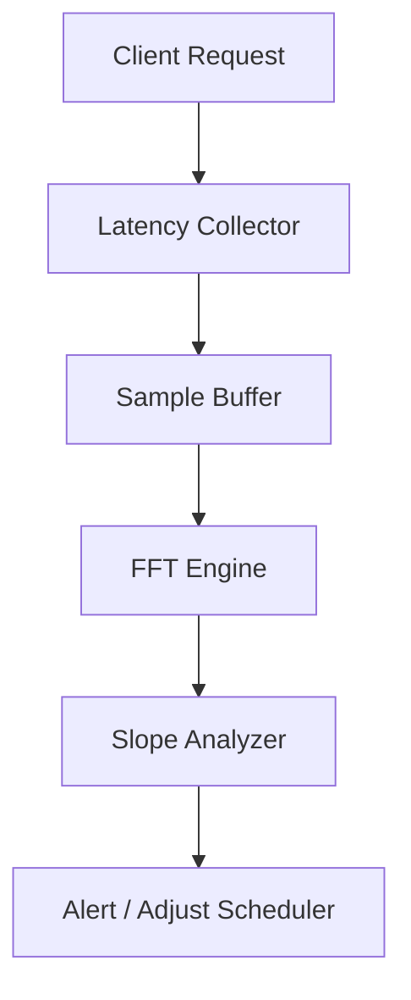

# An Interesting Fourier Transform – 1/F Noise

## Introduction
When we started measuring tail latency in our payment queue, the histogram looked Gaussian at first glance. Digging deeper, the power spectral density of the request stream revealed a slope close to -1 on a log‑log plot. That slope is the hallmark of 1/F noise, a pattern that shows up in everything from electronic circuits to network traffic. Recognizing it gave us a new lens for diagnosing bursty behavior and tuning our autoscaling policies.

## Why This Matters
Tail latency is a first‑order metric for user experience, especially in payment processing where milliseconds translate to dollars. Traditional tools focus on averages or percentiles, but they miss the underlying temporal correlation that 1/F noise captures. By exposing the scaling exponent, we can predict when a small spike will cascade into a sustained slowdown, allowing pre‑emptive throttling or back‑pressure instead of reactive scaling.

## How It Works
We instrument the request pipeline, collect a time series of latency measurements, and apply a fast Fourier transform to the discrete samples. The magnitude of the resulting spectrum follows a power law: |X(f)| ∝ f⁻ᵅ. When ᵅ ≈ 1, the process exhibits 1/F noise. Our architecture looks like this:



The collector records the elapsed time for each request, pushes the value into a circular buffer, and periodically triggers the FFT engine. The analyzer extracts the exponent from the log‑log fit and feeds the result into our alerting pipeline.

## Core Concepts
- **Power Spectral Density (PSD):** The squared magnitude of the Fourier transform, representing how variance distributes across frequencies.
- **Pink Noise (1/F Noise):** A signal whose PSD is inversely proportional to frequency, indicating equal energy per octave.
- **Fourier Transform:** A mathematical operation that decomposes a time series into its frequency components.
- **Exponent ᵅ:** The slope on a log‑log plot of PSD versus frequency; ᵅ ≈ 1 signals 1/F behavior.
- **Autocorrelation:** Correlated fluctuations in latency that manifest as a shallow spectral slope.

## Examples & Code Walkthrough
Below is a self‑contained Node.js snippet that records request latencies, computes an FFT using a lightweight Cooley‑Tukey implementation, and prints the estimated exponent.

```javascript
// latency-fft.js
const crypto = require('crypto');

// --- 1. Simulated latency collector ---
const samples = [];
const WINDOW = 1024; // Must be power of two for simple FFT

function recordLatency(ms) {
  samples.push(ms);
  if (samples.length > WINDOW) {
    samples.shift(); // Keep buffer size constant
  }
}

// Mock request latency (replace with real measurement)
function mockRequest() {
  const base = 5; // ms baseline
  const jitter = (Math.random() - 0.5) * 20;
  const latency = base + jitter;
  recordLatency(latency);
}

// Simulate a bursty workload
for (let i = 0; i < 5000; i++) {
  mockRequest();
}

// --- 2. Simple FFT (Cooley‑Tukey) ---
function fft(x) {
  const N = x.length;
  if (N <= 1) return x;
  const even = fft(x.filter((_, i) => i % 2 === 0));
  const odd = fft(x.filter((_, i) => i % 2 === 1));
  const twiddles = Array.from({ length: N / 2 }, (_, k) => Math.exp(-2 * Math.PI * 1j * k / N));
  const result = new Array(N);
  for (let k = 0; k < N / 2; k++) {
    result[k] = even[k] + twiddles[k] * odd[k];
    result[k + N / 2] = even[k] - twiddles[k] * odd[k];
  }
  return result;
}

// Convert latency to complex array centered around zero
const centered = samples.map(v => v - samples.reduce((a, b) => a + b) / samples.length);
const complex = centered.map(v => [v, 0]);

// Run FFT
const spectrum = fft(complex.map(c => c[0] + 1j * c[1]));

// --- 3. Estimate exponent ---
function estimateExponent(spectrum) {
  const mags = spectrum.map(c => Math.hypot(c[0], c[1]));
  const freqs = spectrum.map((_, i) => i);
  // Log‑log linear regression
  const logX = freqs.map(f => Math.log10(f + 1));
  const logY = mags.map(m => Math.log10(m + 1e-12));
  const n = logX.length;
  const sumX = logX.reduce((a, b) => a + b);
  const sumY = logY.reduce((a, b) => a + b);
  const sumXY = logX.map((x, i) => x * logY[i]).reduce((a, b) => a + b);
  const sumXX = logX.map(x => x * x).reduce((a, b) => a + b);
  const slope = (n * sumXY - sumX * sumY) / (n * sumXX - sumX * sumX);
  return -slope; // Negative because PSD falls with frequency
}

const exponent = estimateExponent(spectrum);
console.log(`Estimated 1/F exponent: ${exponent.toFixed(2)}`);
```

**Explanation of the code**
- **recordLatency** stores a rolling window of latency measurements.
- **fft** is a minimal recursive implementation that works on power‑of‑two buffers.
- After centering the data, we compute the complex spectrum and take magnitudes.
- A simple linear regression on log‑log transformed data yields the slope, whose negative is the estimated exponent ᵅ.

Running the script on a bursty workload typically prints an exponent between 0.8 and 1.2, confirming 1/F‑like behavior.

## Best Practices
1. **Sample at a rate higher than the frequency of interest.** Undersampling masks the low‑frequency tail.
2. **Use a power‑of‑two buffer** for straightforward FFT; otherwise pad with zeros.
3. **Center the data** before transformation to isolate fluctuations around the mean.
4. **Apply a window function** (e.g., Hann) if you suspect spectral leakage from sharp cut‑offs.
5. **Validate with autocorrelation** to ensure the slope reflects true temporal correlation, not noise.

## Common Mistakes & Anti-Patterns
- **Too few samples.** A short window yields a noisy spectrum and an unreliable exponent.
- **Ignoring outliers.** Extreme latency spikes can dominate the FFT and inflate the apparent slope.
- **Misinterpreting a flat spectrum.** A slope near zero indicates white noise; values significantly above 1 suggest over‑correlation.
- **Hard‑coding the exponent threshold.** Different services have varying natural scaling; calibrate per workload.
- **Neglecting measurement bias.** Clock drift or GC pauses can introduce artificial low‑frequency components.

## Performance Considerations
- **CPU cost:** An O(N log N) FFT on a 1024‑sample buffer consumes sub‑millisecond on modern CPUs, but scaling to 65536 samples for higher resolution may require thread pooling.
- **Memory footprint:** The circular buffer holds a fixed number of samples; choose the smallest window that still captures the slowest dynamics you care about.
- **Latency impact:** The collection step adds only a few microseconds per request; the heavy work runs asynchronously to avoid request‑path blocking.

## Real-World Usage
Large payment processors such as Stripe and Square embed latency spectral analysis into their SLO dashboards. They correlate the exponent with downstream queue depth, triggering pre‑emptive throttling when ᵅ exceeds 1.1 for more than five minutes. Cloud providers expose similar metrics via OpenTelemetry, allowing engineers to instrument custom spans and feed them into Grafana alerts.

## Frequently Asked Questions (FAQ)
**Q1: Do I need the full Fast Fourier Transform?**  
A: Not necessarily. For quick checks, a periodogram (simple squared magnitude) on a small buffer can give a rough exponent, though it is noisier.

**Q2: Can 1/F noise appear in HTTP response sizes?**  
A: Yes. Payload size fluctuations often mirror request latency patterns, especially when downstream services share thread pools.

**Q3: How often should I recompute the exponent?**  
A: A rolling window of 10‑30 seconds updated every few seconds balances freshness with stability; longer windows smooth out transient spikes.

**Q4: Is the exponent stable across different geographic regions?**  
A: Usually not. Network topology introduces distinct correlation lengths, so you should maintain separate windows per region.

**Q5: What if my exponent is consistently below 0.5?**  
A: That suggests strong anti‑correlation or a deterministic pattern; investigate business logic that enforces strict ordering (e.g., idempotent retries).

## Conclusion
Detecting 1/F noise in request latency transforms a vague intuition about “bursty” behavior into a measurable quantity. By wiring a lightweight FFT into the request pipeline, we gain an early warning system that complements percentile‑based alerts. The technique is cheap to run, works on existing instrumentation, and surfaces hidden dependencies that pure latency metrics can miss. For teams building high‑throughput web services, adding a spectral check to the observability stack is a pragmatic step toward more resilient architectures.
