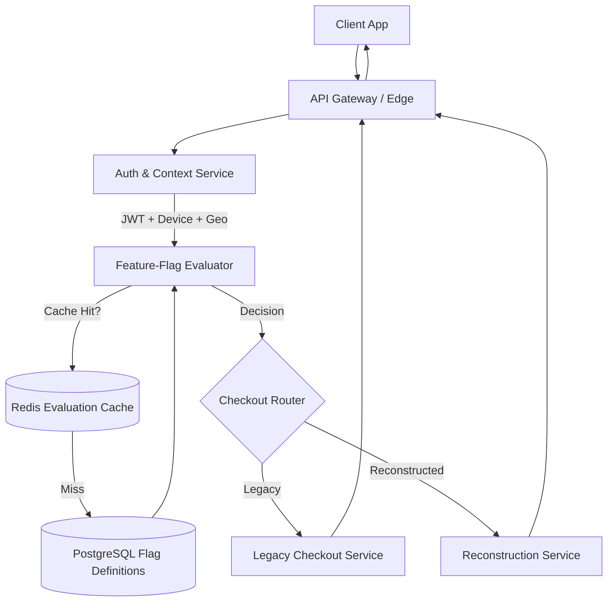

# Backend API Feature Flags: Stable Rollout Targeting for Checkout Reconstruction

## Introduction

Rebuilding a checkout flow is one of the highest‑risk changes a commerce platform can undertake. A single regression in payment handling, address validation, or promo‑code logic can translate directly into lost revenue and eroded trust. Feature flags give us a safety net: they let us ship the new implementation behind a runtime switch, expose it to a controlled slice of traffic, and roll back instantly if metrics deviate. This article walks through a production‑grade pattern for evaluating flags at the API layer, targeting specific user segments, and keeping the evaluation path fast enough to sit in the hot path of every checkout request.

## Why This Matters

In our own platform, the legacy checkout service was a monolithic Rails app that had accumulated eight years of conditional logic. When we decided to rewrite it in Go for latency and maintainability, we couldn’t afford a big‑bang cutover. We needed:

* **Zero‑downtime migration** – existing customers must never see a broken flow.
* **Granular targeting** – roll out by country, device tier, or experiment cohort without deploying new code.
* **Observability** – know exactly which flag decision was made for every request, and correlate that with conversion funnels.
* **Performance** – flag evaluation must add sub‑millisecond overhead; the checkout endpoint already runs at P99 < 120 ms.

The pattern below satisfies all four constraints and has been running in production for over a year across multiple regions.

## How It Works

The request flow is intentionally linear: authenticate, enrich context, evaluate flag, then dispatch to either the legacy or reconstructed checkout implementation. The flag evaluation itself is a pure function that reads from a cached flag definition and a user‑segment bitmap, making it deterministic and cache‑friendly.



**Step‑by‑step breakdown**

1. **API Gateway** terminates TLS, enforces rate limits, and forwards the request to the internal checkout router.
2. **Auth & Context Service** validates the JWT, hydrates a `RequestContext` struct (user ID, country, device class, experiment cohorts), and attaches it to the request context.
3. **Feature‑Flag Evaluator** checks Redis for a cached decision (`user_id:flag_key → bool`). On a miss, it loads the flag definition from PostgreSQL, runs the targeting strategy, caches the result for 5 minutes, and returns the boolean.
4. **Checkout Router** branches: if the flag is off, it calls the legacy service; if on, it calls the new reconstruction service.
5. Both services return a normalized `CheckoutResponse` payload so the client sees a consistent contract regardless of implementation.

## Core Concepts

### Flag Schema

We store flags in a single `feature_flags` table. The columns that matter for targeting are:

| Column | Type | Purpose |
|--------|------|---------|
| `key` | `varchar(64)` | Unique identifier used in code (e.g., `reconstructed_checkout`). |
| `rollout_strategy` | `varchar(32)` | `percentage`, `country`, `device`, `cohort`, or `all`. |
| `target_segments` | `jsonb` | Array of segment values (ISO country codes, device tiers, cohort IDs). |
| `percentage` | `smallint` | 0‑100 for percentage‑based rollout. |
| `enabled_by_default` | `boolean` | Fallback when the flag row is missing or deleted. |
| `deleted_at` | `timestamptz` | Soft delete for safe rollback. |

### Evaluation Engine

The evaluator is a stateless, pure function: `Evaluate(ctx, flagKey, RequestContext) (bool, error)`. It contains **no** business logic beyond the targeting strategies. This makes it trivial to unit test and to replicate in other services (e.g., a mobile SDK) without divergence.

### Caching Strategy

We cache the *decision*, not the flag definition. The key is `flag:{flagKey}:user:{userID}`. TTL is 5 minutes — short enough to react to flag toggles quickly, long enough to absorb traffic spikes. Cache misses fall back to a single-row PostgreSQL read (indexed on `key`), which typically completes in < 1 ms.

### Observability Hooks

Every evaluation emits a structured log line and a Prometheus counter:

```go
metrics.FlagEvaluationTotal.WithLabelValues(flagKey, strategy, decision).Inc()
```

We also attach the flag decision to the OpenTelemetry span so distributed traces show exactly which path a request took.

## Examples & Code Walkthrough

### Request Context Extraction

```go
// context.go
type RequestContext struct {
    UserID   string
    Country  string
    Device   string // "mobile", "desktop", "tablet"
    Cohorts  []string
}

// extractRequestContext pulls claims from the validated JWT and enriches with GeoIP.
func extractRequestContext(r *http.Request) *RequestContext {
    claims := r.Context().Value(jwtClaimsKey).(*JWTClaims)
    geo := r.Context().Value(geoIPKey).(*GeoIPResult)

    return &RequestContext{
        UserID:  claims.Subject,
        Country: geo.CountryCode,
        Device:  parseDeviceClass(r.UserAgent()),
        Cohorts: claims.Cohorts,
    }
}
```

### Flag Evaluator (Production‑Ready)

```go
// flag_evaluator.go
package featureflag

import (
    "context"
    "crypto/sha256"
    "encoding/binary"
    "encoding/json"
    "errors"
    "fmt"
    "strconv"
    "time"

    "github.com/jackc/pgx/v5"
    "github.com/redis/go-redis/v9"
)

var (
    ErrFlagNotFound = errors.New("flag not found")
    ErrInvalidStrategy = errors.New("invalid rollout strategy")
)

type FlagEvaluator struct {
    db    *pgx.Conn
    cache *redis.Client
}

type FlagDef struct {
    Key              string
    RolloutStrategy  string
    TargetSegments   []string
    Percentage       int
    EnabledByDefault bool
}

func NewFlagEvaluator(db *pgx.Conn, cache *redis.Client) *FlagEvaluator {
    return &FlagEvaluator{db: db, cache: cache}
}

// Evaluate returns true if the flag is on for the given context.
func (e *FlagEvaluator) Evaluate(ctx context.Context, flagKey string, rc *RequestContext) (bool, error) {
    // 1. Fast path: cached decision
    cacheKey := fmt.Sprintf("flag:%s:user:%s", flagKey, rc.UserID)
    if cached, err := e.cache.Get(ctx, cacheKey).Bool(); err == nil {
        return cached, nil
    }

    // 2. Load flag definition (single row, indexed lookup)
    flag, err := e.loadFlagDef(ctx, flagKey)
    if err != nil {
        if errors.Is(err, pgx.ErrNoRows) {
            return false, nil // treat missing as disabled
        }
        return false, fmt.Errorf("load flag: %w", err)
    }

    // 3. Compute decision
    decision, err := e.applyStrategy(flag, rc)
    if err != nil {
        return false, err
    }

    // 4. Cache decision with jittered TTL to avoid thundering herd
    ttl := 5*time.Minute + time.Duration(hashString(flagKey+rc.UserID)%60)*time.Second
    if err := e.cache.Set(ctx, cacheKey, decision, ttl).Err(); err != nil {
        // Log but don't fail the request
        log.Printf("cache set failed: %v", err)
    }

    return decision, nil
}

func (e *FlagEvaluator) loadFlagDef(ctx context.Context, key string) (*FlagDef, error) {
    row := e.db.QueryRow(ctx, `
        SELECT key, rollout_strategy, target_segments, percentage, enabled_by_default
        FROM feature_flags
        WHERE key = $1 AND deleted_at IS NULL
    `, key)

    var flag FlagDef
    var segmentsJSON []byte
    if err := row.Scan(&flag.Key, &flag.RolloutStrategy, &segmentsJSON, &flag.Percentage, &flag.EnabledByDefault); err != nil {
        return nil, err
    }
    if err := json.Unmarshal(segmentsJSON, &flag.TargetSegments); err != nil {
        return nil, fmt.Errorf("unmarshal segments: %w", err)
    }
    return &flag, nil
}

func (e *FlagEvaluator) applyStrategy(flag *FlagDef, rc *RequestContext) (bool, error) {
    switch flag.RolloutStrategy {
    case "percentage":
        return percentageRollout(flag.Key, rc.UserID, flag.Percentage), nil
    case "country":
        return contains(flag.TargetSegments, rc.Country), nil
    case "device":
        return contains(flag.TargetSegments, rc.Device), nil
    case "cohort":
        return anyMatch(flag.TargetSegments, rc.Cohorts), nil
    case "all":
        return true, nil
    default:
        return false, ErrInvalidStrategy
    }
}

// percentageRollout uses a stable hash so the same user always gets the same bucket.
func percentageRollout(flagKey, userID string, pct int) bool {
    if pct <= 0 {
        return false
    }
    if pct >= 100 {
        return true
    }
    h := sha256.Sum256([]byte(flagKey + "|" + userID))
    // Take first 8 bytes as uint64, modulo 100
    bucket := binary.BigEndian.Uint64(h[:8]) % 100
    return int(bucket) < pct
}

func contains(slice []string, val string) bool {
    for _, v := range slice {
        if v == val {
            return true
        }
    }
    return false
}

func anyMatch(targets, cohorts []string) bool {
    targetSet := make(map[string]struct{}, len(targets))
    for _, t := range targets {
        targetSet[t] = struct{}{}
    }
    for _, c := range cohorts {
        if _, ok := targetSet[c]; ok {
            return true
        }
    }
    return false
}

func hashString(s string) uint64 {
    h := sha256.Sum256([]byte(s))
    return binary.BigEndian.Uint64(h[:8])
}
```

**Key implementation notes**

* **Deterministic hashing** – SHA‑256 on `flagKey|userID` guarantees stable bucketing across deployments and regions.
* **Jittered TTL** – Adding a pseudo‑random offset (derived from the same hash) prevents cache stampedes when a flag is toggled.
* **Graceful degradation** – If Redis is unavailable, the evaluator falls back to the database on every call; the latency impact is measurable but the service stays functional.
* **No external feature‑flag SaaS dependency** – The logic lives in our codebase, version‑controlled, and auditable.

### Checkout Router Handler

```go
// checkout_handler.go
package httpapi

import (
    "context"
    "encoding/json"
    "net/http"
    "time"

    "github.com/go-chi/chi/v5"
    "go.opentelemetry.io/otel/attribute"
    "go.opentelemetry.io/otel/trace"

    "mycompany/checkout/featureflag"
    "mycompany/checkout/legacy"
    "mycompany/checkout/reconstruction"
)

type CheckoutHandler struct {
    evaluator     *featureflag.FlagEvaluator
    legacySvc     *legacy.Service
    reconSvc      *reconstruction.Service
    tracer        trace.Tracer
}

func NewCheckoutHandler(e *featureflag.FlagEvaluator, legacySvc *legacy.Service, reconSvc *reconstruction.Service, tracer trace.Tracer) *CheckoutHandler {
    return &CheckoutHandler{
        evaluator: e,
        legacySvc: legacySvc,
        reconSvc:  reconSvc,
        tracer:    tracer,
    }
}

func (h *CheckoutHandler) Routes() chi.Router {
    r := chi.NewRouter()
    r.Post("/", h.Handle)
    return r
}

func (h *CheckoutHandler) Handle(w http.ResponseWriter, r *http.Request) {
    ctx, span := h.tracer.Start(r.Context(), "checkout.Handle")
    defer span.End()

    rc := extractRequestContext(r)
    span.SetAttributes(attribute.String("user.id", rc.UserID), attribute.String("user.country", rc.Country))

    // Flag evaluation
    allowed, err := h.evaluator.Evaluate(ctx, "reconstructed_checkout", rc)
    if err != nil {
        // Log with context, but don't leak internals to client
        log.Printf("flag evaluation error: %v", err)
        http.Error(w, "internal error", http.StatusInternalServerError)
        return
    }
    span.SetAttributes(attribute.Bool("flag.reconstructed_checkout", allowed))

    var resp *CheckoutResponse
    if allowed {
        resp, err = h.reconSvc.Build(ctx, rc)
    } else {
        resp, err = h.legacySvc.Handle(ctx, rc)
    }
    if err != nil {
        log.Printf("checkout service error: %v", err)
        http.Error(w, "internal error", http.StatusInternalServerError)
        return
    }

    w.Header().Set("Content-Type", "application/json")
    w.Header().Set("X-Checkout-Path", map[bool]string{true: "reconstructed", false: "legacy"}[allowed])
    json.NewEncoder(w).Encode(resp)
}
```

The handler is intentionally thin: it only orchestrates. All domain logic lives in `legacy.Service` and `reconstruction.Service`, each implementing the same `Build(ctx, *RequestContext) (*CheckoutResponse, error)` interface.

## Best Practices

1. **Keep flag evaluation pure** – No side effects, no external HTTP calls. This enables replication in edge workers or client SDKs.
2. **Version flag keys** – Treat `reconstructed_checkout_v2` as a new key rather than mutating the existing one. It makes rollback trivial and audit logs clear.
3. **Use soft deletes** – Never `DROP` a flag row. Set `deleted_at` and keep the row for 30 days; this preserves historical analytics.
4. **Instrument every branch** – Emit a metric with the flag key, strategy, and decision. Dashboard the ratio of `reconstructed` vs `legacy` traffic in real time.
5. **Test the fallback path** – Run a weekly chaos experiment that forces the flag off for 100 % of traffic and verifies the legacy path still meets SLAs.
6. **Separate config from code** – Flag definitions live in the database; the only code change required for a new targeting rule is adding a new `case` in `applyStrategy`.

## Common Mistakes & Anti-Patterns

| Mistake | Why It Hurts | Fix |
|---------|--------------|-----|
| **Caching the flag definition instead of the decision** | Definition changes (e.g., percentage bump) require cache invalidation logic; stale definitions cause inconsistent rollout. | Cache the boolean decision per user+flag. TTL is short; definition changes are naturally picked up on next miss. |
| **Using random() for percentage rollout** | Each request gets a new bucket, breaking session consistency and making A/B metrics noisy. | Use a deterministic hash of `userID + flagKey` (as shown). |
| **Embedding targeting logic in the handler** | Couples business rules to transport layer; hard to reuse in gRPC, GraphQL, or mobile SDK. | Extract to a standalone `FlagEvaluator` package with a clean interface. |
| **Skipping observability on the fallback path** | You won’t know if the legacy path starts erroring after a flag rollout. | Emit metrics and traces for *both* branches; alert on error rate divergence. |

## Performance Considerations

* **Latency budget** – Flag evaluation adds ~0.3 ms (Redis hit) to ~1.2 ms (PostgreSQL cold read) at P99. The 5‑minute TTL keeps the hit rate > 99.5 % under steady traffic.
* **Memory** – Redis stores one key per active user per flag. At 2 M daily active users and 10 flags, that’s ~20 M keys ≈ 1.2 GB (key + value + overhead). Well within a modest `cache.r6g.xlarge`.
* **Database load** – Single-row primary‑key lookup on `feature_flags`. With an index on `key`, the query plan is an index scan + heap fetch (~0.1 ms). Connection pooling (pgxpool) keeps contention low.
* **Scalability** – The evaluator is stateless; horizontally scale the API pods. Redis Cluster sh
