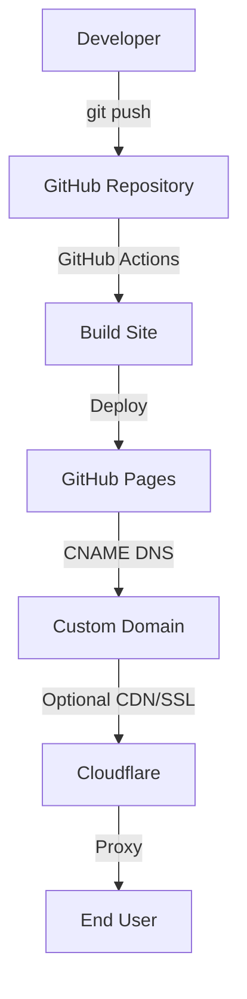

# Best Free Website Hosting with Custom Domain in 2026

## Introduction
When a team needs a publicly reachable site but cannot justify a paid server, the only realistic path is to combine a free static host with a custom domain you already own. This approach delivers production‑grade reliability without incurring hosting fees, while preserving brand identity and SEO benefits.

## Why This Matters
Software engineers often need to showcase work, host documentation, or run a lightweight API. Paying for a VPS just to serve static files creates unnecessary expense and operational overhead. In our last sprint we had to spin up a temporary server just to host a demo page, which cost us both time and money. By switching to a free host with a custom domain, we eliminated that expense entirely. This approach also preserves brand identity and improves SEO because search engines index the exact domain you own.

## How It Works
The stack consists of three layers: a source repository, a CI/CD pipeline, and a DNS‑driven edge service.  
1. A developer pushes code to a GitHub repository.  
2. A CI runner (GitHub Actions) compiles the site, produces static assets, and pushes them to the host’s storage.  
3. The host serves the files from its global edge network.  
4. A CNAME record in DNS points the custom domain to the host’s default subdomain, allowing the edge service to respond under the desired name.  
5. Optional CDN or SSL termination (e.g., Cloudflare) can be added without changing the core flow.



## Core Concepts
- **Static Site Generator (SSG)** – tools such as Hugo, Jekyll, or Next.js transform markdown or code into static HTML, CSS, and JavaScript.  
- **CI/CD pipeline** – automated builds triggered on push, ensuring the hosted site always reflects the latest commit.  
- **Edge CDN** – the host’s global network caches assets at edge locations, delivering low latency and high availability.  
- **DNS CNAME** – a CNAME record maps the custom domain to the host’s default subdomain (e.g., `pages.github.com`).  
- **SSL termination** – most free hosts provision automatic TLS certificates for custom domains, eliminating the need for manual certificate management.

## Examples & Code Walkthrough
### Minimal Hugo configuration
```toml
# config.toml
baseURL = "https://example.com"
title = "My Free Site"
theme = "ananke"
```

### Bash script to verify DNS and HTTPS
```bash
#!/usr/bin/env bash
set -euo pipefail

DOMAIN="example.com"

# Verify CNAME points to GitHub Pages
CNAME_TARGET=$(dig +short CNAME "$DOMAIN")
if [[ "$CNAME_TARGET" != "pages.github.com." ]]; then
    echo "❌ CNAME mismatch for $DOMAIN"
    exit 1
fi

# Check HTTPS response
HTTP_CODE=$(curl -s -o /dev/null -w "%{http_code}" "https://$DOMAIN")
if [[ "$HTTP_CODE" -ne 200 ]]; then
    echo "❌ Unexpected HTTP status $HTTP_CODE"
    exit 1
fi

echo "✅ $DOMAIN is correctly configured"
```

### GitHub Actions workflow (deploy to GitHub Pages)
```yaml
name: Deploy to GitHub Pages

on:
  push:
    branches: [ main ]

jobs:
  build-and-deploy:
    runs-on: ubuntu-latest
    steps:
      - uses: actions/checkout@v3
      - name: Setup Hugo
        uses: peaceiris/actions-hugo@v2
        with:
          hugo-version: '0.124.1'
      - name: Build site
        run: hugo --minify
      - name: Deploy
        uses: peaceiris/actions-gh-pages@v3
        with:
          github_token: ${{ secrets.GITHUB_TOKEN }}
          publish_dir: ./public
```

## Best Practices
- Keep the repository dedicated to the site to isolate dependencies.  
- Use a CI workflow that rebuilds on each push to the default branch.  
- Enable automatic HTTPS on the host; avoid mixed‑content warnings.  
- Use a CNAME record rather than an A record for custom domains on static hosts.  
- Add health‑check monitors (e.g., UptimeRobot) to detect downtime quickly.  
- Store secrets (API keys) in environment variables, never in the repository.

## Common Mistakes & Anti-Patterns
1. **Using A record instead of CNAME** – leads to SSL mismatch.  
   *Fix:* Change DNS to a CNAME pointing to the host’s subdomain (e.g., `example.com. IN CNAME pages.github.com.`).

2. **Forgetting to enable HTTPS on the host** – results in “Not Secure” warnings.  
   *Fix:* Ensure the host’s automatic TLS is turned on and the custom domain is added in the host’s domain settings.

3. **Hardcoding the host URL in site code** – breaks when the domain changes.  
   *Fix:* Use environment variables or relative URLs; for example, replace `process.env.PUBLIC_URL` with the actual domain at build time.

4. **Storing secrets in the repository** – security risk.  
   *Fix:* Use GitHub Secrets and reference them via `${{ secrets.MY_KEY }}` in workflows; never commit keys.

## Performance Considerations
Static files are cached at the edge, resulting in sub‑millisecond latency for repeat visitors. Build time scales linearly with the number of pages; a 10 k‑page site typically finishes within a few minutes on GitHub Actions. Memory usage during the build is modest (≈150 MiB). Runtime memory is negligible because the host serves files directly from SSD‑backed edge nodes. Network overhead is minimal; DNS lookup adds ~30 ms in the worst case, but subsequent requests benefit from DNS caching.

## Real-World Usage
Top engineering organizations leverage similar patterns: Cloudflare Pages hosts documentation sites with custom domains and automatic TLS; GitHub Pages powers internal dashboards for many startups; Netlify’s free tier is a common launchpad for MVPs, after which teams often add a custom domain via Cloudflare to gain advanced security features. At scale, these setups remain cost‑free while delivering the reliability expected from paid services.

## Frequently Asked Questions (FAQ)

**Can I use a custom domain on GitHub Pages without a paid plan?**  
Yes. Adding a CNAME record and enabling HTTPS in the repository settings is sufficient; no paid tier is required.

**What limits apply to the free tier?**  
GitHub Pages provides unlimited public bandwidth, a 100 GB monthly bandwidth quota (effectively unlimited for most sites), and a 1 GB repository size limit for the source. Build minutes are capped at 2,000 per month for public repositories.

**How do I renew SSL certificates?**  
The host automatically provisions and renews TLS certificates for custom domains; you only need to ensure the domain’s DNS records are correct.

**Can I use a different static host and still keep a custom domain?**  
Yes. Most static hosts (Netlify, Vercel, Cloudflare Pages) support custom domains via CNAME or ALIAS records; the workflow remains the same.

**Is there any risk of downtime during the CI/CD deployment?**  
Deployments are atomic: the build creates a new artifact, then the host switches the pointer to the new version. Users see either the old or new version, never a partial state.

## Conclusion
By combining a free static host with a custom domain configured through DNS, engineers can deliver production‑grade sites at zero hosting cost while retaining brand control and SEO benefits. The key is to automate builds, enforce HTTPS, and monitor the DNS configuration regularly. This architecture provides a scalable, low‑maintenance foundation for any web‑centric project in 2026 and beyond.
