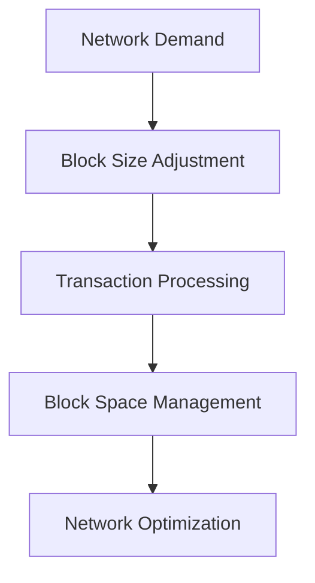

# BIP 110 and the Cost of Policing Bitcoin's Block Space
Bitcoin, the pioneering cryptocurrency, relies on a decentralized network of miners to validate transactions and maintain the integrity of its blockchain. The block space, which refers to the limited capacity of each block in the chain, plays a crucial role in this process. Bitcoin Improvement Proposal 110 (BIP 110) is a significant development aimed at optimizing the management of this block space. In this article, we will explore the specifics of BIP 110, its impact on transaction processing, and the economic implications of policing Bitcoin's block space.

## Introduction
To understand the significance of BIP 110, it's essential to grasp the basics of Bitcoin's block space and how transactions are processed. Each block in the Bitcoin blockchain has a limited size, measured in bytes, which determines how many transactions it can contain. The management of this block space is critical because it directly influences the network's throughput, transaction fees, and overall user experience. BIP 110 introduces a new approach to managing block space, focusing on efficiency and scalability.

## Why This Matters
The ability of the Bitcoin network to process transactions efficiently and securely is paramount to its adoption and usability. As the network grows, so does the demand for block space, leading to increased transaction fees and potential bottlenecks. BIP 110 addresses these challenges by proposing a more dynamic and efficient block size adjustment algorithm. This not only enhances the user experience by potentially reducing transaction fees and confirmation times but also contributes to the long-term sustainability and scalability of the Bitcoin network.

## How It Works
BIP 110 operates by adjusting the block size based on the current network conditions, aiming to balance the need for increased transaction capacity with the security and decentralization requirements of the network. The proposal suggests a more flexible block size limit that can adapt to changes in network demand, thereby optimizing the use of block space.



## Core Concepts
Understanding the core concepts behind BIP 110 requires familiarity with how Bitcoin's block space is managed and the factors influencing transaction processing. Key terms include block size, transaction fees, and network congestion. The interplay between these factors determines the efficiency and security of the Bitcoin network.

## Examples & Code Walkthrough
To illustrate the practical implications of BIP 110, let's consider an example where we analyze block space utilization and transaction data using JavaScript:

```javascript
const bitcoin = require('bitcoinjs-lib');

// Function to analyze block data
function analyzeBlock(blockHash) {
  bitcoin.getBlock(blockHash, (err, block) => {
    if (err) {
      console.error(err);
    } else {
      const transactions = block.transactions;
      console.log(`Block ${blockHash} contains ${transactions.length} transactions.`);
      // Further analysis can be performed here
    }
  });
}

// Example usage
analyzeBlock('some_block_hash');
```

## Best Practices
When implementing solutions based on BIP 110, best practices include monitoring network conditions closely, adjusting block size limits dynamically, and ensuring that security measures are not compromised in favor of increased throughput. Additionally, developers should be mindful of the potential impact on transaction fees and network congestion.

## Common Mistakes & Anti-Patterns
Common mistakes include underestimating the complexity of dynamic block size adjustment and failing to account for potential security vulnerabilities. Anti-patterns may involve rigidly adhering to fixed block size limits without consideration for network demand fluctuations.

## Performance Considerations
The performance implications of BIP 110 are multifaceted, involving considerations of network latency, transaction throughput, and computational overhead. Optimizing block space management can lead to improved network performance, but it must be balanced against the need for security and decentralization.

## Real-World Usage
Industry leaders are already exploring the potential of dynamic block size adjustment to enhance the scalability and usability of the Bitcoin network. Real-world applications include high-volume transaction processing systems and decentralized finance (DeFi) platforms that require efficient and secure transaction management.

## Frequently Asked Questions (FAQ)
1. **What is BIP 110?** - BIP 110 is a Bitcoin Improvement Proposal aimed at optimizing the management of Bitcoin's block space through dynamic block size adjustment.
2. **How does BIP 110 affect transaction fees?** - By optimizing block space usage, BIP 110 could potentially reduce transaction fees by allowing more transactions to be processed in each block.
3. **Is BIP 110 a security risk?** - Like any significant change to the Bitcoin protocol, BIP 110 must be carefully evaluated for potential security risks, but its design aims to maintain or even enhance network security.

## Conclusion
In conclusion, BIP 110 represents a significant step towards enhancing the efficiency, scalability, and usability of the Bitcoin network. By understanding the cost of policing Bitcoin's block space and the mechanisms proposed by BIP 110, developers and users can better appreciate the complexities and challenges involved in maintaining a decentralized, secure, and scalable cryptocurrency network. As the Bitcoin ecosystem continues to evolve, innovations like BIP 110 will play a crucial role in shaping its future.
