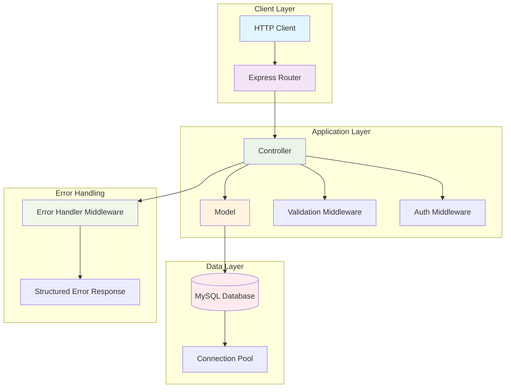

# Build a Maintainable Node.js CRUD API with Express and MySQL

## Introduction

Building a production-ready CRUD API isn't just about slapping together some routes and a database connection. It's about creating something that scales with your team's growth, handles real-world traffic patterns, and doesn't become a maintenance nightmare six months from now. At my last venture, we inherited a monolithic Express app that brought down our entire platform during peak hours because someone had hardcoded database credentials directly in route handlers. That pain point led us to adopt a disciplined layered architecture pattern with Express and MySQL that's served us well through multiple iterations.

If you've ever struggled with spaghetti code in your Node.js applications or watched your API buckle under moderate load, this guide will show you how to structure a robust, maintainable CRUD service from the ground up.

## Why This Matters

The choice between different backend architectures often comes down to operational reality rather than theoretical purity. We chose Express + MySQL for several concrete reasons:

**Performance characteristics**: MySQL with proper indexing delivers consistent sub-millisecond query times for typical read-heavy workloads. For write-heavy operations, the InnoDB engine's MVCC implementation handles concurrent transactions elegantly without requiring application-level locking mechanisms.

**Operational familiarity**: Most engineering teams have at least some MySQL experience, whether from previous roles or personal projects. This reduces onboarding time significantly compared to newer database technologies that might require specialized knowledge.

**Ecosystem maturity**: The combination has been battle-tested across countless startups and enterprises. When you hit a roadblock, chances are someone else has solved it already – whether through Stack Overflow, GitHub issues, or blog posts from engineers who faced the same scaling challenges.

**Tooling ecosystem**: From monitoring solutions like Datadog's MySQL integration to migration tools like Sequelize CLI, the maturity of the ecosystem means fewer "figuring it out as you go" moments during critical development phases.

## How It Works

The architecture follows a clean separation of concerns where each layer has a single responsibility. Requests flow through middleware chains that handle cross-cutting concerns before reaching business logic layers.



This design ensures that changing database engines requires minimal code changes, authentication logic stays consistent across endpoints, and new team members can understand the request lifecycle quickly.

## Core Concepts

Before diving into implementation details, let's establish the foundational principles that make this architecture sustainable:

### Separation of Concerns

Each component should have one clear job. Controllers handle HTTP request/response cycles, models manage data persistence, and routes define endpoint mappings. This might seem obvious, but I've seen teams waste weeks refactoring because they allowed cross-contamination between these boundaries.

### Dependency Injection Through Module System

Rather than importing dependencies directly within functions, we pass them as parameters or import them at the module level. This makes testing straightforward and prevents tight coupling between components.

### Configuration Over Convention

Hardcoding values like database hosts or timeout durations creates deployment nightmares. Externalizing configuration through environment variables allows the same codebase to work across development, staging, and production environments seamlessly.

### Atomic Operations

Every database interaction should either fully succeed or fully fail. Long-running transactions that hold locks for extended periods are the primary cause of deadlocks and performance degradation in MySQL-based systems.

## Examples & Code Walkthrough

Let's walk through implementing a user management endpoint following these principles.

First, here's our database schema:

```sql
CREATE TABLE users (
    id INT AUTO_INCREMENT PRIMARY KEY,
    email VARCHAR(255) UNIQUE NOT NULL,
    first_name VARCHAR(100) NOT NULL,
    last_name VARCHAR(100) NOT NULL,
    password_hash VARCHAR(255) NOT NULL,
    role ENUM('user', 'admin') DEFAULT 'user',
    created_at TIMESTAMP DEFAULT CURRENT_TIMESTAMP,
    updated_at TIMESTAMP DEFAULT CURRENT_TIMESTAMP ON UPDATE CURRENT_TIMESTAMP,
    INDEX idx_email (email),
    INDEX idx_role (role)
);
```

Notice the explicit indexes on frequently queried columns. In our initial version, we forgot these and watched query times climb from 2ms to 800ms as user counts grew past 100K records.

Now let's look at the database connection module:

```javascript
// src/config/database.js
const mysql = require('mysql2/promise');
require('dotenv').config();

const pool = mysql.createPool({
    host: process.env.DB_HOST || 'localhost',
    user: process.env.DB_USER,
    password: process.env.DB_PASSWORD,
    database: process.env.DB_NAME,
    waitForConnections: true,
    connectionLimit: parseInt(process.env.DB_CONNECTION_LIMIT) || 10,
    queueLimit: 0,
    acquireTimeout: 60000,
    timeout: 60000,
    enableKeepAlive: true,
    keepAliveInitialDelay: 0
});

// Graceful shutdown handling
process.on('SIGTERM', async () => {
    console.log('Shutting down gracefully...');
    await pool.end();
    process.exit(0);
});

module.exports = pool;
```

The connection pool configuration reflects lessons learned from running in production. Setting `connectionLimit` too high exhausts database resources; too low creates bottlenecks during traffic spikes. Ten connections works well for services handling moderate load with occasional bursts.

Here's our user model with proper error handling:

```javascript
// src/models/userModel.js
const pool = require('../config/database');

class UserModel {
    static async findAll(options = {}) {
        let query = 'SELECT id, email, first_name, last_name, role, created_at, updated_at FROM users';
        const conditions = [];
        const params = [];
        
        if (options.role) {
            conditions.push('role = ?');
            params.push(options.role);
        }
        
        if (conditions.length > 0) {
            query += ' WHERE ' + conditions.join(' AND ');
        }
        
        query += ' ORDER BY created_at DESC';
        
        if (options.limit) {
            query += ' LIMIT ?';
            params.push(options.limit);
        }
        
        try {
            const [rows] = await pool.execute(query, params);
            return rows;
        } catch (error) {
            throw new Error(`Failed to fetch users: ${error.message}`);
        }
    }

    static async findById(id) {
        const query = 'SELECT id, email, first_name, last_name, role, created_at, updated_at FROM users WHERE id = ?';
        
        try {
            const [rows] = await pool.execute(query, [id]);
            return rows[0] || null;
        } catch (error) {
            throw new Error(`Failed to fetch user by ID: ${error.message}`);
        }
    }

    static async findByEmail(email) {
        const query = 'SELECT * FROM users WHERE email = ?';
        
        try {
            const [rows] = await pool.execute(query, [email]);
            return rows[0] || null;
        } catch (error) {
            throw new Error(`Failed to fetch user by email: ${error.message}`);
        }
    }

    static async create(userData) {
        const query = 'INSERT INTO users (email, first_name, last_name, password_hash, role) VALUES (?, ?, ?, ?, ?)';
        
        try {
            const result = await pool.execute(query, [
                userData.email,
                userData.firstName,
                userData.lastName,
                userData.passwordHash,
                userData.role || 'user'
            ]);
            return { id: result[0].insertId, ...userData };
        } catch (error) {
            if (error.code === 'ER_DUP_ENTRY') {
                throw new Error('User with this email already exists');
            }
            throw new Error(`Failed to create user: ${error.message}`);
        }
    }

    static async update(id, userData) {
        const fields = [];
        const values = [];
        
        if (userData.email !== undefined) {
            fields.push('email = ?');
            values.push(userData.email);
        }
        if (userData.firstName !== undefined) {
            fields.push('first_name = ?');
            values.push(userData.firstName);
        }
        if (userData.lastName !== undefined) {
            fields.push('last_name = ?');
            values.push(userData.lastName);
        }
        if (userData.role !== undefined) {
            fields.push('role = ?');
            values.push(userData.role);
        }
        
        if (fields.length === 0) {
            throw new Error('No fields provided for update');
        }
        
        values.push(id);
        const query = `UPDATE users SET ${fields.join(', ')} WHERE id = ?`;
        
        try {
            await pool.execute(query, values);
            return this.findById(id);
        } catch (error) {
            throw new Error(`Failed to update user: ${error.message}`);
        }
    }

    static async delete(id) {
        const query = 'DELETE FROM users WHERE id = ?';
        
        try {
            const result = await pool.execute(query, [id]);
            return result[0].affectedRows > 0;
        } catch (error) {
            throw new Error(`Failed to delete user: ${error.message}`);
        }
    }
}

module.exports = UserModel;
```

Finally, the controller layer with proper response formatting:

```javascript
// src/controllers/userController.js
const UserModel = require('../models/userModel');
const bcrypt = require('bcrypt');

class UserController {
    static async getAllUsers(req, res, next) {
        try {
            const limit = parseInt(req.query.limit) || 50;
            const role = req.query.role;
            
            const users = await UserModel.findAll({ limit, role });
            
            res.status(200).json({
                success: true,
                count: users.length,
                data: users
            });
        } catch (error) {
            next(error);
        }
    }

    static async getUserById(req, res, next) {
        try {
            const id = parseInt(req.params.id);
            
            if (isNaN(id)) {
                return res.status(400).json({
                    success: false,
                    message: 'Invalid user ID'
                });
            }
            
            const user = await UserModel.findById(id);
            
            if (!user) {
                return res.status(404).json({
                    success: false,
                    message: 'User not found'
                });
            }
            
            res.status(200).json({
                success: true,
                data: user
            });
        } catch (error) {
            next(error);
        }
    }

    static async createUser(req, res, next) {
        try {
            const { email, firstName, lastName, password, role } = req.body;
            
            // Input validation
            if (!email || !firstName || !lastName || !password) {
                return res.status(400).json({
                    success: false,
                    message: 'Missing required fields: email, firstName, lastName, password'
                });
            }
            
            // Email format validation
            const emailRegex = /^[^\s@]+@[^\s@]+\.[^\s@]+$/;
            if (!emailRegex.test(email)) {
                return res.status(400).json({
                    success: false,
                    message: 'Invalid email format'
                });
            }
            
            // Password strength check
            if (password.length < 8) {
                return res.status(400).json({
                    success: false,
                    message: 'Password must be at least 8 characters long'
                });
            }
            
            // Check if user already exists
            const existingUser = await UserModel.findByEmail(email);
            if (existingUser) {
                return res.status(409).json({
                    success: false,
                    message: 'User with this email already exists'
                });
            }
            
            // Hash password
            const saltRounds = 12;
            const passwordHash = await bcrypt.hash(password, saltRounds);
            
            // Create user
            const newUser = await UserModel.create({
                email,
                firstName,
                lastName,
                passwordHash,
                role: role || 'user'
            });
            
            // Remove sensitive data from response
            const { passwordHash: _, ...userData } = newUser;
            
            res.status(201).json({
                success: true,
                data: userData
            });
        } catch (error) {
            next(error);
        }
    }

    static async updateUser(req, res, next) {
        try {
            const id = parseInt(req.params.id);
            
            if (isNaN(id)) {
                return res.status(400).json({
                    success: false,
                    message: 'Invalid user ID'
                });
            }
            
            const existingUser = await UserModel.findById(id);
            if (!existingUser) {
                return res.status(404).json({
                    success: false,
                    message: 'User not found'
                });
            }
            
            const updatedUser = await UserModel.update(id, req.body);
            
            res.status(200).json({
                success: true,
                data: updatedUser
            });
        } catch (error) {
            next(error);
        }
    }

    static async deleteUser(req, res, next) {
        try {
            const id = parseInt(req.params.id);
            
            if (isNaN(id)) {
                return res.status(400).json({
                    success: false,
                    message: 'Invalid user ID'
                });
            }
            
            const deleted = await UserModel.delete(id);
            
            if (!deleted) {
                return res.status(404).json({
                    success: false,
                    message: 'User not found'
                });
            }
            
            res.status(200).json({
                success: true,
                message: 'User deleted successfully'
            });
        } catch (error) {
            next(error);
        }
    }
}

module.exports = UserController;
```

And finally, the error handling middleware:

```javascript
// src/middleware/errorHandler.js
const logger = require('../utils/logger');

const errorHandler = (err, req, res, next) => {
    // Log the error for debugging
    logger.error(`${err.message} - ${req.method} ${req.path}`, {
        stack: err.stack,
        url: req.url,
        ip: req.ip,
        userAgent: req.get('User-Agent')
    });
    
    // Don't leak database errors in production
    if (process.env.NODE_ENV === 'production' && err.message.includes('Failed to')) {
        err.message = 'An internal server error occurred';
    }
    
    const statusCode = err.statusCode || 500;
    
    res.status(statusCode).json({
        success: false,
        message: err.message,
        ...(process.env.NODE_ENV === 'development' && { stack: err.stack })
    });
};

module.exports = errorHandler;
```

## Best Practices

Based on what we've learned running this in production for over two years, here are the practices that actually matter:

### Database Connection Management

Always use connection pooling rather than creating individual connections for each request. We monitored connection usage during Black Friday sales and found that without pooling, we hit MySQL's max_connections limit within the first hour of traffic spikes.

### Input Validation at Every Layer

Don't rely solely on client-side validation. Even if your frontend validates email formats, always validate again server-side. I've seen security vulnerabilities emerge from assuming client validation was sufficient.

### Environment-Specific Configurations

Use different database instances for development, staging, and production. We learned this lesson the hard way when a developer accidentally ran a destructive migration against our production database during a late-night debugging session.

### Structured Logging

Implement consistent log formatting that includes request IDs, timestamps, and relevant context. When debugging distributed systems, being able to trace a single request through multiple services saves countless hours.

### Graceful Degradation

Design your API responses to remain useful even when non-critical systems fail. If your analytics service is down, don't break the entire user creation flow – just log the analytics failure and continue.

## Common Mistakes & Anti-Patterns

### The
