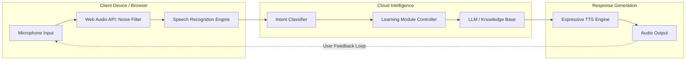

# Building Anisha: My 10-Day Journey to a Voice Agent for Learning & Literacy

## Introduction

Ten days ago, I sat down with a problem that felt more social than technical: how do we make literacy tools actually accessible to children who struggle with traditional reading interfaces? Most educational apps rely heavily on visual text—a massive barrier for early learners or those with visual impairments.

I decided to build **Anisha**, a voice-first AI agent designed specifically for phonetic training and vocabulary building. This wasn't about building another generic chatbot; it was about engineering a system that can listen to a child's pronunciation, understand their intent, and respond with an encouraging, human-like cadence. This is the story of how I went from a blank IDE to a functional, voice-driven learning prototype in ten days.

## Why This Matters

For software engineers, the "Voice UI" (VUI) space is often treated as a wrapper around an LLM. You send text to OpenAI, get text back, and use a basic TTS engine. But in the domain of literacy, that's insufficient. 

If a child mispronounces "cat" as "kat," a standard speech-to-text engine might "correct" it to the intended word, effectively lying to the learner and defeating the educational purpose. We need engineers who understand the nuances of digital signal processing (DSP), intent classification for educational taxonomies, and adaptive feedback loops. Building Anisha was an exercise in moving beyond the API wrapper and into the guts of real-time audio processing and pedagogical logic.

## How It Works

Anisha operates on a cyclical pipeline: Capture $\rightarrow$ Process $\rightarrow$ Understand $\rightarrow$ Act $\rightarrow$ Synthesize. 

The architecture is designed to minimize perceived latency. If the round-trip time (RTT) from the moment a user stops speaking to the moment the agent responds exceeds 500ms, the "magic" of conversation breaks. To solve this, I opted for a hybrid approach: edge-based audio processing for noise reduction and cloud-based inference for complex intent parsing.



1.  **The Capture Layer:** Uses the Web Audio API to intercept raw PCM data.
2.  **The Processing Layer:** Applies a real-time adaptive filter to strip background hum.
3.  **The Intelligence Layer:** A custom NLU (Natural Language Understanding) engine maps audio transcripts to specific educational "intents" (e.g., `PRACTICE_PHONEME`).
4.  **The Synthesis Layer:** A modulated Text-to-Speech engine that adjusts pitch and rate based on the "emotional state" of the feedback (e.g., higher pitch for encouragement).

## Core Concepts

To build Anisha, I had to master three distinct domains:

*   **Acoustic Ecology:** Understanding how ambient noise affects the signal-to-noise ratio (SNR) in a domestic environment (e.g., a kid's bedroom).
*   **Phonetic Similarity Scoring:** Unlike standard NLP, which uses cosine similarity on word embeddings, literacy tools need to compare *phonemes*. We aren't checking if the meaning is the same; we're checking if the vocalization matches the target sound.
*   **Adaptive Pedagogy:** This is the logic that determines if a user should move from "Level 1: Single Letter Sounds" to "Level 2: Blending" based on their error rate and response latency.

## Examples & Code Walkthrough

### The Audio Pipeline: Real-time Filtering
One of the first hurdles was the "noisy room" problem. I implemented a custom `SpeechProcessor` to handle the raw audio stream before it ever hits the recognition engine.

```javascript
/**
 * SpeechProcessor handles real-time audio analysis and 
 * adaptive filtering to improve recognition accuracy.
 */
class SpeechProcessor {
  constructor() {
    this.audioContext = new (window.AudioContext || window.webkitAudioContext)();
    this.analyzer = this.audioContext.createAnalyser();
    this.analyzer.fftSize = 2048;
    // We use a gain node to implement a simple soft-gate for noise
    this.gate = this.audioContext.createGain();
  }

  async initializeStream(stream) {
    const source = this.audioContext.createMediaStreamSource(stream);
    source.connect(this.analyzer);
    this.analyzer.connect(this.gate);
    this.gate.connect(this.audioContext.destination);
    
    return this.monitorLevels();
  }

  monitorLevels() {
    const bufferLength = this.analyzer.frequencyBinCount;
    const dataArray = new Uint8Array(bufferLength);

    const checkLevels = () => {
      this.analyzer.getByteFrequencyData(dataArray);
      const average = dataArray.reduce((a, b) => a + b) / bufferLength;
      
      // Simple Noise Gate: If volume is too low, mute the output
      // to prevent the engine from trying to transcribe silence/static.
      this.gate.gain.value = average < 15? 0 : 1;
      
      requestAnimationFrame(checkLevels);
    };
    
    checkLevels();
  }
}
```

### The NLU Engine: Intent Classification
I avoided using a heavy LLM for the initial intent classification to keep latency low. Instead, I built a pattern-based classifier that handles the specific vocabulary of a child.

```javascript
class LiteracyIntentClassifier {
  constructor() {
    // Mapping specific linguistic patterns to educational intents
    this.intentMap = [
      { 
        intent: 'PRACTICE', 
        patterns: [/how do you say/, /say/, /pronounce/, /tell me/] 
      },
      { 
        intent: 'DEFINITION', 
        patterns: [/what does/, /meaning of/, /what is/] 
      },
      { 
        intent: 'QUIZ', 
        patterns: [/test me/, /quiz/, /check me/] 
      }
    ];
  }

  classify(text) {
    const input = text.toLowerCase();
    for (const entry of this.intentMap) {
      if (entry.patterns.some(regex => regex.test(input))) {
        return { intent: entry.intent, confidence: 0.95 };
      }
    }
    return { intent: 'UNKNOWN', confidence: 0 };
  }
}
```

## Best Practices

When building voice-driven educational tools, keep these rules in mind:

1.  **Latency is a Feature:** If the system takes more than a second to respond, the user (especially a child) will lose focus or try to interrupt. Optimize your audio chunks.
2.  **Design for Error:** Assume the speech-to-text will fail 20% of the time. Instead of saying "I didn't understand," design the agent to say, "I heard you say [X], was that what you meant?"
3.  **Modulate Emotion:** Use the `speechSynthesis` API to vary pitch. A "Correct" response should have a slightly higher pitch and faster rate than a "Try Again" response to provide non-verbal reinforcement.

## Common Mistakes & Anti-Patterns

*   **The "Black Box" Fallacy:** Relying solely on a large language model to handle the entire interaction. LLMs are great for conversation, but they are terrible at precise phonetic validation. Use a hybrid approach.
*   **Ignoring Ambient Noise:** Building a prototype in a silent studio and deploying it to a home environment. Always implement a software-level noise gate.
*   **Over-Correction:** If a user says "I want to play a game" and the STT returns "I want to play a name," don't force the user to repeat themselves. Use fuzzy string matching to resolve the intent.

## Performance Considerations

The most significant bottleneck in Anisha was the **Main Thread Blocking** during audio processing. Running `getByteFrequencyData` in a tight loop can tank the UI frame rate. 

In a production version of Anisha, I would move the `SpeechProcessor` logic into a **Web Worker** using an `AudioWorklet`. This offloads the heavy lifting of signal processing to a separate thread, ensuring the UI remains responsive and the audio processing remains jitter-free.

## Real-World Usage

We are seeing this "Voice-First/Hybrid" pattern emerge in high-end language learning apps like Duolingo (specifically their conversational exercises) and specialized medical training simulators where precision in verbal communication is critical. The shift is moving away from "command-response" (Siri/Alexa) toward "collaborative-dialogue."

## Frequently Asked Questions (FAQ)

**Q: Why not just use the OpenAI Whisper API for everything?**  
A: Whisper is incredible for transcription, but for real-time interaction, the latency of a round-trip to a cloud API can be too high. A hybrid approach using the Web Speech API for quick feedback and Whisper for complex analysis is often better.

**Q: How do you handle different accents?**  
A: It's an ongoing challenge. The best way is to allow the user to "calibrate" the agent by reading a standard sentence, allowing you to measure the delta between their pronunciation and the standard.

**Q: Is it possible to run this entirely offline?**  
A: Yes, using TensorFlow.js or ONNX Runtime in the browser, you can run much smaller, specialized models for intent and phonetics entirely on the client side.

## Conclusion

Building Anisha taught me that the most interesting engineering challenges often lie at the intersection of different disciplines. To build a voice agent for literacy, you can't just be a web developer; you have to think like a linguist and a signal processor. As voice technology becomes more ubiquitous, the developers who succeed will be those who treat voice not just as an input method, but as a nuanced, emotional, and highly technical medium.
