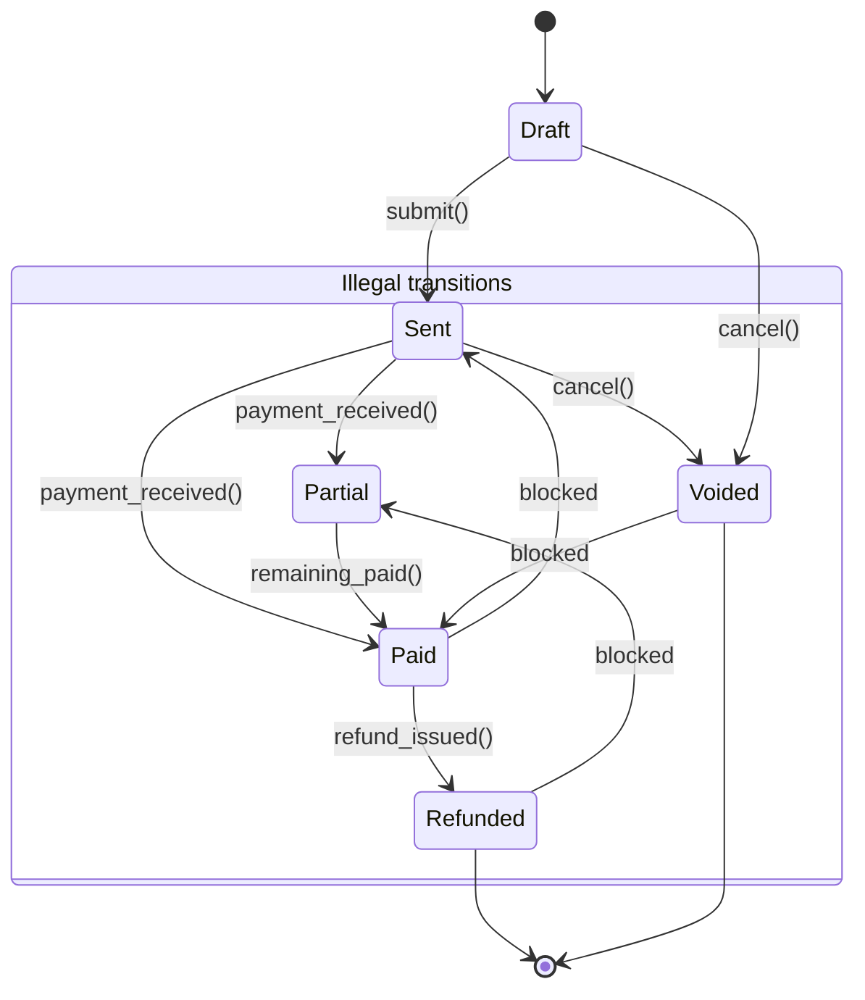

# Building FoxyInvoice — Chapter 1: Every term you need, and where it will bite you

## Introduction

"Invoice" is the most dangerous word in accounting software. It sounds simple until you realize it means seven different things across seven different jurisdictions, and your database schema only has one column for it.

I learned this the hard way. Three years ago, we shipped an invoicing module that assumed `total = sum(line_items)`. Then a German client asked for reverse-charge VAT, and a Brazilian client asked for ISS vs. ICMS distinctions, and our "simple" Invoice object started lying about what it actually represented.

This is Chapter 1 of Building FoxyInvoice, where I'll walk through the terminology traps, the money representation pitfalls, state machine nightmares, and tax engine architecture that separate a prototype from production-grade billing software.

## Why This Matters

Invoice systems look trivial until they aren't. A single rounding error in a multi-currency transaction can trigger regulatory fines. An illegal state transition can charge a customer twice. A Nexus rule miscalculation can create tax liabilities that sink a startup.

The engineering community talks about "domain-driven design" but rarely shows the ugly reality: accounting standards vary by municipality, tax IDs change mid-year, and your "immutable" invoice gets amended because the client forgot to add a line item before sending.

This matters because every SaaS company, every marketplace, every platform with financial transactions will eventually build or integrate an invoicing system. Getting the fundamentals wrong doesn't just cause bugs—it causes legal exposure.

## How It Works

FoxyInvoice treats an invoice not as a data structure but as a lifecycle governed by strict state transitions, a money value object that never loses precision, and a tax engine that resolves jurisdiction rules at calculation time rather than storage time.

The core insight: **separate the invoice document from the invoice transaction**. A document is what the customer sees. A transaction is the accounting event. They share an ID but diverge in state, tax treatment, and currency conversion.



The state machine prevents illegal transitions at the domain layer, not the database layer. This matters because databases are terrible at enforcing business rules—they're great at enforcing constraints, but business rules change faster than schemas.

## Core Concepts

**Money as an integer.** Never store monetary values as floats. An invoice total of `19.99` stored as a float becomes `19.989999999999998` after multiplication. FoxyInvoice uses integer cents (or the smallest currency unit) internally, converting to display strings only at the presentation layer.

**Currency-aware operations.** Adding USD and EUR without conversion is a bug. Our Money value object carries a currency code and rejects operations between mismatched currencies unless an explicit exchange rate is provided.

**Rounding strategy per jurisdiction.** Banker's rounding (round half to even) is standard in financial reporting, but some tax jurisdictions require commercial rounding (round half up). The tax engine must know which rule applies to which line item.

**Tax jurisdiction resolution.** Nexus isn't binary. A company might have nexus in New York for sales tax but not for VAT. The tax engine needs a rules engine, not a lookup table.

## Examples & Code Walkthrough

Here's the Money value object that prevents the float poison:

```python
from decimal import Decimal, ROUND_HALF_EVEN, ROUND_HALF_UP
from dataclasses import dataclass
from enum import Enum

class RoundingStrategy(Enum):
    BANKERS = ROUND_HALF_EVEN
    COMMERCIAL = ROUND_HALF_UP

@dataclass(frozen=True)
class Money:
    """
    Immutable monetary value stored as integer cents.
    Prevents float imprecision and enforces currency isolation.
    """
    amount_cents: int
    currency: str  # ISO 4217 code: USD, EUR, BRL
    
    def __post_init__(self):
        if self.amount_cents < 0:
            raise ValueError("Negative Money requires explicit handling via transfer")
        if len(self.currency) != 3:
            raise ValueError("Currency must be ISO 4217")
    
    def add(self, other: 'Money', exchange_rate: Decimal = None) -> 'Money':
        """Add two Money objects, converting if necessary."""
        if self.currency == other.currency:
            return Money(self.amount_cents + other.amount_cents, self.currency)
        
        if exchange_rate is None:
            raise ValueError(f"Cannot add {self.currency} and {other.currency} without exchange rate")
        
        # Convert other to self's currency
        converted = (other.amount_cents * exchange_rate).quantize(Decimal('1'), rounding=ROUND_HALF_UP)
        return Money(self.amount_cents + int(converted), self.currency)
    
    def allocate(self, ratios: list[Decimal], strategy: RoundingStrategy = RoundingStrategy.BANKERS) -> list['Money']:
        """
        Split money into N parts according to ratios.
        Distributes rounding remainder to largest remainder first.
        """
        if sum(ratios) != Decimal(1):
            raise ValueError("Ratios must sum to 1")
        
        # Calculate raw allocations in cents
        raw = [float(self.amount_cents * r) for r in ratios]
        floored = [int(x) for x in raw]
        
        # Distribute remainder using largest remainder method
        remainder = self.amount_cents - sum(floored)
        indices = sorted(range(len(raw)), key=lambda i: raw[i] - floored[i], reverse=True)
        
        for i in range(remainder):
            floored[indices[i]] += 1
        
        return [Money(amt, self.currency) for amt in floored]
    
    def to_decimal(self) -> Decimal:
        """Convert to Decimal for display or external API."""
        return Decimal(self.amount_cents) / Decimal(100)
```

Now the state machine with illegal transition prevention:

```python
from enum import Enum, auto
from typing import Set, Dict

class InvoiceState(Enum):
    DRAFT = auto()
    SENT = auto()
    PARTIAL = auto()
    PAID = auto()
    REFUNDED = auto()
    VOIDED = auto()

class InvoiceStateMachine:
    """
    Enforces valid invoice lifecycle transitions.
    Prevents zombie invoices from illegal state changes.
    """
    _transitions: Dict[InvoiceState, Set[InvoiceState]] = {
        InvoiceState.DRAFT: {InvoiceState.SENT, InvoiceState.VOIDED},
        InvoiceState.SENT: {InvoiceState.PARTIAL, InvoiceState.PAID, InvoiceState.VOIDED},
        InvoiceState.PARTIAL: {InvoiceState.PAID, InvoiceState.REFUNDED},
        InvoiceState.PAID: {InvoiceState.REFUNDED},
        InvoiceState.REFUNDED: set(),  # terminal
        InvoiceState.VOIDED: set(),    # terminal
    }
    
    @classmethod
    def can_transition(cls, from_state: InvoiceState, to_state: InvoiceState) -> bool:
        return to_state in cls._transitions.get(from_state, set())
    
    @classmethod
    def transition(cls, invoice_id: str, from_state: InvoiceState, to_state: InvoiceState) -> InvoiceState:
        """
        Atomic state transition with concurrency check.
        In production, this wraps a database transaction with SELECT FOR UPDATE.
        """
        if not cls.can_transition(from_state, to_state):
            raise InvalidTransitionError(
                f"Cannot transition {from_state.name} -> {to_state.name} for invoice {invoice_id}"
            )
        
        # Production: UPDATE invoices SET state = %s WHERE id = %s AND state = %s
        # If 0 rows affected, concurrent modification occurred
        return to_state

class InvalidTransitionError(Exception):
    pass
```

And a tax engine skeleton that resolves jurisdiction rules:

```python
from dataclasses import dataclass
from typing import Optional

@dataclass
class TaxJurisdiction:
    country: str
    state: Optional[str] = None  # US states, EU member states
    city: Optional[str] = None
    tax_type: str  # VAT, Sales, GST, ISS
    
    def applies_to(self, customer_address: dict, seller_nexus: list) -> bool:
        """
        Determine if this jurisdiction's tax applies.
        Considers seller nexus, customer location, and tax type.
        """
        if self.country != customer_address.get('country'):
            return False
        
        # Check seller nexus in this jurisdiction
        has_nexus = any(
            n['country'] == self.country and 
            (n.get('state') == self.state if self.state else True)
            for n in seller_nexus
        )
        
        if not has_nexus and self.tax_type == 'Sales':
            # Some jurisdictions require collection based on customer location
            # even without seller nexus (marketplace facilitator laws)
            return customer_address.get('state') == self.state
        
        return has_nexus

class TaxEngine:
    """
    Calculates tax per line item based on jurisdiction rules.
    Supports VAT MOSS, reverse-charge, and exemption certificates.
    """
    def __init__(self, jurisdictions: list[TaxJurisdiction]):
        self.jurisdictions = jurisdictions
    
    def calculate_tax(self, line_amount: Money, customer: dict, seller_nexus: list) -> Money:
        """
        Determine applicable tax rate and calculate.
        Returns tax amount in customer's currency.
        """
        applicable = [
            j for j in self.jurisdictions 
            if j.applies_to(customer.get('address', {}), seller_nexus)
        ]
        
        if not applicable:
            return Money(0, line_amount.currency)
        
        # Composite rate: sum of applicable jurisdiction rates
        # Production: cache rates, handle compound vs. non-compound jurisdictions
        total_rate = Decimal(sum(j.rate for j in applicable))
        
        # Round per jurisdiction, then sum (avoids rounding drift)
        tax_cents = 0
        for jur in applicable:
            jur_tax = (line_amount.amount_cents * jur.rate / Decimal(100)).quantize(1)
            tax_cents += int(jur_tax)
        
        return Money(tax_cents, line_amount.currency)
```

## Best Practices

1. **Store money as integers, always.** Display formatting is a presentation concern, not a storage concern. If your ORM doesn't support integer cents natively, use a custom type mapping.

2. **Version your tax rules.** Tax rates change. A tax calculation done in January 2024 must be reproducible in 2025 when an audit happens. Store the rate ID and effective date with each invoice line.

3. **Immutable invoice documents.** Once sent, the PDF/JSON representation should be frozen. Amendments create new invoice versions with explicit `amends_invoice_id` references.

4. **Idempotent payment processing.** Use idempotency keys on every payment intent. Network retries happen, and double-charging an invoice destroys trust instantly.

5. **Test rounding boundaries.** Create test cases for `0.005`, `0.015`, `0.025` in both rounding strategies. These edge cases cause real financial discrepancies.

## Common Mistakes & Anti-Patterns

**Mistake 1: Using float for money.**
```python
# WRONG - float imprecision
total = 19.99 + 5.99  # 25.979999999999997

# RIGHT - integer cents
total_cents = 1999 + 599  # 2598 exactly
```

**Mistake 2: Storing tax rate on invoice, not tax rule.**
When rates change, historical invoices become wrong. Store the `tax_rule_id` and calculate at display time, or snapshot the rate with an effective date.

**Mistake 3: Allowing state transitions outside the state machine.**
```python
# WRONG - direct state assignment
invoice.state = "paid"  # bypasses validation

# RIGHT - enforce through state machine
state_machine.transition(invoice.id, invoice.state, InvoiceState.PAID)
```

**Mistake 4: Ignoring currency in comparisons.**
```python
# WRONG - comparing across currencies
if invoice.total > payment.amount:  # USD vs EUR?

# RIGHT - explicit conversion
if invoice.total.add(payment.amount, rate=exchange_rate).amount_cents > 0:
```

## Performance Considerations

The Money value object adds negligible overhead—integer arithmetic is faster than float on modern CPUs. The state machine is O(1) for transition checks.

The tax engine is the bottleneck. Jurisdiction resolution is O(n) where n is the number of applicable jurisdictions (typically 1-3). At scale, cache jurisdiction rules in Redis with a 5-minute TTL, and pre-calculate tax for common customer-location combinations.

For high-volume invoice generation (10k+ per hour), batch the PDF generation and use async workers. The database writes are the constraint, not the calculation.

Memory: a single Money object is 56 bytes in CPython. An invoice with 50 line items is under 10KB. This fits comfortably in L1/L2 cache for hot paths.

## Real-World Usage

Stripe handles billions in invoice volume using similar integer-cent storage with explicit currency codes. Their tax product (Stripe Tax) resolves jurisdiction rules in real-time using a rules engine similar to our TaxJurisdiction model.

Netflix deals with multi-currency billing across 190 countries. They use a "money as integer" core with currency conversion at the boundary, exactly as FoxyInvoice's Money.add() demonstrates.

Uber's billing system handles surge pricing, taxes, and refunds simultaneously. Their state machine for trip billing mirrors our InvoiceStateMachine pattern—illegal transitions are rejected at the domain layer before touching the database.

## Frequently Asked Questions (FAQ)

**Q: Why not use a Decimal type instead of integer cents?**
Decimal solves float imprecision but adds serialization complexity and database compatibility issues. Integer cents work everywhere—PostgreSQL, MySQL, Redis, JSON APIs—without precision loss.

**Q: How do you handle invoice amendments in production?**
Create a new invoice with `amends_invoice_id` pointing to the original. The original gets a `replaced_by` flag. Never mutate a sent invoice—audit trails require immutability.

**Q: What about countries with complex tax like India (GST) or Brazil (ICMS/ISS)?**
Treat each tax type as a separate jurisdiction rule. India's CGST/SGST/IGST are three rules applied based on inter-state vs intra-state. The TaxEngine composes them.

**Q: How do you test tax calculations across jurisdictions?**
Maintain a test fixture with 200+ jurisdiction rules covering edge cases: threshold amounts, exemption certificates, reverse-charge scenarios. Run this suite in CI on every tax rule update.

**Q: What's the zombie invoice problem you mentioned?**
When two payment webhooks arrive simultaneously for the same invoice, both try to transition from SENT to PAID. Without optimistic locking or SELECT FOR UPDATE, you get double-payments. The state machine's transition method must be wrapped in a database transaction with row-level locking.

## Conclusion

Building invoice software means building a system that handles money, state, and jurisdiction simultaneously. The terminology trap catches everyone—"invoice" means different things to accountants, developers, and customers.

FoxyInvoice solves this by separating document from transaction, enforcing state transitions strictly, representing money as integers, and resolving tax rules at calculation time. These aren't theoretical choices—they're battle-tested patterns from systems processing billions in transactions.

Start with the Money value object. It's the foundation everything else rests on. Get the cents right, and the rest becomes manageable.

Next chapter: Chapter 2 — Multi-currency support and exchange rate strategies.
