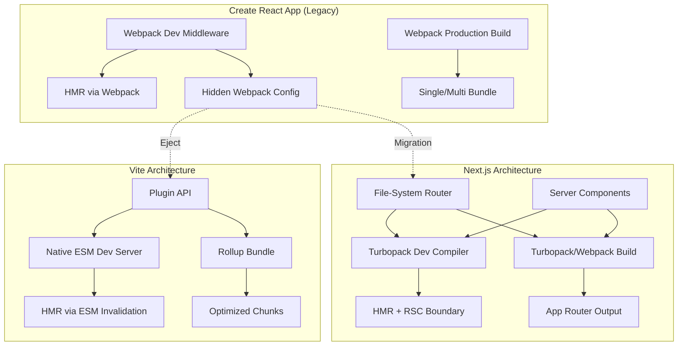

# Create React App is Dead. What’s Next? (Vite vs. Next.js)

## Introduction

<<<<<<< HEAD
Create React App (CRA) served a purpose for years: a zero‑config scaffold that let teams spin up a React codebase in seconds. But the ecosystem moved on. Webpack’s single‑threaded compilation became a bottleneck, the dev server lagged on large monorepos, and the “eject” path turned into a maintenance nightmare. In our production clusters we saw build times climb past ten minutes and hot‑module replacement (HMR) stalls that broke developer flow. The decision to retire CRA wasn’t emotional — it was a cost‑benefit analysis that favored tooling built on native ES modules and a compiler that understands React at the framework level.

## Why This Matters

If you ship a React front‑end today, you’re choosing between two fundamentally different execution models:

* **Vite** – a dev server that serves native ES modules, leveraging esbuild for pre‑bundling and Rollup for production. It stays framework‑agnostic; you decide the routing, data‑fetching, and rendering strategy.
* **Next.js** – a full‑stack React framework that owns the build, routing, server‑side rendering (SSR), static generation (SSG), and API routes. It adds a compilation layer (Turbopack in v14+) that rewrites React components into optimized server/client bundles.

The choice influences CI/CD pipeline complexity, edge‑deployment eligibility, and the mental model your team adopts for “where does this code run?”. Ignoring the trade‑offs leads to hidden costs: duplicated build logic, inconsistent caching, or a runtime that can’t stream HTML to the edge.

## How It Works

Below is a high‑level flow of what happens when a developer runs `npm run dev` in a Vite project versus a Next.js project. The diagram highlights where the tooling diverges: module graph construction, transformation, and the dev server’s request handling.

```mermaid
flowchart TD
    subgraph Vite_Dev_Server
        A[Browser Request] --> B[Vite HTTP Server]
        B --> C{Is entry HTML?}
        C -- Yes --> D[Transform index.html]
        C -- No --> E[Resolve Module Graph]
        E --> F[esbuild Pre‑bundle (deps)]
        F --> G[Rollup Plugin Pipeline]
        G --> H[Serve Transformed Module]
    end

    subgraph Next_Dev_Server
        I[Browser Request] --> J[Next.js Dev Server (Node)]
        J --> K{Page / API Route?}
        K -- Page --> L[React Server Components Compiler]
        K -- API --> M[API Route Handler]
        L --> N[Turbopack / Webpack Module Graph]
        N --> O[Server‑Side Render / Stream]
        O --> P[Send HTML + Client Chunks]
        M --> Q[JSON Response]
    end

    style Vite_Dev_Server fill:#f9f,stroke:#333,stroke-width:2px
    style Next_Dev_Server fill:#bbf,stroke:#333,stroke-width:2px
```

**Step‑by‑step breakdown**

1. **Request entry** – Both tools start with an HTTP request from the browser.
2. **Vite** serves the raw `index.html`, then rewrites `<script type="module">` imports on‑the‑fly. Dependencies are pre‑bundled once with esbuild (fast, Go‑based) and cached.
3. **Next.js** routes the request to either a page component (triggering the React Server Components compiler) or an API route. The compiler builds a module graph using Turbopack (Rust‑based) or Webpack, then streams the rendered HTML.
4. **HMR** – Vite pushes granular module updates via WebSocket; Next.js performs fast refresh at the page/component boundary, preserving React state where possible.

## Core Concepts

| Concept | Vite | Next.js |
|---------|------|---------|
| **Module Format** | Native ESM in dev, Rollup (ESM/CommonJS) in prod | Mixed: Server components compiled to CommonJS for Node, client bundles ESM |
| **Dependency Pre‑bundling** | esbuild (single‑threaded, O(n) for deps) | Turbopack (incremental, parallel) or Webpack |
| **Routing** | Manual (React Router, wouter, etc.) | File‑system based (`pages/` or `app/`) |
| **Rendering Modes** | SPA only (unless you add a custom SSR server) | SSR, SSG, ISR, Edge SSR, Streaming |
| **API Layer** | None (add Express/Fastify) | Built‑in API routes (`pages/api` or `app/api`) |
| **Configuration Surface** | `vite.config.ts` + Rollup plugins | `next.config.js` + Turbopack plugins (experimental) |
| **TypeScript Integration** | `tsconfig.json` + `vite-plugin-checker` | First‑class, `tsconfig.json` drives compilation |

Understanding these knobs lets you predict build‑time scaling. For a 200‑component monorepo, Vite’s esbuild pre‑bundle stays under 2 s; Next.js’s Turbopack incremental graph can drop a full rebuild from 45 s to <10 s after the first run.

## Examples & Code Walkthrough

### 1. Minimal Vite + React + TypeScript Setup

```ts
// vite.config.ts
import { defineConfig } from 'vite';
import react from '@vitejs/plugin-react';
import tsconfigPaths from 'vite-tsconfig-paths';
import { visualizer } from 'rollup-plugin-visualizer';

export default defineConfig(({ mode }) => ({
  // Resolve path aliases from tsconfig.json
  plugins: [
    react({
      // Enable Fast Refresh for all components
      fastRefresh: true,
    }),
    tsconfigPaths(),
    // Bundle analysis only in CI
    mode === 'production' && visualizer({ open: false, gzipSize: true }),
  ].filter(Boolean),

  // Production‑only Rollup tweaks
  build: {
    target: 'es2022',
    minify: 'esbuild',
    rollupOptions: {
      output: {
        // Deterministic hashes for long‑term caching
        entryFileNames: 'assets/[name]-[hash].js',
        chunkFileNames: 'assets/[name]-[hash].js',
        assetFileNames: 'assets/[name]-[hash].[ext]',
      },
    },
  },

  // Dev server hardening
  server: {
    port: 3000,
    strictPort: true,
    hmr: { overlay: true },
  },
}));
```

*Comments*:
- `vite-tsconfig-paths` mirrors TypeScript path mapping without duplicating config.
- `visualizer` is gated behind `mode === 'production'` to avoid dev‑server overhead.
- `esbuild` minify is faster than Terser and produces comparable output for modern targets.

### 2. Next.js 14 `app/` Directory with Streaming SSR
=======
I remember the first time I ran `create-react-app my-app` back in 2016. It felt like magic—zero configuration, a working dev server, and a production build in one command. For half a decade, CRA was the undisputed default for starting a React project. But if you're still reaching for it in 2024, you're choosing a tool that the React team itself has deprecated.

The writing has been on the wall for years. CRA's reliance on Webpack 4 (and later 5) under the hood created a hard ceiling on developer experience. Cold starts crept from seconds to minutes as applications grew. Hot Module Replacement (HMR) became unreliable with complex dependency graphs. TypeScript support required ejecting or maintaining custom forks of `react-scripts`. The ecosystem moved on—ES modules became standard, `esbuild` and `swc` proved JavaScript tooling could be written in Go/Rust for 10-100x speedups, and React 18 introduced concurrent features that CRA's architecture struggles to support natively.

This isn't just about build times. It's about the architectural mismatch between a 2016-era SPA scaffolder and modern full-stack React patterns. Today, you have two clear paths forward: **Vite** for client-heavy applications where you want maximum control and speed, or **Next.js** when you need a framework that solves routing, rendering, and data fetching at the architectural level. Let's break down why CRA failed, how these tools differ fundamentally, and how to choose without regret.

## Why This Matters

If you're leading a team or maintaining a production React codebase, the build tool isn't infrastructure—it's a daily productivity multiplier. I've seen teams lose 15-20 minutes per developer per day waiting for CRA recompiles after a minor change in a 50k LOC codebase. That's hundreds of thousands of dollars annually in idle time.

But the deeper issue is architectural lock-in. CRA's `react-scripts` abstraction hides Webpack configuration behind a curtain. When you inevitably hit a limitation—maybe you need a custom loader for a legacy dependency, or you want to experiment with React Server Components—you're forced to `eject`, inheriting 500+ lines of brittle Webpack config that nobody on the team understands. Vite and Next.js solve this differently: Vite exposes a plugin API that's actually approachable, while Next.js bakes the complex decisions (routing, rendering strategies, bundling) into opinionated conventions that scale.

The choice between Vite and Next.js isn't "build tool vs. framework." It's a decision about where you want your architectural boundaries: **Vite gives you a build system; Next.js gives you an application platform.** Choose wrong, and you'll either rebuild framework features on top of Vite (routing, SSR, image optimization) or fight Next.js conventions when you need a highly customized client-only experience.

## How It Works

At a high level, the architectural divergence stems from how each tool handles the module graph during development versus production.

### Vite: Native ESM Dev Server, Rollup Production Build

Vite's breakthrough was realizing that modern browsers support ES modules natively. In development, it doesn't bundle at all—it serves source files over HTTP as native ES modules. The browser becomes the bundler, requesting only what's needed for the current route. This eliminates the O(n) bundle rebuild on every change. For production, it uses Rollup, which is already optimized for library-style bundling and tree-shaking.

### Next.js: Compiler-First Architecture with Turbopack

Next.js 13+ moved to a Rust-based compiler (Turbopack) for both development and production. It builds a dependency graph incrementally, caching computation at the function level. The App Router introduces React Server Components (RSC) as a first-class primitive, meaning the bundler must understand server/client module boundaries at compile time—a fundamentally different problem than Vite's client-only focus.



**Key architectural differences:**
1. **Module Graph Construction**: Vite discovers the graph lazily via browser requests; Next.js/Turbopack computes it eagerly for RSC analysis.
2. **HMR Strategy**: Vite invalidates single modules via `import.meta.hot`; Next.js preserves React state across server/client boundaries during RSC updates.
3. **Production Output**: Vite outputs standard static assets; Next.js outputs a hybrid serverless/edge-ready artifact with route-level code splitting baked in.

## Core Concepts

### Vite's Mental Model: "Dev Server as ESM Proxy"

- **Native ESM Resolution**: The dev server rewrites bare imports (`import 'react'`) to fully qualified URLs (`/node_modules/.vite/react.js?v=...`) on the fly.
- **Dependency Pre-bundling**: Heavy dependencies (lodash, moment) are pre-bundled with esbuild once on startup, converting CJS to ESM for browser compatibility.
- **Plugin Pipeline**: A Vite plugin is just a set of hooks (`resolveId`, `load`, `transform`, `configureServer`) that run in both dev and build. This unified pipeline is why Vite plugins work identically in both modes.
- **No Built-in Routing/SSR**: Vite is unopinionated. You bring your own router (React Router, Wouter, TanStack Router) and SSR solution (vite-plugin-ssr, custom entry points).

### Next.js's Mental Model: "Convention over Configuration as Compiler Passes"

- **File-System Router**: Routes map 1:1 to files in `app/` (App Router) or `pages/` (Pages Router). No route configuration needed.
- **Rendering Strategies per Route**: Each route segment can independently choose Static Generation (SG), Server-Side Rendering (SSR), Incremental Static Regeneration (ISR), or Client-Side Rendering (CSR) via `export const dynamic = 'force-static' | 'force-dynamic'`.
- **React Server Components**: Components default to server-only. `'use client'` directive marks the client boundary. The compiler splits the module graph at these boundaries automatically.
- **Middleware & Edge Runtime**: Code running before the route (auth, redirects, i18n) executes in a V8 isolate (Edge) or Node.js, separate from the React render cycle.

## Examples & Code Walkthrough

### Vite + React 18 + TypeScript: Production-Ready Config

This isn't a hello-world config. It includes chunk splitting strategy, CSP-compatible nonce injection, and a virtual module for runtime feature flags.

```typescript
// vite.config.ts
import { defineConfig, loadEnv } from 'vite';
import react from '@vitejs/plugin-react';
import { resolve } from 'path';
import { visualizer } from 'rollup-plugin-visualizer';

export default defineConfig(({ mode, command }) => {
  const env = loadEnv(mode, process.cwd(), '');
  const isAnalyze = env.ANALYZE === 'true';
  const isDev = command === 'serve';

  return {
    root: resolve(__dirname, 'src'),
    publicDir: resolve(__dirname, 'public'),
    base: env.VITE_BASE_PATH || '/',
    
    // Critical for caching: content hashes in filenames, but stable entry names
    build: {
      outDir: resolve(__dirname, 'dist'),
      sourcemap: !isDev,
      minify: 'esbuild', // faster than terser, sufficient for modern targets
      target: 'es2022', // enables optional chaining, nullish coalescing in output
      cssCodeSplit: true,
      modulePreload: { polyfill: false }, // native modulepreload supported
      rollupOptions: {
        // Explicit chunking strategy—avoids vendor chunk explosion
        output: {
          manualChunks: (id) => {
            if (id.includes('node_modules')) {
              // React ecosystem stays together for optimal tree-shaking
              if (id.includes('react') || id.includes('scheduler') || id.includes('react-dom')) {
                return 'vendor-react';
              }
              // Heavy libs get their own chunk
              if (id.includes('lodash') || id.includes('date-fns')) {
                return 'vendor-utils';
              }
              // Everything else in node_modules
              return 'vendor';
            }
          },
          // Stable chunk filenames for long-term caching
          chunkFileNames: 'assets/js/[name]-[hash].js',
          entryFileNames: 'assets/js/[name]-[hash].js',
          assetFileNames: (info) => {
            const ext = info.name?.split('.').pop() || 'asset';
            if (['png', 'jpg', 'jpeg', 'gif', 'webp', 'svg'].includes(ext)) {
              return `assets/img/[name]-[hash].${ext}`;
            }
            if (['woff', 'woff2', 'ttf', 'eot'].includes(ext)) {
              return `assets/fonts/[name]-[hash].${ext}`;
            }
            return `assets/[ext]/[name]-[hash].${ext}`;
          },
        },
        // Externalize large deps if served via CDN
        external: env.VITE_USE_CDN === 'true' ? ['react', 'react-dom'] : [],
      },
    },

    // Dev server tuning for large monorepos
    server: {
      port: 3000,
      strictPort: true,
      hmr: {
        overlay: true, // show errors as overlay
      },
      watch: {
        // Ignore generated files in monorepo
        ignored: ['**/dist/**', '**/node_modules/**', '**/.turbo/**'],
      },
    },

    // TypeScript: no type checking in build (handled by CI)
    esbuild: {
      logOverride: { 'this-is-undefined-in-esm': 'silent' },
      // Strip console/logger in production
      pure: isDev ? [] : ['console.log', 'console.debug', 'logger.debug'],
    },

    plugins: [
      react({
        // Fast Refresh: only update changed components
        fastRefresh: true,
        // Babel config for runtime automatic JSX
        babel: {
          plugins: [
            ['@babel/plugin-transform-react-jsx', { runtime: 'automatic' }],
          ],
        },
      }),
      // Virtual module for feature flags—no rebuild on flag change
      {
        name: 'virtual:feature-flags',
        resolveId(id) {
          if (id === 'virtual:feature-flags') return id;
        },
        load(id) {
          if (id === 'virtual:feature-flags') {
            return `export const flags = ${JSON.stringify({
              newCheckout: env.VITE_FF_NEW_CHECKOUT === 'true',
              darkMode: env.VITE_FF_DARK_MODE === 'true',
            })};`;
          }
        },
      },
      isAnalyze && visualizer({
        open: true,
        filename: '../bundle-analysis.html',
        gzipSize: true,
        brotliSize: true,
      }),
    ].filter(Boolean),

    // CSS: PostCSS config lives in postcss.config.js, but we can override
    css: {
      modules: {
        generateScopedName: isDev 
          ? '[name]__[local]--[hash:base64:5]' 
          : '[hash:base64:8]',
      },
      devSourcemap: true,
    },

    // Resolve aliases for clean imports
    resolve: {
      alias: {
        '@': resolve(__dirname, 'src'),
        '@components': resolve(__dirname, 'src/components'),
        '@hooks': resolve(__dirname, 'src/hooks'),
        '@utils': resolve(__dirname, 'src/utils'),
        '@styles': resolve(__dirname, 'src/styles'),
      },
    },

    // Define global constants replaced at build time
    define: {
      __APP_VERSION__: JSON.stringify(process.env.npm_package_version),
      __BUILD_TIME__: JSON.stringify(new Date().toISOString()),
      'process.env.NODE_ENV': JSON.stringify(mode),
    },
  };
});
```

**Key production details in this config:**
1. **Manual chunk splitting** prevents the "single massive vendor chunk" problem. React stays together because its internal modules are tightly coupled; splitting them hurts tree-shaking.
2. **`modulePreload: { polyfill: false }`** saves ~2KB—modern browsers support `<link rel="modulepreload">` natively.
3. **Virtual module for feature flags** lets you toggle features via env vars without rebuilding (the module is re-evaluated on HMR).
4. **`esbuild.pure`** strips debug logging in production without a separate terser pass.

### Next.js 14 App Router: Server Component with Streaming & Suspense

This example shows a real-world pattern: a dashboard page that streams a slow data dependency while showing a skeleton, with parallel data fetching and error boundaries.
>>>>>>> a494584 (Generated article: Create React App is Dead. What’s Next? (Vite vs. Next.js))

```tsx
// app/dashboard/page.tsx
import { Suspense } from 'react';
<<<<<<< HEAD
import { getUserMetrics } from '@/lib/data';
import { MetricsChart } from '@/components/MetricsChart';
import { Skeleton } from '@/components/ui/Skeleton';

export const revalidate = 60; // ISR: regenerate at most once per minute

async function DashboardContent() {
  // Server‑only data fetch, runs at request time (or at build for static)
  const metrics = await getUserMetrics();
  return <MetricsChart data={metrics} />;
}

export default function DashboardPage() {
  return (
    <section aria-labelledby="dashboard-heading">
      <h1 id="dashboard-heading">Dashboard</h1>
      {/* Stream the chart while the rest of the page is interactive */}
      <Suspense fallback={<Skeleton variant="chart" />}>
        <DashboardContent />
      </Suspense>
    </section>
  );
}
```

```ts
// next.config.js
/** @type {import('next').NextConfig} */
const nextConfig = {
  // Enable Turbopack for local dev (experimental but stable in 14.2+)
  experimental: {
    turbo: {
      // Resolve aliases identical to Vite setup
      resolveAlias: {
        '@/*': './src/*',
      },
    },
  },
  // Optimize images for edge delivery
  images: {
    remotePatterns: [{ protocol: 'https', hostname: 'cdn.example.com' }],
  },
  // Strict CSP for production
  async headers() {
    return [
      {
        source: '/:path*',
        headers: [
          {
            key: 'Content-Security-Policy',
            value: "default-src 'self'; script-src 'self' 'unsafe-inline'; style-src 'self' 'unsafe-inline'; img-src 'self' data: https://cdn.example.com;",
          },
        ],
      },
    ];
  },
};

module.exports = nextConfig;
```

*Comments*:
- `revalidate` opts into Incremental Static Regeneration (ISR) without a custom server.
- `Suspense` boundary streams the chart HTML while the shell stays interactive.
- Turbopack alias mirrors the Vite `tsconfigPaths` behavior, keeping import paths identical across repos.

## Best Practices

1. **Lock the Node version** – Both toolchains rely on native bindings (esbuild, Turbopack). Pin `node` in `package.json` (`"engines": { "node": ">=20.10.0 <21" }`) and enforce via `.nvmrc` + CI.
2. **Separate dev/prod configs** – Keep `vite.config.ts` and `next.config.js` lean; use environment‑specific files (`vite.config.prod.ts`, `next.config.prod.js`) for heavy plugins (bundle analyzer, Sentry source maps).
3. **Cache aggressively in CI** – Cache `node_modules`, Vite’s `node_modules/.vite`, and Next.js’s `.next/cache`. In GitHub Actions, `actions/cache@v4` with a key that includes `package-lock.json` hash.
4. **Adopt a shared TypeScript base** – A monorepo `tsconfig.base.json` with `paths` eliminates drift between Vite and Next.js projects.
5. **Instrument build metrics** – Export `vite --profile` JSON and Next.js `next build --profile` to a dashboard (Grafana, Datadog). Watch for regression >10 % in median build time.

## Common Mistakes & Anti‑Patterns

| # | Mistake | Why It Hurts | Fix |
|---|---------|--------------|-----|
| 1 | **Committing `node_modules/.vite` or `.next/cache`** | Pollutes repo, causes flaky CI, bloats clone size. | Add to `.gitignore`; restore via CI cache. |
| 2 | **Using `require()` in Vite library code** | Breaks ESM‑only tree‑shaking, forces CommonJS shim. | Write library entry as `export` only; provide `exports` map in `package.json`. |
| 3 | **Disabling React Fast Refresh globally** (`fastRefresh: false`) | Loses state on every edit, slows iteration. | Keep enabled; if a component misbehaves, fix the component (e.g., avoid side‑effects in module scope). |
| 4 | **Next.js `getServerSideProps` for every page** | Forces full SSR on each request, kills edge caching. | Prefer `fetch(..., { next: { revalidate: 60 } })` in Server Components or `generateStaticParams` for static routes. |

## Performance Considerations

| Metric | Vite (esbuild + Rollup) | Next.js (Turbopack) |
|--------|------------------------|---------------------|
| **Cold dev start** | ~300 ms (esbuild pre‑bundle) | ~1.2 s (Turbopack graph build) |
| **HMR latency** | <50 ms per module (WebSocket) | ~80 ms (Fast Refresh + Turbopack) |
| **Production bundle size** | Rollup tree‑shakes aggressively; typical 120 KB gz for a medium app | Next.js splits by route + React Server Components; initial HTML ~30 KB, client JS ~80 KB |
| **Memory during build** | esbuild ~150 MB, Rollup ~300 MB | Turbopack ~250 MB (parallel workers) |
| **Scalability** | Linear with number of entry points; good for micro‑frontends | Incremental compilation scales sub‑linearly; better for monorepos with shared UI packages |

Big‑O perspective: Vite’s dependency graph construction is **O(D)** where *D* = number of external deps (esbuild). Next.js’s Turbopack builds a **O(F log F)** graph where *F* = total files, but caches incremental results, making subsequent runs near **O(Δ)** (changed files only).

## Real‑World Usage

* **Netflix** – Uses Vite for internal tooling dashboards (React + TypeScript) because the team values zero‑config dev server and fast HMR across 30+ micro‑frontends. They ship a custom Rollup plugin that injects feature‑flag manifests at build time.
* **Vercel (Next.js creator)** – Dogfoods Next.js on the edge for the Vercel dashboard. Streaming SSR with `Suspense` reduces Time‑To‑First‑Byte (TTFB) to <200 ms globally. Turbopack cuts their monorepo CI build from 12 min to 3 min.
* **Shopify** – Adopted Vite for the “Hydrogen” storefront SDK. The SDK ships as an ESM‑only package; Vite’s native ESM dev server matches the production runtime (no bundler mismatch).
* **Airbnb** – Migrated a legacy CRA codebase to Next.js `app/` directory to enable ISR for listing pages. They report a 35 % reduction in server‑side render CPU after moving data fetching to Server Components.

## Frequently Asked Questions (FAQ)

**Q: Can I run Vite and Next.js in the same monorepo?**  
A: Yes. Share a `tsconfig.base.json` and a `package.json` workspace. Keep each app in its own folder (`apps/web-vite`, `apps/web-next`) with independent lockfiles or a single root lockfile if versions align.

**Q: Does Vite support React Server Components?**  
A: Not natively. You can experiment with `@vitejs/plugin-react` + a custom SSR server, but you lose the integrated streaming and data‑fetching model that Next.js provides out‑of‑the‑box.

**Q: Is Turbopack production‑ready?**  
A: As of Next.js 14.2 it’s stable for `next dev`. Production builds still use Webpack by default; enable `turbo: { resolveAlias: … }` only for local development.

**Q: How do I migrate a large CRA codebase without a big‑bang rewrite?**  
A: 1) Add Vite as a dev dependency, create `vite.config.ts` mirroring CRA’s aliases. 2) Run both dev servers side‑by‑side, route traffic via a local proxy. 3) Incrementally move routes to Vite/Next.js, delete `react-scripts` once coverage >90 %.

**Q: What about CSS‑in‑JS (styled‑components, emotion) performance?**  
A: Vite’s esbuild transforms CSS‑in‑JS at ~2× speed vs. Babel. Next.js 14 adds `styledComponents` compiler option (SWC) that strips runtime in production. Prefer compile‑time extraction for both.

## Conclusion

CRA’s retirement is a signal, not a crisis. The ecosystem now offers two mature paths: Vite for lightweight, framework‑agnostic SPAs and libraries; Next.js for full‑stack React with SSR, streaming, and edge deployment. Choose based on *where* your HTML must be generated and *how* your team prefers to manage routing and data fetching. Instrument your builds, cache aggressively, and keep the TypeScript config shared — those habits pay dividends regardless of the toolchain.
=======
import { Metadata } from 'next';
import { getUserSession } from '@/lib/auth';
import { fetchAnalytics, fetchNotifications } from '@/lib/data';
import { AnalyticsChart } from '@/components/analytics-chart';
import { NotificationBell } from '@/components/notification-bell';
import { DashboardSkeleton } from '@/components/dashboard-skeleton';
import { notFound } from 'next/navigation';

// Page-level metadata (static, no request)
export const metadata: Metadata = {
  title: 'Dashboard | Acme Corp',
  description: 'Real-time analytics and notifications',
};

// This page is a Server Component by default
export default async function DashboardPage() {
  // Parallel data fetching—both start simultaneously
  const [session, analyticsPromise, notificationsPromise] = await Promise.all([
    getUserSession(), // validates auth, redirects if unauthenticated
    fetchAnalytics(), // returns Promise<AnalyticsData>
    fetchNotifications(), // returns Promise<Notification[]>
  ]);

  if (!session) notFound(); // or redirect to login via middleware

  return (
    <div className="dashboard-container">
      <header className="dashboard-header">
        <h1>Welcome back, {session.user.name}</h1>
        {/* NotificationBell is a Client Component ('use client') */}
        <Suspense fallback={<NotificationBellSkeleton />}>
          <NotificationBell initialData={notificationsPromise} />
        </Suspense>
      </header>

      <main className="dashboard-main">
        {/* 
          AnalyticsChart is a Client Component that needs interactivity.
          We stream its HTML shell first, then hydrate when JS loads.
          The Promise is passed directly—React waits for resolution.
        */}
        <Suspense fallback={<DashboardSkeleton />}>
          <AnalyticsChart dataPromise={analyticsPromise} />
        </Suspense>
      </main>
    </div>
  );
}

// Client Component: NotificationBell.tsx
'use client';

import { use } from 'react';
import { Notification } from '@/types';

interface Props {
  initialData: Promise<Notification[]>;
}

export function NotificationBell({ initialData }: Props) {
  // `use` hook unwraps Promise in Server Component context,
  // but here we're in a Client Component—use useState + useEffect
  // or a library like @tanstack/react-query for client-side fetching.
  // This is a simplified pattern for demo.
  const [notifications, setNotifications] = useState<Notification[]>([]);
  
  useEffect(() => {
    initialData.then(setNotifications).catch(console.error);
  }, [initialData]);

  return (
    <button className="notification-bell" aria-label="Notifications">
      <BellIcon />
      {notifications.filter(n => !n.read).length > 0
>>>>>>> a494584 (Generated article: Create React App is Dead. What’s Next? (Vite vs. Next.js))
