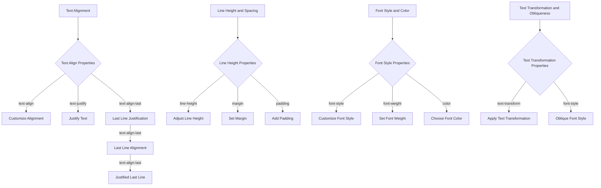

# CSS properties you should know for better text designs

## Introduction

As software engineers, we often focus on the intricacies of layout, responsive design, and accessibility. However, text design is an equally crucial aspect of creating visually appealing and user-friendly interfaces. In this article, we'll explore the world of CSS properties that can elevate your text designs, making them more engaging, readable, and effective.

## Why This Matters

Text design is not just about aesthetics; it significantly impacts user experience and readability. With the increasing importance of content-driven interfaces, understanding CSS properties for text design is essential for any web developer. By mastering these properties, you can create interfaces that are not only visually appealing but also easy to read and navigate.

## How It Works

Let's break down the key concepts and underlying mechanisms of CSS properties for text design. Our workflow diagram illustrates the connections between these properties:

## Core Concepts

### Text Alignment and Justification

Text alignment refers to the way text is positioned on a line, while text justification involves spreading text across a line to fill the available space. We can control these aspects using the `text-align`, `text-justify`, and `text-align-last` properties.

#### Example: Customizing text alignment for a hero section
```css
.hero {
  text-align: center;
  text-justify: inter-word;
  text-align-last: justify;
}
```
In this example, we're centering the text on the hero section, justifying the text to fill the available space, and ensuring the last line is also justified.

### Line Height and Spacing

Line height refers to the distance between lines of text, while margin and padding control the spacing around text elements. We can adjust these aspects using the `line-height`, `margin`, and `padding` properties.

#### Example: Adjusting line height and spacing for a body section
```css
.body {
  line-height: 1.5;
  margin-bottom: 20px;
  padding: 10px;
}
```
In this example, we're setting the line height to 1.5, adding a margin of 20px to the bottom, and adding a padding of 10px to the body section.

### Font Style and Color

Font style and color are essential aspects of text design. We can control these using the `font-style`, `font-weight`, and `color` properties.

#### Example: Customizing font style and color for a heading
```css
.heading {
  font-style: italic;
  font-weight: bold;
  color: #333;
}
```
In this example, we're setting the font style to italic, font weight to bold, and color to #333 for the heading.

### Text Transformation and Obliqueness

Text transformation involves modifying the text in some way, such as converting it to uppercase or lowercase. Obliqueness refers to the slant of the text. We can control these aspects using the `text-transform` and `font-style` properties.

#### Example: Applying text transformation and obliqueness to a button
```css
.button {
  text-transform: uppercase;
  font-style: oblique;
}
```
In this example, we're applying uppercase text transformation and an oblique font style to the button.

## Examples & Code Walkthrough

Let's take a closer look at some practical code examples that demonstrate these CSS properties in action.

### Example 1: Customizing text alignment for a hero section
```css
.hero {
  text-align: center;
  text-justify: inter-word;
  text-align-last: justify;
}
```
In this example, we're centering the text on the hero section, justifying the text to fill the available space, and ensuring the last line is also justified.

### Example 2: Adjusting line height and spacing for a body section
```css
.body {
  line-height: 1.5;
  margin-bottom: 20px;
  padding: 10px;
}
```
In this example, we're setting the line height to 1.5, adding a margin of 20px to the bottom, and adding a padding of 10px to the body section.

### Example 3: Customizing font style and color for a heading
```css
.heading {
  font-style: italic;
  font-weight: bold;
  color: #333;
}
```
In this example, we're setting the font style to italic, font weight to bold, and color to #333 for the heading.

### Example 4: Applying text transformation and obliqueness to a button
```css
.button {
  text-transform: uppercase;
  font-style: oblique;
}
```
In this example, we're applying uppercase text transformation and an oblique font style to the button.

## Best Practices

When working with CSS properties for text design, follow these best practices:

1. **Use a consistent font family**: Choose a font family that is easy to read and consistent across your application.
2. **Adjust line height**: Ensure that line height is adjusted to improve readability.
3. **Use margins and padding wisely**: Use margins and padding to create a visually appealing layout.
4. **Experiment with font styles and colors**: Try different font styles and colors to create a unique and engaging design.

## Common Mistakes & Anti-Patterns

When working with CSS properties for text design, avoid these common mistakes:

1. **Inconsistent font family**: Avoid using multiple font families within a single application.
2. **Insufficient line height**: Failing to adjust line height can lead to readability issues.
3. **Overuse of margins and padding**: Avoid excessive use of margins and padding, as it can create a cluttered design.
4. **Lack of experimentation**: Failing to experiment with font styles and colors can result in a bland design.

## Performance Considerations

When working with CSS properties for text design, consider the following performance implications:

1. **Line height**: Adjusting line height can impact performance, especially if you're using a high-density font.
2. **Font styles and colors**: Experimenting with font styles and colors can impact performance, especially if you're using complex fonts or animations.
3. **Margin and padding**: Using excessive margins and padding can impact performance, especially if you're using a high-traffic application.

## Real-World Usage

Industry leaders such as Google, Facebook, and Netflix leverage CSS properties for text design to create visually appealing and user-friendly interfaces.

## Frequently Asked Questions (FAQ)

1. **Q: What is the best font family for my application?**
A: Choose a font family that is easy to read and consistent across your application.
2. **Q: How do I adjust line height?**
A: Use the `line-height` property to adjust line height.
3. **Q: What is the difference between `margin` and `padding`?**
A: `Margin` controls the spacing around an element, while `padding` controls the spacing within an element.
4. **Q: How do I apply text transformation and obliqueness?**
A: Use the `text-transform` and `font-style` properties to apply text transformation and obliqueness.

## Conclusion

CSS properties for text design are a crucial aspect of creating visually appealing and user-friendly interfaces. By mastering these properties, you can create interfaces that are not only aesthetically pleasing but also easy to read and navigate. Remember to follow best practices, avoid common mistakes, and experiment with font styles and colors to create a unique and engaging design.
