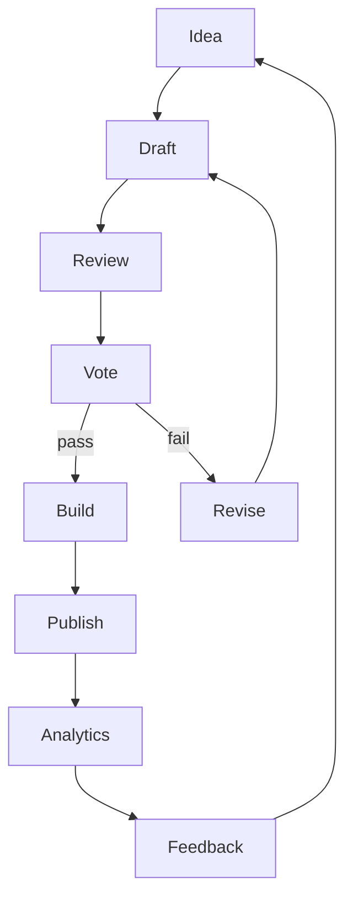

# CSS-Tricks could be a co-op

## Introduction
Chris Coyier’s CSS-Tricks has long served as a trusted source for front‑end techniques, deep dives, and community‑driven commentary. Imagine if the same platform were owned and operated by the people who create its content—writers, designers, and developers—rather than a single individual or corporate entity. This article explores how a cooperative ownership model could be reflected in the software architecture of a developer‑focused media site. We’ll walk through the technical pieces that enable shared governance, transparent revenue distribution, and community‑mediated publishing, using CSS‑Tricks as a concrete reference point.

## Why This Matters
Software engineers care about ownership models because they affect incentives, sustainability, and the velocity of innovation. When contributors have a direct stake in the platform’s success, they are more likely to invest time in quality reviews, documentation, and tooling improvements. From an architectural standpoint, a co‑op demands clear audit trails, deterministic payout logic, and pluggable governance mechanisms—concerns that intersect with CI/CD, access control, and event‑driven design. By examining these requirements, we uncover patterns that can improve any open‑source or community‑driven project, not just a media site.

## How It Works
The core of a co‑op media platform is a contribution lifecycle that balances openness with collective decision‑making. Content moves through stages where peer review, voting, and automated publishing are enforced by code rather than ad‑hoc Slack threads. The diagram below visualizes the flow from an initial idea to post‑publish analytics, highlighting where smart contracts (or simple off‑chain scripts) intervene to enforce co‑op rules.



**Step‑by‑step explanation**

1. **Idea** – A contributor opens a lightweight issue in the platform’s GitHub repo describing a proposed article or tutorial.
2. **Draft** – The author works in a private branch, submitting pull requests (PRs) that trigger a preview build.
3. **Review** – Assigned maintainers (rotated monthly via a governance token) leave comments; the PR must obtain at least two approvals.
4. **Vote** – Once approved, the PR enters a voting window where all co‑op members with ≥10 contribution points can cast a yes/no vote. A simple majority passes.
5. **Build** – On a successful vote, CI runs linting, accessibility checks, and bundles the article assets (HTML, CSS, demo embeds).
6. **Publish** – The built artifact is pushed to the static‑site bucket; a webhook notifies the newsletter and social feeds.
7. **Feedback** – Page views, time‑on‑page, and comment sentiment are collected and fed back into the contributor’s reputation score.
8. **Revise** – If the vote fails, the author revises the draft based on feedback and the cycle repeats.

All state transitions are recorded in an immutable log (e.g., Append‑only table in Postgres) to support audits and revenue calculations.

## Core Concepts
- **Contribution Token** – An ERC‑20‑like token (or a simple DB‑backed credit) that quantifies each member’s work. Tokens are minted on approved PRs and burned when a member withdraws.
- **Governance Oracle** – A off‑chain service that tallies votes, respects quorum rules, and writes the outcome to the blockchain or a trusted ledger.
- **Revenue Split Engine** – A deterministic function that allocates ad revenue, sponsorships, and membership fees based on token holdings and activity multipliers (e.g., weight for reviews vs. authoring).
- **Pluggable Preview** – A micro‑frontend system that isolates each article’s demo sandbox, preventing CSS/JS leakage across contributions.
- **Immutable Audit Log** – Append‑only store of every action (PR open, comment, vote, publish) to enable dispute resolution and historic reporting.

## Examples & Code Walkthrough
Below is a Node.js module that implements the revenue split engine. It reads contribution tokens from a PostgreSQL table, applies activity weights, and distributes a pot of funds proportionally. The code includes defensive checks, clear comments, and a simple CLI for manual runs.

```javascript
// revenue-split.js
/**
 * Calculates and disburses revenue to co‑op members based on token holdings.
 * Assumes a Postgres schema:
 *   members(id UUID PRIMARY KEY, address TEXT, token_balance BIGINT)
 *   activity_weights(member_id UUID, weight NUMERIC) -- defaults to 1.0
 *
 * This script is intentionally self‑contained for illustration.
 * In production you would wrap it in a job queue and protect DB credentials.
 */
const { Pool } = require('pg');
require('dotenv').config();

const pool = new Pool({
  connectionString: process.env.DATABASE_URL,
});

/**
 * Fetch latest token balances and activity weights.
 * @returns {Promise<Array<{id:string, address:string, tokenBalance:number, weight:number}>>}
 */
async function fetchMemberData() {
  const client = await pool.connect();
  try {
    const res = await client.query(`
      SELECT m.id, m.address, m.token_balance,
             COALESCE(aw.weight, 1.0) AS weight
      FROM members m
      LEFT JOIN activity_weights aw ON aw.member_id = m.id
    `);
    return res.rows.map(r => ({
      id: r.id,
      address: r.address,
      tokenBalance: Number(r.token_balance),
      weight: Number(r.weight),
    }));
  } finally {
    client.release();
  }
}

/**
 * Compute each member's share of the revenue pot.
 * Share = (token_balance * weight) / Σ(token_balance * weight)
 * @param {Array} members
 * @param {number} potInCents
 * @returns {Promise<Array<{address:string, amountCents:number}>>}
 */
async function computeShares(members, potInCents) {
  const weightedSum = members.reduce(
    (sum, m) => sum + m.tokenBalance * m.weight,
    0
  );
  if (weightedSum === 0) {
    throw new Error('No weighted token balance to split');
  }

  return members.map(m => {
    const raw = (m.tokenBalance * m.weight * potInCents) / weightedSum;
    // Round down to whole cent; remainder goes to community fund
    const amountCents = Math.floor(raw);
    return { address: m.address, amountCents };
  });
}

/**
 * Main entry point – expects REVENUE_POT_CENTS env var.
 */
async function run() {
  const pot = Number(process.env.REVENUE_POT_CENTS);
  if (!pot || pot <= 0) {
    console.error('Set REVENUE_POT_CENTS to a positive integer');
    process.exit(1);
  }

  try {
    const members = await fetchMemberData();
    const shares = await computeShares(members, pot);

    // In a real system you would trigger payouts via a wallet or banking API.
    // Here we simply log the result.
    console.log(`Distributing ${pot} cents among ${members.length} members:`);
    shares.forEach(s => {
      console.log(`${s.address}: ${s.amountCents} cents`);
    });
    const distributed = shares.reduce((sum, s) => sum + s.amountCents, 0);
    const remainder = pot - distributed;
    if (remainder > 0) {
      console.log(`Remainder ${remainder} cents allocated to community fund`);
    }
  } catch (err) {
    console.error('Failed to compute revenue split:', err.message);
    process.exit(1);
  } finally {
    await pool.end();
  }
}

if (require.main === module) {
  run();
}
```

**Explanation of key parts**

- **fetchMemberData** pulls token balances and optional activity weights, defaulting weight to 1.0 for members without explicit overrides.
- **computeShares** implements the proportional formula, guarding against division by zero and applying integer math to avoid floating‑point drift.
- **run** ties everything together, reads a revenue pot from the environment, and logs the distribution. In production you would replace the `console.log` with calls to a payment processor (e.g., Stripe Connect, Gnosis Safe) and persist each payout record for auditing.
- The script is deliberately free of framework magic—plain Node.js and `pg`—so it can be dropped into any CI job or admin tool.

## Best Practices
1. **Make governance explicit in code** – Encode quorum, voting periods, and token‑mint rules as smart contracts or serverless functions that cannot be bypassed by a single admin.
2. **Separate concerns** – Keep the preview sandbox (iframe/web component) independent from the main site CSS to avoid style leakage and simplify CI caching.
3. **Audit everything** – Write every state change to an immutable log; this simplifies dispute resolution and provides data for reputation algorithms.
4. **Use deterministic payouts** – Floating‑point rounding can cause cents to disappear; always use integer arithmetic and allocate remainders to a community fund.
5. **Rotate maintainers** – Prevent power concentration by automatically rotating review duties based on token‑weighted random selection.
6. **Plan for upgradeability** – Design the revenue split engine as a pluggable module so new weighting models (e.g., time‑based decay) can be swapped without downtime.

## Common Mistakes & Anti‑Patterns
| Mistake | Why it hurts | Fix |
|---------|--------------|-----|
| **Hard‑coding voting thresholds** | Makes it impossible to adapt as the co‑op grows; a fixed 50 % quorum may become unattainable. | Store thresholds in a governance table and allow members to propose changes via the same voting mechanism. |
| **Storing private keys in repo** | Leads to fund theft if the repository is public. | Use a secret manager (AWS Secrets Manager, Vault) and load keys at runtime; never commit them. |
| **Allowing direct pushes to main** | Bypasses review and voting, eroding trust. | Enforce branch protection rules requiring PR reviews and status checks before merge. |
| **Using floating‑point for money** | Rounding errors can cause under‑ or over‑payment over time. | Perform all monetary calculations in integer cents (or wei) and only format for display. |
| **Neglecting latency in preview builds** | Long wait times discourage frequent contributions. | Cache dependency layers, use incremental builds, and run lightweight lint checks in parallel with full bundle. |

## Performance Considerations
- **Contribution throughput** – The system’s bottleneck is usually the CI pipeline for preview builds. Sharding PRs across multiple runners and caching `node_modules` or `rustc` toolchains can keep average build time under two minutes for typical articles.
- **Revenue split calculation** – The algorithm is O(n) in the number of members. With a few thousand participants, a single query completes in under 100 ms on a modest Postgres instance. Indexes on `members.id` and `activity_weights.member_id` are essential.
- **Audit log writes** – Append‑only writes are cheap; however, indexing every column for ad‑hoc queries can slow inserts. Keep the log table narrow (action_type, actor_id, payload JSONB, timestamp) and create materialized views for frequent reports.
- **Network** – Static asset delivery should be served via a CDN with edge caching; the origin only needs to handle payload generation on publish, which is infrequent (< 10 req/s for a mid‑sized site).

## Real-World Usage
- **GitHub** – Uses protected branches, required reviews, and optional CODEOWNERS files to enforce a lightweight form of cooperative governance on large open‑source projects.
- **OpenCollective** – Provides transparent budgeting and expense tracking for collectives, letting members see where funds go and vote on major expenditures.
- **Mirror.xyz** – A publishing platform where writers earn tokens based on readership; the token economics are enforced by smart contracts on Ethereum, ensuring automatic and auditable splits.
- **Netflix’s internal “Studio”** – While not a co‑op, their microservices architecture isolates each team’s deployments, similar to how a micro‑frontend sandbox isolates article demos, reducing blast radius from faulty contributions.
- **Cloudflare Workers** – Demonstrates how serverless functions can execute governance logic (e.g., vote counting) with low latency and zero‑ops overhead.

## Frequently Asked Questions (FAQ)
**Q: Do we need a blockchain to run a co‑op?**  
A: No. Blockchains provide trustless execution and transparent token balances, but a traditional database with proper access controls and audit logs can achieve the same goals for many communities. Choose a blockchain only if you need censorship‑resistant payouts or cross‑border fund flows without a banking intermediary.

**Q: How do we handle a member who wants to leave?**  
A: The member submits a withdrawal request. The governance oracle verifies that the request does not violate any lock‑up periods, burns the corresponding tokens, and triggers a payout of their accrued revenue share (minus any outstanding obligations).

**Q: What if a vote is tied?**  
A: The charter can define a tie‑breaking rule—e.g., the vote of the longest‑standing member, or a random selection weighted by token balance. The rule should be coded into the governance oracle to avoid ambiguity.

**Q: Can we monetize without ads?**  
A: Yes. Membership dues, sponsored series that are clearly marked, and marketplace fees for job boards or component libraries are common alternatives. The revenue split engine works regardless of the income source; you just feed the pot into the same calculation.

**Q: How do we prevent spam or low‑quality submissions?**  
A: Require a minimum token stake to open a PR (similar to a deposit). The stake is refunded if the PR passes review; otherwise it is forfeited to the community fund. This creates an economic barrier to frivolous contributions while remaining refundable for earnest contributors.

## Conclusion
Architecting a developer‑focused media site as a cooperative is less about inventing new technology and more about composing existing patterns—protected branches, token‑based reputation, deterministic payouts, and immutable logging—into a system that aligns incentives with collective ownership. By treating governance as a first‑class concern in the codebase, we create platforms where contributors feel genuine stewardship, leading to higher quality work and longer‑term sustainability. Whether you are running a modest side project or reimagining an established brand like CSS‑Tricks, these principles offer a practical roadmap to shared ownership in the web development ecosystem.
