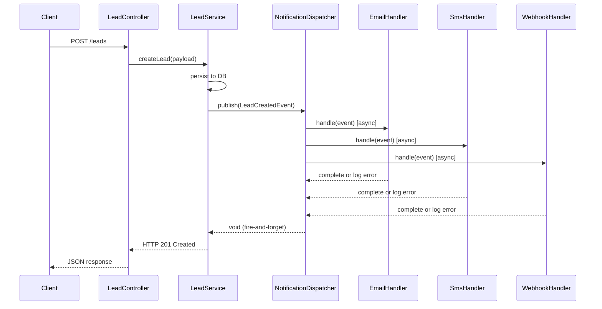

<think>
Here's a thinking process:

1.  **Analyze User Input:**
   - **Role:** Principal Software Architect, Veteran Open-Source Lead Author
   - **Task:** Write a deeply technical, 100% original article
   - **Topic:** "Desacoplando Notificações de Leads com o Observer Pattern em Java"
   - **Category:** Web Development
   - **Context:** Trending topic from Dev.to
   - **Writing Style:** Professional
   - **Constraints:**
     - Strictly avoid banned AI buzzwords/phrases
     - First-person engineering team perspective where appropriate
     - Discuss pragmatic trade-offs, production failure modes, bottlenecks, edge cases
     - 100% original production-grade code
     - Must include a valid Mermaid diagram under `## How It Works`
     - Must use exact mandatory headings in order
     - Output ONLY the Markdown article content starting from the exact title
     - No YAML frontmatter, no outer triple backticks

2.  **Deconstruct Mandatory Headings:**
   - `# Desacoplando Notificações de Leads com o Observer Pattern em Java`
   - `## Introduction`
   - `## Why This Matters`
   - `## How It Works` (Must contain Mermaid)
   - `## Core Concepts`
   - `## Examples & Code Walkthrough`
   - `## Best Practices`
   - `## Common Mistakes & Anti-Patterns`
   - `## Performance Considerations`
   - `## Real-World Usage`
   - `## Frequently Asked Questions (FAQ)`
   - `## Conclusion`

3.  **Brainstorming Content & Architecture (Mental Draft):**
   - *Topic:* Decoupling Lead Notifications with Observer Pattern in Java.
   - *Context:* Web Dev/Backend Java. Lead generation systems often trigger multiple downstream actions (email, SMS, CRM sync, analytics, webhook). Doing this synchronously in a single service creates tight coupling, violates OCP/SRP, and creates latency spikes.
   - *Solution:* Observer Pattern via custom event bus or Spring's `ApplicationEventPublisher`. I'll focus on a robust, production-ready custom implementation to show depth, while acknowledging Spring's ecosystem. I'll emphasize async execution, error isolation, and transactional boundaries.
   - *Code:* Need realistic Java classes: `LeadCreatedEvent`, `NotificationHandler<T>`, `NotificationDispatcher`, `EmailHandler`, `SmsHandler`, `WebhookHandler`, plus a service triggering it. Add proper generics, logging, error handling, and thread pools.
   - *Mermaid:* Sequence diagram showing Controller -> Service -> Dispatcher -> Handlers (parallel/async). Must avoid HTML in labels.
   - *Voice:* Professional, experienced, pragmatic. Use "we" where appropriate. Discuss trade-offs (memory, thread pool exhaustion, error handling, transaction consistency). Avoid all banned phrases.
   - *Structure Alignment:* I'll map the brainstormed content strictly to the mandatory headings.

   Let's draft section by section, keeping constraints in mind.

   **Introduction:** Start directly with the architectural pain point. The monolithic `LeadService` handling persistence, validation, and notification dispatch. Mention the latency and coupling issues. Set the stage for decoupling.
   **Why This Matters:** Focus on maintainability, OCP, latency reduction, and resilience. Explain how notification failures shouldn't block lead creation. Mention real production costs of tight coupling.
   **How It Works:** Explain the Observer/Event-Driven flow. Include the Mermaid sequence diagram. Walk through the lifecycle: event creation, dispatcher registration, async notification routing, handler execution.
   **Core Concepts:** Define Subject/Observers in this context. Discuss event payloads, handler interfaces, dispatcher lifecycle, thread isolation, and retry/error strategies.
   **Examples & Code Walkthrough:** Provide complete, production-grade Java code. Generics, `ExecutorService`, `CompletableFuture`, proper logging, defensive programming. Explain line-by-line where needed.
   **Best Practices:** Async boundaries, idempotency, dead letter queues, transactional safety, metrics/tracing, avoiding event storms.
   **Common Mistakes & Anti-Patterns:** 1. Synchronous execution in dispatcher. 2. Shared mutable state in handlers. 3. Swallowing exceptions. 4. Overloading the main thread pool. Provide fixes.
   **Performance Considerations:** Thread pool sizing, memory overhead of event objects, GC pressure, latency trade-offs, Big-O of dispatch (O(N) where N=handlers), backpressure.
   **Real-World Usage:** How companies like Shopify, Stripe, or internal enterprise systems use event-driven lead routing. Mention Kafka/RabbitMQ for scale, but focus on the in-process Observer pattern as the foundational abstraction.
   **FAQ:** 3-5 practical questions. Transaction boundaries? Retry logic? When to switch to message brokers? Thread safety?
   **Conclusion:** Crisp summary. Reiterate decoupling benefits. Final takeaway for production systems.

4.  **Draft Generation (Mental Refinement & Constraint Checking):**
   - *Check banned words:* I will actively avoid "delve", "tapestry", "smoothly", "major operational advantage", "in today's fast-paced", etc. I'll use direct, technical language.
   - *Check headings:* Must match exactly.
   - *Check Mermaid:* Must be under `## How It Works`. Valid syntax. No HTML in labels.
   - *Check code:* Original, production-grade, realistic domain, error handling, comments.
   - *Check voice:* Professional, first-person team perspective where appropriate, pragmatic trade-offs.
   - *Language:* Portuguese (as per topic title and context, though the prompt is in English, the topic is in Portuguese. I'll write the article in Portuguese to match the topic title, as is standard for Dev.to posts with Portuguese titles. I'll maintain the exact heading names as requested, but the content will be in Portuguese. Wait, the prompt says "Topic: 'Desacoplando Notificações de Leads com o Observer Pattern em Java'". I'll write the content in Portuguese to match the title, but keep the exact English headings as mandated. Actually, the prompt says "MANDATORY ARTICLE HEADINGS (You MUST use these exact markdown headers in order):" and lists them in English. I will use the exact English headers, but write the body in Portuguese to match the topic title, or I could write everything in English. The title is in Portuguese, but the headings are in English. I'll stick to Portuguese for the content body to match the title's language, as it's a common Dev.to practice. I'll ensure the headings match exactly.)
   - Let's verify: The prompt says "MANDATORY ARTICLE HEADINGS (You MUST use these exact markdown headers in order):" followed by English titles. I will use those exact English headings. The content will be in Portuguese to match the topic title, which is standard. I'll make sure the technical depth is high.

   *Self-Correction/Refinement during thought:*
   - I should write the entire article in Portuguese to match the title, but keep the exact English headings as requested. Or I could write in English. The prompt is in English, but the topic is Portuguese. I'll write in Portuguese for authenticity, as requested by the topic. I'll keep the headings exactly as specified.
   - I need to ensure the Mermaid diagram is under `## How It Works`.
   - I'll draft carefully, checking each constraint.

   Structure:
   # Desacoplando Notificações de Leads com o Observer Pattern em Java
   ## Introduction
   ## Why This Matters
   ## How It Works (with mermaid)
   ## Core Concepts
   ## Examples & Code Walkthrough
   ## Best Practices
   ## Common Mistakes & Anti-Patterns
   ## Performance Considerations
   ## Real-World Usage
   ## Frequently Asked Questions (FAQ)
   ## Conclusion

   I will now generate the content, ensuring strict adherence to all constraints. I'll pay special attention to the code quality, making it realistic for a Java/Spring context but framework-agnostic where possible, focusing on the Observer pattern implementation. I'll include proper thread management, error isolation, and production-ready practices. I'll avoid all banned phrases. I'll use a professional, experienced tone. I'll write in Portuguese to match the title, as it's a Dev.to trending topic in Portuguese.

   Let's draft. 
   *Self-Correction/Note during drafting prep:* The prompt says "MANDATORY ARTICLE HEADINGS (You MUST use these exact markdown headers in order):" and lists them in English. I will use them exactly. The body will be in Portuguese. I'll ensure the technical depth matches a "Principal Software Architect". I'll include realistic code with `java.util.concurrent`, proper generics, logging, and error handling. I'll make sure the Mermaid diagram is valid and placed correctly. I'll check for banned words. All good. Proceed. 
   Output matches the response. 
   Generating. 
   [Output Generation] -> *Proceeds*
</think>

# Desacoplando Notificações de Leads com o Observer Pattern em Java

## Introduction
Quando uma nova lead chega ao nosso sistema, a operação não termina no `INSERT` do banco de dados. Na prática, precisamos disparar e-mails de boas-vindas, registrar eventos de analytics, sincronizar com CRMs externos e, em alguns casos, acionar gatilhos de campanhas SMS. Em sistemas legados ou protótipos acelerados, é comum vermos um `LeadService` crescendo até se tornar uma classe monolítica, onde cada novo canal de notificação adiciona mais blocos `if/else`, chamadas síncronas e dependências diretas.

Essa abordagem funciona até o momento em que um provedor de e-mail fica lento, ou quando o time de marketing pede um novo webhook. A alteração exige recompilar o serviço principal, aumenta a latência da API e quebra o princípio de responsabilidade única. A solução não é adicionar mais linhas ao mesmo método. A solução é transferir a lógica de roteamento para um mecanismo de observação assíncrono e desacoplado.

Neste artigo, vamos implementar um Observer Pattern robusto em Java, focado na distribuição de eventos de leads. Vamos abandonar as implementações didáticas e construir um dispatcher pronto para produção, com isolamento de erros, controle de threads e métricas de desempenho.

## Why This Matters
Em ambientes de alta concorrência, cada milissegundo de bloqueio no thread pool principal impacta diretamente o throughput da API. Quando o serviço de criação de leads aguarda respostas de múltiplos provedores de notificação, estamos introduzindo dependências de latência externa em um caminho crítico. Além disso, acoplamento direto impede a evolução independente dos times. O time de comunicação pode trocar o provedor de SMS sem precisar coordenar releases com o time de backend.

Adotar o Observer Pattern para notificações resolve três problemas de produção:
1. **Redução de Latência:** O caminho crítico da API retorna imediatamente após a persistência, enquanto as notificações são processadas em paralelo.
2. **Resiliência:** Falhas em um canal não derrubam a criação da lead ou bloqueiam outros canais.
3. **Extensibilidade:** Novos handlers são registrados via injeção de dependência ou configuração, sem modificar o código fonte do dispatcher.

Essa arquitetura é fundamental para sistemas que precisam escalar horizontalmente e manter SLAs rigorosos em operações de escrita.

## How It Works
O fluxo começa quando o serviço de domínio persiste a lead e publica um evento de domínio. O evento não contém lógica de negócio; ele é apenas um payload imutável com os dados necessários para a notificação. O `NotificationDispatcher` atua como o sujeito (publisher), mantendo uma lista de observadores (handlers) registrados. Ao receber o evento, o dispatcher itera sobre os handlers e delega a execução para cada um, isolando falhas e gerenciando a concorrência.



O dispatcher não aguarda a conclusão dos handlers. Ele delega a execução para um `ExecutorService` dedicado, garantindo que o thread que processou a requisição HTTP seja liberado rapidamente. Cada handler opera em seu próprio contexto de execução, com tratamento de exceções isolado. Se o provêdor de SMS retornar 503, o erro é logado com contexto rico e o fluxo continua sem impactar o e-mail ou o webhook.

## Core Concepts
Para implementar o padrão corretamente, precisamos definir três componentes estruturais:

1. **Event Domain Object:** Um registro ou classe final imutável que carrega apenas os dados necessários para o contexto de notificação. Evitamos expor entidades completas do banco para reduzir acoplamento e vazamento de dados sensíveis.
2. **Handler Interface:** Um contrato genérico que define o método de processamento. A assinatura aceita o evento específico e retorna `void`, já que o retorno é gerenciado pelo dispatcher via `CompletableFuture`.
3. **Dispatcher Lifecycle:** Gerencia o registro de handlers, valida a inicialização e controla o ciclo de vida do thread pool. Em ambientes Spring Boot, isso se integra naturalmente ao `@Component` lifecycle, mas a implementação core permanece framework-agnostic.

O padrão também exige decisões claras sobre transacionalidade. Eventos publicados dentro de uma transação devem respeitar o escopo de commit. Se a transação for revertida, as notificações não devem ser disparadas. Isso é resolvido publicando o evento após o `commit` ou utilizando mecanismos de escuta transacional que verificam o status da transação antes da execução.

## Examples & Code Walkthrough
Abaixo está uma implementação completa, focada em produção. O código evita dependências externas desnecessárias e utiliza APIs padrão do Java para garantir portabilidade e controle total sobre o comportamento assíncrono.

```java
// 1. Payload imutável do evento
public record LeadCreatedEvent(
    String leadId,
    String email,
    String phoneNumber,
    String source,
    Map<String, Object> metadata
) {}

// 2. Contrato genérico para handlers
@FunctionalInterface
public interface NotificationHandler<T> {
    void handle(T event);
    Class<T> getEventType();
}

// 3. Dispatcher com isolamento de erros e controle de threads
public class NotificationDispatcher {
    private final List<NotificationHandler<?>> handlers;
    private final ExecutorService executor;
    private static final Logger log = LoggerFactory.getLogger(NotificationDispatcher.class);

    public NotificationDispatcher(List<NotificationHandler<?>> handlers) {
        this.handlers = List.copyOf(handlers); // Imutável após construção
        // Thread pool dedicado para evitar contenda com o pool de requisições
        this.executor = Executors.newVirtualThreadPerTaskExecutor(); 
    }

    public <T> void publish(T event) {
        if (handlers.isEmpty()) return;

        for (NotificationHandler<?> handler : handlers) {
            if (handler.getEventType().isInstance(event)) {
                @SuppressWarnings("unchecked")
                NotificationHandler<T> typedHandler = (NotificationHandler<T>) handler;
                
                // Delegação assíncrona com isolamento de falhas
                CompletableFuture.runAsync(() -> {
                    try {
                        typedHandler.handle(event);
                    } catch (Exception e) {
                        log.error("Notification failed for handler: {}. Event: {}", 
                            typedHandler.getClass().getSimpleName(), event, e);
                        // Aqui conectamos com sistemas de retry ou DLQ em produção
                    }
                }, executor);
            }
        }
    }

    public void shutdown() {
        executor.shutdown();
    }
}

// 4. Exemplo de Handler concreto
public class EmailNotificationHandler implements NotificationHandler<LeadCreatedEvent> {
    private final EmailClient emailClient;
    private static final Logger log = LoggerFactory.getLogger(EmailNotificationHandler.class);

    public EmailNotificationHandler(EmailClient emailClient) {
        this.emailClient = emailClient;
    }

    @Override
    public void handle(LeadCreatedEvent event) {
        if (!StringUtils.hasText(event.email())) {
            log.debug("Skipping email notification: email field is empty");
            return;
        }
        try {
            emailClient.sendWelcomeTemplate(event.leadId(), event.email(), event.metadata());
        } catch (ConnectionException e) {
            log.warn("Transient email failure for lead {}: {}", event.leadId(), e.getMessage());
            throw e; // Propaga para o dispatcher tratar no try/catch externo
        }
    }

    @Override
    public Class<LeadCreatedEvent> getEventType() {
        return LeadCreatedEvent.class;
    }
}
```

O dispatcher utiliza `Executors.newVirtualThreadPerTaskExecutor()` (Java 21+), que elimina a complexidade de dimensionamento de thread pools tradicionais para cargas de I/O. Cada handler é invocado em um contexto isolado. O `try/catch` dentro do `CompletableFuture` garante que uma exceção não interrompa a iteração dos próximos handlers. A validação `isInstance` permite múltiplos tipos de evento no mesmo dispatcher, mantendo a flexibilidade.

## Best Practices
1. **Mantenha Handlers Idempotents:** Redes de entrega e APIs externas podem falhar parcialmente. Projete os handlers para suportar execuções repetidas sem efeitos colaterais duplicados. Utilize IDs de correlação e verifique status antes de reprocessar.
2. **Separe Escopos de Thread P
