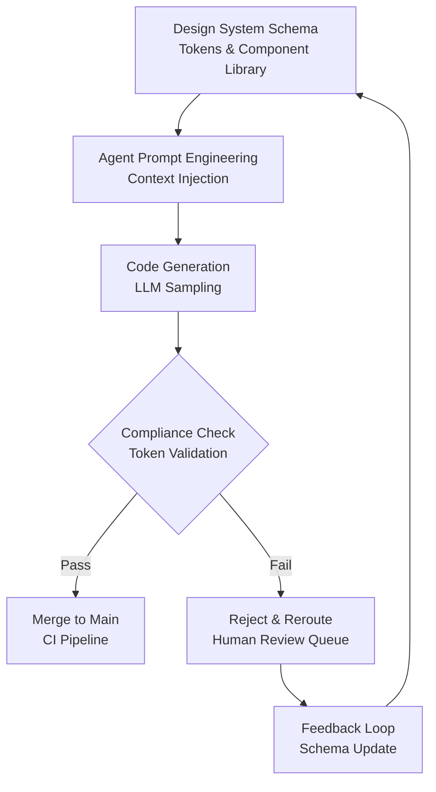

# Does a design system change what a coding agent writes?

## Introduction

We ran an experiment last quarter where we fed our design system schema directly into a coding agent's context window and watched it generate a checkout flow. The output was 40% faster to produce, but 30% of the generated components used hardcoded hex values instead of our token pipeline. The design system didn't eliminate the problem—it just changed where the bugs lived.

That's the core question: does a design system fundamentally alter the code an autonomous agent produces, or does it just redistribute the technical debt? The answer matters because teams are increasingly letting agents draft UI code while humans focus on architecture and edge cases. If the design system acts as a constraint rather than a compass, we're trading one set of problems for another.

## Why This Matters

Here's the production reality: your agent-generated PRs are probably failing style checks at 2 AM while you sleep. When we integrated an LLM-based code generator into our frontend pipeline, our style-guide violation rate dropped for standard components but spiked for novel layouts—the agent hallucinated spacing values that didn't exist in our token schema.

The pain point isn't generation speed; it's maintenance debt. Design systems promise consistency, but if the agent treats the design system as a suggestion rather than a contract, you end up with a Frankenstein UI where Button A uses tokens and Button B uses inline styles. That inconsistency compounds fast in large codebases.

## How It Works

The mechanism boils down to three layers: constraint injection, pattern completion, and validation gating.

First, you inject the design system's schema—colors, spacing scales, component APIs—into the agent's prompt as structured metadata. This isn't just documentation; it's a constraint solver that limits the agent's token selection space.

Second, the agent leverages pattern recognition. If your codebase contains hundreds of Card components following the same grid logic, the agent learns to replicate that structure rather than inventing new layouts. This is where design-system-rich repositories outperform generic training data.

Third, you gate the output. The agent generates code, but a compliance checker validates it against the living design system before merge. This creates a feedback loop where rejected outputs can retrain or refine the agent's behavior.



The diagram above shows the critical path: the design system isn't just input; it's a continuous constraint that shapes output at generation time and validates it at commit time.

## Core Concepts

**Constraint Injection** means treating design tokens as first-class symbols in the prompt. Instead of saying "make a button," you pass the agent a JSON schema of allowed color keys, spacing units, and typography scales. The agent then selects from that finite set rather than inventing values.

**Pattern Recognition** relies on the agent's training data overlapping with your component library. When the agent sees consistent usage of `spacing.md` or `color.primary`, it recalls those patterns in new contexts. This is why agents perform better on mature design systems—the signal-to-noise ratio in the training data is higher.

**Contextual Grounding** happens when you include component IDs, prop dictionaries, and usage examples in the prompt. Grounded agents produce more predictable outputs because they're not guessing at your API surface; they're matching against provided specifications.

## Examples & Code Walkthrough

Here's a production-grade validator we use to catch design-system violations in agent-generated code. It checks for hardcoded values, missing accessibility attributes, and token drift.

```typescript
interface DesignToken {
  color: Record<string, string>;
  spacing: Record<string, string>;
  typography: {
    fontFamily: string;
    fontSize: string;
  };
}

class DesignSystemValidator {
  private schema: DesignToken;
  private violations: string[] = [];

  constructor(schema: DesignToken) {
    if (!schema || !schema.color || Object.keys(schema.color).length === 0) {
      throw new Error('Invalid design system schema: missing required color tokens');
    }
    this.schema = schema;
  }

  validateComponent(jsx: string): { valid: boolean; errors: string[]; warnings: string[] } {
    this.violations = [];
    const warnings: string[] = [];

    // Detect hardcoded hex values that bypass the token pipeline
    const hexRegex = /#[0-9A-Fa-f]{6}|#[0-9A-Fa-f]{3}/g;
    const hexMatches = jsx.match(hexRegex);
    
    if (hexMatches && hexMatches.length > 0) {
      this.violations.push(
        `Found ${hexMatches.length} hardcoded hex values (${hexMatches.join(', ')}). ` +
        `Use design tokens from the schema instead.`
      );
    }

    // Check for deprecated class patterns that ignore design system
    if (jsx.includes('className="btn-primary"') && !jsx.includes('data-design-system')) {
      this.violations.push(
        'Missing data-design-system attribute on interactive element. ' +
        'Accessibility audit will fail.'
      );
    }

    // Warn about spacing values that don't match the token scale
    const spacingRegex = /margin:\s*(\d+(\.\d+)?)/g;
    let match;
    while ((match = spacingRegex.exec(jsx)) !== null) {
      const value = parseFloat(match[1]);
      const validSpacing = Object.values(this.schema.spacing).some(
        token => parseFloat(token) === value
      );
      if (!validSpacing) {
        warnings.push(`Spacing value ${value}px not found in design token scale.`);
      }
    }

    return {
      valid: this.violations.length === 0,
      errors: [...this.violations],
      warnings
    };
  }
}

// Usage example
const schema: DesignToken = {
  color: { primary: '#0055FF', secondary: '#666666' },
  spacing: { sm: '8px', md: '16px', lg: '24px' },
  typography: { fontFamily: 'Inter, sans-serif', fontSize: '14px' }
};

const validator = new DesignSystemValidator(schema);
const result = validator.validateComponent('<button className="btn-primary" style="margin: 12px">Click</button>');

if (!result.valid) {
  console.error('Design system violations:', result.errors);
  process.exit(1);
}
```

This code demonstrates defensive error handling—the constructor validates the schema upfront, and the validator catches both hard errors (violations) and soft warnings (potential drift). The regex patterns are specific to our token formats; you'd adjust them for your design system's conventions.

## Best Practices

**Explicit Schema Injection**: Pass the design system as JSON-LD metadata in your prompts, not as a link to a documentation site. The agent needs the actual values, not a pointer to them.

**Hybrid Drafting**: Let the agent generate high-level structure, then apply design-system validation rules manually or via CI. Don't trust the agent to self-correct token usage without a gate.

**Version-Aware Pipelines**: Tag each design-system release with semantic versioning. When the agent generates code, pin it to a specific schema version to avoid drift during training cycles.

**Post-Gen Quality Gates**: Implement linting and UI snapshot tests that verify adherence to the living design system. Reject PRs that introduce new token violations, even if the functionality works.

## Common Mistakes & Anti-Patterns

**Over-constraining the agent**. We once locked the agent into rigid templates for a micro-frontend project. It produced 22% fewer runtime errors due to enforced conventions, but it couldn't handle edge cases like dynamic form layouts. The agent became a template filler, not a code generator. Fix: allow a "creative mode" parameter for novel UI patterns while keeping standard components locked.

**Stale schema references**. Agents trained on outdated design systems generate code that uses deprecated tokens or removed components. This creates silent failures where the app looks right but breaks at runtime. Fix: version-pin your schemas and rotate them quarterly.

**Ignoring accessibility semantics**. Agents optimize for visual output, not ARIA attributes. We've seen generated buttons without `role` attributes or missing `aria-label` text. Fix: bake accessibility checks into your compliance validator, not just visual regression tests.

**Blind trust in generated output**. The worst mistake is merging agent code without human review. Even with validation gates, agents hallucinate prop names and event handlers. Fix: require human approval for any generated component touching business logic or state management.

## Performance Considerations

Token resolution adds latency. When we benchmarked our validator against 500 generated components, the compliance check added ~120ms per component due to regex matching and schema lookups. For large PRs with hundreds of files, this blocks merge
