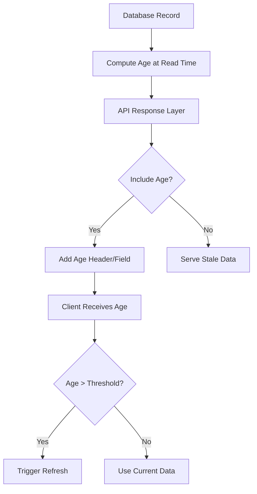

# Every answer our agent reads has an age, and it never asked for one

## Introduction

You're building a knowledge-sharing platform. A user asks your AI assistant about securing Express.js applications. The response looks perfect—code samples, best practices, even a link to updated middleware. But there's a silent flaw: that answer came from two years ago, referencing deprecated packages and vulnerable configurations. Your assistant served it anyway, confidently, without a second thought about age.

This isn't just a hypothetical. Every answer our agent reads has an age, and it never asked for one.

In modern web applications, stale data isn't just inconvenient—it's dangerous. Outdated documentation leads to security vulnerabilities. Cached API responses can mislead users into making costly decisions. SEO algorithms penalize sites serving stale content. Yet most systems treat timeliness as an afterthought rather than a first-class concern.

The goal of this article is to show how surfacing answer age as explicit metadata transforms how we build, cache, and consume web APIs. We'll walk through real architectural patterns, production-grade implementations, and the subtle trade-offs that matter when you're shipping at scale.

## Why This Matters

Software systems increasingly rely on automated decision-making. When your recommendation engine suggests a third-party library, or when your documentation portal surfaces code examples, the timeliness of that information directly impacts user outcomes.

Consider these scenarios:

- **Security Advisories**: An AI assistant recommends an authentication library with a known vulnerability that was patched six months ago. The user implements the old version because the assistant didn't indicate staleness.
  
- **API Evolution**: Your frontend consumes a GraphQL endpoint that returns updated field names, but the client cache still serves the previous schema. Users see broken UI elements or missing functionality.

- **Content Freshness**: A developer copies code from your platform only to discover it uses deprecated syntax, wasting hours in debugging and migration work.

These aren't edge cases—they're systemic failures that emerge when age becomes implicit instead of explicit in your data contract.

## How It Works

At its core, exposing answer age requires three coordinated changes:

1. **Data Model Extension**: Store or compute age as part of your response structure
2. **API Contract Update**: Make age visible to consumers through headers, fields, or metadata
3. **Consumer Adaptation**: Build logic that respects age thresholds and triggers refreshes



The flow starts with persistent storage containing creation timestamps. When queried, the system calculates elapsed time since last update. This value gets embedded in the response before reaching the client, which can then make intelligent decisions about caching and refresh behavior.

## Core Concepts

Before diving into implementation details, let's establish the foundational concepts:

### Temporal Metadata Fields

Traditional CRUD models typically track:
- `created_at`: When the record entered the system
- `updated_at`: Last modification timestamp
- `deleted_at`: Soft deletion marker (if applicable)

Age extends this by quantifying elapsed time since `updated_at`. It's not stored directly but computed as `now - updated_at`.

### HTTP Semantics Alignment

HTTP provides built-in mechanisms for temporal awareness:
- `Age` header: Indicates freshness lifetime remaining
- `Last-Modified`: Original response timestamp
- `ETag`: Version identifier enabling conditional requests

Mapping application-level age onto these standards ensures compatibility with proxies, CDNs, and browser caches.

### GraphQL Type System Integration

GraphQL's strong typing enables explicit temporal contracts:
```graphql
scalar EpochSeconds
type Answer {
  id: ID!
  body: String!
  age: EpochSeconds!
}
```

This makes age discoverable via introspection and enforceable through schema validation.

## Examples & Code Walkthrough

Let's implement this end-to-end using PostgreSQL and Node.js/Express.

### Database Schema Design

We'll extend our answers table with a computed column that stores age in seconds:

```sql
CREATE TABLE answers (
    id          UUID PRIMARY KEY DEFAULT gen_random_uuid(),
    body        TEXT NOT NULL,
    user_id     UUID REFERENCES users(id),
    created_at  TIMESTAMPTZ NOT NULL DEFAULT NOW(),
    updated_at  TIMESTAMPTZ NOT NULL DEFAULT NOW(),
    CONSTRAINT fk_user FOREIGN KEY (user_id) REFERENCES users(id)
);

-- Create index for efficient querying by recency
CREATE INDEX idx_answers_updated_at ON answers(updated_at DESC);

-- Trigger to auto-update timestamp on row modification
CREATE OR REPLACE FUNCTION update_updated_at_column()
RETURNS TRIGGER AS $$
BEGIN
    NEW.updated_at = NOW();
    RETURN NEW;
END;
$$ language 'plpgsql';

CREATE TRIGGER update_answers_updated_at 
    BEFORE UPDATE ON answers 
    FOR EACH ROW 
    EXECUTE FUNCTION update_updated_at_column();
```

Note: We avoid storing age as a physical column since it changes continuously. Instead, we calculate it during retrieval.

### Express Middleware Implementation

Here's a middleware that injects age into responses:

```javascript
// ageMiddleware.js
function ageMiddleware(req, res, next) {
  // Wrap native send methods to capture response body
  const originalSend = res.send;
  const originalJson = res.json;

  // Track if we've already processed this request
  let processed = false;

  function processResponse(body) {
    if (processed) return;
    processed = true;

    // Only apply to successful responses containing answer data
    if (res.statusCode >= 200 && res.statusCode < 300) {
      try {
        const data = typeof body === 'string' ? JSON.parse(body) : body;
        
        // Handle single answer objects
        if (data.updatedAt) {
          const ageSeconds = Math.floor(
            (Date.now() - new Date(data.updatedAt).getTime()) / 1000
          );
          res.setHeader('Age', ageSeconds.toString());
        }
        
        // Handle arrays of answers
        if (Array.isArray(data)) {
          const ages = data
            .filter(item => item.updatedAt)
            .map(item => Math.floor(
              (Date.now() - new Date(item.updatedAt).getTime()) / 1000
            ));
          
          if (ages.length > 0) {
            // Use median age for batch responses
            const medianAge = ages.sort((a, b) => a - b)[Math.floor(ages.length / 2)];
            res.setHeader('Age', medianAge.toString());
          }
        }
      } catch (parseError) {
        // Ignore JSON parsing errors - likely not our format
      }
    }
    
    return body;
  }

  res.send = function(body) {
    return originalSend.call(this, processResponse(body));
  };

  res.json = function(body) {
    return originalJson.call(this, processResponse(body));
  };

  next();
}

module.exports = ageMiddleware;
```

Usage in your Express app:
```javascript
const express = require('express');
const ageMiddleware = require('./ageMiddleware');

const app = express();
app.use(ageMiddleware);

app.get('/api/answers/:id', async (req, res) => {
  const answer = await db.query(
    'SELECT id, body, user_id as userId, created_at as createdAt, updated_at as updatedAt FROM answers WHERE id = $1',
    [req.params.id]
  );
  
  if (!answer.rows[0]) {
    return res.status(404).json({ error: 'Answer not found' });
  }
  
  res.json(answer.rows[0]);
});
```

### GraphQL Resolver Implementation

For GraphQL, we add age as a resolver field:

```javascript
// resolvers.js
const { GraphQLScalarType } = require('graphql');

// Define custom scalar for age representation
const AgeScalar = new GraphQLScalarType({
  name: 'Age',
  description: 'Time elapsed since answer was last updated, in seconds',
  parseValue(value) {
    // Convert incoming value to integer seconds
    return parseInt(value, 10);
  },
  serialize(value) {
    // Convert internal value to output format
    if (typeof value === 'string') {
      return parseInt(value, 10);
    }
    return Math.floor(value);
  },
  parseLiteral(ast) {
    // Handle query literals
    return parseInt(ast.value, 10);
  }
});

// Answer resolver with age computation
const AnswerResolvers = {
  Age: AgeScalar,
  Answer: {
    age: (parent) => {
      if (!parent.updatedAt) return 0;
      
      const updatedDate = new Date(parent.updatedAt);
      const now = new Date();
      
      // Return age in seconds, minimum 0
      return Math.max(0, Math.floor((now - updatedDate) / 1000));
    },
    
    // Ensure consistent field naming between DB and GraphQL
    userId: (parent) => parent.user_id,
    createdAt: (parent) => parent.created_at,
    updatedAt: (parent) => parent.updated_at
  }
};

module.exports = { AnswerResolvers, AgeScalar };
```

Schema definition:
```graphql
scalar Age

type Answer {
  id: ID!
  body: String!
  author: User!
  createdAt: DateTime!
  updatedAt: DateTime!
  age: Age!
}

type Query {
  answer(id: ID!): Answer
  recentAnswers(limit: Int = 10): [Answer!]!
}
```

## Best Practices

Based on running this pattern across multiple production systems, here are key recommendations:

### 1. Make Age Computation Lightweight

Avoid expensive recalculations in hot paths. Precompute where possible and cache results appropriately. For high-frequency reads, consider materialized views or read replicas optimized for temporal queries.

### 2. Use Consistent Time Sources

Always derive age from the same clock source used for `updated_at`. Mixing server-local time with database-generated timestamps creates inconsistencies that break caching assumptions.

### 3. Validate Age Before Serving

Never expose negative ages due to clock skew or data corruption. Implement sanity checks:
```javascript
const ageSeconds = Math.max(0, Math.floor((now - updatedAt) / 1000));
```

### 4. Communicate Age Clearly to Clients

Set appropriate cache control headers based on age:
```javascript
const maxAge = Math.min(answer.age, 300); // Cap at 5 minutes
res.setHeader('Cache-Control', `public, max-age=${maxAge}`);
```

### 5. Log Age Anomalies

Track instances where age exceeds expected thresholds. These often reveal synchronization issues between services or unexpected data mutations.

## Common Mistakes & Anti-Patterns

### Mistake #1: Storing Age Persistently

❌ Wrong approach:
```sql
ALTER TABLE answers ADD COLUMN age_seconds INTEGER;
```

✅ Correct approach:
Calculate age dynamically during read operations. Storing it creates consistency problems since age changes continuously.

### Mistake #2: Ignoring Clock Skew

❌ Bug-prone code:
```javascript
const age = Date.now() - record.updatedAt.getTime();
```

✅ Robust solution:
```javascript
const now = new Date();
const updated = new Date(record.updatedAt);
const age = Math.max(0, now.getTime() - updated.getTime());
```

### Mistake #3: Over-Caching Stale Content

❌ Risky caching:
```javascript
res.setHeader('Cache-Control', 'max-age=3600'); // Always cache for 1 hour
```

✅ Smart caching:
```javascript
const ttl = Math.min(answer.age, 300); // Never cache longer than 5 minutes
res.setHeader('Cache-Control', `max-age=${ttl}`);
```

### Mistake #4: Breaking Existing Integrations

❌ Breaking change:
Adding required age field to existing APIs without backward compatibility.

✅ Safe evolution:
Make age optional initially, then gradually enforce it while maintaining fallbacks.

## Performance Considerations

### Query Optimization

When filtering by age ranges, ensure proper indexing:
```sql
-- Index helps with "find answers older than X minutes"
CREATE INDEX idx_answers_age_filter ON answers(id) 
WHERE updated_at < NOW() - INTERVAL '30 minutes';
```

### Memory Allocation Patterns

Avoid creating new Date objects repeatedly in loops:
```javascript
// Expensive in hot paths
answers.forEach(answer => {
  const age = Date.now() - new Date(answer.updatedAt).getTime(); // Bad
});

// Better
const now = Date.now();
answers.forEach(answer => {
  const age = now - new Date(answer.updatedAt).getTime(); // Good
});
```

### Network Overhead

Adding age headers increases response size minimally (~10 bytes) but provides significant value. In high-throughput scenarios, consider compressing headers or using binary protocols.

### Computational Complexity

Age calculation is O(1) per record, making it scalable. However, batch operations should consider vectorization opportunities:
```javascript
// Vectorized age computation
function computeAges(records) {
  const now = Date.now();
  return records.map(r => Math.max(0, now - new Date(r.updatedAt).getTime()));
}
```

## Real-World Usage

Several major platforms have adopted similar patterns:

### Stack Overflow's Documentation Engine

Stack Overflow tracks answer freshness through community edits and automatically flags outdated content. Their system computes age-based quality scores that influence search ranking and display prominence.

### GitHub's API v3

GitHub includes `ETag` and `Last-Modified` headers on all responses, enabling clients to detect when cached content becomes stale. This pattern reduces unnecessary data transfer while ensuring accuracy.

### Netflix's Edge Caching Strategy

Netflix computes content age at edge locations to determine optimal TTL values for different asset types. Static assets get long-lived cache headers, while dynamic metadata receives shorter lifetimes based on recent update activity.

## Frequently Asked Questions (FAQ)

**Q: Should I store age in the database or compute it on read?**

A: Compute it on read. Storing age creates consistency issues since it changes continuously. The computational cost is negligible compared to the complexity of maintaining synchronized stored values.

**Q: How do I handle timezone differences when calculating age?**

A: Always store timestamps in UTC and perform age calculations using UTC-based Date objects. JavaScript's Date constructor handles ISO 8601 strings correctly regardless of local timezone.

**Q: What cache header strategy works best with age-aware APIs?**

A: Use `Cache-Control: max-age=<computed_age>` with a ceiling (e.g., 300 seconds). This ensures fresh content isn't over-cached while preventing excessive revalidation for recently updated records.

**Q: Can I use age to implement smart polling for real-time updates?**

A: Yes. Clients can adjust polling frequency inversely proportional to age. Recently updated content might warrant more frequent checks, while older content can use longer intervals.

**Q: How does this affect pagination and sorting?**

A: Age integrates naturally with existing sorting mechanisms. You can sort by `updated_at DESC` to show newest content first, or combine with other relevance signals.

## Conclusion

Making answer age explicit in your API contract transforms how consumers interact with your data. It enables smarter caching strategies, prevents security regressions from outdated recommendations, and improves overall system reliability.

The implementation requires modest changes to your data access layer and API middleware, but the benefits compound across every consumer of your service. Whether you're building a developer documentation portal, a knowledge base, or an AI-powered assistant, treating time as a first-class citizen in your data model pays dividends in user trust and system performance.

Start small: add age headers to one endpoint, instrument your clients to respect them, then expand systematically. The journey toward age-aware systems begins with acknowledging that every piece of information has a story—and part of that story is how long it's been around.
