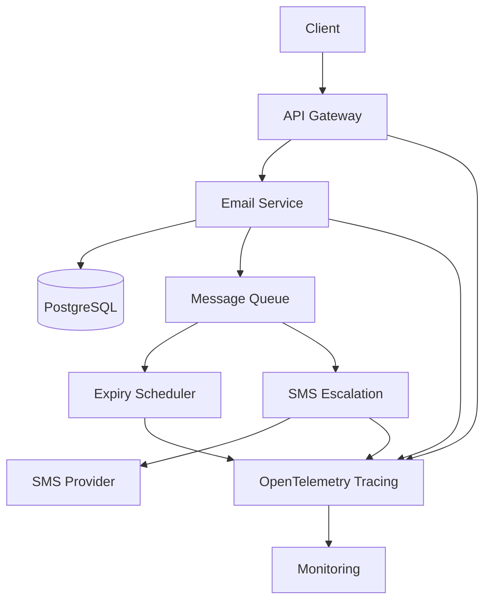

# Expiry Windows: Node.js Email Status, SMS Escalation, and Event Traces

## Introduction
A common requirement in messaging systems is that a message must stay “active” for a configurable period. After that window expires the system should change the message state, optionally trigger a secondary action, and make the whole flow observable. In our production cluster we needed exactly this behavior for email tickets that could roll over to an SMS if the original message was not answered within 24 hours. The solution had to be resilient, easy to extend, and cheap to operate.

## Why This Matters
Engineers building incident‑response or customer‑support backends often face silent failures: an email sits in a queue, the SLA clock ticks past the agreed window, and no one is notified. The result is a missed escalation, a breached SLA, and a frustrated on‑call team. By encoding an explicit expiry window and wiring it to an automatic SMS fallback, we turn a manual check into a deterministic event. The added tracing gives us end‑to‑end visibility, which shortens debugging time when things go wrong.

## How It Works
The system is composed of five cooperating parts:

1. **API Gateway** – receives the client request and forwards it to the Email Service.
2. **Email Service** – persists a row in PostgreSQL, publishes an outbox event, and schedules a future expiry check.
3. **Expiry Scheduler** – a lightweight worker that polls a priority queue, updates the row status, and emits an escalation event.
4. **SMS Escalation** – consumes escalation events, calls a third‑party SMS provider, and records the outcome.
5. **Tracing Layer** – injects a trace ID into every span so the entire lifecycle can be followed in a distributed tracing backend.

The flow is visualized below:



When a new email arrives, the Email Service writes a row with a `expires_at` timestamp and pushes a lightweight job onto a priority queue. The Scheduler runs on a fixed interval, pulls the earliest job, checks whether the expiry time has passed, and if so updates the row status to `expired`. It then publishes an `email.expired` event. The SMS Escalation service listens for that event, looks up the recipient, sends an SMS, and marks the original row as `escalated`. Every step creates an OpenTelemetry span, and the `message_id` is propagated as baggage so that the whole chain can be traced.

## Core Concepts
- **Expiry window**: a configurable duration (e.g., 24 h) after which the message is considered stale.
- **Outbox table**: a relational store that holds the message metadata, including `status` and `expires_at`. An index on `expires_at` allows efficient “next‑to‑expire” queries.
- **Priority queue**: an in‑memory structure (backed by Redis or a lightweight library) that orders items by `expires_at`. This lets the scheduler do O(1) work per tick.
- **Event‑driven escalation**: a decoupled worker that reacts to expiry events, enabling independent scaling and failure isolation.
- **Distributed tracing**: each service emits spans tagged with the same `message_id`, providing a single timeline for debugging.

## Examples & Code Walkthrough
Below is a production‑grade implementation in TypeScript. The code is simplified but captures the essential logic, error handling, and instrumentation.

### Email Service
```ts
// emailService.ts
import { Pool } from 'pg';
import { v4 as uuid } from 'uuid';
import { trace, context, Baggage } from '@opentelemetry/api';
import { Queue } from './priorityQueue'; // custom wrapper around a sorted set

const tracer = trace.getTracer('email-service');
const pg = new Pool({ connectionString: process.env.DATABASE_URL });
const expiryQueue = new Queue({ scheduler: true });

export class EmailService {
  private windowMs: number;

  constructor(windowMs: number = 24 * 60 * 60 * 1000) {
    this.windowMs = windowMs;
  }

  async send(to: string, subject: string, html: string): Promise<string> {
    const span = tracer.startSpan('email:send');
    try {
      const messageId = uuid();
      const expiresAt = new Date(Date.now() + this.windowMs).toISOString();

      await pg.query(
        `INSERT INTO email_outbox (message_id, status, expires_at, payload)
         VALUES ($1, $2, $3, $4)`,
        [messageId, 'pending', expiresAt, JSON.stringify({ to, subject, html })]
      );

      // Enqueue for the scheduler; the key is the expiry timestamp
      expiryQueue.enqueue({ messageId, expiresAt }, Date.now() + this.windowMs);

      // Propagate the ID downstream
      Baggage.set('message_id', messageId);
      return messageId;
    } catch (err) {
      span.recordException(err as Error);
      throw err;
    } finally {
      span.end();
    }
  }

  async markExpired(messageId: string): Promise<void> {
    const span = tracer.startSpan('email:markExpired');
    try {
      await pg.query(
        `UPDATE email_outbox SET status = 'expired' WHERE message_id = $1`,
        [messageId]
      );
      // Publish escalation event (in a real system this would go to Kafka)
      console.log(`[event] email:${messageId} -> escalation`);
    } catch (err) {
      span.recordException(err as Error);
      throw err;
    } finally {
      span.end();
    }
  }
}
```

### Expiry Scheduler
```ts
// scheduler.ts
import { setInterval } from 'node:timers/promises';
import { expiryQueue } from './emailService.js';
import { pg } from './emailService.js'; // reuse the same pool

async function scheduleExpiryChecks(intervalMs = 30_000) {
  setInterval(async () => {
    while (expiryQueue.size > 0) {
      const { messageId, expiresAt } = expiryQueue.peek();
      const now = Date.now();
      if (now < expiresAt) break; // wait for next tick

      expiryQueue.dequeue();
      // Guard against concurrent updates
      const result = await pg.query(
        `UPDATE email_outbox SET status = 'expired'
         WHERE message_id = $1 AND expires_at <= $2
         RETURNING message_id`,
        [messageId, new Date(now)]
      );
      if (result.rowCount > 0) {
        // Only emit if the row was actually updated
        console.log(`[event] email:${messageId} -> escalation`);
      }
    }
  }, intervalMs);
}

scheduleExpiryChecks().catch(console.error);
```

### SMS Escalation
```ts
// smsEscalation.ts
import { EventEmitter } from 'events';
import { sendSMS } from './smsProvider.js';
import { pg } from './emailService.js';
import { trace } from '@opentelemetry/api';

const emitter = new EventEmitter();
const tracer = trace.getTracer('sms-escalation');

emitter.on('emailExpired', async (msgId: string) => {
  const span = tracer.startSpan('sms:escalate');
  try {
    const record = await pg.query(
      `SELECT payload FROM email_outbox WHERE message_id = $1 AND status = 'expired'`,
      [msgId]
    );
    if (!record.rowCount) return; // already handled

    const { to } = JSON.parse(record.rows[0].payload);
    const smsId = await sendSMS(to, 'Your email has been pending for 24 h – please respond.');

    await pg.query(
      `UPDATE email_outbox SET status = 'escalated', sms_id = $1 WHERE message_id = $2`,
      [smsId, msgId]
    );

    // Persist the escalation event for auditing
    await pg.query(
      `INSERT INTO escalation_events (email_msg_id, sms_id, created_at) VALUES ($1, $2, now())`,
      [msgId, smsId]
    );
  } catch (err) {
    span.recordException(err as Error);
    throw err;
  } finally {
    span.end();
  }
});

// Hook the emitter to the scheduler's log line (in production use a real message bus)
export function notifyExpired(messageId: string) {
  emitter.emit('emailExpired', messageId);
}
```

### Tracing Integration
All spans automatically inherit the `message_id` from baggage, so a trace started in the API layer flows through the scheduler and ends in the SMS service. The backend (Jaeger, Tempo, etc.) then displays a single timeline.

## Best Practices
- **Store timestamps in UTC** and never let the client influence `expires_at`.
- **Use a priority queue** rather than scanning the table; it keeps the scheduler work constant regardless of volume.
- **Idempotent updates** – the `UPDATE ... WHERE expires_at <= now()` guard prevents double‑processing if the scheduler runs twice.
- **Separate concerns** – the Email Service should not know about SMS; the escalation worker only sees events.
- **Export metrics** (pending, expired, escalated counts) alongside traces to correlate spikes
