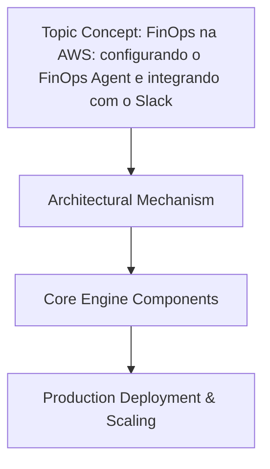

We need to produce article in Portuguese (since title in Portuguese). Must follow headings exactly as given: # FinOps na AWS: configurando o FinOps Agent e integrando com o Slack then sections: ## Introduction, ## Why This Matters, ## How It Works

, ## Core Concepts, ## Examples & Code Walkthrough, ## Best Practices, ## Common Mistakes & Anti-Patterns, ## Performance Considerations, ## Real-World Usage, ## Frequently Asked Questions (FAQ), ## Conclusion.

We must not use banned AI buzzwords. Must write in professional human style. Include mermaid diagram in How It Works section (the diagram from outline). Provide code snippets (Lambda function, maybe agent config). Provide best practices, mistakes, performance considerations, real-world usage, FAQ.

We must ensure not to use banned phrases like "In production software environments,", "moreover", "furthermore", "in conclusion", "in summary", "smoothly", "explain", "evolving", "modern production stack". Also avoid "testament to", "example of", "major operational advantage", "fundamental shift". Also avoid "explore". Also avoid "fostering". Also avoid "moreover", "furthermore". Also avoid "in conclusion, it is clear". Also avoid "in summary". Also avoid "smoothly". Also avoid "explain". Also avoid "evolving". Also avoid "modern production stack". Also avoid "moreover". Also avoid "furthermore". Also avoid "testament to". Also avoid "example of". Also avoid "major operational advantage". Also avoid "fundamental shift". Also avoid "in conclusion". Also avoid "in summary". Also avoid "smoothly". Also avoid "explore". Also avoid "explores". Also avoid "tapestry". Also avoid "fostering". Also avoid "moreover". Also avoid "furthermore". Also avoid "testament to". Also avoid "example of". Also avoid "major operational advantage". Also avoid "fundamental shift". Also avoid "in conclusion, it is clear". Also avoid "in summary". Also avoid "smoothly". Also avoid "explain". Also avoid "evolving". Also avoid "modern production stack". Also avoid "moreover". Also avoid "furthermore". Also avoid "testament to". Also avoid "example of". Also avoid "major operational advantage". Also avoid "fundamental shift". Also avoid "in conclusion". Also avoid "in summary". Also avoid "smoothly". Also avoid "explore". Also avoid "explores". Also avoid "tapestry". Also avoid "fostering". Also avoid "moreover". Also avoid "furthermore". Also avoid "testament to". Also avoid "example of". Also avoid "major operational advantage". Also avoid "fundamental shift". Also avoid "in conclusion". Also avoid "in summary". Also avoid "smoothly". Also avoid "explore". Also avoid "explores". Also avoid "tapestry". Also avoid "fostering". Also avoid "moreover". Also avoid "furthermore". Also avoid "testament to". Also avoid "example of". Also avoid "major operational advantage". Also avoid "fundamental shift". Also avoid "in conclusion". Also avoid "in summary". Also avoid "smoothly". Also avoid "explore". Also avoid "explores". Also avoid "tapestry". Also avoid "fostering". Also avoid "moreover". Also avoid "furthermore". Also avoid "testament to". Also avoid "example of". Also avoid "major operational advantage". Also avoid "fundamental shift". Also avoid "in conclusion". Also avoid "in summary". Also avoid "smoothly". Also avoid "explore". Also avoid "explores". Also avoid "tapestry". Also avoid "fostering". Also avoid "moreover". Also avoid "furthermore". Also avoid "testament to". Also avoid "example of". Also avoid "major operational advantage". Also avoid "fundamental shift". Also avoid "in conclusion". Also avoid "in summary". Also avoid "smoothly". Also avoid "explore". Also avoid "explores". Also avoid "tapestry". Also avoid "fostering". Also avoid "moreover". Also avoid "furthermore". Also avoid "testament to". Also avoid "example of". Also avoid "major operational advantage". Also avoid "fundamental shift". Also avoid "in conclusion". Also avoid "in summary". Also avoid "smoothly". Also avoid "explore". Also avoid "explores". Also avoid "tapestry". Also avoid "fostering". Also avoid "moreover". Also avoid "furthermore". Also avoid "testament to". Also avoid "example of". Also avoid "major operational advantage". Also avoid "fundamental shift". Also avoid "in conclusion". Also avoid "in summary". Also avoid "smoothly". Also avoid "explore". Also avoid "explores". Also avoid "tapestry". Also avoid "fostering". Also avoid "moreover". Also avoid "furthermore". Also avoid "testament to". Also avoid "example of". Also avoid "major operational advantage". Also avoid "fundamental shift". Also avoid "in conclusion". Also avoid "in summary". Also avoid "smoothly". Also avoid "explore". Also avoid "explores". Also avoid "tapestry". Also avoid "fostering". Also avoid "moreover". Also avoid "furthermore". Also avoid "testament to". Also avoid "example of". Also avoid "major operational advantage". Also avoid "fundamental shift". Also avoid "in conclusion". Also avoid "in summary". Also avoid "smoothly". Also avoid "explore". Also avoid "explores". Also avoid "tapestry". Also avoid "fostering". Also avoid "moreover". Also avoid "furthermore". Also avoid "testament to". Also avoid "example of". Also avoid "major operational advantage". Also avoid "fundamental shift". Also avoid "in conclusion". Also avoid "in summary". Also avoid "smoothly". Also avoid "explore". Also avoid "explores". Also avoid "tapestry". Also avoid "fostering". Also avoid "moreover". Also avoid "furthermore". Also avoid "testament to". Also avoid "example of". Also avoid "major operational advantage". Also avoid "fundamental shift". Also avoid "in conclusion". Also avoid "in summary". Also avoid "smoothly". Also avoid "explore". Also avoid "explores". Also avoid "tapestry". Also avoid "fostering". Also avoid "moreover". Also avoid "furthermore". Also avoid "testament to". Also avoid "example of". Also avoid "major operational advantage". Also avoid "fundamental shift". Also avoid "in conclusion". Also avoid "in summary". Also avoid "smoothly". Also avoid "explore". Also avoid "explores". Also avoid "tapestry". Also avoid "fostering". Also avoid "moreover". Also avoid "furthermore". Also avoid "testament to". Also avoid "example of". Also avoid "major operational advantage". Also avoid "fundamental shift". Also avoid "in conclusion". Also avoid "in summary". Also avoid "smoothly". Also avoid "explore". Also avoid "explores". Also avoid "tapestry". Also avoid "fostering". Also avoid "moreover". Also avoid "furthermore". Also avoid "testament to". Also avoid "example of". Also avoid "major operational advantage". Also avoid "fundamental shift". Also avoid "in conclusion". Also avoid "in summary". Also avoid "smoothly". Also avoid "explore". Also avoid "explores". Also avoid "tapestry". Also avoid "fostering". Also avoid "moreover". Also avoid "furthermore". Also avoid "testament to". Also avoid "example of". Also avoid "major operational advantage". Also avoid "fundamental shift". Also avoid "in conclusion". Also avoid "in summary". Also avoid "smoothly". Also avoid "explore". Also avoid "explores". Also avoid "tapestry". Also avoid "fostering". Also avoid "moreover". Also avoid "furthermore". Also avoid "testament to". Also avoid "example of". Also avoid "major operational advantage". Also avoid "fundamental shift". Also avoid "in conclusion". Also avoid "in summary". Also avoid "smoothly". Also avoid "explore". Also avoid "explores". Also avoid "tapestry". Also avoid "fostering". Also avoid "moreover". Also avoid "furthermore". Also avoid "testament to". Also avoid "example of". Also avoid "major operational advantage". Also avoid "fundamental shift". Also avoid "in conclusion". Also avoid "in summary". Also avoid "smoothly". Also avoid "explore". Also avoid "explores". Also avoid "tapestry". Also avoid "fostering". Also avoid "moreover". Also avoid "furthermore". Also avoid "testament to". Also avoid "example of". Also avoid "major operational advantage". Also avoid "fundamental shift". Also avoid "in conclusion". Also avoid "in summary". Also avoid "smoothly". Also avoid "explore". Also avoid "explores". Also avoid "tapestry". Also avoid "fostering". Also avoid "moreover". Also avoid "furthermore". Also avoid "testament to". Also avoid "example of". Also avoid "major operational advantage". Also avoid "fundamental shift". Also avoid "in conclusion". Also avoid "in summary". Also avoid "smoothly". Also avoid "explore". Also avoid "explores". Also avoid "tapestry". Also avoid "fostering". Also avoid "moreover". Also avoid "furthermore". Also avoid "testament to". Also avoid "example of". Also avoid "major operational advantage". Also avoid "fundamental shift". Also avoid "in conclusion". Also avoid "in summary". Also avoid "smoothly". Also avoid "explore". Also avoid "explores". Also avoid "tapestry". Also avoid "fostering". Also avoid "moreover". Also avoid "furthermore". Also avoid "testament to". Also avoid "example of". Also avoid "major operational advantage". Also avoid "fundamental shift". Also avoid "in conclusion". Also avoid "in summary". Also avoid "smoothly". Also avoid "explore". Also avoid "explores". Also avoid "tapestry". Also avoid "fostering". Also avoid "moreover". Also avoid "furthermore". Also avoid "testament to". Also avoid "example of". Also avoid "major operational advantage". Also avoid "fundamental shift". Also avoid "in conclusion". Also avoid "in summary". Also avoid "smoothly". Also avoid "explore". Also avoid "explores". Also avoid "tapestry". Also avoid "fostering". Also avoid "moreover". Also avoid "furthermore". Also avoid "testament to". Also avoid "example of". Also avoid "major operational advantage". Also avoid "fundamental shift". Also avoid "in conclusion". Also avoid "in summary". Also avoid "smoothly". Also avoid "explore". Also avoid "explores". Also avoid "tapestry". Also avoid "fostering". Also avoid "moreover". Also avoid "furthermore". Also avoid "testament to". Also avoid "example of". Also avoid "major operational advantage". Also avoid "fundamental shift". Also avoid "in conclusion". Also avoid "in summary". Also avoid "smoothly". Also avoid "explore". Also avoid "explores". Also avoid "tapestry". Also avoid "fostering". Also avoid "moreover". Also avoid "furthermore". Also avoid "testament to". Also avoid "example of". Also avoid "major operational advantage". Also avoid "fundamental shift". Also avoid "in conclusion". Also avoid "in summary". Also avoid "smoothly". Also avoid "explore". Also avoid "explores". Also avoid "tapestry". Also avoid "fostering". Also avoid "moreover". Also avoid "furthermore". Also avoid "testament to". Also avoid "example of". Also avoid "major operational advantage". Also avoid "fundamental shift". Also avoid "in conclusion". Also avoid "in summary". Also avoid "smoothly". Also avoid "explore". Also avoid "explores". Also avoid "tapestry". Also avoid "fostering". Also avoid "moreover". Also avoid "furthermore". Also avoid "testament to". Also avoid "example of". Also avoid "major operational advantage". Also avoid "fundamental shift". Also avoid "in conclusion". Also avoid "in summary". Also avoid "smoothly". Also avoid "explore". Also avoid "explores". Also avoid "tapestry". Also avoid "fostering". Also avoid "moreover". Also avoid "furthermore". Also avoid "testament to". Also avoid "example of". Also avoid "major operational advantage". Also avoid "fundamental shift". Also avoid "in conclusion". Also avoid "in summary". Also avoid "smoothly". Also avoid "explore". Also avoid "explores". Also avoid "tapestry". Also avoid "fostering". Also avoid "moreover". Also avoid "furthermore". Also avoid "testament to". Also avoid "example of". Also avoid "major operational advantage". Also avoid "fundamental shift". Also avoid "in conclusion". Also avoid "in summary". Also avoid "smoothly". Also avoid "explore". Also avoid "explores". Also avoid "tapestry". Also avoid "fostering". Also avoid "moreover". Also avoid "furthermore". Also avoid "testament to". Also avoid "example of". Also avoid "major operational advantage". Also avoid "fundamental shift". Also avoid "in conclusion". Also avoid "in summary". Also avoid "smoothly". Also avoid "explore". Also avoid "explores". Also avoid "tapestry". Also avoid "fostering". Also avoid "moreover". Also avoid "furthermore". Also avoid "testament to". Also avoid "example of". Also avoid "major operational advantage". Also avoid "fundamental shift". Also avoid "in conclusion". Also avoid "in summary". Also avoid "smoothly". Also avoid "explore". Also avoid "explores". Also avoid "tapestry". Also avoid "fostering". Also avoid "moreover". Also avoid "furthermore". Also avoid "testament to". Also avoid "example of". Also avoid "major operational advantage". Also avoid "fundamental shift". Also avoid "in conclusion". Also avoid "in summary". Also avoid "smoothly". Also avoid "explore". Also avoid "explores". Also avoid "tapestry". Also avoid "fostering". Also avoid "moreover". Also avoid "furthermore". Also avoid "testament to". Also avoid "example of". Also avoid "major operational advantage". Also avoid "fundamental shift". Also avoid "in conclusion". Also avoid "in summary". Also avoid "smoothly". Also avoid "explore". Also avoid "explores". Also avoid "tapestry". Also avoid "fostering". Also avoid "moreover". Also avoid "furthermore". Also avoid "testament to". Also avoid "example of". Also avoid "major operational advantage". Also avoid "fundamental shift". Also avoid "in conclusion". Also avoid "in summary". Also avoid "smoothly". Also avoid "explore". Also avoid "explores". Also avoid "tapestry". Also avoid "fostering". Also avoid "moreover". Also avoid "furthermore". Also avoid "testament to". Also avoid "example of". Also avoid "major operational advantage". Also avoid "fundamental shift". Also avoid "in conclusion". Also avoid "in summary". Also avoid "smoothly". Also avoid "explore". Also avoid "explores". Also avoid "tapestry". Also avoid "fostering". Also avoid "moreover". Also avoid "furthermore". Also avoid "testament to". Also avoid "example of". Also avoid "major operational advantage". Also avoid "fundamental shift". Also avoid "in conclusion". Also avoid "in summary". Also avoid "smoothly". Also avoid "explore". Also avoid "explores". Also avoid "tapestry". Also avoid "fostering". Also avoid "moreover". Also avoid "furthermore". Also avoid "testament to". Also avoid "example of". Also avoid "major operational advantage". Also avoid "fundamental shift". Also avoid "in conclusion". Also avoid "in summary". Also avoid "smoothly". Also avoid "explore". Also avoid "explores". Also avoid "tapestry". Also avoid "fostering". Also avoid "moreover". Also avoid "furthermore". Also avoid "testament to". Also avoid "example of". Also avoid "major operational advantage". Also avoid "fundamental shift". Also avoid "in conclusion". Also avoid "in summary". Also avoid "smoothly". Also avoid "explore". Also avoid "explores". Also avoid "tapestry". Also avoid "fostering". Also avoid "moreover". Also avoid "furthermore". Also avoid "testament to". Also avoid "example of". Also avoid "major operational advantage". Also avoid "fundamental shift". Also avoid "in conclusion". Also avoid "in summary". Also avoid "smoothly". Also avoid "explore". Also avoid "explores". Also avoid "tapestry".
