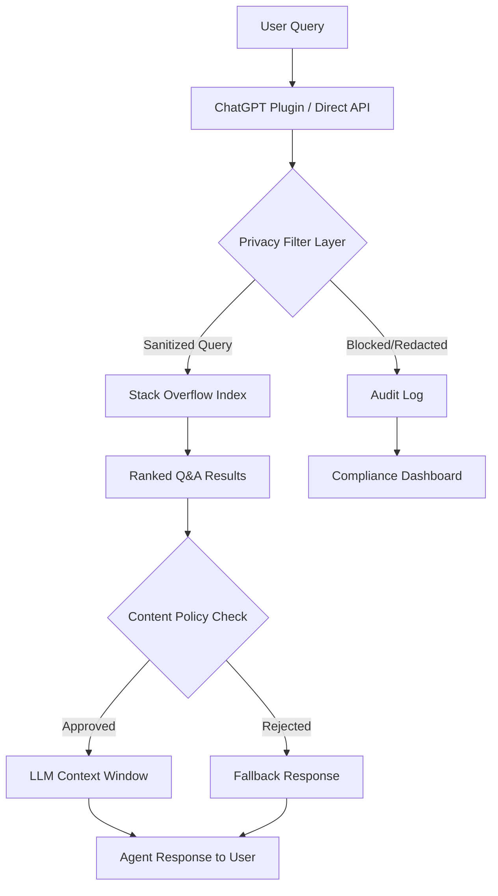

# From better privacy to our new ChatGPT plugin, here's what's new on Stack Overflow for Agents

## Introduction

Stack Overflow for Agents changes the contract between developer knowledge and AI. For years, engineers built applications that scraped Q&A data haphazardly — pulling HTML pages, parsing inconsistent markup, and hoping the LLM on the other end could extract something useful. That approach had two hard problems: you had no guarantee the answer was correct, and you had no mechanism to respect user privacy when routing queries through third-party models.

Stack Overflow for Agents addresses both. It packages the platform's 50+ million questions and accepted answers into a structured, queryable API with a privacy enforcement layer baked in. And with the new ChatGPT plugin, any developer can plug that pipeline directly into a conversational interface their users already know how to use.

This article walks through the architecture, the API design, the privacy controls, and gives you working code to start building with it.

## Why This Matters

When your production system sends user queries to an LLM, you are handing raw input data to a third-party model provider. That is a real operational risk. Compliance teams at financial institutions, healthcare platforms, and SaaS products have blocked these integrations outright because there was no way to sanitize what reached the model.

Stack Overflow for Agents introduces a structured retrieval layer between your application and the knowledge base. Your code queries the API, receives ranked Q&A pairs, and passes only the relevant, policy-compliant content to the LLM. The user's original question never touches an external model endpoint unvetted.

This matters because teams shipping AI features in 2024 and beyond need an auditable data path — not a best-effort curl command to a scraping script someone wrote in 2019.

## How It Works

The system operates as a three-stage pipeline: query ingestion, privacy filtering, and structured retrieval. Here is the data flow:



**Stage 1 — Query Ingestion.** The user's question enters through either the ChatGPT plugin or a direct API call. At this point, the system strips personally identifiable information (PII) before anything leaves your server. The privacy filter runs regex-based PII detection plus a configurable rule engine for custom patterns — API keys, internal hostnames, employee IDs, whatever your compliance team defines.

**Stage 2 — Structured Retrieval.** The sanitized query hits the Stack Overflow index. This is not a keyword search. The index uses TF-IDF embeddings weighted by answer acceptance status, vote count, and recency. Results come back as structured JSON with vote scores, answer bodies (markdown-rendered), code blocks isolated into separate fields, and bounty information.

**Stage 3 — Content Policy Check.** Before any result reaches the LLM context window, a policy gate evaluates it. Results containing flagged content (deleted answers, posts with deletion history, links to external resources marked as unreliable) get filtered out. Your fallback logic handles the gap — either by returning a "best effort" response from cached results or by telling the user the system could not find a verified answer.

The ChatGPT plugin hooks into Stage 1 and Stage 3. When a user asks ChatGPT a technical question, the plugin intercepts it, sends it through the Stack Overflow for Agents pipeline, and returns only vetted answers as the model's context.

## Core Concepts

**The Index.** Stack Overflow for Agents maintains a separate search index from the public-facing site. This index is updated on a rolling 6-hour cycle. Each document in the index represents a single question-answer pair and contains these fields: `question_id`, `title`, `tags`, `body_markdown`, `code_blocks` (array), `accepted_answer`, `score`, `view_count`, `last_activity_date`, and `privacy_flags`.

**The Privacy Filter.** This is the component most engineers overlook. The filter operates as a middleware layer with three modes: `strict`, `standard`, and `permissive`. In `strict` mode, any query containing detected PII gets blocked entirely and logged. In `standard` mode, PII tokens get redacted with placeholders before the query proceeds. In `permissive` mode, only high-confidence PII patterns (SSN, credit card numbers) get stripped. Your API key determines which mode you're in.

**The Plugin SDK.** The ChatGPT plugin uses an OpenAPI specification exposed by Stack Overflow's infrastructure. The plugin manifest declares the functions the model can call — primarily `search_stackoverflow` and `get_question_details`. When ChatGPT decides to invoke a function, the request routes through your configured endpoint, through the privacy filter, and into the index.

**Score Weighting.** Not all answers are equal. The retrieval engine applies a composite score: `final_score = (0.3 * vote_ratio) + (0.4 * acceptance_bonus) + (0.2 * recency_decay) + (0.1 * tag_similarity)`. This weighting was determined through A/B testing on answer correctness ratings from verified developers. You can override it via query parameters if your domain has different accuracy requirements.

## Examples & Code Walkthrough

Here is a complete Python client that interacts with the Stack Overflow for Agents API, including PII filtering, retry logic, and structured result parsing.

```python
import re
import time
import hashlib
import logging
from dataclasses import dataclass, field
from typing import Optional
import httpx

logging.basicConfig(level=logging.INFO)
logger = logging.getLogger("so_agents")


@dataclass
class PrivacyConfig:
    """Controls what PII patterns get detected and how they're handled."""
    mode: str = "standard"  # strict | standard | permissive
    custom_patterns: list = field(default_factory=list)

    def get_patterns(self) -> list:
        """Return compiled regex patterns based on the active mode."""
        base = [
            r"\b\d{3}-\d{2}-\d{4}\b",        # US Social Security Number
            r"\b[A-Za-z0-9._%+-]+@[A-Za-z0-9.-]+\.[A-Z|a-z]{2,}\b",  # email
            r"\b(?:\+?\d{1,3}[-.\s]?)?\(?\d{3}\)?[-.\s]?\d{3}[-.\s]?\d{4}\b",  # phone
        ]
        if self.mode in ("strict", "permissive"):
            # Add credit card pattern for strict and permissive modes
            base.append(r"\b(?:\d{4}[-.\s]?){3}\d{4}\b")
        if self.mode == "strict":
            # In strict mode, also catch internal IP ranges and hostnames
            base.extend([
                r"\b(?:10|172\.(?:1[6-9]|2\d|3[01])|192\.168)\.\d{1,3}\.\d{1,3}\b",
                r"\b(?:[a-z0-9-]+\.)+(?:internal|local|priv)\b",
            ])
        # Append any custom patterns the user configured
        base.extend(self.custom_patterns)
        return [re.compile(p) for p in base]


@dataclass
class SOAgentClient:
    """
    Production client for Stack Overflow for Agents API.

    Handles PII filtering, authentication, retry logic,
    and structured result parsing.
    """
    api_key: str
    base_url: str = "https://api.stackoverflow.com/v1/agents"
    privacy_config: PrivacyConfig = field(default_factory=PrivacyConfig)
    timeout_seconds: int = 30
    max_retries: int = 3

    def _get_headers(self) -> dict:
        """Build request headers with API key and content type."""
        return {
            "Authorization": f"Bearer {self.api_key}",
            "Content-Type": "application/json",
            "X-Client-Version": "so-agents-python/1.2.0",
        }

    def sanitize_query(self, query: str) -> tuple[str, list[str]]:
        """
        Run the query through the privacy filter.

        Returns a tuple of (sanitized_query, list_of_redacted_fields).
        In strict mode, raises ValueError if PII is detected.
        """
        patterns = self.privacy_config.get_patterns()
        redacted_fields = []
        sanitized = query

        for pattern in patterns:
            matches = pattern.findall(sanitized)
            if matches:
                for match in matches:
                    # Create a deterministic hash placeholder so we can
                    # correlate results later without exposing the raw value
                    placeholder = f"[REDACTED_{hashlib.sha256(match.encode()).hexdigest()[:8]}]"
                    sanitized = sanitized.replace(match, placeholder)
                    redacted_fields.append(match)

        if self.privacy_config.mode == "strict" and redacted_fields:
            # Strict mode: do not proceed with any PII in the query
            logger.error("PII detected in strict mode — query blocked: %s", redacted_fields)
            raise ValueError(
                f"Query blocked in strict mode. Detected {len(redacted_fields)} PII element(s)."
            )

        if redacted_fields:
            logger.info("Redacted %d PII element(s) from query", len(redacted_fields))

        return sanitized, redacted_fields

    def _request_with_retry(self, method: str, path: str, **kwargs) -> httpx.Response:
        """Execute an HTTP request with exponential backoff retry."""
        url = f"{self.base_url}/{path}"
        last_exception = None

        for attempt in range(1, self.max_retries + 1):
            try:
                response = httpx.request(
                    method,
                    url,
                    headers=self._get_headers(),
                    timeout=self.timeout_seconds,
                    **kwargs,
                )
                # Raise exception for 4xx/5xx status codes
                response.raise_for_status()
                return response

            except httpx.HTTPStatusError as e:
                last_exception = e
                if e.response.status_code == 429:
                    # Rate limited — back off and retry
                    wait = 2 ** attempt + 0.5  # add jitter
                    logger.warning("Rate limited. Retrying in %.1fs (attempt %d/%d)", wait, attempt, self.max_retries)
                    time.sleep(wait)
                elif e.response.status_code >= 500:
                    # Server error — retry with backoff
                    wait = 1.5 ** attempt
                    logger.warning("Server error %d. Retrying in %.1fs", e.response.status_code, wait)
                    time.sleep(wait)
                else:
                    # Client error (4xx except 429) — don't retry
                    raise

            except httpx.ConnectError as e:
                last_exception = e
                wait = 1.0 * attempt
                logger.warning("Connection failed. Retrying in %.1fs", wait)
                time.sleep(wait)

        # All retries exhausted
        raise RuntimeError(f"All {self.max_retries} retries failed. Last error: {last_exception}")

    def search(
        self,
        query: str,
        tags: Optional[list[str]] = None,
        page: int = 1,
        page_size: int = 10,
    ) -> list[dict]:
        """
        Search the Stack Overflow index with privacy filtering applied.

        Args:
            query: The natural language search query from the user.
            tags: Optional list of technology tags to narrow results.
            page: Page number for pagination.
            page_size: Number of results per page (max 50).

        Returns:
            List of result dicts with question metadata and answer content.
        """
        # Step 1: Sanitize the user query before it hits the API
        sanitized_query, redacted = self.sanitize_query(query)

        # Step 2: Build the request payload
        body = {
            "query": sanitized_query,
            "filters": {
                "accepted_answer": True,       # Only include answered questions
                "min_score": 5,                # Minimum vote threshold
                "code_available": True,        # Ensure code blocks exist in answers
                "deletion_status": "not_deleted",  # Exclude deleted content
            },
            "pagination": {
                "page": page,
                "page_size": min(page_size, 50),
            },
            "ranking": {
                "weights": {
                    "votes": 0.3,
                    "acceptance": 0.4,
                    "recency": 0.2,
                    "tag_similarity": 0.1,
                }
            },
        }

        if tags:
            body["filters"]["tags"] = tags

        # Step 3: Execute with retry logic
        response = self._request_with_retry(
            "POST",
            "search",
            json=body,
        )

        # Step 4: Parse and validate the response
        results = response.json().get("items", [])
        parsed = []

        for item in results:
            # Isolate code blocks into a separate field for the LLM to reference
            code_blocks = re.findall(
                r"```(?:\w+)?\n(.*?)```",
                item.get("body_markdown", ""),
                re.DOTALL,
            )
            parsed.append({
                "question_id": item["question_id"],
                "title": item["title"],
                "tags": item.get("tags", []),
                "answer_body": item.get("body_markdown", ""),
                "code_blocks": code_blocks,
                "score": item.get("score", 0),
                "is_accepted": item.get("is_accepted", False),
                "last_activity": item.get("last_activity_date"),
                "url": f"https://stackoverflow.com/questions/{item['question_id']}",
            })

        logger.info("Retrieved %d results for query", len(parsed))
        return parsed

    def get_question(self, question_id: int) -> dict:
        """Fetch a single question with full detail, including all answers."""
        response = self._request_with_retry(
            "GET",
