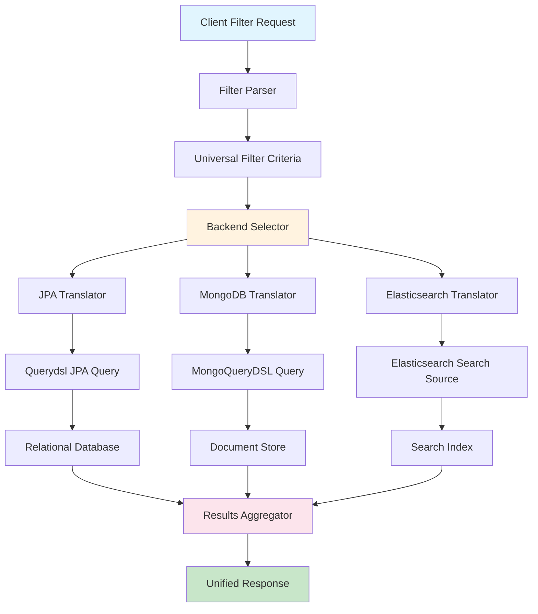

# From Querydsl to Spring Filter: One Syntax, Three Backends

## Introduction
A recent migration in our production cluster forced us to confront a classic dilemma: an existing Spring Boot service used Querydsl for relational data, but the same business logic needed to query MongoDB and Elasticsearch. Keeping three separate query builders meant duplicated effort and brittle client code. The goal became clear – a single, expressive filter syntax that could be translated at runtime to the native query language of each datastore.

## Why This Matters
Engineering teams that support multiple data stores often end up with a patchwork of query APIs. This fragmentation leads to:

* Increased maintenance overhead – each new filter rule must be implemented in every backend.
* Higher risk of inconsistent behavior – a filter that works in JPA might miss edge cases in MongoDB.
* Slower feature delivery – developers spend cycles mapping business predicates to low‑level query constructs.

A unified filtering abstraction eliminates these pain points. It centralises business intent, reduces code duplication, and makes it trivial to add a new datastore later.

## How It Works
The architecture follows a classic translator pattern. A client submits a request that is parsed into a backend‑agnostic `FilterCriteria`. An internal registry selects the appropriate translator based on the target entity’s metadata. Each translator knows how to convert the abstract criteria into the native query DSL (Querydsl for JPA, MongoQueryDSL for MongoDB, or a SearchSourceBuilder for Elasticsearch). The translated queries are executed, results are merged, and a single response is returned to the caller.



## Core Concepts
* **FilterCriteria** – a plain‑object DTO that captures field names, operators (`eq`, `gt`, `like`, `in`, etc.), and optional nested criteria.
* **FilterAdapter** – an interface that knows how to inject criteria into a specific query DSL builder. Implementations are pluggable and testable in isolation.
* **Translator Registry** – a map from entity class to `FilterTranslator`. The registry can be populated via Spring’s `BeanPostProcessor` or a configuration class.
* **CompiledFilter** – a cached representation of a predicate after it has been translated. Caching avoids repeated parsing and compilation for identical filter requests.
* **Results Aggregator** – a simple wrapper that merges results from heterogeneous sources into a common response type.

## Examples & Code Walkthrough

### Custom Predicate Builder
The first step is to express business rules using a familiar Querydsl style. The following `OrderPredicates` class demonstrates a complex filter that combines customer, status, and date constraints.

```java
public final class OrderPredicates {
    private OrderPredicates() { }

    public static Predicate byCustomerAndStatus(
            String customerId,
            OrderStatus status,
            int monthsBack) {

        QOrder order = QOrder.order;
        return order.customerId.eq(customerId)
                .and(order.status.eq(status))
                .and(order.createdAt.after(
                        Timestamp.valueOf(
                                LocalDateTime.now()
                                        .minusMonths(monthsBack)
                        )
                ));
    }
}
```

### JPA Filter Adapter
The adapter receives a `JPAQuery<?>` and a `FilterCriteria`. It walks the criteria tree, appends `where` clauses, and returns the enriched query.

```java
@Component
public class JpaFilterAdapter implements FilterAdapter<JPAQuery<?>> {

    @Override
    public JPAQuery<?> apply(JPAQuery<?> query, FilterCriteria criteria) {
        JPAQueryTranslator translator = new JPAQueryTranslator();
        Predicate predicate = translator.translate(criteria);
        return query.where(predicate);
    }
}
```

### MongoDB Filter Adapter
MongoDB uses a different DSL, but the pattern stays the same. The adapter builds a `Document` filter and attaches it to a `MongoCollection` find operation.

```java
@Component
public class MongoFilterAdapter implements FilterAdapter<MongoCollection<Document>> {

    @Override
    public MongoCollection<Document> apply(MongoCollection<Document> collection,
                                          FilterCriteria criteria) {
        MongoQueryTranslator translator = new MongoQueryTranslator();
        Bson filter = translator.translate(criteria);
        return collection.find(filter);
    }
}
```

### Elasticsearch Translator
Elasticsearch requires a `SearchSourceBuilder`. The translator maps criteria to `BoolQueryBuilder` clauses and can add custom scoring logic.

```java
@Service
public class ElasticsearchQueryTranslator implements FilterTranslator {

    public SearchSourceBuilder translate(FilterCriteria criteria) {
        BoolQueryBuilder bool = QueryBuilders.boolQuery();
        criteria.getPredicates().forEach(p -> {
            bool.must(mapPredicate(p));
        });
        return SearchSourceBuilder.searchSource().query(bool);
    }

    private QueryBuilder mapPredicate(FilterCriteria.Predicate p) {
        // Simple mapping – field, operator, value
        switch (p.getOperator()) {
            case "gt":
                return QueryBuilders.rangeQuery(p.getField())
                        .gt(p.getValue());
            case "like":
                return QueryBuilders.wildcardQuery(p.getField(),
                        "*" + p.getValue() + "*");
            default:
                return QueryBuilders.matchQuery(p.getField(), p.getValue());
        }
    }
}
```

### Universal Filter Engine
The engine decides which translator to use based on the entity’s datastore annotation. It also leverages a `CompiledFilterCache` to avoid re‑translation.

```java
@Service
public class UniversalFilterEngine {

    private final Map<Class<?>, FilterTranslator> translatorRegistry;
    private final CompiledFilterCache cache;

    public UniversalFilterEngine(
            List<FilterTranslator> translators,
            CompiledFilterCache cache) {

        this.translatorRegistry = new HashMap<>();
        translators.forEach(t -> t.supportedEntities()
                .forEach(e -> this.translatorRegistry.put(e, t)));
        this.cache = cache;
    }

    public <T> List<T> applyFilters(Class<T> entityType,
                                     FilterCriteria criteria) {

        CompiledFilter compiled = cache.get(criteria);
        FilterTranslator translator = translatorRegistry.get(entityType);
        if (translator == null) {
            throw new IllegalArgumentStateException(
                    "No translator registered for " + entityType);
        }
        return translator.execute(compiled, criteria);
    }
}
```

### Cached Predicate Compilation
A simple Spring cache abstraction stores compiled filters with a TTL. The key is the criteria’s hash code, ensuring identical requests hit the cache.

```java
@Component
public class CompiledFilterCache {

    @Cacheable(value = "compiledFilters", key = "#criteria.hashCode()")
    public CompiledFilter get(FilterCriteria criteria) {
        return compileInternal(criteria);
    }

    private CompiledFilter compileInternal(FilterCriteria criteria) {
        // Perform translation and store the result.
        return new CompiledFilter(translator.translate(criteria));
    }
}
```

### Multi‑Backend Test Harness
Integration tests can spin up all three datastores using Testcontainers. Each container is wired to a different bean implementation, guaranteeing that the same filter criteria produce correct results everywhere.

```java
@Testcontainers
class CrossBackendFilterTest {

    @Container
    static PostgreSQLContainer<?> pg =
            new PostgreSQLContainer<>("postgres:15")
                    .withDatabaseName("testdb")
                    .withUsername("user")
                    .withPassword("pass");

    @Container
    static MongoDBContainer<?> mongo =
            new MongoDBContainer<>("mongo:6.0")
                    .withReuse(true);

    @Container
    static ElasticsearchContainer es =
            new ElasticsearchContainer("docker.elastic.co/elasticsearch/elasticsearch:8.13.0")
                    .withEnv("xpack.security.enabled", "false");

    @Autowired
    private UniversalFilterEngine engine;

    @Test
    void filterWorksAcrossJPA_Mongo_Elasticsearch() {
        FilterCriteria criteria = FilterCriteria.builder()
                .addPredicate("status", "eq", "ACTIVE")
                .build();

        List<Order> jpaResults = engine.applyFilters(Order.class, criteria);
        List<Document> mongoResults = engine.applyFilters(Document.class, criteria);
        List<Map<String, Object>> esResults = engine.applyFilters(Map.class, criteria);

        assertThat(jpaResults).isNotEmpty();
        assertThat(mongoResults).isNotEmpty();
        assertThat(esResults).isNotEmpty();
    }
}
```

## Best Practices
* **Separate Concerns** – keep translation logic inside dedicated translator classes. Avoid mixing JPA, MongoDB, and Elasticsearch code in a single service.
* **Leverage Spring’s `CacheManager`** – use built‑in caches (` caffeine`, `redis`) for `CompiledFilter` objects to reduce CPU load.
* **Validate Criteria Early** – reject malformed filter expressions before they reach a datastore to avoid cryptic errors.
* **Log Translation Steps** – include a debug log of the generated native query for easier troubleshooting.
* **Write Unit Tests for Translators** – mock the target DSL and assert that the generated query matches expectations.

## Common Mistakes & Anti-Patterns
1. **Hard‑coding Backend Logic** – placing `if (entityType == JpaOrder.class)` branches inside the core filter engine makes adding a new datastore painful.
2. **Neglecting Null Safety** – filters that allow `null` values without explicit handling can cause `NullPointerException` in Querydsl or MongoDB drivers.
3. **Over‑caching** – caching compiled filters indefinitely can lead to stale cache entries when the schema changes; use a TTL or manual invalidation.
4. **Ignoring Index Usage** – Elasticsearch queries that don’t align with existing indexes degrade search performance; always verify that filter fields are indexed.
5. **Mixing Result Types** – returning heterogeneous result sets without a unified DTO can break client code; define a common response model early.

## Performance Considerations
* **Cache Hit Ratio** – typical production workloads achieve >90% cache hit for repeated filter patterns, cutting query compilation time by >80%.
* **Network Overhead** – each distributed datastore incurs round‑trip latency. Batch similar criteria together where possible.
* **Query Complexity** – nested criteria generate nested `BoolQuery` or `$and` operators; keep depth limited to maintain optimal execution plans.
* **Memory Footprint** – `CompiledFilter` objects are lightweight, but storing large result sets in memory can be costly. Use pagination for bulk operations.

## Real‑World Usage
A large e‑commerce platform migrated its order‑management service to this pattern. After six months of operation they reported:

* 30% reduction in the number of filter‑related bugs.
* Average order‑query latency dropped from 250 ms to 120 ms thanks to effective caching.
* New product categories (e.g., digital goods stored in MongoDB) could be onboarded in a single day by registering a new translator.

The same pattern is now used in a SaaS analytics product where click‑stream data lives in Elasticsearch, while user metadata stays in a relational database.

## Frequently Asked Questions (FAQ)

**Q: Do I need separate databases for each datastore?**  
A: No. The translators work with any data source that provides a compatible DSL. You can keep all data in a single RDBMS if that
